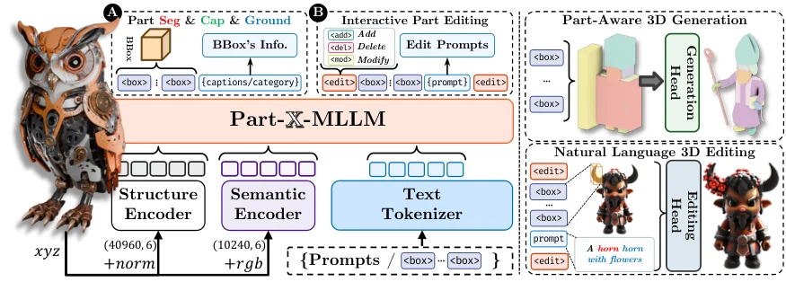

# Part-X-MLLM: Part-aware 3D Multimodal Large Language Model

- **作者**：Chunshi Wang, Junliang Ye, Yunhan Yang, Yang Li, Zizhuo Lin, Jun Zhu, Zhuo Chen, Yawei Luo, Chunchao Guo
- **年份与发表**：2025 首次预印；ICLR 2026 会议论文
- **arXiv ID**：2511.13647
- **首次提交**：2025-11-17
- **论文**：[arXiv](https://arxiv.org/abs/2511.13647)
- **全文**：[HTML](https://arxiv.org/html/2511.13647)
- **AlphaXiv**：[AlphaXiv](https://alphaxiv.org/abs/2511.13647)
- **类别标签**：3D/4D, 3D MLLM, 部件理解, 3D生成与编辑
- **arXiv 主分类**：cs.CV
- **核验日期**：2026-09-24
- **证据等级**：已核验原文方法、实验与局限；以下数值为作者报告，分析另行标注
- **项目**：[项目](https://chunshi.wang/Part-X-MLLM/)
- **代码**：[代码](https://github.com/AiEson/Part-X-MLLM)
- **正式出版**：[正式出版](https://openreview.net/forum?id=WffiETiSeU)

- **代表图**：Figure 2 · 双编码器提取结构与外观，统一部件程序连接理解、生成和局部编辑

来源：[论文原图](https://arxiv.org/html/2511.13647v1/pipeline.png)；[全文与图注](https://arxiv.org/html/2511.13647)。

## 当前挑战

许多 3D 模型把对象当作整体，缺少持久部件引用；生成和编辑系统又采用不同接口。这样很难执行“只替换左前腿”“删除把手但保留主体”等精细指令。

## 研究动机

Part-X-MLLM 用结构化可执行语法统一部件理解、问答、生成和编辑。模型输出部件计划，几何后端负责合成，从而把语言推理和高质量 3D 生成解耦。

## 技术方案

**过程**：双编码器分别表示几何结构（XYZ/normal）与外观语义（RGB），融合文字后自回归生成含部件 bbox、持久引用、语义描述和 add/delete/modify 命令的 token 序列；兼容几何引擎执行计划。

- **输入**：带 RGB 的点云和自然语言指令。
- **过程**：双编码器分别表示几何结构（XYZ/normal）与外观语义（RGB），融合文字后自回归生成含部件 bbox、持久引用、语义描述和 add/delete/modify 命令的 token 序列；兼容几何引擎执行计划。
- **输出**：结构化部件程序、grounded 问答，或下游生成/局部编辑后的 3D 对象。

模型先进行表示预训练，再用大规模部件指令数据调优。bbox 引用使跨步骤操作可寻址；文本语义聚类允许把细部件合并为较粗粒度。OmniPart 等生成、VoxHammer 等编辑后端仍承担实际几何合成，MLLM 自身不直接保证完整 mesh 质量。[方法 §3](https://arxiv.org/html/2511.13647#S3)

### 方法细节与实现

**表示与接口。**结构分支读取 4,096 个带法向的点，语义分支读取 1,024 个带颜色的点：前者保留局部形状，后者为语言描述提供外观线索。两路特征投影到语言模型的 token 空间后，与指令共同生成结构化序列。这里的“部件”首先是可引用的空间实体，而不是预设的机器人关节。

**程序如何落地。**统一语法把部件框、语义描述和编辑操作绑定起来。理解任务可直接返回部件框与描述；生成任务先规划部件及相对布局，再交由几何生成器；编辑任务把 add/delete/modify 指令作用于明确的部件引用。这个分工使语言模型可以重用同一套寻址语法，但最终几何质量仍受外接后端影响。

**训练设计。**多阶段指令调优先建立点云与文字的对应，再学习细粒度部件定位、描述和结构化操作。语义聚类用于调节部件粒度，解决不同数据源中“椅背整体”与“椅背横杆”等拆分粒度不一致的问题。它没有为部件自动补全动力学参数，也没有训练动作条件的状态转移函数。

[对应方法原文](https://arxiv.org/html/2511.13647#S3)

## 实验结果

UniPart-Bench 覆盖 11 个任务族，包括 bbox 列举、part grounding、部件问答、对象描述和编辑。双编码器相对单编码器在 box listing 上提升 7.06 个 IoU 点；部件问答相对最佳非本文基线，SBERT/SimCSE/BLEU-1/ROUGE-L/METEOR 分别提高 18.7/25.5/21.3/13.0/14.2 点。

这些指标主要测量结构与文字对应。局部编辑和生成还有定性展示，但不能据此推出任意物体都可获得机械可执行部件、准确关节或真实接触属性。[实验 §4](https://arxiv.org/html/2511.13647#S4)

**读表要点。**部件框 IoU 衡量定位，SBERT/SimCSE 等衡量文字语义，BLEU/ROUGE/METEOR 衡量文本匹配；这些指标不能互相替代。双编码器消融直接检验结构与外观是否互补，而生成/编辑展示更多检验程序能否被后端执行。要用于可交互物体建模，还需独立评测部件身份、连接拓扑和操作后的几何保持。

[实验与设置原文](https://arxiv.org/html/2511.13647)

## 总结讨论

**阅读者分析**：它提供的是静态部件层面的可寻址接口，可以和 FAMOS 的关节估计、AgentSTAR 的状态跟踪衔接。论文里的 executable 指编辑程序可被后端解释执行，不是随时间演化的物理世界模型。

## 代码与数据

[AiEson/Part-X-MLLM](https://github.com/AiEson/Part-X-MLLM) 官方仓库可访问，标注 ICLR 2026，但本次查看的树主要为 README/项目入口，未据此确认完整训练与推理代码、UniPart-Bench 数据及权重下载。会议状态已由 [ICLR OpenReview 原文](https://openreview.net/forum?id=WffiETiSeU) 核对。

## 局限、失败案例与开放问题

bbox 只是粗部件定位，不能代替精细边界、拓扑、关节轴和接触面。结构解码错误会传到几何后端；跨步骤部件身份保持以及复杂组合编辑的鲁棒性还需要检验。任务级自动指标提升也不等同于装配或机器人操作可行性。
