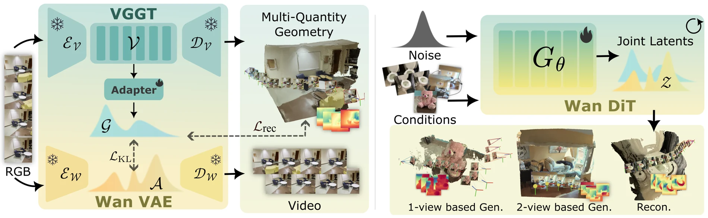

# Gen3R: 3D Scene Generation Meets Feed-Forward Reconstruction

- **首次提交**：2026-01-07
- **最近修订**：2026-03-23
- **arXiv 主分类**：cs.CV
- **核验日期**：2026-09-24
- **作者**：Jiaxin Huang, Yuanbo Yang, Bangbang Yang, Lin Ma, Yuewen Ma, Yiyi Liao
- **年份与发表**：2026，CVPR 2026（官方项目标注）
- **arXiv ID**：2601.04090
- **论文**：[arXiv](https://arxiv.org/abs/2601.04090)
- **全文**：[本卡核验版本 v2](https://arxiv.org/html/2601.04090v2)
- **项目**：[Gen3R](https://xdimlab.github.io/Gen3R/)
- **代码**：[GitHub](https://github.com/JaceyHuang/Gen3R)
- **模型**：[Hugging Face](https://huggingface.co/JaceyH919/Gen3R)
- **AlphaXiv**：[AlphaXiv](https://alphaxiv.org/abs/2601.04090)
- **类别标签**：3D/4D, 世界模型
- **证据等级**：已核验原文方法、实验表格与官方资源；未独立复现实验

- **代表图**：Figure 2 · 方法总览

来源：[论文原图](https://arxiv.org/html/2601.04090v2/fig/pipeline/gen3r_method_v7.png)；[原文与图注](https://arxiv.org/html/2601.04090v2)。

## 当前挑战

先生成视频再交给重建器，可能累积跨视图不一致；直接把 RGB VAE 用于点云压缩，又容易丢失几何。VGGT 已经学习了相机、深度与点图的联合特征，但高维几何 token 的分辨率和统计分布都不适合直接送入预训练视频扩散模型。

## 研究动机

Gen3R 将重建模型的中间表示改造成几何潜空间，让视频生成先验与几何重建先验在采样过程中交互。关键不是事后增加深度输出，而是在保留外观、几何两个解码通道的同时联合生成它们。

## 核心 Insight

几何潜变量不必从昂贵的完整 3D 真值重新学起：可以压缩 VGGT 多层 token，并用外观 latent 的分布约束使其适合扩散。论文的两阶段串联对照与移除分布对齐消融支持这一设计；它仍依赖几何教师，不能解释为无几何先验的纯 RGB 学习。

## 技术方案

**输入**：单张图、首尾两张图或完整图像序列，可选文本与相机条件；重建评测不提供相机条件。

**过程**：VGGT 四层 token → 几何 adapter 编解码与分布对齐 → 与 Wan 外观 latent 联合去噪 → 分别解码图像和几何。

**输出**：RGB 视频、相机参数、深度与全局点云；最终几何采用深度结合预测相机反投影。该输出不是原生带纹理 mesh 或 3DGS。

**第一阶段：几何压缩。**从 VGGT 第 4、11、17、23 层读取 2048 维特征，经 adapter 映射到与 Wan VAE 相同的时空大小和通道维度，再映射回几何 token。重建目标同时约束 token、自带相机头、深度头和点图头的输出，以保留原有几何能力；KL 项将几何分布对齐到预训练外观 latent 分布。监督主要来自教师预测，不要求所有训练集都有完整 3D 真值。

**第二阶段：联合生成。**将外观与几何 latent 沿宽度拼接，微调相机条件 Wan2.1。训练均匀采样单图、首尾双图、全序列三种输入模式，图像掩码标识已观测位置；相机条件以 50% 概率丢弃。已知的几何 latent 不作为额外条件，因此推理仍从图像进入。生成器与 adapter 分开训练，不能把此处“统一”理解成一个无压缩的端到端像素目标。

**训练规模。**十个数据集混合提供超过 30 万场景，覆盖室内外、对象、驾驶及合成数据。adapter 先用 25 帧训练 15K 步，再用 49 帧训练 6K 步；生成器用 49 帧、560×560、24 张 H20 微调 8K 步。RE10K 使用官方划分，其余数据集随机约 90% 训练、10% 测试。

[方法与训练设置](https://arxiv.org/html/2601.04090v2#S3)

## 实验结果

外观评测从 RE10K、DL3DV 各取 200 段序列；几何评测从 Co3Dv2、WildRGB-D 各取 300 段，TartanAir 取 80 段。点云先做 Umeyama 对齐，再各采样 20K 点，报告 Accuracy、Completeness 和 CD。生成任务给定相机，完整序列重建则不给相机，两个任务的分数不能混用。

| 设置 | Gen3R | 对照 | 解释 |
| --- | --- | --- | --- |
| 单图生成，RE10K PSNR / LPIPS | 20.51 / 0.2281 | Gen3C 20.26 / 0.2302 | 保真度小幅改善，需结合几何评价 |
| 双图生成，RE10K PSNR | 27.05 | LVSM 29.58 | 统一模型并未全面超过专用视图合成 |
| 单图生成，Co3Dv2 CD | 1.1047 | VGGT 2.3561 | 完整度改善；VGGT 的点云 Accuracy 反而更好 |
| 全序列重建，TartanAir CD | 1.5101 | VGGT 1.5957 | 生成先验在此设置改善综合几何误差 |
| 全序列重建，WildRGB-D CD | 0.1260 | VGGT 0.1165 | 优势不是跨数据集一致成立 |

单图 Co3Dv2 中，Gen3R 的 Accuracy / Completeness 为 0.8284 / 1.3811，VGGT 为 0.3291 / 4.3830。Accuracy 衡量预测点到真值表面的距离，并非单独对可见区域计算；更完整带来的 CD 收益不等于表面精度同步提高。消融还比较了同训练数据下的“视频生成后接 VGGT”与去掉 KL 对齐：联合采样改善外观、几何及相机控制；潜空间失配则阻碍收敛。

[表 1–5 与评测协议](https://arxiv.org/html/2601.04090v2#S4)

## 代码与数据

官方 GitHub 提供训练、推理与几何 adapter 代码，Hugging Face 提供模型；项目标注 CVPR 2026。WVD 在论文比较时由作者重实现，不能默认与后续官方版本完全等价。本次核验了公开入口，没有下载运行模型。

## 局限、失败案例与开放问题

几何教师可能把系统误差带入潜空间；点云经对齐后的评价不证明绝对尺度正确。生成包含多步去噪，“feed-forward”不等于单次网络前向或实时；完整 mesh 的拓扑、碰撞面与物理参数也不在输出保证内。论文主要论证多视角场景生成，不应把沿相机轨迹的视频直接称为对象动态 4D 世界。

## 总结讨论

**阅读者分析**：Gen3R 的关键价值在于明确展示“重建 token 可以成为生成变量”。与 GAE 的几何原生 codec、PixWorld 的像素空间渲染监督相比，它选择保留预训练外观 latent 并对齐几何分支，兼顾复用强视频先验与多种几何输出。选型时应同时考虑可见面精度、完整度、输出格式和采样成本。
