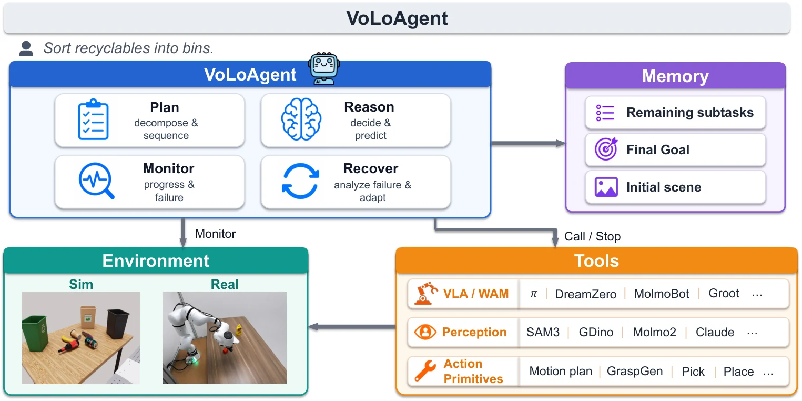

# VoLo: A Physical Orchestrator for Open-Vocabulary Long-Horizon Manipulation

- **作者**：Siyi Chen, Hugo Hadfield, Alex Zook, Mikaela Angelina Uy, Chan Hee Song, Erwin Coumans, Xuning Yang, Faisal Ladhak, Qing Qu, Stan Birchfield, Jonathan Tremblay, Valts Blukis
- **年份与发表**：2026，arXiv 预印本
- **arXiv ID**：2606.07723
- **首次提交**：2026-06-05
- **论文**：[arXiv](https://arxiv.org/abs/2606.07723)
- **全文**：[HTML](https://arxiv.org/html/2606.07723)
- **AlphaXiv**：[AlphaXiv](https://alphaxiv.org/abs/2606.07723)
- **类别标签**：VLM Agent, 机器人学习, 长时记忆, World Action Model
- **arXiv 主分类**：cs.RO
- **核验日期**：2026-09-24
- **证据等级**：已核验原文方法、实验与局限；以下数值为作者报告，分析另行标注
- **项目**：[项目](https://chicychen.github.io/VoLo/)
- **代码**：[代码](https://github.com/NVlabs/VoLoAgent)
- **数据**：[数据](https://github.com/NVlabs/RoboVoLo)

- **代表图**：Figure 3 · 规划、监视、工具路由和失败恢复组成异步机器人执行闭环

来源：[论文原图](https://arxiv.org/html/2606.07723v1/system.png)；[全文与图注](https://arxiv.org/html/2606.07723)。

## 当前挑战

长程开放词汇操作同时需要理解复杂指令、追踪已完成状态、执行接触技能和恢复错误。固定的“VLM 规划 → VLA 执行”层级，往往无法在动作执行中切换能力；真实机器人也不会在模型思考时自动暂停环境。

## 研究动机

VoLo 将 VLA/WAM 当成可中断的工具，与分割、抓取和放置工具一起由 VLM 调度。论文名为 VoLo，系统和官方仓库名为 VoLoAgent；它研究的是物理环境中的能力编排，不是新训练一个视频世界模型。

## 技术方案

**过程**：拆解子任务后异步运行 VLA；短上下文监控器约 0.2 Hz 检查进展，在 continue、next subgoal、recovery 中选择；恢复阶段暂停活动工具，调用更完整记忆，选择重规划、改写 VLA 指令或感知驱动的 grasp/place。

- **输入**：开放词汇指令、相机观察、当前子目标、执行反馈与外部记忆。
- **过程**：拆解子任务后异步运行 VLA；短上下文监控器约 0.2 Hz 检查进展，在 continue、next_subgoal、recovery 中选择；恢复阶段暂停活动工具，调用更完整记忆，选择重规划、改写 VLA 指令或感知驱动的 grasp/place。
- **输出**：机器人动作、工具切换和更新后的任务状态。

工具族包含 π0.5/DreamZero 等动作模型、SAM3/Molmo2 等感知模型，以及结合 GraspGen 与 IK 的动作原语。快速监控与完整思考上下文分离，降低每轮推理负担。抓取原语即使没有完全成功，也可能把末端带到更合适的位置，让 VLA 接续完成。[方法 §4](https://arxiv.org/html/2606.07723#S4)

### 方法细节与实现

**系统层次。**VoLoAgent 将长任务分解、工具路由、执行监视和失败恢复放在同一个调度循环中。底层工具既包括 VLA/WAM，也包括感知模型、抓取与放置原语和运动规划器；因此高层输出是“调用哪个技能、给什么目标、是否中止”，而非直接回归每个关节的连续控制。

**闭环运行。**初始计划和最终目标写入记忆，执行中的监视器约以 0.2 Hz 检查进展。底层动作异步运行时，高层仍可根据画面判断任务进度，打断失败行为、更新剩余子任务并切换工具。失败恢复不是简单重复原指令，而是结合当前物体状态重新选择操作路径。

**为什么要保留多种工具。**开放词汇任务同时包含语义识别、几何可达性和接触控制，单一 VLA 并不在每个环节占优。该工作检验的是系统编排能否扩大现有技能的任务覆盖；不同感知、控制工具提供的先验和可用信息，也属于系统能力的一部分，不能把最终成绩解释成某一个端到端策略的能力。

[对应方法原文](https://arxiv.org/html/2606.07723#S3)

## 实验结果

RoboVoLo 覆盖常识、记忆、复杂指代、世界知识四个套件，15 类、126 个任务，每任务 3 次。表 2 中完整系统成功率为 41.80%，纯 π0.5 为 12.57%，Only VLA 编排为 34.97%，No VLA 为 17.76%，支持工具互补和编排的价值。

真实 Franka FR3 使用 14 任务×3 次：完整系统 42.9%，纯 π0.5 为 14.3%。但 No VLA 为 45.2%、Only VLA 为 40.5%，置信区间高度重叠；不能据此声称实机上全工具组合显著超过全部消融。[实验 §5](https://arxiv.org/html/2606.07723#S5)

**评估单位与代价。**RoboVoLo 的 126 个任务覆盖 15 类操作、4 个测试套件，每任务进行 3 次试验。实机只有 14 个任务、每任务 3 次试验，完整系统 42.9% 与去除 VLA 后的 45.2% 接近，置信区间重叠。模拟中的明显收益与实机中不稳定的模块收益应分别报告；0.2 Hz 是高层监视频率，不是机器人底层控制频率。

[实验与设置原文](https://arxiv.org/html/2606.07723)

## 总结讨论

**阅读者分析**：适合把已有 WAM 接入长程 Agent，尤其是失败检测和恢复。这里的长期记忆主要是任务/执行记忆；它并不显式维护可渲染 4D 世界。比较时应报告底层策略、感知工具、特权信号和整套系统预算。

## 代码与数据

[NVlabs/VoLoAgent](https://github.com/NVlabs/VoLoAgent) 已公开编排代码；[RoboVoLo](https://github.com/NVlabs/RoboVoLo) 提供 126 个 RoboLab 任务与场景资产入口，要求 RoboLab v0.3.0。仓库 README 描述了 ground-truth failure detection 支持，复现实验需区分模拟器诊断/恢复信号与真实视觉监控设置。

## 局限、失败案例与开放问题

云端 VLM 每次调用约 1–5 秒，可能错过快速失败；完成判断仍是主要错误源。验证主要针对单臂平行夹爪；其他本体不能仅靠“暂停手臂”实现安全等待。真实实验规模不足以精确区分多个编排变体。
