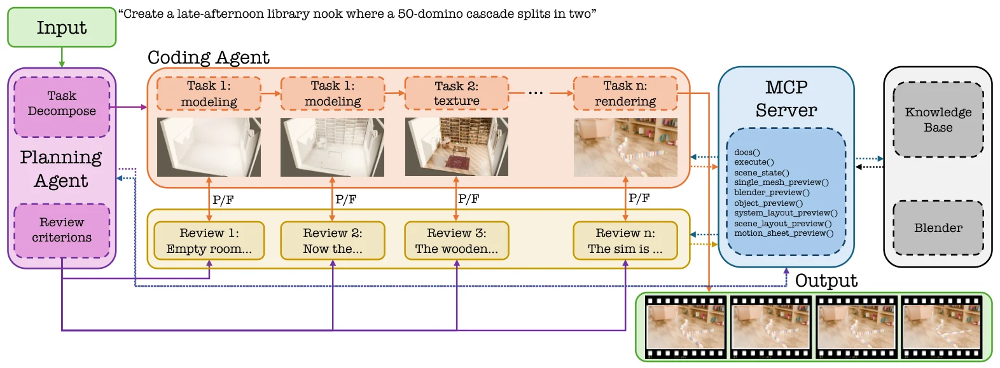

# SimWorlds: A Multi-Agent System for Dynamic 3D Scene Creation

- **作者**：Chunjiang Liu, Xiaoyuan Wang, Haoyu Chen, Yizhou Zhao, Ming-Hsuan Yang, László A. Jeni
- **年份与发表**：2026，arXiv 预印本
- **arXiv ID**：2607.01766
- **首次提交**：2026-07-02
- **论文**：[arXiv](https://arxiv.org/abs/2607.01766)
- **全文**：[HTML](https://arxiv.org/html/2607.01766)
- **AlphaXiv**：[AlphaXiv](https://alphaxiv.org/abs/2607.01766)
- **类别标签**：3D/4D, 场景生成, 多智能体, 物理仿真
- **arXiv 主分类**：cs.AI
- **核验日期**：2026-09-24
- **证据等级**：已核验原文方法、实验与局限；以下数值为作者报告，分析另行标注
- **项目**：[项目](https://dynsimworlds.github.io)

- **代表图**：Figure 2 · 规划与编码 Agent 分阶段构建 Blender 场景，并由审核与引擎工具反馈修复

来源：[论文原图](https://arxiv.org/html/2607.01766v1/pipeline.png)；[全文与图注](https://arxiv.org/html/2607.01766)。

## 当前挑战

把文字转成动态 Blender 场景，需要同时安排几何、物体关系、求解器、时间轴、材质与相机。几张渲染图看起来正确，并不能说明物体真的受刚体、流体或布料求解器驱动：关键帧动画可以模仿运动，却没有可干预的物理机制。

## 研究动机

SimWorlds 将“视觉上符合指令”和“引擎内机制正确”分开检查。核心贡献是分阶段构建、可检查的场景协议，以及直接读取引擎运行状态的验证工具；多 Agent 分工服务于局部发现和修复错误。最终产物是可继续编辑的动态 3D 工程。

## 技术方案

**过程**：Planner 制定对象与机制计划；Coder 按固定顺序搭建场景；确定性 verifier 检查协议和结构；Reviewer 检查预览与指令一致性，失败则返回当前阶段修复。工具读取 bake 状态、modifier、动画曲线和实际运动差分，核实指定机制是否生效。

- **输入**：自然语言场景描述；编辑模式还接收已有工程、编辑指令及目标图像。
- **过程**：Planner 制定对象与机制计划；Coder 按固定顺序搭建场景；确定性 verifier 检查协议和结构；Reviewer 检查预览与指令一致性，失败则返回当前阶段修复。工具读取 bake 状态、modifier、动画曲线和实际运动差分，核实指定机制是否生效。
- **输出**：包含几何、材质、灯光、相机、动画与物理的 `.blend` 文件，以及渲染视频。

场景协议用对象分组和关系组织计划，使检查项能够定位到具体实体。确定性检查负责可枚举约束，VLM 负责构图、外观等感知判断；后者仍可能判断错误。文本生成模式与 BlenderBench 的图像条件编辑模式应分开理解。[方法 §3](https://arxiv.org/html/2607.01766#S3)

### 方法细节与实现

**场景是有状态的工程产物。**规划 Agent 先把文字要求拆成对象、关系、运动和渲染阶段；编码 Agent 通过 Blender 工具逐阶段修改场景；审核 Agent 根据阶段目标和实际渲染决定接受还是修复。阶段间保留 .blend 场景，因此后续操作是在已有对象及动画上继续构建，而不是每轮从文字重新生成一段视频。

**验证器检查什么。**场景协议把规划中的实体和动作映射到引擎里的对象与状态，形成可核查的对应关系。检查既涉及对象存在、属性和布局，也涉及 modifier、关键帧曲线、模拟烘焙以及跨帧状态差异。视觉审核负责发现外观或语义不符，程序验证负责发现“画面看似合理、实际没有指定动画或模拟结构”的错误。

**编辑与恢复。**系统把修复限制在相应阶段，利用场景快照和工具反馈持续修改；编辑模式则在已有场景上响应新增要求。它更接近可检查的动态图形资产生产流程：有些运动来自物理模拟，有些来自程序动画。仅凭运动出现和协议通过，不能证明全部场景都满足真实动力学。

[对应方法原文](https://arxiv.org/html/2607.01766#S3)

## 实验结果

4DBuildBench 共 50 个场景：布料、流体、刚体、粒子、软体五类各 9 个，另有 5 个静态场景；动态类别分别覆盖三个难度。表 1 的机制通过率 MPR 为 0.87，VIGA 为 0.67；VLM 分数为 0.82 对 0.78。机制检查与抽帧视觉评价的差距，支持作者关于视觉检查盲区的主张。

BlenderBench 在相同 Opus 4.7、6 次迭代预算下比较：总体 PL 从 6.02 降到 4.63，N-CLIP 从 5.28 降到 4.80，VLM 从 2.76 升到 3.41。15 场景消融子集上，去掉 verifier 使 SPR 从 0.97 降到 0.87；去掉阶段构建使 VLM 从 0.87 降到 0.76。这是子集结果，不能与全量 50 场景分数直接比较。[实验 §4](https://arxiv.org/html/2607.01766#S4)

**证据如何解读。**主评测包含 50 个场景，消融使用 15 个场景。MPR 从比较系统的 0.67 提高到 0.87，视觉语言评分从 0.78 到 0.82，分别反映运动/视觉层面的评估结果。结构协议通过率依赖系统能否输出相应中间产物，跨系统比较时需留意可检查接口不同；生成时长、Agent 调用和 Blender 执行成本也是实际使用门槛。

[实验与设置原文](https://arxiv.org/html/2607.01766)

## 总结讨论

**阅读者分析**：适合作为可编辑仿真场景和合成数据的构建管线；其价值集中在“生成的代码是否真正调用正确物理机制”。它没有验证从真实视频识别物理参数，也没有证明生成数据能提升机器人策略。

## 代码与数据

官方项目入口可访问；本次未从页面确认独立代码仓库、4DBuildBench 下载包和许可证。论文描述了工具、协议和评测配置，可用于理解实现，但公开可复现状态仍待核验。

## 局限、失败案例与开放问题

场景结构指标 SPR 依赖方法自身的分组结构，作者明确承认跨系统公平性有限，因此应以机制指标、视觉指标和编辑任务共同判断。确定性检查不能代替感知判断；复杂材质、布局和语义仍依赖 VLM。物理求解器工作正常也不等于参数与真实世界一致。
