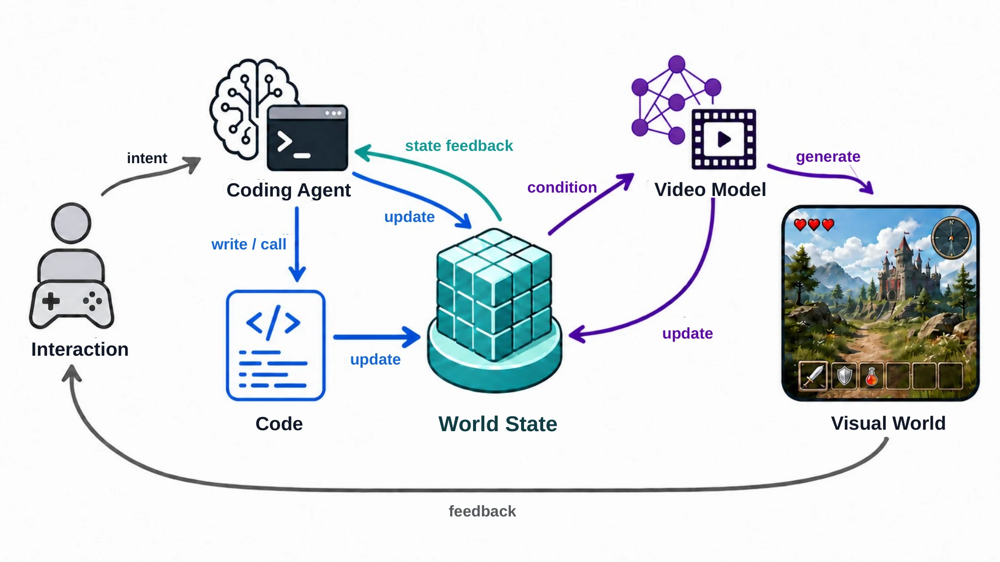

# Code World Model: Coding Agent as World Brain

- **作者**：Yiwen Chen, Guosheng Lin, Chi Zhang
- **年份与发表**：2026，arXiv 预印本
- **arXiv ID**：2608.25927
- **首次提交**：2026-08-26
- **论文**：[arXiv](https://arxiv.org/abs/2608.25927)
- **全文**：[HTML](https://arxiv.org/html/2608.25927)
- **AlphaXiv**：[AlphaXiv](https://alphaxiv.org/abs/2608.25927)
- **类别标签**：世界模型, 可执行世界模型, 视频生成, 代码生成
- **arXiv 主分类**：cs.CV
- **核验日期**：2026-09-24
- **证据等级**：已核验原文方法、实验与局限；以下数值为作者报告，分析另行标注
- **项目**：[项目](https://buaacyw.github.io/cwm/)
- **代码**：[代码](https://github.com/buaacyw/code-world-model)

- **代表图**：Figure 2 · 代码维护世界状态，代理观测约束视频渲染，并响应后续交互

来源：[论文原图](https://arxiv.org/html/2608.25927v1/code_world_model_pipeline.png)；[全文与图注](https://arxiv.org/html/2608.25927)。

## 当前挑战

视频生成能展示事件外观，却难持续维护离屏角色、数值规则和跨很长时间发展的后果。让语言模型逐帧更新所有实体又会带来高延迟；仅用文字描述位置和运动，也很难精确控制视频模型。

## 研究动机

Code World Model 将世界演化和视觉呈现分开：Coding Agent 在需要解释事件、修改规则时工作，可执行代码高频维护状态；视频模型把该状态转换成丰富的视觉观察。连接两者的关键是逐帧空间代理 proxy，而非不断增长的文字历史。

## 技术方案

**过程**：Coding Agent 修改实体、规则和事件逻辑；代码执行世界更新；轻量编译/渲染管线生成深度与语义 ID 代理视频；经 LoRA 适配的 MiniMax-H3 Ref2VA 接收 proxy、文字和首帧外观锚点，生成视频。

- **输入**：用户事件和控制、持续保存的世界代码与状态、已有游戏引擎模板，以及外观描述。
- **过程**：Coding Agent 修改实体、规则和事件逻辑；代码执行世界更新；轻量编译/渲染管线生成深度与语义 ID 代理视频；经 LoRA 适配的 MiniMax-H3 Ref2VA 接收 proxy、文字和首帧外观锚点，生成视频。
- **输出**：可执行、可由玩家控制的世界状态，以及与代理轨迹对齐的视频观察。

推理时利用已有引擎的控制、碰撞和更新循环，不是从零自动生成完整大型游戏。训练视频为 1344×768、24 FPS、124 帧，proxy 为 336×192；长视频使用 124 帧窗口和 34 帧重叠，复用首帧外观锚点。[方法 §3](https://arxiv.org/html/2608.25927#S3)

### 方法细节与实现

**世界状态与视频的职责。**编码 Agent 修改可执行代码和显式状态，引擎根据状态推进对象与交互逻辑；视频模型把简化场景观测转换成高质量画面。未来的结构约束来自持续存在的程序状态，而不是只靠视频模型的历史上下文记住场景。这也意味着可执行世界的逻辑正确性主要依赖代码和引擎。

**状态如何进入视频模型。**论文不直接把完整程序当作视频 token，而是由引擎产生深度、语义或实例标识等视觉代理，将对象布局、遮挡和运动压缩成视频模型能消费的条件。实验使用 336×192 的代理观测，生成 1,344×768、124 帧、24 FPS 的片段。代理的条件带宽决定了哪些状态能被画面保留，未被代理编码的属性仍可能由生成先验补写。

**训练与系统成本。**视频适配使用 rank 128 LoRA，约 5.96 亿可训练参数，8 张 H800；数据为 9,420 段视频、约 5.6 小时，训练 3,534 步。已有游戏模板和资产提供了可运行世界的起点，因此案例展示应与完全从零构造任意世界区分。作者当前的生成演示没有把编码、引擎执行和视频渲染合计成实时交互延迟。

[对应方法原文](https://arxiv.org/html/2608.25927#S3)

## 实验结果

作者用 157 段游戏录制、约 5.6 小时视频抽取 9,420 个五秒片段。LoRA rank 128、约 596M 可训练参数，在 8 张 H800 上训练 3 个 epoch、3,534 步；推理采用 20 步 Euler。

§4.2 主要报告位置、动作、场景布局和相机控制的**定性结果**与项目视频；比较明确不考虑推理延迟。现有证据支持“少量 proxy–RGB 适配可以控制视觉生成”，尚不足以宣称开放世界长期自主运行、实时交互或量化 benchmark 的普遍领先。[实验 §4](https://arxiv.org/html/2608.25927#S4)

**目前支持的结论。**持续对象、状态编辑和跨交互画面是主要展示内容，尚缺统一的大规模定量测试及完整延迟分解。可以据此判断代码状态是可行的控制接口，但不能推出视觉生成严格忠于每个物理参数，也不能把输出片段的 24 FPS 当作系统生成速度。

[实验与设置原文](https://arxiv.org/html/2608.25927)

## 总结讨论

**阅读者分析**：该工作是“代码状态 → 空间控制 → 视频呈现”的系统原型。与 Code as Worlds 的主要区别是，它侧重运行和呈现世界；后者侧重从观察构造可执行表示，并把模拟状态转成定量物理推理监督。代码中有显式规则，不等于这些规则已由真实观测因果识别。

## 代码与数据

[官方仓库](https://github.com/buaacyw/code-world-model) 已提供推理模块、环境文档、公开 CWM LoRA 与 40 个紧凑示例的安装入口。示例包含 NPZ 条件，需在本地展开；仓库开放不能自动视作完整训练数据和全部世界构建流程均已发布。独立基础模型仍依赖 MiniMax-H3。

## 局限、失败案例与开放问题

作者明确指出训练规模小、生成质量受限，尚未实现自回归实时生成；Coding Agent 仍难从零可靠实现复杂游戏机制。持久的代码状态也不能保证视频生成始终遵守状态，特别是遮挡、细动作和长时身份一致性。
