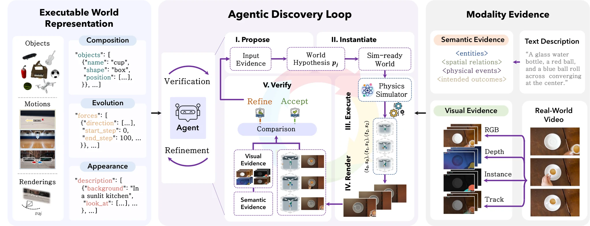

# Code as Worlds: Agentic Discovery of Executable World Representations for Physical Reasoning

- **作者**：Hanyang Wang, Yimo Cai, Weiliang Chen, Jiawei Chi, Haowen Sun, Qiyu Dai, Yi-Hsin Hung, Xingzhuo Guo, Jinshan Ren, Runmao Yao, Ziwei Liu, Mingsheng Long, Yueqi Duan, Jun Gao, Jiangran Lyu, Fangfu Liu, Jialong Wu
- **年份与发表**：2026，arXiv 预印本
- **arXiv ID**：2608.27549
- **首次提交**：2026-08-27
- **论文**：[arXiv](https://arxiv.org/abs/2608.27549)
- **全文**：[HTML](https://arxiv.org/html/2608.27549)
- **AlphaXiv**：[AlphaXiv](https://alphaxiv.org/abs/2608.27549)
- **类别标签**：可执行世界模型, 物理推理, 代码生成, 3D/4D
- **arXiv 主分类**：cs.CV
- **核验日期**：2026-09-24
- **证据等级**：已核验原文方法、实验与局限；以下数值为作者报告，分析另行标注
- **项目**：[项目](https://mirros-lab.github.io/code-as-world)
- **代码**：[代码](https://github.com/mirros-lab/code-as-world)

- **代表图**：Figure 2 · 提出、实例化、执行和验证世界假设，以多模态证据迭代修订程序

来源：[论文原图](https://arxiv.org/html/2608.27549v1/pipeline-wjl.png)；[全文与图注](https://arxiv.org/html/2608.27549)。

## 当前挑战

像素容易表示外观，却没有直接可计算的物理量；一般 3D 表示有几何但未必有动力学；自然语言能描述规律但难保证数值精确。单目视频中的尺度、隐藏参数和不完全观测，也使真实机制恢复存在歧义。

## 研究动机

作者提出 Executable World Representation（EWR）：用程序同时规定物理构成、动态演化和视觉外观，让模拟器执行并输出同步视频与状态。Agent 通过渲染、比较和修改提高与观测的一致性，再利用可查询状态生成数值问答监督。

## 技术方案

**过程**：视频路径用 SAM3 提取实例掩码和轨迹、VGGT-Ω 估计深度和相机、SAM3D 产生物体几何；Agent 组装可执行场景，运行模拟并比较图像、掩码、深度和轨迹，逐轮修改。文字路径从描述直接构造模拟世界。两者统一导出状态轨迹与定量 VQA。

- **输入**：文字物理场景，或经过筛选的真实运动视频。
- **过程**：视频路径用 SAM3 提取实例掩码和轨迹、VGGT-Ω 估计深度和相机、SAM3D 产生物体几何；Agent 组装可执行场景，运行模拟并比较图像、掩码、深度和轨迹，逐轮修改。文字路径从描述直接构造模拟世界。两者统一导出状态轨迹与定量 VQA。
- **输出**：可执行世界、同步视觉/物理状态，以及训练后的 Code-as-World-VL 定量物理推理模型。

训练分两步：先用 RefCOCO 系列与 GOT-10K 学习图像空间中的框、尺度与运动测量；再用 EWR 的世界坐标状态监督 GRPO，奖励包含相对数值误差、单位和格式。物理推理模型回答尺寸、位移、速度、加速度等问题。[方法 §3–5](https://arxiv.org/html/2608.27549#S3)

### 方法细节与实现

**EWR 的结构。**可执行表示同时定义对象与组合关系、运动规律或模拟参数，以及渲染外观。执行一次程序就能得到同步的视觉序列和可查询物理状态，从而把“画面里发生什么”与“数值上移动多少”接到同一条证据链。这种表示提供了测量接口，但恢复出的尺度和隐藏参数仍依赖所采用的物理先验。

**发现循环。**Agent 根据文字或视觉证据提出世界假设，将其实例化为模拟场景，执行后把渲染结果与参考的实例、轨迹、深度及语义比较，再据差异修订程序。最多 5 轮的迭代与一次生成、Best-of-5 对照，分别区分“利用反馈修正”和“多采样碰到较好结果”。视频证据由多个预训练模块提取，分割、尺度或相机估计错误可能成为后续优化共同追随的偏差。

**训练监督的两层校准。**第一阶段用图像空间测量任务建立框、距离和运动的读取能力；第二阶段用经验证的可执行世界提供世界坐标真值，以 GRPO 奖励数值相对误差、单位和回答格式。前者解决能否从图像中测量，后者解决像素变化到物理量的校准。提升定量问答不自动意味着发现了唯一正确的微观机制。

[对应方法原文](https://arxiv.org/html/2608.27549#S3)

## 实验结果

真实视频从 WISA-80K 筛选，排除大幅相机运动、运动不足、剪辑和不完整物理事件，并经过人工审核。重建比较最多 5 轮 agentic refinement 与 one-shot、Best-of-5，指标包含 Visual Alignment、Object IoU、Traj-ADE、Velocity-ADE 和 Accuracy@2%D。

QuantiPhy-validation 的表 1 报告 MRA：4B 为 50.6，9B 为 55.4，27B reasoning 为 58.6；作为直接回答比较，Qwen3.5-4B 为 31.2，Gemini-3.1 Flash 为 54.8。27B 使用 reasoning trace，不能视作与直接回答模型完全等价的推理预算。评测限于官方 2S/2D/3S/3D 子集和相应物理先验。[实验与表 1](https://arxiv.org/html/2608.27549#S5.SS4)

**重建与推理须分开评估。**Visual Alignment 和 Object IoU 测量渲染/实例吻合；轨迹与速度误差测试运动拟合；QuantiPhy 的 MRA 测试最终问答模型。这三类证据处于不同环节。更强的机制验证应固定恢复的世界，换动作或初始条件检查预测，而不是继续针对同一参考视频调参；本文主要支持观测匹配与受控定量推理。

[实验与设置原文](https://arxiv.org/html/2608.27549)

## 总结讨论

**阅读者分析**：最有价值的接口是“可执行状态生成精确训练标签”。它比用视频外观打分更直接连接尺度和运动量，但一个能解释视频的程序未必是唯一真实机制。若用于 HOI，需要额外验证接触、摩擦、遮挡和跨动作干预后的预测。

## 代码与数据

[官方仓库](https://github.com/mirros-lab/code-as-world) 提供 4B/9B 权重与推理说明、QuantiPhy 评估、MuJoCo 示例。完整大规模 EWR 发现与训练数据管线的公开程度需逐项检查，不能用一个弹道示例替代整个自动发现系统的复现。

## 局限、失败案例与开放问题

作者明确承认模拟器建模范围有限，优化可能得到视觉上合理但机制不准确的局部解释。QuantiPhy 更偏受控运动中的单目尺度校准，不覆盖完整接触、形变、流体和复杂长时多体动力学。原馆藏中的详细历史解读和来源关联继续保留。
