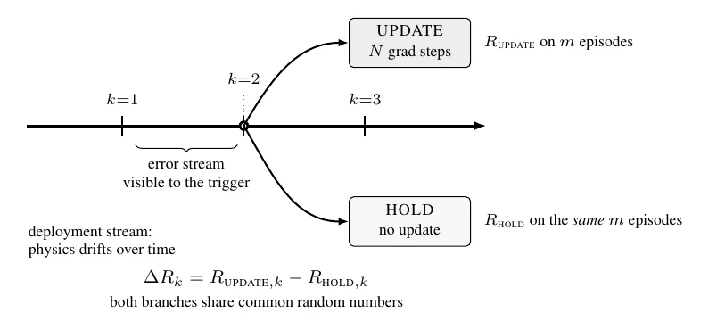

# Measuring the Value of World-Model Updates: A Counterfactual Utility Protocol for Continual Adaptation

- **首次提交**：2026-09-10
- **arXiv 主分类**：cs.LG
- **核验日期**：2026-09-24
- **整理来源**：用户提供的 2026-09-20 周报正式条目，按独立论文卡片补充原文核验
- **全文**：[HTML](https://arxiv.org/html/2609.10954)
- **作者**：Anqi Peter Li, Kaden Kim
- **年份与发表**：2026，arXiv；论文注明 under review at the CWM workshop
- **arXiv ID**：2609.10954
- **DOI**：无
- **论文**：[arXiv](https://arxiv.org/abs/2609.10954)
- **正式出版**：无
- **项目**：未发现独立官方项目页
- **代码**：论文称随附 code artifact 含实验 harness、分析脚本和 fork ledgers；本次未从可访问元数据核验到仓库 URL
- **数据**：论文称 code artifact 包含 corrected fork ledgers；未核验到独立数据页
- **模型**：未发现公开权重
- **AlphaXiv**：[AlphaXiv](https://alphaxiv.org/abs/2609.10954)
- **类别标签**：世界模型, 持续适应, 反事实评估, 因果干预, 强化学习
- **证据等级**：已核验原文方法与实验；关键比较与限制见各节

- **代表图**：Figure 1 · 固定更新与不更新的成对分叉评估协议

来源：[论文原图](https://arxiv.org/pdf/2609.10954#page=3)；[全文与图注](https://arxiv.org/html/2609.10954)。

## 当前挑战

部署期模型误差上升不意味着马上更新一定提高控制回报。单条在线轨迹只能看到更新或不更新之一，需要可恢复状态的配对实验建立更新效用标签。

## 研究动机

论文提出 fork ledger：在预注册的部署决策点保存状态，运行 UPDATE 与 HOLD 两条匹配 continuation，用相同初始状态、动作噪声和 planner 采样噪声计算 \(\Delta R\)。它把“误差是否变大”与“此刻更新是否有价值”分开，使任何只读取分叉前信号的触发器都能在同一组 treatment-effect 标签上比较。

最重要的 insight 是固定更新机制即使降低模型误差，也未必提高控制回报；更新价值依赖任务、漂移方向和当前能力。因果含义严格限定为：对该模拟器、该决策点和该固定更新干预的配对效果，不是关于世界动力学的一般因果发现。

## 技术方案

**过程**：先记录冻结参考流；每个决策点创建 UPDATE/HOLD 分支，UPDATE 对最近 10,000 transitions 做 200 个梯度步，HOLD 不更新；两分支在固定扰动和 30 个匹配 episode 上用 latent-space MPC/CEM 评估；计算 Delta R，再用分叉前 prediction error、KL 或 return 等信号排序更新时机。

- **输入**：干净动力学上预训练的 DreamerV3 风格 RSSM、发生物理参数漂移的部署流、预注册决策点、固定更新剂量及窗口。
- **过程**：先记录冻结参考流；每个决策点创建 UPDATE/HOLD 分支，UPDATE 对最近 10,000 transitions 做 200 个梯度步，HOLD 不更新；两分支在固定扰动和 30 个匹配 episode 上用 latent-space MPC/CEM 评估；计算 \(\Delta R\)，再用分叉前 prediction error、KL 或 return 等信号排序更新时机。
- **输出**：每个决策点的更新效用 ledger、置信区间、触发器 AUC 与策略回报汇总。

UPDATE 与 HOLD 在同一决策点分叉，以匹配随机数运行固定剂量更新的两个后续分支；只有分叉前信号可被用作更新触发器。reference stream 始终按 HOLD 继续，因此不同 fork 的单次更新效用不等价于长期连续提交更新的收益。

[原文方法](https://arxiv.org/html/2609.10954)

### 方法细节与实现

**评估对象。**论文并不设计一个更强的自适应世界模型，而是为“此刻是否值得更新”生成可重复使用的评估标签。参考部署流保持模型冻结，在预注册时刻复制完整状态，分别执行固定更新规则 UPDATE 和保持参数 HOLD。两支使用相同初始状态、动作噪声和规划采样随机数，以减少与更新无关的回报方差。

**反事实量与触发器隔离。**标签 ΔR = R_UPDATE − R_HOLD 定义的是一次完整更新干预的价值，包括更新时间、步数、数据窗口及其引起的参数变化。任何候选触发器只能读取分叉前的误差信号，对相同标签排序和打分；不能把分叉后的 HOLD 回报当成在线特征。这样避免不同触发器各自产生部署轨迹，导致阈值比较混入状态分布变化。

**实验机制的边界。**参考流为 6,000 个控制步、每 250 步一个决策点；主设置用最近 10,000 条转移执行 200 个梯度步，再以 30 个相同评估回合比较两支。评估时物理漂移固定在分叉瞬间值，因此测到的是当下世界里的更新价值；这与漂移继续加速时的前瞻价值不同。更新采用不回放旧训练数据的微调，不能据此否定所有持续学习方法。

[对应方法原文](https://arxiv.org/html/2609.10954#S3)

## 实验结果

主要环境是 DeepMind Control Suite/MuJoCo 的 cartpole-swingup、walker-walk、cheetah-run，另有 legacy schedule 的 hopper-hop 负对照。每个主要任务为 5 个预训练 checkpoint × 2 个漂移方向 × 每 cell 24 次 attempted fork，共 240 次；以 checkpoint cluster bootstrap 计算区间。

全 attempted forks 上，固定无 replay 更新在 CartPole、Walker、Cheetah 的平均 \(\Delta R\) 分别为 -144.0（95% CI [-185.4, -116.1]）、-82.8（[-101.1, -61.7]）、-18.6（[-29.0, -6.6]）。排除更新后发散的 fork 会产生 post-treatment conditioning；该子集上 CartPole 和 Walker 仍为负，而 Cheetah 为 -3.9（[-17.5, +13.0]），不能判定。独立 stream seeds 保持该符号格局，但独立推断单位仍是任务而不是种子。

论文还显示 CartPole 上按 residual 选择时机可优于 rate-matched random，但跨任务排序不稳定。实验直接支持“该固定无 replay 更新机制的价值随任务和漂移变化，以及 fork ledger 能比较触发器”；不支持“在线更新通常有害”或“该触发器可泛化到视觉世界模型”。

核验定位：摘要的 all-attempted estimand、正文表 1 的 retained subset 与表 3 触发器比较。720 次主要 attempted forks 中保留 693 次；剔除发散属于处理后筛选。CartPole/Walker/Cheetah 的全尝试均值为 −144.0/−82.8/−18.6，而保留子集为 −113.4/−82.1/−3.9，必须标明分母和估计对象。

[原文实验与表格](https://arxiv.org/html/2609.10954)

**避免幸存者偏差。**全部尝试为 720 个分叉，保留集为 693；三任务的全尝试平均回报差约为 −144.0/−82.8/−18.6，保留集为 −113.4/−82.1/−3.9。删除失败更新会使结果显得更乐观，因此主结论应优先依据全尝试口径。实验是少数低维控制任务和固定更新机制，推广到视觉 WAM 尚需重新构建分叉环境。

[实验与设置原文](https://arxiv.org/html/2609.10954)

## 代码与数据

正文明确称 accompanying code artifact 包含 harness、分析脚本和 corrected fork ledgers，但 arXiv 元数据和本次可访问正文未给出可核验仓库链接。因此只能确认作者的开放声明，不能确认下载可用性、许可证或复现实验是否完整；模型权重未见公开。

## 局限、失败案例与开放问题

研究依赖可恢复模拟器状态、标量回报和固定更新机制；每个 \(\Delta R\) 只衡量一次更新，参考流始终从 HOLD 继续，不评估已触发更新持续提交后的复合效果。主要证据仅有三个任务族和五个 checkpoint clusters；bootstrap 可能欠覆盖，多个 signal 比较没有 multiplicity correction。预注册主端点未报告、episode ramp 未执行、阈值规则有偏离，作者也把相关结果限定为描述性。视觉世界模型还缺少统一下游 outcome 与可控配对 rollout，部署到真实机器人时也难精确复现随机分支。

## 总结讨论

**阅读者分析**：该工作与 Causal-JEPA 所代表的“因果世界模型”关注点相邻但层级不同：它没有学习 SCM 或干预结构，而是为世界模型更新构造实验性反事实评价。对 DWM、HandsOnWorld、X-WAM、Flow WAM 等方向，它提供一种更严格的更新/适应评测思路：不要只报告 action-conditioned prediction 或视频质量，而应比较同一状态下 update/hold 对任务成功的影响。若知域后续设计因果 WAM，可把该 protocol 作为评估层，同时另行建立干预变量、识别假设和反事实泛化实验。
