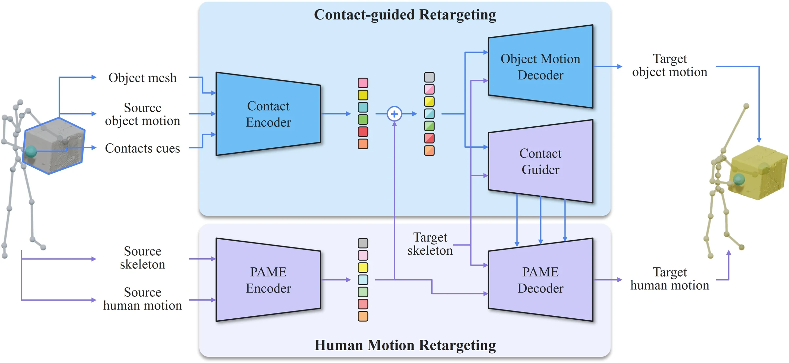

# ReCHOIR: Contact-guided Human Object Interaction Retargeting to Diverse Characters

- **首次提交**：2026-09-10
- **arXiv 主分类**：cs.GR
- **核验日期**：2026-09-24
- **整理来源**：用户提供的 2026-09-20 周报正式条目，按独立论文卡片补充原文核验
- **全文**：[HTML](https://arxiv.org/html/2609.10982)
- **作者**：Chaelin Kim, Seokhyeon Hong, Kwan Yun, Soojin Choi, Inseo Jang, Junyong Noh
- **年份与发表**：2026，SIGGRAPH Asia 2026 Journal Track；ACM Transactions on Graphics 45(6)，论文原文标注 2026 年 12 月出版
- **arXiv ID**：2609.10982
- **DOI**：原文当前未给出
- **论文**：[arXiv](https://arxiv.org/abs/2609.10982)
- **正式出版**：论文 PDF 标注 ACM Transactions on Graphics, Vol. 45, No. 6, Article 261；本次未核验到稳定 DOI 页面
- **项目**：[ReCHOIR 官方项目页](https://cherry-leki.github.io/projects/ReCHOIR/)
- **代码**：未发现已公开官方代码仓库
- **数据**：使用 OMOMO、BEHAVE、SAME 训练/评测数据；未发现本工作新增独立数据发布
- **模型**：未发现公开权重
- **AlphaXiv**：[AlphaXiv](https://alphaxiv.org/abs/2609.10982)
- **类别标签**：HOI, 动作重定向, 3D 人体动作, 接触建模, 前馈生成
- **证据等级**：已核验原文方法与实验；关键比较与限制见各节

- **代表图**：Figure 2 · 接触编码与引导分支协同人体运动重定向和物体运动解码

来源：[论文原图](https://arxiv.org/html/2609.10982v1/figures/03_Method/overview_v6_1.jpg)；[全文与图注](https://arxiv.org/html/2609.10982)。

## 当前挑战

角色体型和骨架发生变化时，单独重定向人体会破坏接触，单独复制物体轨迹也可能不合理。逐实例优化能修正部分接触，却难满足快速批量生成。

## 研究动机

论文解决跨不同骨架和体型角色的 HOI 动作重定向：既要保留源人体动作语义，也要维持人体—物体接触并同步调整物体运动。核心 insight 是把可迁移人体动作先验拆成全局与部位 latent，再把物体几何、物体状态和稀疏接触编码到相同部位结构中，以残差控制分支调制冻结的人体动作解码器；同一融合 latent 同时驱动物体运动解码器。

这比把 skeleton retargeting 后接 IK 更系统，因为人体与物体共同适配；也比 test-time optimization 更快。但实验表明它追求的是整体平衡，并非每个接触指标最优。

## 技术方案

**过程**：第一阶段训练 PAME 条件自编码器，将全身运动编码为 global token 与 body-part tokens，并用目标骨架解码；第二阶段冻结 PAME，以 PointNet++/MLP 编码物体几何、运动与接触，映射为部位对齐条件，与动作 latent 融合；Contact Guider 以类似 ControlNet 的残差路径调制 PAME Decoder，Object Motion Decoder 联合预测物体轨迹。

- **输入**：源人体动作和源骨架、目标角色骨架、源物体网格、逐帧物体状态以及由固定交互关节定义的接触线索。
- **过程**：第一阶段训练 PAME 条件自编码器，将全身运动编码为 global token 与 body-part tokens，并用目标骨架解码；第二阶段冻结 PAME，以 PointNet++/MLP 编码物体几何、运动与接触，映射为部位对齐条件，与动作 latent 融合；Contact Guider 以类似 ControlNet 的残差路径调制 PAME Decoder，Object Motion Decoder 联合预测物体轨迹。
- **输出**：适配目标骨架的完整人体运动，以及与之对齐的物体位置轨迹；当前物体朝向沿用源序列。

全局与部位 latent 先学习可迁移人体先验，再冻结先验并通过 Contact Guider 注入对象与接触条件。人体和对象平移由共享交互条件联合驱动，物体旋转仍沿用源序列。

[原文方法](https://arxiv.org/html/2609.10982)

### 方法细节与实现

**形体变化为何会破坏交互。**按关节旋转直接重定向动作时，目标角色的手长、躯干比例和站姿不同，即使关节轨迹相似，手也可能离开物体表面。ReCHOIR 把源运动中的接触关系作为额外约束，联合调整目标角色动作与物体运动，使“手和物体在何时何地接触”优先于纯姿态相似。

**模块分工。**PAME 自编码器先学习跨骨架的人体运动表示与重建；接触编码器读取物体几何、源物体运动和接触线索；接触引导分支以类似 ControlNet 的方式调制冻结的运动模型；物体运动解码器再输出与目标身体匹配的物体运动。冻结已有运动先验有助于保留自然动作，同时让新增模块学习交互约束。

**数据和监督。**基础动作覆盖 20 个 Mixamo 角色，交互监督来自 OMOMO/BEHAVE；额外以 10 个未见角色测试跨体形泛化。接触约束与运动重建共同塑造结果，目标是给动画角色生成可用 HOI，而不是执行真实机器人接触控制。物体旋转处理仍有限，复杂铰接、滑动和接触力不由当前表示完整描述。

[对应方法原文](https://arxiv.org/html/2609.10982#S3)

## 实验结果

PAME 使用与 SAME 相同的约 130 分钟 locomotion 数据、160 种骨架；HOI 阶段使用 OMOMO 与 BEHAVE 训练划分，源动作经 MotionBuilder 重定向到 20 个 Mixamo 角色，共 567 个样本、约 64 分钟。测试采用训练未见的 10 个角色：OMOMO-test 88 段/14,733 帧，BEHAVE-test 77 段/18,737 帧，均为 30 fps。训练在单张 NVIDIA RTX A5000 上完成。

指标覆盖人体动作 JR、RT、JP、FS、GP，接触 PRE、REC、F1、CD，物体 OGP、OF、OS，以及每帧耗时。基线包括 PAME、PAME+IK、PAME+Optim、PAME+IM；人体先验另与 SAME、SAN 比较。

ReCHOIR 在 OMOMO-test/BEHAVE-test 上分别为 F1 0.9713/0.9818、CD 5.9437/4.3277 cm、耗时 0.421/0.394 ms 每帧。它没有超过所有实例优化基线的接触数值，但相对约 15–200 ms 每帧的 IK/优化基线明显更快。23 名参与者对 12 段 HOI、五种方法的 60 个结果进行五点量表评价，ReCHOIR 在动作语义一致性、接触保持、交互对齐、整体质量上分别得 4.402、4.265、4.308、4.257，均为最高。消融显示去掉 Contact Guider 会显著降低接触指标，支持残差交互控制设计。

实验直接支持的是指定数据和目标角色构造下的效率—质量折中，以及各模块在该协议中的贡献；不直接支持真实捕获 HOI、任意骨架拓扑、长序列稳定性或通用物理可行性。

核验定位：原文方法、定量结果、消融和 23 人用户研究；周报中的 0.421/0.394 ms 是每帧推理时间，不包含原始 HOI 捕获与数据构建成本。该任务输入已有结构化动作和物体信息，不能归为从 RGB 直接重建 HOI。

[原文实验与表格](https://arxiv.org/html/2609.10982)

**性能含义。**报告的 0.421 ms 属于相应网络推理设置，不能直接等同于包括输入重建、角色准备和接触提取在内的完整制作耗时。接触保持、运动自然度与人体/物体碰撞应结合观察：接触点接近并不保证无穿透，关节误差低也不保证互动语义保持。

[实验与设置原文](https://arxiv.org/html/2609.10982)

## 代码与数据

项目页和论文可访问，但本次未发现官方代码仓库、模型权重或专门数据包。论文基于公开数据集并详细描述训练划分，但 MotionBuilder 生成的配对目标动作和完整预处理是否发布尚不明确，因此目前不足以一键复现。

## 局限、失败案例与开放问题

作者明确指出：源接触位置对体型差异大的目标可能不可达，语义等价交互有时需要重新选择接触策略；固定稀疏交互关节难覆盖精细抓握；物体只预测平移、不预测旋转；仅支持单个刚体；逐帧模型不显式建模长时依赖。训练使用构造配对而非真实目标 HOI ground truth，也可能带来工具链偏差。后续应评测接触重规划、手指/网格级接触、碰撞与动力学、多物体/关节物体以及长序列时序稳定性。

## 总结讨论

**阅读者分析**：该工作直接属于 3D HOI 的生成与重定向分支。其部位化 interaction latent 和冻结先验上的残差控制，可与 HarmoHOI 类重建结果衔接，也可为 StreamingHOI 提供低延迟动作适配模块。对知域研究路线最重要的提醒是：接触保持已经不能只看 F1/CD，需要同时报告动作语义、物体物理伪影、运行时和用户感知，并把“接触位置复制”升级为“交互语义保持”。
