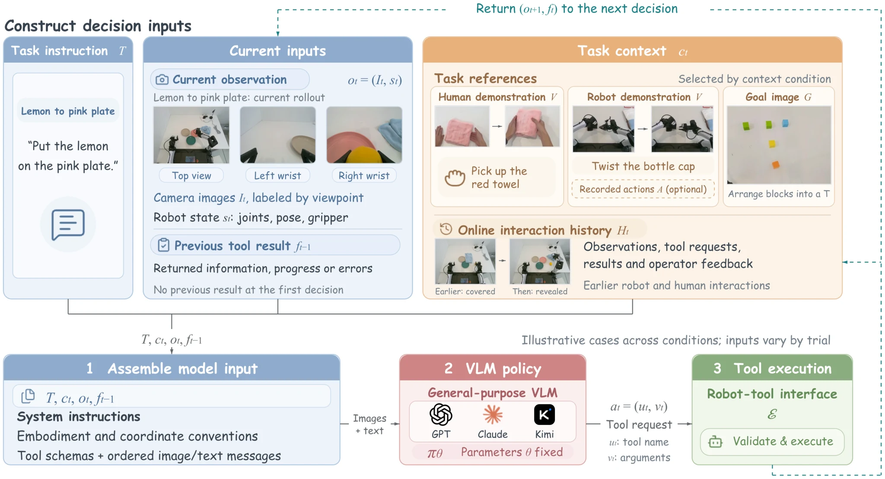

# In-Context Robot Learning with VLM Agents

- **首次提交**：2026-09-16
- **arXiv 主分类**：cs.CV
- **核验日期**：2026-09-24
- **整理来源**：用户提供的 2026-09-23 周报正式条目，按独立论文卡片补充原文核验
- **全文**：[HTML](https://arxiv.org/html/2609.19138)
- **作者**：Dongzhou Cheng, Taoran Yi, Ye Fang, Xingwu Zhang, Fan Feng, Yixuan Li, Gengxiong Zhuang, Rongze Wang, Shuai Yang, Wei Song, Weizhi Xue, Minyan Wu, Jie Gui, Jiaqi Wang, Tong Wu
- **年份与发表**：2026，arXiv，2026-09-16
- **arXiv ID**：2609.19138
- **DOI**：10.48550/arXiv.2609.19138
- **论文**：[arXiv](https://arxiv.org/abs/2609.19138)
- **正式出版**：未核验到
- **项目**：[Project](https://cheng-haha.github.io/GPT-Policy/)
- **代码**：[GitHub](https://github.com/cheng-haha/GPT-Policy)
- **数据**：未核验到独立公开数据集
- **模型**：使用商业 VLM，未发布独立机器人基础模型权重
- **AlphaXiv**：[AlphaXiv](https://alphaxiv.org/abs/2609.19138)
- **类别标签**：Embodied In-Context Learning, VLM Agent, Human Video
- **证据等级**：已核验原文方法与实验；关键比较与限制见各节

- **代表图**：Figure 2 · 示范与在线历史进入固定 VLM，结构化工具返回执行结果和新观察

来源：[论文原图](https://arxiv.org/html/2609.19138v1/overview.png)；[全文与图注](https://arxiv.org/html/2609.19138)。

## 当前挑战

机器人示范通常被当作离线训练数据；对于新任务，重新训练代价高。冻结 VLM 即使理解画面，也未必知道双臂命令、接触顺序和具体位移，因此需要把示范中可执行的经验压缩进上下文。

## 研究动机

该工作不训练新的机器人 foundation policy，而是让固定 VLM 在 inference context 中读取任务 demonstration。作者提出 context compiler，把机器人或人类演示压缩成保留 task-relevant state transition 的视觉上下文，VLM随后提出工具化的机器人动作，并由受约束 controller执行和检查结果。

关键点是 human video可以直接作为 in-context experience，而无需动作标签；对 contact-sensitive任务，带 aligned action reference 的 robot demonstration仍明显更有效。

## 技术方案

**过程**：context compiler提取关键视觉状态变化 → VLM根据 context提出 robot-tool action → constrained controller执行 → observation反馈重新进入上下文。

**输入**：当前视觉观察、任务指令、human/robot demonstration、可选动作参考。

**输出**：可执行机器人动作以及跨尝试更新的任务 context。

上下文来源包括人类视频、机器人视频及对齐动作、目标图、机器人自己的执行历史和在线人类反馈。视觉转移描述与控制工具之间仍需要空间定位、IK、轨迹限幅和实测执行检查；VLM 输出并不直接等于底层电机控制。

[原文方法](https://arxiv.org/html/2609.19138)

### 方法细节与实现

**上下文不是一段笼统摘要。**输入把任务指令、带视角标识的当前图像、机器人状态、目标图或示范关键帧、可选动作参考和本轮执行历史分开组织。示范记录按时间顺序交错图像与状态/动作文本，在线历史另存工具请求及执行结果；旧实时图像可以截断，任务参考则保留，避免把示范动作误认成当前已执行动作。

**工具到控制的完整链条。**VLM 通过结构化调用选择 move_to、move_eef_chunk 或夹爪命令。笛卡尔目标使用各手臂基座坐标系和 xyzw 四元数；控制器对位置线性插值、对旋转做 SLERP，再以前一解为初值逐点求 IK。Ruckig 分配时间并满足采样轨迹的速度、加速度和 jerk 限制，执行后回传实测状态、端点误差及稳定情况。

**在线适应发生在哪里。**VLM 参数固定，行为变化来自参考示范、历史结果与人工反馈的上下文变化。请求被拒绝也产生下一轮可用的反馈；模型宣称完成与物理任务实际成功分别记录。工具层运动学和标定承担大量可执行性保障，因此不能把该系统等价于仅靠视觉语言推理直接控制电机。

[对应方法原文](https://arxiv.org/html/2609.19138#S3)

## 实验结果

官方项目覆盖十个机器人任务，每种条件仅约 3 次 trial，因此统计规模较小。部分任务从无 demonstration 的 0/3提升到 human-video的2/3；contact-sensitive任务中，video+action reference可进一步达到3/3或2/3。这些结果支持“视觉示例可以驱动 in-context robot adaptation”，但不足以证明大规模任务泛化。

表 1 将成功数、决策次数和耗时同时报告。Pick Up Notebook 从无示范 0/3 变为人类视频 2/3，平均时间从 24.6 分钟降到 16.1 分钟；拔插插头由机器人视频的 0/3 变为视频+动作的 2/3，但平均时间从 7.9 分钟增至 10.8 分钟。上下文改善成功率不代表每个任务都更快。

[原文实验与表格](https://arxiv.org/html/2609.19138)

**比较动作参考的条件。**若要判断动作数值本身是否有用，必须固定示范图像和非动作文本，并说明是否额外提供实测状态。否则所谓“视频加动作”的收益可能同时来自更多程序描述或状态信息。论文小样本结果说明上下文接口可工作；商业模型版本、控制工具、示范挑选和额外尝试预算限制了横向可比性。

[实验与设置原文](https://arxiv.org/html/2609.19138)

## 代码与数据

GitHub公开了主要框架、ARX X5 与 I2RT/YAM 等接口，但仓库明确说明真实部署 host、私有 prompts、录制数据、calibration 和部分完整 real-robot pipeline 尚未全部公开，因此目前不是完全一键复现状态。

## 局限、失败案例与开放问题

试验次数少；性能受商业 VLM 版本影响；系统 latency、inter-arm collision和 demonstration selection仍明显影响结果。当前证据更适合证明“VLM上下文可以承载操作经验”，而不是证明已获得稳定的一般机器人 in-context learner。

## 总结讨论

**阅读者分析**：直接对应 embodied in-context learning，并补充 S1、RoboTTT、HOST 等路线：这里上下文是**外部视觉演示和交互历史**，而不是模型参数更新。
