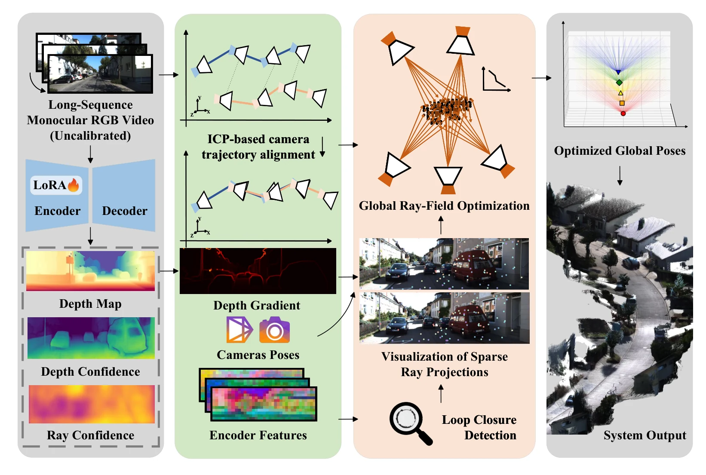

# GRF-Recon: Global Ray-Field Optimization for Long-Sequence Feed-forward Reconstruction

- **首次提交**：2026-09-17
- **arXiv 主分类**：cs.CV
- **核验日期**：2026-09-24
- **整理来源**：用户提供的 2026-09-23 周报正式条目，按独立论文卡片补充原文核验
- **全文**：[HTML](https://arxiv.org/html/2609.20012)
- **作者**：Enpeng Li, Yunzhou Zhang, Zhiyao Zhang, Dexuan Lyu, Chenyu Wang, Chiyuan Cui, Cheng Cheng
- **年份与发表**：2026，ECCV 2026 Spotlight；arXiv
- **arXiv ID**：2609.20012
- **DOI**：10.48550/arXiv.2609.20012
- **论文**：[arXiv](https://arxiv.org/abs/2609.20012)
- **正式出版**：arXiv comment明确标注 Accepted to ECCV 2026 as a Spotlight presentation；正式proceedings DOI本次未核验到
- **项目 / 代码 / 模型**：未核验到稳定公开入口
- **数据**：使用长序列视觉/几何benchmark，详见正文
- **AlphaXiv**：[AlphaXiv](https://alphaxiv.org/abs/2609.20012)
- **类别标签**：Feedforward Reconstruction, Long Sequence, Ray Field, 3D Geometry
- **证据等级**：已核验原文方法与实验；关键比较与限制见各节

- **代表图**：Figure 2 · 局部深度适配、稀疏射线场及回环图优化共同校正长序列几何

来源：[论文原图](https://arxiv.org/html/2609.20012v1/pipeline.png)；[全文与图注](https://arxiv.org/html/2609.20012)。

## 当前挑战

长序列前馈重建受到显存限制，分块虽能运行，却带来尺度不一致与累积轨迹漂移；局部点云漂亮也不保证长期全局坐标正确。

## 研究动机

GRF-Recon关注feedforward reconstruction扩展到长单目序列后的三个核心问题：GPU memory、局部geometry degradation和长期camera drift。它不完全依赖简单chunk stitching，而是在ray-field level增加跨帧全局几何约束。

## 技术方案

**过程**：coarse-to-fine trajectory alignment → LoRA注入monocular geometric prior → hybrid-weight sparse ray-field optimization进行local point refinement和cross-frame ray coupling → joint ray-error trajectory stitching降低累计drift。

**输入**：long monocular image sequence。

**输出**：长序列camera trajectory与globally consistent 3D reconstruction。

DA3 前端通过重归一化 LoRA 引入单目几何蒸馏，再构造 hybrid sparse ray-field 并用回环与全局图优化耦合序列。它保留前馈几何初始化，但完整管线包括优化后端。

[原文方法](https://arxiv.org/html/2609.20012)

### 方法细节与实现

**局部预测。**GRF-Recon 先在窗口内进行前馈几何预测，再用深度适配模块修正局部深度，并将相邻窗口初始轨迹拼接起来。DAR 使用 rank 8 LoRA，可训练参数低于骨干的 3%；报告训练 15 个 epoch、单 RTX 3090 约 14 小时。这个阶段解决局部深度系统偏差，不能独立消除长程累计漂移。

**全局射线场。**系统把深度、深度梯度、置信度和相机射线组织成稀疏几何约束，再借助回环检测把远隔时间但观察同一区域的窗口连接起来，进行全局图优化。相较只拼接点云，射线约束能够把重投影方向和尺度关系带入全局一致性求解。

**前馈与优化的边界。**标题中的 feed-forward 描述底层几何预测来源，最终长序列结果仍经过回环与图优化。部署成本应包含局部网络、候选匹配和全局求解；不能把最后的精度归因于一次纯前馈推理。弱纹理、动态对象和缺少回环的路径会削弱优化约束。

[对应方法原文](https://arxiv.org/html/2609.20012#S3)

## 实验结果

论文在多个长序列重建基准上比较feedforward和SLAM方法，报告在保持feedforward scalability的同时取得有竞争力的trajectory accuracy，并显著改善global reconstruction consistency。当前结论最直接支持“长序列feedforward reconstruction需要跨chunk显式global geometric coupling”，而不能解释成所有场景都全面优于成熟SLAM。

KITTI 表 2 的 ATE RMSE 平均为 7.18 m，DA3-Streaming 12.72 m、ORB-SLAM3 7.93 m；该平均**排除了高速序列 01**，本文在该序列仍为 76.52 m。Waymo 平均为 1.39 m，DA3-Streaming 1.76 m。所有轨迹/点云经全局 Sim(3) 对齐 LiDAR GT；实验使用单张 RTX 3090 24GB，深度前端微调约 14 小时。

[原文实验与表格](https://arxiv.org/html/2609.20012)

**重要口径。**轨迹评测使用 Sim(3) 对齐，说明误差是在允许全局旋转、平移和尺度校准后测得。KITTI 主均值 7.18 排除了困难序列 01，而该序列单独误差为 76.52；Waymo 为 1.39。阅读时需要同时看到排除规则和失败序列，不能只引用一个平均值作为任意长程相机轨迹都稳定的证据。

[实验与设置原文](https://arxiv.org/html/2609.20012)

## 代码与数据

本次未核验到官方代码、模型权重或独立新数据发布。

## 局限、失败案例与开放问题

方法仍需要额外ray-field optimization和trajectory stitching，因此并非严格意义上的single-pass纯feedforward；其长期性能也依赖monocular prior和跨帧overlap。

## 总结讨论

**阅读者分析**：对VGGT、DynamicVGGT、Gen3R等向长视频/4D reconstruction扩展很有价值：它说明局部feedforward geometry之外，长期全局坐标一致性仍然需要专门机制。
