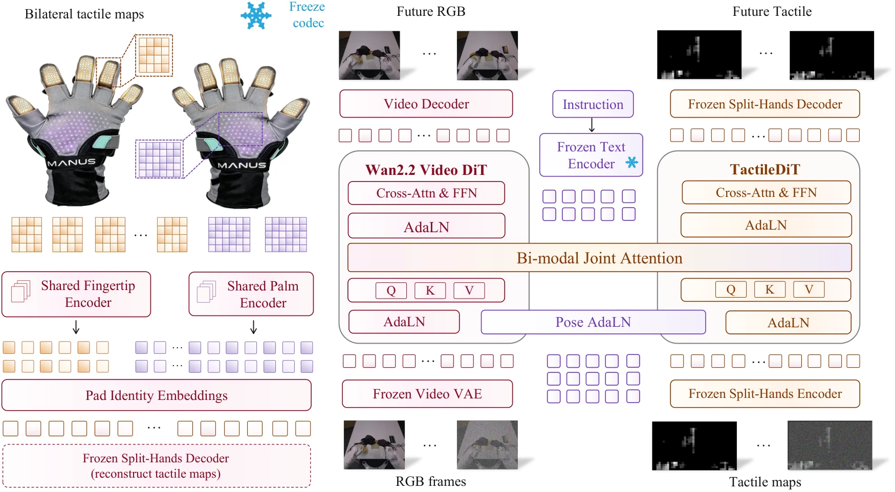

# DexTouch-WM: Learning Action-Conditioned Tactile World Models from Human Touch for Dexterous Robot Manipulation

- **首次提交**：2026-09-17
- **最近修订**：2026-09-18
- **arXiv 主分类**：cs.RO
- **核验日期**：2026-09-24
- **整理来源**：用户提供的 2026-09-23 周报正式条目，按独立论文卡片补充原文核验
- **全文**：[HTML](https://arxiv.org/html/2609.20649)
- **作者**：Yan Qin, Yue Chen, Wenwei Lin, Shujia Liu, Chuqiao Lyu, Kailun Su, Weiyang Jin, Chenze Yu, Ping Luo, Wenbo Ding, Tianxing Chen, Renjing Xu
- **年份与发表**：2026，arXiv v2；IROS 2026 Workshop RoBoWoMo Lightning Talk
- **arXiv ID**：2609.20649
- **DOI**：10.48550/arXiv.2609.20649
- **论文**：[arXiv](https://arxiv.org/abs/2609.20649)
- **正式出版**：IROS 2026 Workshop RoBoWoMo Lightning Talk；不是主会议录状态
- **项目**：未核验到独立官方项目页
- **代码**：未核验到
- **数据**：100 小时 human touch + 5 小时 robot interaction，未核验到公开下载
- **模型**：未核验到权重
- **AlphaXiv**：[AlphaXiv](https://alphaxiv.org/abs/2609.20649)
- **类别标签**：Tactile World Model, Human-to-Robot, Dexterous Manipulation
- **证据等级**：已核验原文方法与实验；关键比较与限制见各节

- **代表图**：Figure 2 · 独立触觉编码与视觉专家通过联合注意力预测未来 RGB 和接触状态

来源：[论文原图](https://arxiv.org/html/2609.20649v2/Pipeline.png)；[全文与图注](https://arxiv.org/html/2609.20649)。

## 当前挑战

视觉能看到物体移动，但很难单独确定是否接触、接触在哪个手指及压力如何演化。机器人触觉数据昂贵，而人类触摸数据与机器人动作和传感器拓扑并不天然对齐。

## 研究动机

DexTouch-WM将 human touch作为 robot tactile world-model 的 scaling data。作者在人手和机器人手上使用兼容的柔性压阻 tactile array，并把 human motion retarget 到 robot action space，使 human/robot transition能够监督同一个 action-conditioned visual-tactile world model。

## 技术方案

**过程**：预训练 video expert处理视觉，anatomy-aware tactile expert处理 palm/fingertip token；AdaLN式 action conditioning对齐世界演化；模型联合预测 future RGB 与 bilateral tactile state。

**输入**：RGB、多区域 tactile observations 和 retargeted action。

**输出**：未来视觉和接触状态，可进一步作为 policy evaluator 或 synthetic trajectory generator。

区分数据规模化和控制验证：共享传感器布局与动作重定向使人类触觉序列进入同一个预测器；世界模型还被用来估计策略相对好坏、生成额外训练轨迹。前者需要评价排序相关性，不能把模拟成功率直接当成真实成功率。

[原文方法](https://arxiv.org/html/2609.20649)

### 方法细节与实现

**视觉与触觉双专家。**视觉端继承 Wan2.2-TI2V-5B 和冻结 VAE，触觉端使用较轻的专门编码与 Transformer；两者通过带掩码的联合注意力交互，同时保留各自的前馈层和时间调制。触觉不是贴在 RGB 上的一幅提示图，而是有独立预测目标的动力学模态。

**触觉编码细节。**每只手保留 320 个 taxel：五个 4×4 指尖阵列和一个 15×16 掌部阵列。所有指尖共享编码器、两掌共享另一编码器，以 pad identity 保留传感器位置。预训练采用接触加权以避免大量零接触区域主导损失，然后冻结触觉编解码器。未来触觉预测相对初始潜变量的残差 r_t=z_t−z_0，解码时加回干净的初始锚点。

**人机对齐并非无标定。**HumanTouch 联合采集触觉、Manus 手部骨架、Vive 腕部位姿和多视角 RGB；将人手运动通过 IK 对齐到 WujiHand2。统一的 67D 动作包含双腕姿态、双手关节和相机位姿，并相对首帧表达。传感器空间布局、时间同步与手部几何标定是迁移前提，而非从普通网络视频直接恢复真实触觉。

[对应方法原文](https://arxiv.org/html/2609.20649#S3)

## 实验结果

固定 5 小时 robot data，把 human interaction由 0 扩到 100 小时后，held-out robot prediction持续改善；Contact-IoU由0.42升至0.59，Contact-F1由0.55升至0.71，同时视觉 trajectory accuracy也改善。

表 1 的精确 Contact-IoU 为 0.415→0.588、Contact-F1 为 0.551→0.706，触觉 MSE 为 0.093→0.029；变化对应固定 5h 机器人数据、加入 100h 人类数据。表 2 的模拟策略评分有明显乐观偏差，例如 FTP-1 Place Shoes 的真实成功率 0.725，WM-Mix 为 0.963。因此论文还用 Pearson/MMRV 衡量策略排序，预测更好不等于绝对成功率已校准。

[原文实验与表格](https://arxiv.org/html/2609.20649)

**数据增量与用途。**固定 5 小时机器人数据，加入 100 小时人类数据后，接触 IoU 从 0.415 到 0.588、F1 从 0.551 到 0.706、MSE 从 0.093 到 0.029，支持触觉未来预测改善。将世界模型作为策略评价器时，作者仍观察到绝对成功率偏乐观；相对排名有用与绝对成功概率校准是两个不同问题。

[实验与设置原文](https://arxiv.org/html/2609.20649)

## 代码与数据

本次未核验到正式公开仓库、数据下载或模型权重。

## 局限、失败案例与开放问题

human→robot transfer依赖共享 tactile sensor topology与action retargeting；因此它目前还不是“任意互联网人类视频/触觉直接迁移”的通用方案。

## 总结讨论

**阅读者分析**：它把“从人类视频学习”进一步扩展到“从人类**触觉交互**学习”，对 contact-aware 3D/4D HOI WAM尤其重要。
