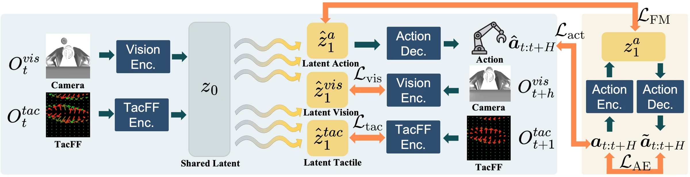

# Agile-WAM: An Agile Tactile World Action Model for Contact-Rich Robot Control

- **首次提交**：2026-09-17
- **最近修订**：2026-09-18
- **arXiv 主分类**：cs.RO
- **核验日期**：2026-09-24
- **整理来源**：用户提供的 2026-09-23 周报正式条目，按独立论文卡片补充原文核验
- **全文**：[HTML](https://arxiv.org/html/2609.20761)
- **作者**：Hanchu Zhou, Brendan Lynch, Raman Goyal, Dechen Gao, Begum Kasap, Boqi Zhao, Junshan Zhang
- **年份与发表**：2026，arXiv v2
- **arXiv ID**：2609.20761
- **DOI**：10.48550/arXiv.2609.20761
- **论文**：[arXiv](https://arxiv.org/abs/2609.20761)
- **正式出版**：未核验到
- **项目**：[Project](https://hanchuzhou.github.io/TARO_project_page/)
- **代码**：未核验到
- **数据**：未核验到独立发布
- **模型**：未核验到
- **AlphaXiv**：[AlphaXiv](https://alphaxiv.org/abs/2609.20761)
- **类别标签**：Tactile WAM, Contact-Rich Manipulation, Efficient WAM
- **证据等级**：已核验原文方法与实验；关键比较与限制见各节

- **代表图**：Figure 2 · 从共享观测潜变量联合生成动作及不同预测时距的视觉、触觉状态

来源：[论文原图](https://arxiv.org/html/2609.20761v2/figures/tac_framework.png)；[全文与图注](https://arxiv.org/html/2609.20761)。

## 当前挑战

视觉变化与指尖接触变化的时间尺度不同。统一预测很长的视觉和触觉未来会增加难度，大型视频扩散模型的延迟也不适合插入、旋拧等需要及时修正的任务。

## 研究动机

Agile-WAM不依赖大型视频 diffusion backbone，而是在共享 visual-tactile latent 中直接联合生成 action chunk和future visual/tactile latent。核心设计是认识到 vision 和 touch 的变化时间尺度不同：视觉预测较远 horizon，而 tactile只预测下一时间步。

## 技术方案

**过程**：联合编码到 shared latent → multi-horizon multimodal prediction → flow matching联合生成 future latent 与 action chunk。

**输入**：视觉、触觉、机器人状态。

**输出**：机器人动作和未来 visual/tactile state。

采用联合 action–vision–tactile 预测，而非只在策略输入中拼接触觉。不同未来 horizon 分配给两种感知模态，消融分别检查世界预测、模态组合和 horizon，借此分辨额外 latent 容量与预测目标的贡献。

[原文方法](https://arxiv.org/html/2609.20761)

### 方法细节与实现

**从观测潜变量出发的流。**视觉、触觉和本体编码器先把当前观测融合成 z_0，流模型从这个状态出发，一次预测动作、未来视觉和未来触觉潜变量。这样把多模态状态融合作为共同起点，避免每个积分步都重复整套高成本感知条件化；与只预测动作的策略相比，未来模态提供额外动态监督。

**动作编解码与训练一致性。**动作自编码器以 L1 重建学习动作潜空间；训练还解码实际 ODE 积分得到的动作潜变量，并让动作误差经积分过程反传。这样优化的不是只在干净动作编码上表现良好的解码器，也约束了流模型生成路径与最终可执行动作之间的匹配。

**不同模态使用不同预测时距。**视觉目标预测到执行动作段末尾 h_vis=h，触觉目标只预测下一步 h_tac=1。设计动机是视觉可提供较长时程的目标与场景变化，而接触状态切换快、远期触觉不确定性更大。两种未来潜变量分别以预测损失监督，不能把该模型解释成已经准确生成整段高频接触过程。

[对应方法原文](https://arxiv.org/html/2609.20761#S3)

## 实验结果

论文覆盖9个仿真任务和5个实机接触任务。实机五任务各20次试验，Agile-WAM分别成功16/20、11/20、13/20、6/20、17/20，合计63/100；VITA-VT为49/100。绝对提高14个百分点，按这组表格数计算相对提高28.6%。原文摘要/正文写作29.4%，与表中汇总不能完全对应，此处保留两种口径的差异，不把29.4%误写成上述公式的计算结果。

Peg Insertion为55%，低于VITA-VT的60%，并非每任务领先。11.9 ms是论文配置中的模型推理时间，实际闭环还包含传感器读取和控制执行。未来预测和预测时距消融支持多模态目标的作用，但当前证据未将可解释接触状态与抽象预测特征完全分离。

[实验表格与消融](https://arxiv.org/html/2609.20761#S4)

## 代码与数据

本次没有核验到稳定官方代码和权重。

## 局限、失败案例与开放问题

当前优势主要在 contact-rich manipulation；共享 latent究竟学习到了可解释的 contact state还是有效但抽象的 predictive feature仍未完全分离。

## 总结讨论

**阅读者分析**：提供了“高频 contact world model”设计，对未来将低频4D geometry和高频contact dynamics异步结合很有启发。
