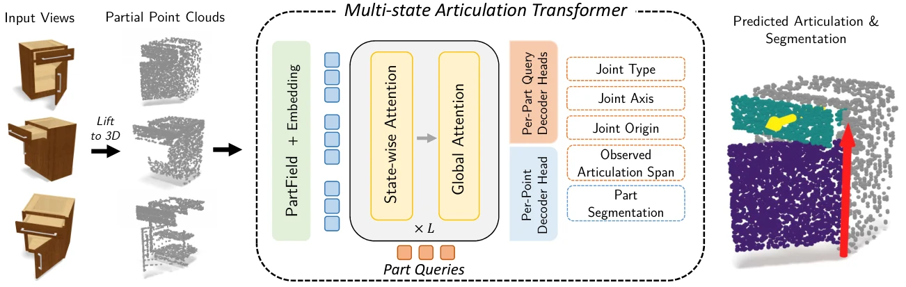

# FAMOS: Feed-Forward 3D Articulation Modeling from Sparse Observations

- **首次提交**：2026-09-17
- **arXiv 主分类**：cs.CV
- **核验日期**：2026-09-24
- **整理来源**：用户提供的 2026-09-23 周报正式条目，按独立论文卡片补充原文核验
- **全文**：[HTML](https://arxiv.org/html/2609.20817)
- **作者**：Kevin Qu, Tao Sun, Massimiliano Viola, Liyuan Zhu, Zhizhuo Zhou, Sayan Deb Sarkar, Konrad Schindler, Iro Armeni
- **年份与发表**：2026，arXiv
- **arXiv ID**：2609.20817
- **DOI**：10.48550/arXiv.2609.20817
- **论文**：[arXiv](https://arxiv.org/abs/2609.20817)
- **项目**：[Project](https://kevinqu7.github.io/famos/)
- **代码**：官方项目当前标记 `Code soon`
- **数据**：提供 procedural data generator demo；完整训练数据未核验到公开
- **模型**：未核验到
- **AlphaXiv**：[AlphaXiv](https://alphaxiv.org/abs/2609.20817)
- **类别标签**：Feedforward Reconstruction, Articulation, Interactive 3D
- **证据等级**：已核验原文方法与实验；关键比较与限制见各节

- **代表图**：Figure 2 · 跨状态部件查询联合预测分割、关节类型、轴线和已观测运动跨度

来源：[论文原图](https://arxiv.org/html/2609.20817v1/method.png)；[全文与图注](https://arxiv.org/html/2609.20817)。

## 当前挑战

静态外形无法唯一决定哪里能动、关节轴在哪里；多次观察又稀疏、无序且不完整。逐实例优化虽然可利用运动证据，却往往慢且依赖初始化。

## 研究动机

FAMOS从稀疏、无序、多状态 partial point clouds中直接预测 movable-part segmentation和joint parameters，而不是只从单一静态形状猜 articulation prior。

## 技术方案

**过程**：Multi-state Articulation Transformer交替进行state-wise和global attention；observed articulation span objective迫使模型利用跨状态motion evidence。

**输入**：一到多个 sparse monocular observations，经几何模型提升到 partial point clouds。

**输出**：movable parts、joint type、axis/origin和observed motion range。

Multi-State Articulation Transformer 将局部状态内结构和跨状态关系交替融合；监督除了部件与关节参数，也约束已观察到的运动跨度。这个 observed range 来自实际输入状态，不应被解释为已经恢复物体所有机械极限。

[原文方法](https://arxiv.org/html/2609.20817)

### 方法细节与实现

**多状态而非单状态识别。**输入是同一物体在若干开合状态下的局部点云。冻结的 PartField 提供局部形状语义，坐标和法向的位置编码提供几何线索。Transformer 交替进行单状态内部注意力和跨状态全局交互，没有绑定固定状态序号的 embedding，因此可以处理数量变化、顺序不固定的观测集合。

**部件槽位与输出。**可学习的部件查询不是预设“抽屉/门”等类别，而是待匹配的实例槽位；每个槽预测部件分割、关节类型、轴线、原点及观测到的运动跨度。训练时用跨所有状态共享的匹配分配槽位，避免某个部件在不同状态被不同槽位接管。

**运动跨度不是关节极限。**对至少在两个状态可见的部件，跨度定义为观测到的最大与最小关节状态之差；转动用弧度，平移按物体尺度归一化。这刻意把任务限定为观测证据支持的运动幅度，避免仅凭静态物体类别猜测整个可动范围。未展示的极限位置和接触约束不由这项预测直接给出。

[对应方法原文](https://arxiv.org/html/2609.20817#S3)

## 实验结果

在PartNet-Mobility、ACD、ArtiCraft-10K上比较 feed-forward与optimization baselines；ACD上相对 strongest feed-forward baseline的movable-part segmentation提升28.2 F1点，项目页报告motion MAO F1提升27.8点和约0.1 s inference。

表 1 的 ACD 部件分割 F1：FAMOS 71.9%，Particulate 43.7%，差 28.2 个百分点。表 2 的 ACD +MAO F1：64.5% 对 36.7%，差 27.8 点。MAO 逐层加入运动类型、轴与原点条件，比分割分数更接近完整关节建模。单视图测试也有收益，但不能用多状态结果替代单视图证据。

[原文实验与表格](https://arxiv.org/html/2609.20817)

**主要收益与适用边界。**ACD 和 MAO 的分割指标分别为 71.9 对 43.7、64.5 对 36.7，但分割提高并不自动等于关节轴精度提高，应结合各关节指标看。模型仍需要多状态点云及可靠的同物体关联；普通单帧 RGB 中完全不可见的运动机制，不能由该协议证明可恢复。

[实验与设置原文](https://arxiv.org/html/2609.20817)

## 代码与数据

代码尚未正式公开。

## 局限、失败案例与开放问题

它预测的是 articulation model而不是完整dynamic world rollout；真实 casual capture结果目前更偏generalization demo。

## 总结讨论

**阅读者分析**：对object-centric HOI world model意义直接：如果要预测“手推动抽屉/门之后世界如何变化”，movable-part identity与joint geometry是比纯point map更具可执行性的状态。
