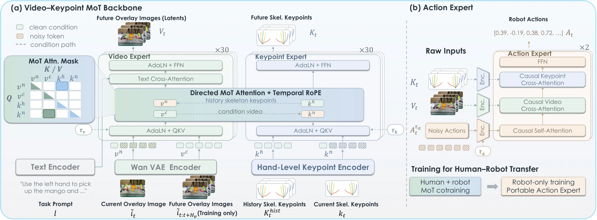

# Skel-WAM: A Hand-Skeleton-Conditioned World Action Model for Human-to-Robot Manipulation Transfer

- **首次提交**：2026-09-18
- **arXiv 主分类**：cs.RO
- **核验日期**：2026-09-24
- **整理来源**：用户提供的 2026-09-23 周报正式条目，按独立论文卡片补充原文核验
- **全文**：[HTML](https://arxiv.org/html/2609.21514)
- **作者**：Zetao Cai, Yaping Li, Yiqun Wang, Xinyu Zhan, Yuyin Yang, Haoxiang Ma, Kailin Li, Tao Lu, Jiangmiao Pang, Linning Xu, Dahua Lin
- **年份与发表**：2026，arXiv
- **arXiv ID**：2609.21514
- **DOI**：10.48550/arXiv.2609.21514
- **论文**：[arXiv](https://arxiv.org/abs/2609.21514)
- **项目**：[Project](https://healorcai.github.io/Skel-WAM/)
- **代码**：[官方占位仓库](https://github.com/HealorCai/Skel-WAM)，训练/评估代码与权重计划于 2026 年 12 月前发布
- **数据**：human + robot demonstrations；未核验到独立发布
- **模型**：未核验到
- **AlphaXiv**：[AlphaXiv](https://alphaxiv.org/abs/2609.21514)
- **类别标签**：Human Video, World Action Model, Hand Skeleton, Cross-Embodiment
- **证据等级**：已核验原文方法与实验；关键比较与限制见各节

- **代表图**：Figure 2 · 视频与手关键点专家共享运动先验，独立动作专家完成机器人控制

来源：[论文原图](https://arxiv.org/html/2609.21514v1/method_overview_pdf.png)；[全文与图注](https://arxiv.org/html/2609.21514)。

## 当前挑战

低成本人类示范缺少机器人动作标签，人手和机器人手在外观、运动学和控制空间上存在差异。直接混合 RGB 难明确分离共享运动规律与本体专有控制。

## 研究动机

通过同构hand skeleton，把human hand和robot hand运动映射到scene-grounded skeleton overlay与2.5D keypoint representation；human data训练Video/Keypoint Experts，robot-only Action Expert负责最终可执行动作。

## 技术方案

**过程**：Video–Keypoint Mixture-of-Transformers预测future visual dynamics与skeleton trajectory → Action Expert读取预测状态并输出robot action。

**输入**：RGB/skeleton-overlay、2.5D hand keypoints、task instruction。

**输出**：future visual/skeleton state及机器人动作。

共享的是手部拓扑、图像内骨架 overlay 和 2.5D keypoints。Video/Keypoint Experts 接受人机数据，Action Expert 只用机器人动作监督；官方说明动作梯度不回传共享 backbone。前向读取共享动态和反向更新共享表示必须分开理解。

[原文方法](https://arxiv.org/html/2609.21514)

### 方法细节与实现

**共享手部接口。**人和机器人都表示成双手、每手 21 点的拓扑，并同步保留两种形式：投影到 RGB 的骨架覆盖图，以及每点的归一化 u/v、米制深度和有效性。人手通过 WiLoR/MANO 加实测手长和相机优化得到米制点；机器人通过 URDF 正运动学及相机外参获得对应点。因此共享的是几何语义，而非直接复用人手关节角。

**四流注意力。**Wan2.2 初始化视频专家，层数对齐的关键点专家处理每手每帧一个 token。视频预测流读取历史骨架，关键点预测流读取视频条件；历史/条件分支隔离，当前锚点保持干净，未来目标参与 flow matching。训练中的未来视频条件可来自真值，而推理依次生成视频、关键点、动作，不能读取未来真实观察。

**人类数据如何影响控制。**人机混合训练只优化视频与关键点的 MoT；机器人专属动作专家随后仅在机器人数据上训练，动作梯度不回传共享骨干。实机为 42D 动作，包含双臂末端位姿和手部关节；视频/关键点/动作分别用 3/3/5 个采样步。此设计将共享运动先验和本体专属动作映射明确分开。

[对应方法原文](https://arxiv.org/html/2609.21514#S3)

## 实验结果

四个真实双臂任务平均SR 79.86%、七个simulation任务63.29%，分别比strongest baseline高22.22和8.28个百分点；robot-missing variations上human-robot cotrain将38.89%提高到86.11%。

原文表格每格同时列 SR / progress，79.86 和 63.29 是 SR。消融里，human cotrain 完整为 86.11%，去掉 overlay 为 50.00%，去掉 keypoints 为 13.89%；说明两种共享运动通道并非可简单互换。robot-missing variations 是特定位置、旋转、扰动与高度变化，不等于任意新任务零样本。

[原文实验与表格](https://arxiv.org/html/2609.21514)

**关键消融。**实机四任务平均 SR 为 79.86%，EgoVLA 为 57.64%；仿真七任务为 63.29% 对 55.01%。去掉骨架覆盖图或关键点分支的相关消融分别降至 50% 和 13.89%，支持两个几何接口的互补性。人类迁移的变化场景实验与机器人单域主表是不同设置，不能把它们拼成同一个总体成功率。

[实验与设置原文](https://arxiv.org/html/2609.21514)

## 代码与数据

项目与官方仓库页面已公开，但当前仓库主要为论文介绍和发布计划；evaluation、预处理、训练和 checkpoints 仍列在 TODO，不能记为完整实现已发布。

## 局限、失败案例与开放问题

共享hand topology是强先验，对非手形gripper、吸盘、多工具、多接触点系统如何泛化仍需要验证。

## 总结讨论

**阅读者分析**：这是本期最直接的“从人类视频学习具身 WAM”论文之一，也为4D HOI提供了明确可解释的cross-embodiment motion interface。
