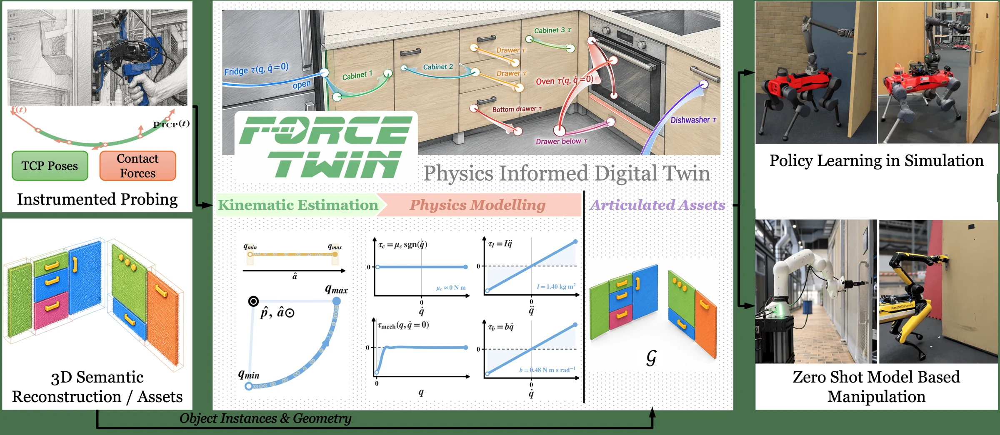

# ForceTwin: Physics-informed Digital Twins for Robotic Manipulation from Instrumented Human Interaction

- **作者**：Tim Engelbracht, René Zurbrügg, Mayank Mittal, Marco Hutter, Marc Pollefeys, Hermann Blum, Zuria Bauer
- **年份与发表**：2026，arXiv 预印本
- **arXiv ID**：2609.21751
- **首次提交**：2026-09-18
- **论文**：[arXiv](https://arxiv.org/abs/2609.21751)
- **全文**：[HTML](https://arxiv.org/html/2609.21751)
- **AlphaXiv**：[AlphaXiv](https://alphaxiv.org/abs/2609.21751)
- **类别标签**：数字孪生, 物理参数辨识, 接触建模, 机器人学习
- **arXiv 主分类**：cs.RO
- **核验日期**：2026-09-24
- **证据等级**：已核验原文方法、实验与局限；以下数值为作者报告，分析另行标注
- **项目**：[项目](https://timengelbracht.github.io/forcetwin-website/)

- **代表图**：Figure 1 · 力觉主动探测辨识对象动力学，构建可用于规划与仿真训练的数字孪生

来源：[论文原图](https://arxiv.org/html/2609.21751v1/figures/ForceTwin_PipelineFigure.png)；[全文与图注](https://arxiv.org/html/2609.21751)。

## 当前挑战

外观相似的门可能需要完全不同的力。现有数字孪生往往恢复关节几何，或由 VLM 赋予静态质量/摩擦先验，难刻画闭门器、弹簧等随位置与速度变化的机构负载。

## 研究动机

ForceTwin 让人用带力传感器的手持夹具主动探索对象，通过同步位姿与 wrench 估计运动学和有效动力学，并把结果用于机器人操作和策略训练。它的额外观测是直接测量的交互力，因此不能当成从普通 RGB 视频恢复动力学的方法。

## 技术方案

**过程**：估计转动/移动关节与轴线；补偿工具自身的重力和惯性 wrench；利用关节 Jacobian 投影为广义作用力；非负拟合惯量、库仑摩擦和黏性阻尼，再用位置负载与非负速度相关阻尼网络拟合机构残差；组装孪生用于仿真与控制。

- **输入**：逐对象采集的工具位姿、六维力/力矩和交互轨迹。
- **过程**：估计转动/移动关节与轴线；补偿工具自身的重力和惯性 wrench；利用关节 Jacobian 投影为广义作用力；非负拟合惯量、库仑摩擦和黏性阻尼，再用位置负载与非负速度相关阻尼网络拟合机构残差；组装孪生用于仿真与控制。
- **输出**：对象关节参数、有效动力学及机构函数；可供阻抗控制器前馈补偿和门穿越策略训练使用的资产。

模型可写为 τ = Iq̈ + μ sign(q̇) + bq̇ + g(q) + c(q,|q̇|)q̇。非负 c 约束耗散性；g 可以包含弹簧，也可以吸收未补偿的重力负载。[方法 §III](https://arxiv.org/html/2609.21751#S3)

### 方法细节与实现

**主动辨识而非只重建外观。**人使用带力传感器的手持夹具推动、拉动或转动物体，同步记录工具位姿与接触力/力矩，辨识关节结构和作用力模型；这一步不要求机器人参与。物理模型可独立于几何重建估计，再与同段记录恢复或另行提供的几何资产配准。力数据约束仅凭外观与运动难以确定的实例动力学，使资产可用于后续机器人控制与仿真训练。

**物理参数化。**关节广义力由惯性项 Iq̈、库仑摩擦 μsign(q̇)、黏性项 bq̇、重力项 g(q) 和非负的状态相关耗散 c(q,|q̇|)q̇ 组成。非负耗散约束避免残差网络凭空向系统注入能量。这个结构把可解释低阶物理项与难以解析建模的状态依赖阻力结合起来，但有限探测轨迹下若干参数仍可能互相补偿。

**使用方式。**辨识后的对象进入模拟器，支持基于模型的操作和仿真策略学习，再回到真实对象执行。每个新对象需要探测和注册，不是只凭一幅图片直接预测通用接触力；力传感器质量、探测动作覆盖和关节模型正确性会决定孪生模型的有效范围。

[对应方法原文](https://arxiv.org/html/2609.21751#S3)

## 实验结果

12 根真实测试轴上，移动/转动类型准确率均为 100%；转动轴位置误差为 23±26 mm，MoMa-SG 为 46±20 mm。Spot 与 Franka 的 9 个可执行对象—本体组合中，平均目标完成程度为 87.3%，VLM prior 为 59.7%，kinematics-only 为 56.9%；该 Complete 指标不应改写成同等比例的二元任务成功率。

强机构场景收益尤其明显，例如 Franka 金属门完成程度 81.2%，两个基线约 1.6%/1.5%；但弱负载的抽屉、滑门上并非每项都领先。Spot 的金属门因作用力超过执行器能力未纳入可执行组合。论文还报告用孪生训练门穿越策略并部署实机。[实验 §IV](https://arxiv.org/html/2609.21751#S4)

**评价口径。**9 个对象—本体组合中报告 87.3% 的目标完成程度，对照为 59.7%/56.9%；这里不是 87.3% 的二元任务成功率。结果支持物理校准在测试对象上的效用，尚不足以证明摩擦、重力和残差被唯一识别。更强外推证据需要未用于辨识的速度、负载和接触位置测试。

[实验与设置原文](https://arxiv.org/html/2609.21751)

## 总结讨论

**阅读者分析**：它直接补上几何孪生到接触控制之间缺失的“需要多少力”。对 HOI，最有价值的是运动学约束与测力联合辨识；其规模化代价则是每个实例都需要充分激励的物理探索。

## 代码与数据

官方项目页已确认；页面仍显示 Paper/Code/Video soon，但 arXiv 原文已经可访问。尚未确认公开实现、原始仪器采集数据或训练资产下载。

## 局限、失败案例与开放问题

作者明确指出参数分解不唯一：常量残差阻尼与 b 可互相吸收，配置相关重力与 g 也不可自动区分。模型在 (q,q̇) 上无记忆，不能表示回差、静止粘滞和锁扣状态；仅在探索过的关节范围有效。改变抽屉负载后如何在线更新，仍未解决。
