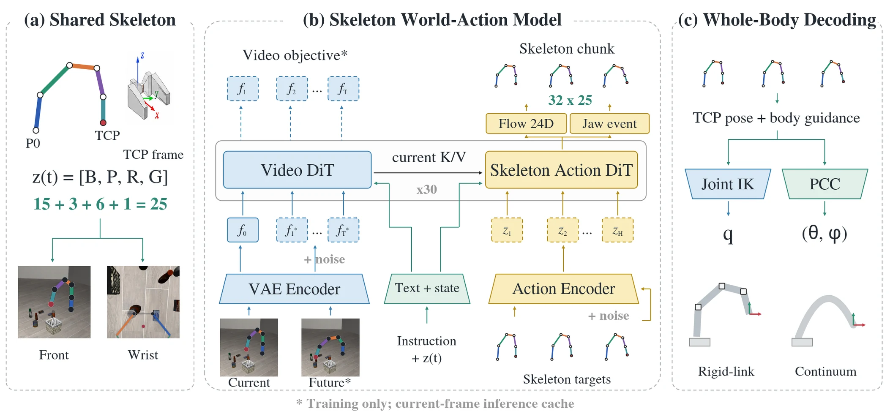

# SkelWAM: A Skeleton-Guided World-Action Model for Zero-Shot Cross-Embodiment Manipulation

- **首次提交**：2026-09-18
- **arXiv 主分类**：cs.RO
- **核验日期**：2026-09-24
- **整理来源**：用户提供的 2026-09-23 周报正式条目，按独立论文卡片补充原文核验
- **全文**：[HTML](https://arxiv.org/html/2609.21983)
- **作者**：Pengjun Niu, Yujia Xie, Rui Peng, Hang Zhao, Ke Liu
- **年份与发表**：2026，arXiv
- **arXiv ID**：2609.21983
- **DOI**：10.48550/arXiv.2609.21983
- **论文**：[arXiv](https://arxiv.org/abs/2609.21983)
- **项目**：[Project](http://www.liukepku.com/skelwam/index.html)
- **代码**：未核验到
- **数据**：LIBERO-Cross10 benchmark
- **模型**：未核验到
- **AlphaXiv**：[AlphaXiv](https://alphaxiv.org/abs/2609.21983)
- **类别标签**：Cross-Embodiment, Skeleton WAM, Zero-Shot Transfer
- **证据等级**：已核验原文方法与实验；关键比较与限制见各节

- **代表图**：Figure 2 · 共享手臂骨架统一视觉和动作，再经本体专用解码器生成控制

来源：[论文原图](https://arxiv.org/html/2609.21983v1/figures/fig02_representation/figure.png)；[全文与图注](https://arxiv.org/html/2609.21983)。

## 当前挑战

只统一末端位姿不能描述不同手臂的整身可达性、中心线与本体外观差异。源本体训练的策略可能在新本体的视觉和动作两个接口上同时失配。

## 研究动机

不同于基于手部骨架的 Skel-WAM，本工作定义25D whole-body representation，由arm centerline、TCP pose与parallel-jaw command组成，并将视觉canonicalization和动作表示都建立在同一geometry上。

## 技术方案

**过程**：video-action MoT预测canonical skeleton action chunk → embodiment-specific constrained decoder转成各robot joint/continuum controls。

**输入**：canonical third-person/wrist observations及source robot demonstrations。

**输出**：目标机器人可执行动作，无需target-task demonstration或policy update。

统一的 25D 骨架把手臂中心线、TCP 姿态和夹爪状态编码到视觉与动作中；部署仍需目标本体专用的受约束解码器及反馈。零样本指没有目标任务示范或策略梯度更新，并不意味着无需目标机器人几何和控制适配。

[原文方法](https://arxiv.org/html/2609.21983)

### 方法细节与实现

**25D 规范动作。**手臂中心线按弧长均匀采样，以 TCP 为参考、按臂长归一化；五个有效中心线点形成 15D，再加 3D TCP 位置、6D 旋转和 1D 夹爪命令。中心线采样不绑定具体关节位置，因此可在刚性关节臂与连续体臂之间定义同一种形状描述。

**视觉也必须规范化。**原生机器人像素被掩蔽并补全背景，再绘制规范中心线与夹爪代理。仿真可利用特权分割与隐藏机器人后的渲染，实机依赖标定掩码和修补。这解释了为什么去掉视觉规范化会几乎完全失效：共享动作向量不能单独消除本体外观分布变化。

**训练和推理接口。**视频与动作专家均以 30 层 Wan2.2 初始化，先联合训练，再冻结视频专家；24D 连续几何使用 flow matching，夹爪采用事件存在性及首次切换时刻的分解目标。动作查询只读取当前帧 K/V 和动作 token，部署缓存当前 K/V，无需生成未来视频。32×25 的骨架动作段由目标本体的 IK 或连续体运动学解码，并加入中心线形状约束。

[对应方法原文](https://arxiv.org/html/2609.21983#S3)

## 实验结果

LIBERO-Cross10涵盖10 tasks×10 target embodiments、共1,000 episodes；Franka-trained模型达到43.3%，最佳evaluated baseline为7.1%，95% Wilson CI为40.3–46.4%。

最关键的表 2 消融：去掉视觉规范化 SR 43.3%→0.0%，去掉共享动作表示→0.1%；去掉 world modeling 只降到 43.0%，去掉解码改进为 40.9%。因此实验主要支持视觉/动作接口统一，尚不能把大幅迁移收益单独归因于世界预测。官方同时注明各基线预训练与源域适配预算不同。

[原文实验与表格](https://arxiv.org/html/2609.21983)

**归因与零样本定义。**去掉世界建模后 43.3% 仅降为 43.0%，而去掉视觉/动作共享接口分别降到 0.0%/0.1%，这是解释贡献最有力的证据。零样本指没有目标任务示范或策略更新，仍需目标本体标定、运动学与解码器；把它称为完全无适配部署会误导复现预期。

[实验与设置原文](https://arxiv.org/html/2609.21983)

## 代码与数据

项目可访问；代码未核验到。

## 局限、失败案例与开放问题

真实JAKA→Feagine continuum robot实验目前主要证明可部署性，而非提供与simulation同等级的大规模统计。

## 总结讨论

**阅读者分析**：这是非常直接的 cross-embodiment WAM。对“3D/4D信息是否能成为通用动作语言”这个研究问题价值很高。
