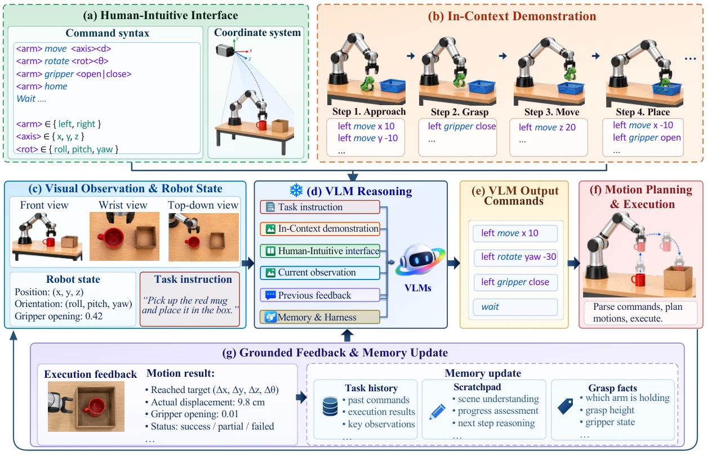

# Transferring the Intelligence of VLMs to Robotic Control

- **作者**：Meng-Hao Guo, Zhe-Han Mo, Jia-Jun Wang, Yi Zhang, Kejin Wang, Yi-Xuan Deng, Jia-Peng Zhang, Yongming Rao, Shi-Min Hu
- **年份与发表**：2026，arXiv 预印本
- **arXiv ID**：2609.22966
- **首次提交**：2026-09-19
- **论文**：[arXiv](https://arxiv.org/abs/2609.22966)
- **全文**：[HTML](https://arxiv.org/html/2609.22966)
- **AlphaXiv**：[AlphaXiv](https://alphaxiv.org/abs/2609.22966)
- **类别标签**：Embodied ICL, VLM Agent, 机器人学习
- **arXiv 主分类**：cs.RO
- **核验日期**：2026-09-24
- **证据等级**：已核验原文方法、实验与局限；以下数值为作者报告，分析另行标注
- **项目**：[项目](https://robodawn.top/)
- **代码**：[代码](https://github.com/Hugo-AGI/RoboDawn)

- **代表图**：Figure 2 · 语义运动接口、上下文示范与执行反馈连接冻结 VLM 和机器人

来源：[论文原图](https://arxiv.org/html/2609.22966v1/pipeline.png)；[全文与图注](https://arxiv.org/html/2609.22966)。

## 当前挑战

通用 VLM 有视觉推理能力，却不自然对应高频关节角和机器人动作坐标。任务专用策略又通常需要大量示范和参数更新。问题是如何给冻结 VLM 一个它能理解、能根据反馈修正的机器人接口。

## 研究动机

RoboDawn 用少量符合人类直觉的离散运动命令连接 VLM 与机器人，再用上下文示范教会命令约定和任务策略。能力适配主要发生在推理上下文中，无需任务专用梯度训练。

## 技术方案

**过程**：冻结 VLM 观察、推理、生成批量命令；控制层以夹爪指尖中点 GIP 为参考，将 move、rotate、point、gripper、home 等命令转成目标位姿与规划运动；收到 reached/partial/failed 后继续更新计划和记忆。

- **输入**：带空间网格标注的多视图图像、机器人状态、任务指令、命令说明、零到多个任务示范和历史反馈。
- **过程**：冻结 VLM 观察、推理、生成批量命令；控制层以夹爪指尖中点 GIP 为参考，将 move、rotate、point、gripper、home 等命令转成目标位姿与规划运动；收到 reached/partial/failed 后继续更新计划和记忆。
- **输出**：闭环机器人操作及执行过程记录。

示范轨迹被转成在线可执行的命令和简短解释。默认平移和旋转单命令幅度分别限制为 20 cm 与 90°；世界坐标约定和 GIP 一致性是落地关键。零样本指无任务示范，仍包含公共命令说明。[原文方法 §3](https://arxiv.org/html/2609.22966#S3)

### 方法细节与实现

**语义控制接口。**RoboDawn 把机器人的运动暴露为以世界坐标和语义方向描述的移动、旋转与夹爪操作，单次位移和转角分别限制在 20 cm、90° 范围。VLM 需要推理相对目标及操作顺序，由运动规划和控制器负责执行具体轨迹。这层接口降低不同机器人底层动作格式差异对语言模型的影响。

**上下文示范与反馈。**固定 VLM 读取多视角图像、机器人状态、任务指令和少量示范，将示范中的操作模式迁移到当前对象与布局；每次命令后接收实际移动量、夹爪状态及执行成功/失败信息。记忆保存已发生操作、进度和相关空间事实，使下次决策能根据执行偏差修正。

**为何不能把它当成新训练的 VLA。**模型能力主要来自已有 VLM，加上机器人接口、提示和上下文组织，任务期间不训练新的动作网络。代码开放有利于复现编排流程，但相机与机器人标定、可达性检查和商业模型调用条件仍需在本地适配。

[对应方法原文](https://arxiv.org/html/2609.22966#S3)

## 实验结果

RoboTwin 2.0 C2R 为 50 个双臂任务、每任务 10 次：零样本 53.2%，一个任务示范 73.6%；训练于全量基准示范的 π0.5 为 46.0%。RoboDojo 为 42 个任务、每任务 5 次，零/单样本分别 35.67%/47.17%。后者混有开放指令任务，阅读比较时需留意各基线训练覆盖。

项目页报告 RoboDojo 单样本从 60 命令预算的 31.2% 提升到 240 命令的 47.2%，因此成功率也依赖测试时交互预算。实机 Franka 展示入篮和叠块；入篮零样本为 9/10。时间分析用 Seed-2.1-Pro：每决策推理约 9.74 秒，机器人运动约 2.09 秒，不是高频控制。[原文](https://arxiv.org/html/2609.22966)；[官方实验页](https://robodawn.top/)

**规模与效率。**C2R 采用 50 个任务、每任务 10 次评估；RoboDojo 为 42 个任务、每任务 5 次。后者由 35.67% 提高到 47.17%，单次决策平均推理约 9.74 秒、运动约 2.09 秒，瓶颈主要在高层模型。增加一条示范带来的改善支持上下文学习，但不同模型推理预算和重试次数应同时对齐。

[实验与设置原文](https://arxiv.org/html/2609.22966)

## 总结讨论

**阅读者分析**：与 VoLo 的互补点是接口层级不同：RoboDawn 让 VLM 直接组合简单运动命令；VoLo 调度已经具有接触技能的策略与工具。它也不同于 WAM：没有训练一个显式未来视觉/触觉预测器。

## 代码与数据

[Hugo-AGI/RoboDawn](https://github.com/Hugo-AGI/RoboDawn) 已公开，官方项目页已从早期 coming soon 更新为开源链接。模型依赖外部 VLM；不能把无需任务训练解释为不依赖任何预训练模型和控制基础设施。

## 局限、失败案例与开放问题

细接触精度不足、IK 路径碰撞、过早判断成功是已展示失败。精确旋转比平移更困难；增加示范不保证单调改善，长上下文可能降低效果。实机任务和次数仍少，VLM 版本与命令预算影响复现。
