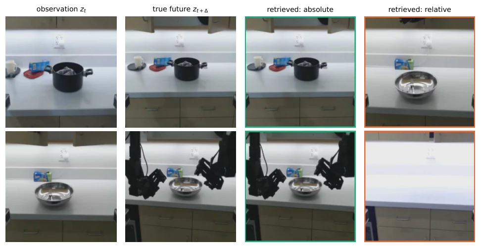

# Robot World Models Are Not Invariant to How the Actions Are Written

- **首次提交**：2026-09-19
- **arXiv 主分类**：cs.RO
- **核验日期**：2026-09-24
- **整理来源**：用户提供的 2026-09-23 周报正式条目，按独立论文卡片补充原文核验
- **全文**：[HTML](https://arxiv.org/html/2609.23252)
- **作者**：Ahmed Karim, Leon Chlon
- **年份与发表**：2026，arXiv
- **arXiv ID**：2609.23252
- **DOI**：10.48550/arXiv.2609.23252
- **论文**：[arXiv](https://arxiv.org/abs/2609.23252)
- **项目**：未核验到
- **代码**：未核验到
- **数据**：使用 ALOHA、PushT 等
- **模型**：未核验到
- **AlphaXiv**：[AlphaXiv](https://alphaxiv.org/abs/2609.23252)
- **类别标签**：World Model, Action Representation, Invariance
- **证据等级**：已核验原文方法与实验；关键比较与限制见各节

- **代表图**：Figure 1 · 同一物理动作采用不同编码时的未来检索差异

来源：[论文原图](https://arxiv.org/html/2609.23252v1/fig1_montage_2row.png)；[全文与图注](https://arxiv.org/html/2609.23252)。

## 当前挑战

同一物理动作可以用绝对目标或相对增量表示。即使给定当前状态后两者信息等价，神经网络也可能将表示方式当成行为差异，进而改变对未来和候选动作的评分。

## 研究动机

论文发现 world model会强烈依赖action notation。即使 absolute target和relative delta在给定当前state后数学上等价，模型训练于一种写法后直接换另一种写法，预测空间可能完全改变。

## 技术方案

**过程**：冻结I-JEPA encoder，仅学习action-conditioned latent transition；比较absolute和relative action encoding；随后通过objective orbit averaging和agreement penalty修复representation dependence。

**输入**：current JEPA latent与action window。

**输出**：future latent和用于goal-conditioned action selection的world prediction。

研究冻结 I-JEPA 视觉表征，只训练 latent transition，将“动作坐标变化”与“物理行为变化”尽量分开。orbit averaging 在等价表示上聚合目标，agreement penalty 显式约束两种表示的输出一致，而不是只增加一种动作数据增强。

[原文方法](https://arxiv.org/html/2609.23252)

### 方法细节与实现

**被检验的不变性。**给定当前状态，绝对目标位置和相对位移可以相互变换，因而它们应描述同一物理行动。作者冻结 I-JEPA 编码器，只训练动作条件的潜状态转移，比较同一转移分别采用两种动作写法时的预测与检索结果，从而尽量排除视觉编码器差异。

**修复目标。**orbit averaging 对等价动作表示上的训练目标求平均，agreement penalty 进一步把同一物理行动的预测拉近。前者增加跨表示覆盖，后者明确约束输出一致；两者不是只换一种归一化尺度。强约束能改善跨表示一致性，但也可能削弱对熟悉编码的专门拟合。

**决策层检查。**论文除比较 latent 相似度，还用预测未来做目标条件的动作选择，检验表示偏差是否改变实际候选排序。动作编码本身几乎可逆并不能迫使神经网络遵守这种等价性，这是对 WAM 接口和数据混合方式的直接提醒。

[对应方法原文](https://arxiv.org/html/2609.23252#S3)

## 实验结果

三组robot dataset、两种morphology中cross-encoding retrieval下降2.6–13.4×；goal-conditioned action selection从53.1%降到15.4%；PushT cross-encoding cosine仅0.067、worst −0.377。两种action encoding在joint input上仍可\(R^2=0.996\)互相重建。

表 2 中 λ=16 时，两种编码 agreement mean/worst 达 0.999/0.995，动作选择为 41.1%/41.1%。它恢复了编码一致性，却低于原 teacher 在熟悉编码下的 53.1%。因此修复的是表示依赖，并非无代价提升每项任务性能；retrieval collapse 倍数也不是机器人成功率下降倍数。

[原文实验与表格](https://arxiv.org/html/2609.23252)

**恢复与损失同时存在。**λ=16 时两种编码的平均/最差 agreement 为 0.999/0.995，动作选择均达到 41.1%，恢复了一致性，但低于原 teacher 在熟悉编码下的 53.1%。因此正确结论是表示稳健性与单域最优性能之间存在权衡，不能只展示 agreement 接近 1 就宣称控制全面改善。

[实验与设置原文](https://arxiv.org/html/2609.23252)

## 代码与数据

未核验到新代码发布。

## 局限、失败案例与开放问题

重点只验证少数action parameterization；其他representation symmetry是否同样严重仍需系统测试。

## 总结讨论

**阅读者分析**：对WAM benchmark和跨本体动作统一极其重要：action coordinate选择本身可能成为隐藏confounder。
