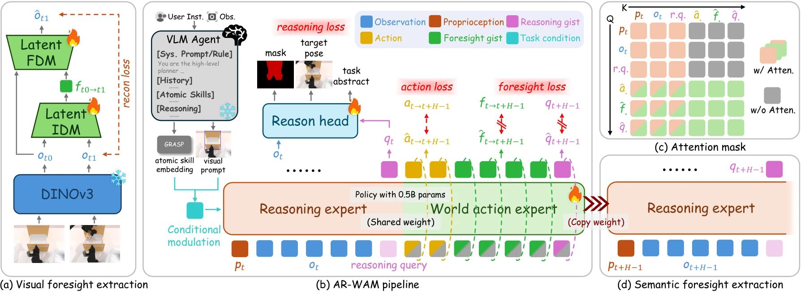

# AR-WAM: A Visual-Conditioned Agent-Ready World Action Model for Robotic Manipulation

- **首次提交**：2026-09-20
- **arXiv 主分类**：cs.RO
- **核验日期**：2026-09-24
- **整理来源**：用户提供的 2026-09-23 周报正式条目，按独立论文卡片补充原文核验
- **全文**：[HTML](https://arxiv.org/html/2609.23578)
- **作者**：Yicheng Jiang, Zesen Gan, Xiaobo Wang, Tianlun He, Chenxu Zhao, Minghui Wu, Xinyue Wang, Jiaxu Wang, Junhao He, Jianan Wang, Qiming Shao
- **年份与发表**：2026，arXiv
- **arXiv ID**：2609.23578
- **DOI**：10.48550/arXiv.2609.23578
- **论文**：[arXiv](https://arxiv.org/abs/2609.23578)
- **项目 / 代码 / 数据 / 模型**：本次未核验到公开入口
- **AlphaXiv**：[AlphaXiv](https://alphaxiv.org/abs/2609.23578)
- **类别标签**：World Action Model, Agent Interface, Visual Grounding
- **证据等级**：已核验原文方法与实验；关键比较与限制见各节

- **代表图**：Figure 1 · 结构化推理、视觉与语义未来对齐共同条件化动作生成

来源：[论文原图](https://arxiv.org/html/2609.23578v1/AR-WAM_overview.png)；[全文与图注](https://arxiv.org/html/2609.23578)。

## 当前挑战

上层 Agent 已能做语言推理，底层策略再次解析长指令可能增加歧义和模型开销。复杂任务还需要显式目标绑定，避免动作作用于错误对象。

## 研究动机

AR-WAM认为上层AI Agent本身已经具有language reasoning，因此底层机器人policy不一定还需要natural-language interface。它用target bounding box + learnable operation token定义任务。

## 技术方案

**过程**：0.5B model通过frozen visual encoder编码当前世界，在compact latent中预测scene evolution，同时输出动作；外部Agent通过detect/execute/query primitive控制长程流程。

**输入**：视觉场景、visual grounding box、operation token。

**输出**：world-state latent和robot action。

视觉框用于指定交互对象，可学习 operation token 指定操作类型；模型用紧凑的 gist future state 支持动作。上层 detect/execute/query 负责长程分解与查询，不能把整个 Agent 的记忆能力归到 0.5B 底层模型。

[原文方法](https://arxiv.org/html/2609.23578)

### 方法细节与实现

**可解释推理目标。**AR-WAM 的 reasoning queries 预测目标掩码、双臂末端终态和原子任务类别，分别用分割、位姿和分类损失监督；这是一组结构化隐变量，不是自由文本思维链。上层 Agent 提供目标框和原子操作，底层据此形成可执行动作段。

**双层未来对齐。**离线逆动力学模块从当前与未来视觉特征提取 foresight gist，作为冻结的视觉未来目标；同时用未来 reasoning token 提供语义未来目标。世界动作专家联合预测动作、视觉 gist 与未来推理状态，分别优化动作和两类未来对齐损失。总参数约 0.5B，其中约 0.3B 为冻结 DINOv3、约 0.2B 为共享推理/动作网络。

**调度与缓存。**每轮先执行一次推理并缓存 K/V，动作去噪时复用；累计末端移动、夹爪开闭或时间条件触发上层重新规划。这样的事件触发机制把低频语义规划和连续控制衔接起来，也意味着失败恢复收益同时依赖工具接口与调用规则。

[对应方法原文](https://arxiv.org/html/2609.23578#S3)

## 实验结果

RoboTwin clean平均87.2%、random 84.2%；matched ablation中text condition为74.2%，完整visual prompt + reasoning + gist foresight为87.2%。真实机器人long-horizon结果相对基线提升36.7%，报告14.1 ms inference。

RoboTwin 表 1 显示 clean 87.2% 低于 Fast-WAM 的 87.8%，random 84.2% 高于 82.5%；优势不是全设置最高。匹配消融里去 reasoning 为 79.4%，去 foresight 为 78.6%，用 patch 目标代替 gist 为 76.4%，完整为 87.2%。这组消融比不同大小的外部模型比较更能支持紧凑未来状态设计。

[原文实验与表格](https://arxiv.org/html/2609.23578)

**不要只看随机化榜单。**RoboTwin 随机设置为 84.2%，对照 Fast-WAM 为 82.5%；干净设置为 87.2%，略低于 87.8%。去掉 reasoning 或 foresight 后分别为 79.4%/78.6%，支持两类监督有效，但高层视觉提示、训练框抖动和推理缓存也参与最终系统表现。

[实验与设置原文](https://arxiv.org/html/2609.23578)

## 代码与数据

未核验到公开资源。

## 局限、失败案例与开放问题

需要外部detector / Agent提供目标和memory，因此系统边界比普通VLA/WAM更大；长时能力不能全部归功于内部 world model。

## 总结讨论

**阅读者分析**：提示WAM可能成为Agent体系中的“execution primitive”，而不一定承担全部language planning。
