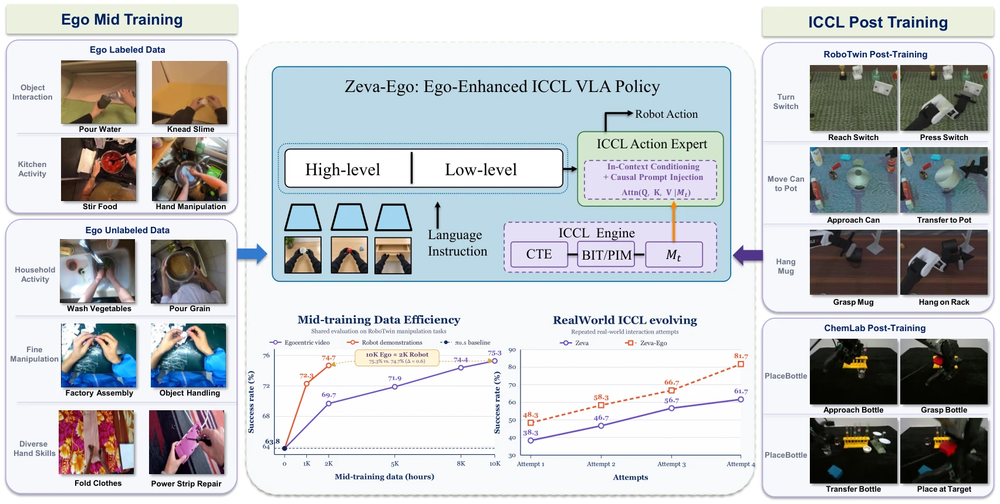

# Zeva-Ego: Egocentric Mid-Training with In-Context Causal Learning for Robot Manipulation

- **首次提交**：2026-09-21
- **最近修订**：2026-09-22
- **arXiv 主分类**：cs.RO
- **核验日期**：2026-09-24
- **整理来源**：用户提供的 2026-09-23 周报正式条目，按独立论文卡片补充原文核验
- **全文**：[HTML](https://arxiv.org/html/2609.24411)
- **作者**：Bingjia Huang, Xin Ding, Fu Chen, Kun Li, Wei Sun, Hao Wu, Yunxin Liu, Ting Cao
- **年份与发表**：2026，arXiv v2
- **arXiv ID**：2609.24411
- **DOI**：10.48550/arXiv.2609.24411
- **论文**：[arXiv](https://arxiv.org/abs/2609.24411)
- **项目 / 代码 / 数据 / 模型**：本次未核验到稳定公开入口
- **AlphaXiv**：[AlphaXiv](https://alphaxiv.org/abs/2609.24411)
- **类别标签**：Egocentric Video, Human-to-Robot, In-Context Learning, Action-Effect
- **证据等级**：已核验原文方法与实验；关键比较与限制见各节

- **代表图**：Figure 1 · 人类视频中间训练与部署期动作—效果上下文学习的两阶段框架

来源：[论文原图](https://arxiv.org/html/2609.24411v2/zeva_ego_teaser.png)；[全文与图注](https://arxiv.org/html/2609.24411)。

## 当前挑战

海量第一视角人类视频无法直接提供机器人动作；而部署后一次错误的 action-effect 经验，通常也无法马上被固定策略利用。该工作分别处理离线人类经验利用与在线上下文适配。

## 研究动机

ACE把egocentric visual transition转成action-centered supervision用于VLA mid-training；ICCL则在部署时根据多次action-effect observation进行parameter-free in-context adaptation。

## 技术方案

**过程**：ACE学习transition representation → VLA mid-training → ICCL积累执行结果作为context。

**输入**：egocentric human video、robot observations/action和部署后的action-effect feedback。

**输出**：机器人动作及随interaction history改善的行为。

ACE 提供面向动作效果的中间监督，ICCL 在测试时累积动作及后果，不更新参数。mid-training 的数据规模收益和部署时多次尝试收益来自不同设置，应分别看待。

[原文方法](https://arxiv.org/html/2609.24411)

### 方法细节与实现

**ACE 第一阶段：提取非动作残差。**冻结 DINOv2 提取两帧特征，编码器同时看到已知物理动作，用 4×128 的环境瓶颈表示动作解释不了的相机移动、遮挡和场景变化；解码器在当前特征、动作和该瓶颈的条件下重建未来特征。相机监督、动作依赖抑制和方差正则进一步约束残差通道。

**ACE 第二阶段：仅从视觉提取动作。**保留环境查询并增加 16 个任务查询，编码器只读取两帧 RGB 特征；冻结的第一阶段环境表示作为教师目标，不直接输入第二阶段。物理动作轨迹先相对初态积分并采样为 8 个点，平移、旋转和夹爪分别归一化，以 KL 邻域匹配让相似动作对应相近的视觉任务 token。标注无动作的人类视频时只需视觉输入。

**ICCL 与策略耦合。**π0.5 的语言视觉骨干预测子任务，动作专家以 flow matching 输出连续动作。ICCL 的历史动作—效果上下文直接条件化动作专家，不进入 VLM 骨干；因此高层子任务判断和低层经验修正有不同的计算路径。在线收益来自上下文积累，而非测试时参数更新或显式结构因果模型估计。

[对应方法原文](https://arxiv.org/html/2609.24411#S3)

## 实验结果

10K小时Ego video使RoboTwin从63.8%提升到75.3%，约等于2K小时robot demonstration的74.7%；ICCL在四次尝试中从58%提升到89%，无参数更新。

还需区分 RoboTwin 设置：原文表 1 的 RoboTwin 2.0 Hard 平均成功率为 58.7%，π0.5 为 51.2%；不能与数据规模实验的 75.3% 混用。LIBERO-PRO 表 2 平均为 57.48%，提升在 Spatial 子集尤为突出，但并非所有子集最高。四次尝试 58%→89% 包含额外环境反馈预算，不是单次零样本性能。

[原文实验与表格](https://arxiv.org/html/2609.24411)

**两个增益不能混为一谈。**10K 小时第一视角数据的 63.8%→75.3% 来自数据规模实验；RoboTwin 2.0 Hard 主表为 58.7%，与 π0.5 的 51.2% 比较；四次尝试的 58%→89% 又引入在线反馈预算。这三组数字回答不同问题，均应保留设置名称，避免读者误认为同一测试上的连续提升。

[实验与设置原文](https://arxiv.org/html/2609.24411)

## 代码与数据

本次未核验到可下载的官方实现、独立数据或模型权重；具体开放状态仍待核验。

## 局限、失败案例与开放问题

所谓“4–5小时Ego≈1小时Robot”只是本模型、本benchmark下的empirical ratio，不能当成通用scaling law。ICCL中的“causal”也不等于SCM或causal identification。

## 总结讨论

**阅读者分析**：同时覆盖Egocentric World Model / human-video learning / embodied in-context adaptation，与人类视频学习和在线上下文适配直接相关。
