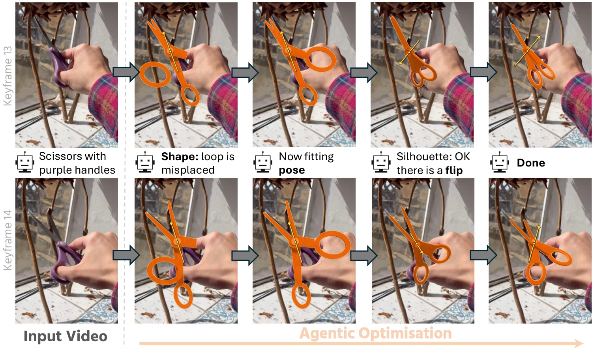

# AgentSTAR: Agentic Shape Tracking and Reconstruction from Monocular Videos

- **作者**：Kirill Mazur, Nikita Karaev, Matthew Chang, Jitendra Malik, Nur Muhammad "Mahi'' Shafiullah
- **年份与发表**：2026，arXiv 预印本
- **arXiv ID**：2609.24487
- **首次提交**：2026-09-21
- **论文**：[arXiv](https://arxiv.org/abs/2609.24487)
- **全文**：[HTML](https://arxiv.org/html/2609.24487)
- **AlphaXiv**：[AlphaXiv](https://alphaxiv.org/abs/2609.24487)
- **类别标签**：3D/4D, 关节物体, 物体跟踪, VLM Agent, HOI
- **arXiv 主分类**：cs.CV
- **核验日期**：2026-09-24
- **证据等级**：已核验原文方法、实验与局限；以下数值为作者报告，分析另行标注
- **项目**：[项目](https://agenticstar.github.io/)
- **代码**：[代码](https://github.com/makezur/agenticSTAR)

- **代表图**：Figure 2 · VLM 查看渲染叠加结果，交替修订对象形状与时序姿态

来源：[论文原图](https://arxiv.org/html/2609.24487v1/method.png)；[全文与图注](https://arxiv.org/html/2609.24487)。

## 当前挑战

从单目交互视频先求密集对应、再估几何和关节，容易受大运动、遮挡、透明物体和弱纹理干扰。无结构点轨迹也不能直接给机器人提供可操作的部件和关节状态。

## 研究动机

AgentSTAR 先提出能解释视频的结构化物体，再优化它随时间的状态。VLM 负责形状和机制假设，数值工具负责精细位姿；两者通过渲染—比较循环互补，避免仅依赖像素匹配。

## 技术方案

**过程**：Agent 用 Python/Blender primitives 编写 canonical 物体、命名部件和关节；交替修改共享形状和每帧 generalized pose；渲染 silhouette，与扣除手部遮挡的目标 mask 计算 IoU；借助 pose sweep、局部数值搜索和跨关键帧时间诊断修正结果。

- **输入**：关键帧、目标物体 mask、相机参数，可选手部遮挡 mask 和深度。实际代码提供 Pi3X 相机恢复入口，物体 mask 仍需提供或由分割模型生成。
- **过程**：Agent 用 Python/Blender primitives 编写 canonical 物体、命名部件和关节；交替修改共享形状和每帧 generalized pose；渲染 silhouette，与扣除手部遮挡的目标 mask 计算 IoU；借助 pose sweep、局部数值搜索和跨关键帧时间诊断修正结果。
- **输出**：结构化物体几何、关节参数和各帧 SE(3)+关节状态；官方代码导出 GLB 与 pose.json。

深度是可选监督，默认方案不依赖深度拟合；但单目结果存在全局尺度歧义，部分 3D 评估另用深度对齐尺度。代码与论文的相机/尺度协议需要共同阅读。[方法 §3](https://arxiv.org/html/2609.24487#S3)

### 方法细节与实现

**共享形状与逐帧状态。**Agent 生成 Python/Blender 程序定义规范空间中的对象形状与关节结构，同一形状跨所有帧共享；每帧只改变 SE(3) 位姿和关节状态。相比逐帧独立拟合，这使遮挡时的部件身份和结构保持受到约束，也让重建结果可以被继续编辑或执行。

**交替优化。**shape step 修改形状代码，pose step 调整每帧刚体和关节参数；VLM 查看参考帧与渲染叠加图后提出修正，优化 harness 管理候选执行、评分、历史和接受规则。轮廓 IoU 是主要图像证据，可结合手部遮挡排除和深度，但单一轮廓指标存在翻转、尺度和背面形状歧义。

**时序约束的作用。**相邻帧状态应平滑且共享同一物理对象，时序一致性帮助避免逐帧局部最优。程序可执行并不等于实时：论文给出每视频可达 10 小时的优化预算。公开实现中的部分机制模块默认关闭、不同分支配置不同，复现应检查实际运行配置，而不是只按框图理解所有模块都启用。

[对应方法原文](https://arxiv.org/html/2609.24487#S3)

## 实验结果

评测包含 ARCTIC 关节物体、HOT3D 刚体和 iTACO。ARCTIC harness 消融中，默认 GPT-5.6 Sol 的 3D tracking EPE 为 5.59 cm；去掉时间工具为 6.15 cm、无 harness 为 11.26 cm，仅使用 IoU objective 的变体达到 151.46 cm，说明可用优化工具和搜索设计十分关键。

HOT3D 上平均平移误差 3.04 cm、平均旋转误差 37.6°；SAM3D-Tracker 为 6.41 cm/51.6°。iTACO 的多个关节指标领先，但 world-frame Chamfer 并非所有指标最佳。默认每视频优化预算为 **10 小时**，因此与前馈模型比较时必须同时报告成本。[实验 §4](https://arxiv.org/html/2609.24487#S4)

**消融揭示的不只是 VLM 能力。**完整 harness 的跟踪 EPE 为 5.59，去掉时序项为 6.15、去掉 harness 为 11.26，单独 IoU 优化可到 151.46。这说明状态管理、约束与评分设计非常关键。HOT3D 平移误差 3.04 cm 与旋转误差 37.6° 并存，也表明视觉上吻合不能替代准确 6D 位姿。

[实验与设置原文](https://arxiv.org/html/2609.24487)

## 总结讨论

**阅读者分析**：这是一条以物体结构约束轨迹的 inverse graphics 路线，很适合为 object-centric HOI 构建离线资产或伪标签。其部件对应来自共享模型和 forward kinematics，不等同于通用非刚体稠密点跟踪，也没有恢复力学参数。

## 代码与数据

[makezur/agenticSTAR](https://github.com/makezur/agenticSTAR) 已公开 harness、Blender 工具、样例和输入约定。README 提醒论文启用了 mechanism 模块，而代码默认关闭；GPT-5.6 Sol 论文结果使用 critic 分支。运行耗时数小时且消耗大量模型 tokens，复现不能只运行默认命令。

## 局限、失败案例与开放问题

形状原语、关节假设、相机和分割质量限制上限；silhouette 相似不能唯一确定隐藏表面或真实机制。粗语义先验可能生成看似合理但错误的结构。当前系统不适合低延迟在线 HOI 跟踪，向柔性物体、多对象接触及自动可靠初始化的扩展仍待验证。
