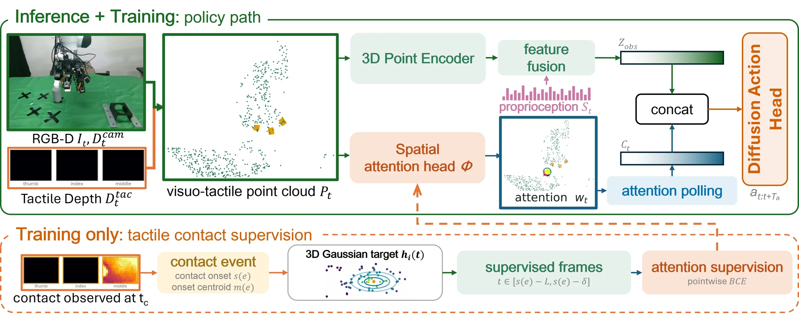

# TACIT: Tactile Contact Supervision for Spatial Attention in Dexterous Manipulation

- **首次提交**：2026-09-21
- **arXiv 主分类**：cs.RO
- **核验日期**：2026-09-24
- **整理来源**：用户提供的 2026-09-23 周报正式条目，按独立论文卡片补充原文核验
- **全文**：[HTML](https://arxiv.org/html/2609.24507)
- **作者**：Yanhou Lai, Fucai Zhu, Ruiqiang Wang, Koichi Hashimoto
- **年份与发表**：2026，arXiv
- **arXiv ID**：2609.24507
- **DOI**：10.48550/arXiv.2609.24507
- **论文**：[arXiv](https://arxiv.org/abs/2609.24507)
- **项目 / 代码 / 模型**：未核验到
- **数据**：real robot + simulation；未核验到公开下载
- **AlphaXiv**：[AlphaXiv](https://alphaxiv.org/abs/2609.24507)
- **类别标签**：Tactile, 3D Spatial Attention, Dexterous Manipulation, HOI
- **证据等级**：已核验原文方法与实验；关键比较与限制见各节

- **代表图**：Figure 2 · 接触事件只提供训练监督，空间注意力与实时视觉触觉共同驱动扩散策略

来源：[论文原图](https://arxiv.org/html/2609.24507v1/figure/tacit_policy_architecture.jpg)；[全文与图注](https://arxiv.org/html/2609.24507)。

## 当前挑战

灵巧操作中，目标接触区往往很小，视觉—触觉简单融合可能仍将注意力分散到无关空间。依赖人工点标注又难扩展，因此需要从示范接触本身提取空间监督。

## 研究动机

使用teleoperation demonstration中真实测得的tactile contact作为训练阶段的3D attention监督，而不需要手工点标注或视觉foundation model生成attention label。

## 技术方案

**过程**：示范中的后续接触位置监督接触前的三维空间注意力，注意力池化特征条件化视觉触觉扩散策略。

**输入**：camera point cloud、vision与tactile observation。

**输出**：dexterous robot actions。

训练期把测得的接触位置映射成 3D Gaussian 注意力目标；策略执行仍接收视觉和触觉。所谓“接触作为训练监督”不意味着测试时不需要触觉。注意力池化用于突出后续操作要到达的区域。

[原文方法](https://arxiv.org/html/2609.24507)

### 方法细节与实现

**接触监督的时间方向。**先从示范中检测在 t_c 发生的接触及其三维中心，再把该位置转换为接触前 t<t_c 的空间注意力监督。后续触觉事件告诉模型此前应关注哪里；不是使用“历史接触点”解释尚未发生的接近。未来接触只作为离线训练标签，推理时没有访问未来传感器。

**点云和注意力。**相机深度与触觉深度转成统一空间的视觉—触觉点云，三维点编码器提供特征，注意力头预测各点权重；以接触中心构造 Gaussian 目标，监督注意力聚焦到目标接触区域。加权池化后的局部特征与本体状态及其他视觉触觉特征融合，交给扩散动作头生成动作段。

**训练监督与部署输入分开。**接触事件标签只用于训练，但运行中的策略仍接收实时触觉。输入匹配对照使用同样 600 个相机点和 900 个触觉点，因而更能隔离“接触监督空间注意力”的作用，而不是将额外传感器或更密点云误算成方法收益。

[对应方法原文](https://arxiv.org/html/2609.24507#S3)

## 实验结果

每任务仅10 demonstrations、5个placement regions；ball placement 66.7%，peg insertion73.3%，而input-matched 3D visuotactile baseline分别10%与20%。所有30 trials都能在12秒内进入150 mm approach region，剩余失败发生于到达后。

输入匹配对照 A2 与 TACIT 都使用 600 camera points + 900 tactile points，区别在接触监督注意力。30 次 ball/peg 测试，A2 成功 3/30、6/30，TACIT 为 20/30、22/30；TACIT reach 均为 30/30。结果支持接近阶段的空间定位改进，剩余失败仍在近距离操作阶段。

[原文实验与表格](https://arxiv.org/html/2609.24507)

**分阶段评价更准确。**每任务 10 条示范，30 次测试中球放置为 20/30、插销为 22/30，输入匹配对照为 3/30、6/30。全部试验都能在 12 秒内到达 150 mm 接近区域，说明定位/接近明显改善，但仍有最后接触与精细操作失败。它是感知和策略学习方法，不是触觉未来生成或力学系统辨识工作。

[实验与设置原文](https://arxiv.org/html/2609.24507)

## 代码与数据

未核验到公开资源。

## 局限、失败案例与开放问题

论文证据支持的是contact supervision改善approach/spatial grounding；它不是world model，也不能单独证明长期contact dynamics学习。

## 总结讨论

**阅读者分析**：可作为3D/4D HOI world model中contact-supervision设计的重要参考。
