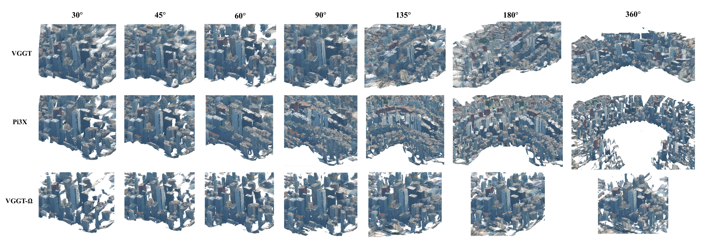

# When Wider Views Fail: Stress-Testing Feed-Forward 3D Reconstruction

- **首次提交**：2026-09-21
- **arXiv 主分类**：cs.CV
- **核验日期**：2026-09-24
- **整理来源**：用户提供的 2026-09-23 周报正式条目，按独立论文卡片补充原文核验
- **全文**：[HTML](https://arxiv.org/html/2609.24839)
- **作者**：Daisy Li, Kyle Gao, Quanyun Wu, Hanna Chomko, John S. Zelek, Jonathan Li
- **年份与发表**：2026，arXiv
- **arXiv ID**：2609.24839
- **DOI**：10.48550/arXiv.2609.24839
- **论文**：[arXiv](https://arxiv.org/abs/2609.24839)
- **项目 / 代码 / 数据 / 模型**：未核验到
- **AlphaXiv**：[AlphaXiv](https://alphaxiv.org/abs/2609.24839)
- **类别标签**：Feedforward Reconstruction, VGGT, Distribution Shift
- **证据等级**：已核验原文方法与实验；关键比较与限制见各节

- **代表图**：Figure 1 · 固定输入数量时，视角跨度扩大带来的全局重建差异

来源：[论文原图](https://arxiv.org/html/2609.24839v1/TRT.png)；[全文与图注](https://arxiv.org/html/2609.24839)。

## 当前挑战

输入图像数量相同，并不意味着几何约束同样强。相机跨度增大时相邻视图重叠减少，前馈模型可能以重复结构替代真实环形布局；常规窄基线测试不容易暴露这种错误。

## 研究动机

固定输入图像数量，只扩大camera angular span，测试feedforward geometry foundation model面对越来越弱view overlap时是否仍保持全局一致。

## 技术方案

**过程**：分别送入Pi3X、VGGT、VGGT-Ω等模型 → 与pseudo-reference比较point cloud geometry。

**输入**：固定数量、不同angular span的sparse views。

**输出**：3D reconstruction与F-score / Chamfer / EMD等指标。

控制视图数量并改变角度跨度，以两个场景的伪参考点云计算 Chamfer、EMD、Precision、Recall 和 F-score。它是一项受控压力测试，不是提出新的重建网络。

[原文方法](https://arxiv.org/html/2609.24839)

### 方法细节与实现

**受控变量。**研究固定输入图像数量，改变相机覆盖的角跨度，从 30° 逐步扩展到 360°，测试 VGGT、Pi3X 和 VGGT-Ω。这样尽量隔离“视角跨度”与“图像更多”这两个常被混淆的因素，检查模型能否将重叠较少、外观差异更大的观察整合到同一场景。

**评价参照。**实验只有两个真实场景、7 个跨度和3个模型，共42个场景—跨度—模型组合；42不是场景数。重建与伪参考对齐后计算精度、完整度和 F-score，因此参考本身的误差、遮挡与对齐选择会影响绝对数值。

**观察到的失败。**扩大视角可能让局部预测更丰富，却让不同区域不能在统一坐标中闭合，表现为重复结构、尺度漂移或空间断裂。结果提示局部深度与匹配质量不充分保证大跨度全局一致性；不同几何监督和训练覆盖产生的差异，仍不能从两个场景中归纳为普遍因果结论。

[对应方法原文](https://arxiv.org/html/2609.24839#S3)

## 实验结果

两场景42组case中，VGGT和Pi3X随span扩大出现大幅退化和重复建筑结构，而VGGT-Ω明显稳定。例如Scene II 360°时Pi3X、VGGT、VGGT-Ω F-score分别约15.26%、9.44%、94.74%。

Scene I 的 360° F-score 为 VGGT 23.69%、Pi3X 14.87%、VGGT-Ω 86.05%；Scene II 分别为 9.44%、15.26%、94.74%。两场景趋势一致，但不能把 42 组模型/跨度评测当作 42 个独立场景。伪参考本身及阈值定义也影响绝对分数。

[原文实验与表格](https://arxiv.org/html/2609.24839)

**360° 的对照。**场景 I 三模型 F-score 为 23.69/14.87/86.05，场景 II 为 9.44/15.26/94.74。VGGT-Ω 在本测试显著更稳，但这些是特定场景和阈值下的分数，不是所有广视角任务的排名。更大场景集、统一训练预算和不同参考重建都应作为后续验证。

[实验与设置原文](https://arxiv.org/html/2609.24839)

## 代码与数据

本次未核验到可下载的官方实现、独立数据或模型权重；具体开放状态仍待核验。

## 局限、失败案例与开放问题

场景数量非常有限，并使用pseudo-reference；因此适合作为stress-test evidence，而不是证明VGGT-Ω对所有wide-baseline场景都绝对更强。

## 总结讨论

**阅读者分析**：对所有基于VGGT/π³类feedforward backbone做4D HOI的工作都是重要warning：视角更多不代表geometry更可靠。
