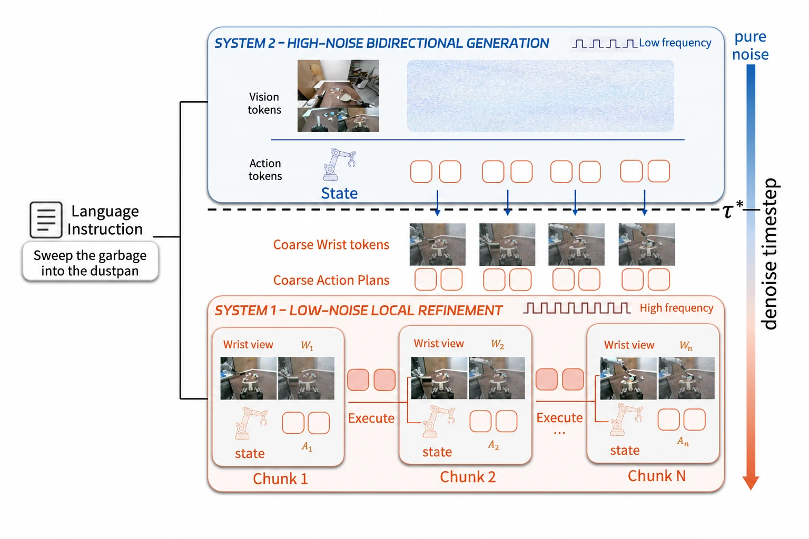

# DualWAM: Dual-System World Action Models for Asynchronous Global Planning and Local Refinement

- **首次提交**：2026-09-21
- **arXiv 主分类**：cs.RO
- **核验日期**：2026-09-24
- **整理来源**：用户提供的 2026-09-23 周报正式条目，按独立论文卡片补充原文核验
- **全文**：[HTML](https://arxiv.org/html/2609.24868)
- **作者**：Yixin Zheng, Jiangran Lyu, Yuntian Deng, Kai Liu, Yizhou Zhou, Yizhou Wang, Xiaoguang Zhao, He Wang, Zhizheng Zhang
- **年份与发表**：2026，arXiv
- **arXiv ID**：2609.24868
- **DOI**：10.48550/arXiv.2609.24868
- **论文**：[arXiv](https://arxiv.org/abs/2609.24868)
- **项目**：[Project](https://steveouo.github.io/DualWAM-Web/)
- **代码**：项目页当前未提供可核验代码入口
- **数据 / 模型**：未核验到公开下载
- **AlphaXiv**：[AlphaXiv](https://alphaxiv.org/abs/2609.24868)
- **类别标签**：World Action Model, Asynchronous Denoising, Dual-System, Egocentric Data
- **证据等级**：已核验原文方法与实验；关键比较与限制见各节

- **代表图**：Figure 1 · 高噪声全局规划与低噪声局部修正承接同一去噪过程

来源：[论文原图](https://arxiv.org/html/2609.24868v1/figures/DualWAM-pipeline.png)；[全文与图注](https://arxiv.org/html/2609.24868)。

## 当前挑战

全局视频规划需要长上下文与较大计算量，局部接触修正需要最新观察和低延迟。同步等待全局重规划会阻塞机器人，完全独立的小策略又可能偏离全局计划。

## 研究动机

将WAM分成低频global System 2和高频wrist-centric System 1，但两者不是完全分离的两个policy，而是接力处理同一条world-action denoising trajectory。

## 技术方案

**过程**：System 2高noise范围对完整global world/action sequence双向denoise → 在handoff noise tau 截取时间对齐局部window → System 1结合最新wrist observation完成低noise refinement → 异步执行。

**输入**：language、robot state、global view和wrist view。

**输出**：持续高频robot action与较长horizon world prediction。

两个系统分担同一 denoising trajectory：System 2 处理高噪声全局状态，System 1 读取时间对齐的中间窗口和新腕部观察完成低噪声更新；旧的全局计划持续可用，因此局部动作无需等待下一轮全局推理完成。

[原文方法](https://arxiv.org/html/2609.24868)

### 方法细节与实现

**按去噪阶段分工。**System 2 在较高噪声阶段低频生成全局视觉—动作计划，System 1 在较低噪声阶段结合最新腕部观察高频修正局部动作。二者承接同一条去噪轨迹，因此局部模块不是完全独立重新规划，而是在已有粗计划附近快速纠偏。

**异步执行。**机器人执行当前动作段时，后台继续推理后续段；局部时间窗与新到达观察对齐，减少长计划因接触或物体位移而过时的问题。系统既涉及网络角色分配，也涉及缓存、并行调度及实现优化，部署延迟不能只从参数量推算。

**辅助数据的角色匹配。**全局模块需要较长时程任务结构，局部模块需要近距离视觉和动作修正证据。分别给两者匹配训练数据比无区分扩展训练集更符合分工，但真实收益仍需与相同数据预算的同步单模型对照。双系统名称本身并不保证高层推理更强。

[对应方法原文](https://arxiv.org/html/2609.24868#S3)

## 实验结果

Franka与Galbot zero-shot任务中，平均比strongest evaluated baseline高4.5个百分点；critical path speedup 16.6×；加入role-matched egocentric + UMI auxiliary data后成功率提高14个百分点。

63 ms critical path 相对 1043 ms 的 System 2/比较基线为 16.6×；表 2 从原单 GPU 四步实现 2854 ms 到最终 63 ms 的累计优化为 45.3×，两者分母不同。局部模型替换消融中，完整系统 SR 54%，Action-only DiT 7%、Fast-WAM 14%，延迟分别约 63/59/62 ms，支持该设置中局部 future prediction 的额外作用。

[原文实验与表格](https://arxiv.org/html/2609.24868)

**速度分母须写清。**最终局部推理约 63 ms，相对一个 1,043 ms 阶段是约 16.6 倍，相对完整 2,854 ms 基线才约 45.3 倍；不同分母不能混用。局部动作模型单独仅 7、Fast 版本 14，而双系统为 54 的相关消融，支持全局计划与局部世界动作联合建模的协作价值。

[实验与设置原文](https://arxiv.org/html/2609.24868)

## 代码与数据

项目公开；本次未核验到代码、模型或数据下载。

## 局限、失败案例与开放问题

系统依赖多GPU/异步execution和较复杂的数据组合；效率数字需要区分model critical path、完整系统latency和hardware配置。

## 总结讨论

**阅读者分析**：与X-WAM asynchronous denoising、StreamingHOI和未来3D/4D WAM高度相关；尤其适合扩展为global 4D memory + local contact refinement。
