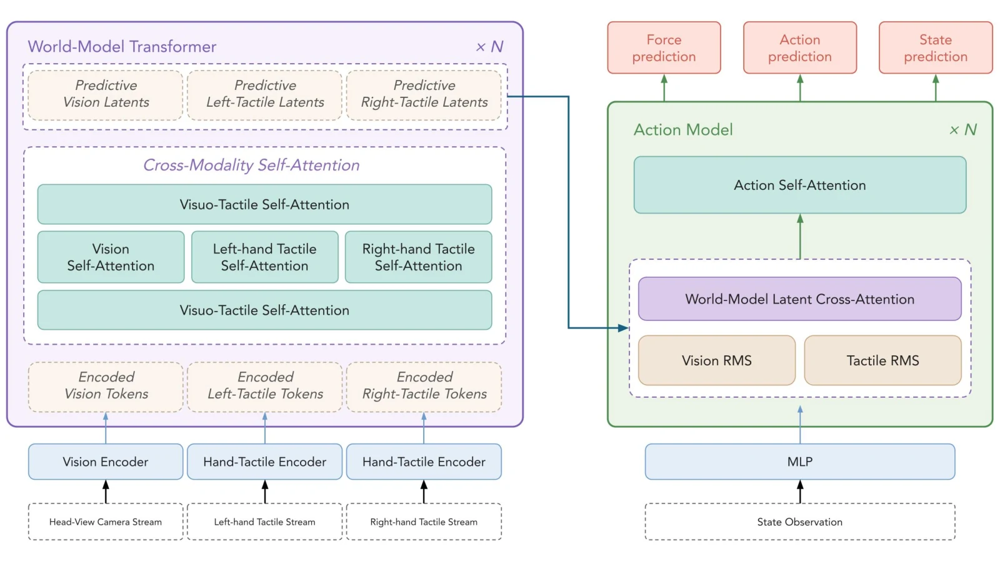

# DexTacWAM: A Visuo-Tactile World-Action Model for Dexterous Manipulation

- **首次提交**：2026-09-21
- **arXiv 主分类**：cs.RO
- **核验日期**：2026-09-24
- **整理来源**：用户提供的 2026-09-23 周报正式条目，按独立论文卡片补充原文核验
- **全文**：[HTML](https://arxiv.org/html/2609.24976)
- **作者**：Haoran Yuan, Zekai Wang, Boning Shao, Haoran Lu, Trevor Darrell, Ismini Lourentzou, Wei Zhan
- **年份与发表**：2026，arXiv
- **arXiv ID**：2609.24976
- **DOI**：10.48550/arXiv.2609.24976
- **论文**：[arXiv](https://arxiv.org/abs/2609.24976)
- **项目**：[Project](https://dextacwam.github.io/)
- **代码**：项目当前标记 coming soon
- **数据**：约100 demonstrations / task；未公开下载
- **模型**：未核验到
- **AlphaXiv**：[AlphaXiv](https://alphaxiv.org/abs/2609.24976)
- **类别标签**：Tactile WAM, Dexterous Manipulation, Contact Dynamics
- **证据等级**：已核验原文方法与实验；关键比较与限制见各节

- **代表图**：Figure 1 · 视触觉世界潜变量经分模态 K/V 归一化输入动作专家

来源：[论文原图](https://arxiv.org/html/2609.24976v1/architecture.png)；[全文与图注](https://arxiv.org/html/2609.24976)。

## 当前挑战

只把当前触觉拼到 action head 可能帮助瞬时控制，却没有约束模型理解接触会如何随未来动作变化。多手指触觉还需要保留手指身份与位置，而不能无差别平均。

## 研究动机

将每个fingertip独立编码，再通过finger- and pose-aware compressor聚合为tactile latent，并把该latent真正放入video diffusion world model预测，而不只是给action head附加触觉feature。

## 技术方案

**过程**：fingertip encoder → pose-aware tactile compressor → tactile latent与visual latent联合world prediction → action expert读取visuo-tactile future state。

**输入**：多视角视觉、多指tactile map和robot state。

**输出**：future visual/contact state和dexterous action。

fingertip encoder 后的 finger/pose-aware compressor 生成可供世界预测的触觉 latent；视频世界专家联合预测视觉与接触，动作专家读取共享动态。设计重点是把触觉置于预测目标中，而不仅扩展策略输入。

[原文方法](https://arxiv.org/html/2609.24976)

### 方法细节与实现

**触觉压缩。**十指触觉先保留 finger identity，再将手部姿态注入聚合查询；每只手用一个查询聚合五指 token，实现 5:1 压缩。轻量空间—时间注意力继续建模滑动、换抓和交接过程，左右手触觉潜变量与视觉时间轴对齐，作为额外视图进入世界模型。

**动作读取接口。**视觉 token 稠密，触觉稀疏且统计尺度不同；直接拼接会使共享注意力优化不稳定。方法在交叉注意力前分别对视觉与触觉 K/V 做无参数 RMSNorm，再拼回同一注意力模块，而不是新增独立模态门控。动作目标包含手臂、手、状态及十指共 60D 的力相关目标，整体使用一个 flow-matching MSE。

**三阶段实际训练。**约4小时、488段交互先训练触觉投影和压缩，冻结视觉 VAE；随后直接用各任务约100条示范适配视频世界模型，没有额外触觉中间训练；最后从头训练动作专家，同样没有独立动作预训练。因而题目中的 continual 是逐阶段扩展模态能力，不能直接理解为部署期间持续在线学习。

[对应方法原文](https://arxiv.org/html/2609.24976#S3)

## 实验结果

22-DoF bimanual平台6个contact-rich tasks平均70.6，strongest baseline 38.0；matched ablation中删除tactile world modeling但保留相同tactile feature/action expert后，四任务平均74.7→26.6。每方法每任务20次real-robot trial。

70.6 是论文六任务聚合指标，部分任务包含阶段性进度，不能都解读成二元成功事件百分比。匹配四任务消融 74.7→26.6 则保留相同触觉特征与动作专家，更接近隔离 tactile world modeling 的贡献。基线 RDP 38.0 与该四任务子集的 26.6 来自不同汇总，不能直接拼接为同一排名。

[原文实验与表格](https://arxiv.org/html/2609.24976)

**收益与可比性。**六任务平均任务得分70.6，其中若干任务按阶段进度计分，不能统一称为70.6%二元成功率。四任务匹配消融去掉触觉世界建模后74.7→26.6，更直接支持未来触觉的作用。主表基线沿用原动作格式，而本文使用相对末端动作，需将这种接口差异纳入归因。

[实验与设置原文](https://arxiv.org/html/2609.24976)

## 代码与数据

官方项目有代码入口占位，但尚未公开训练仓库。

## 局限、失败案例与开放问题

传感器仍高度embodiment-specific；真实任务规模只有6类。未来需验证contact representation能否迁移到不同tactile hardware。

## 总结讨论

**阅读者分析**：这是目前最直接证明“contact prediction作为world state对action有额外价值”的本期工作之一。
