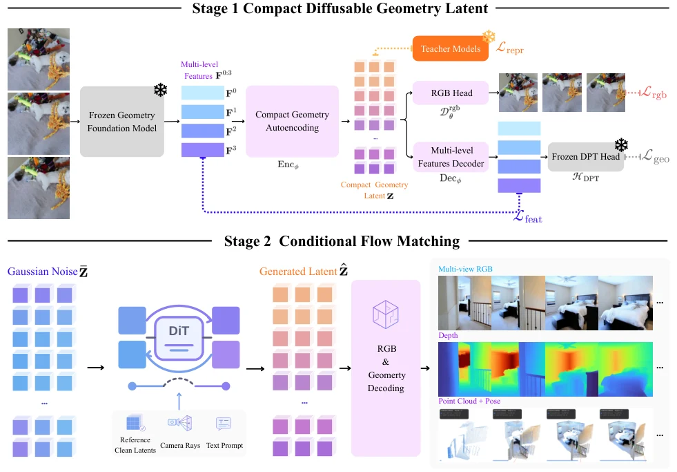

# GAE: Learning a Geometry-Native Latent Space for 3D-Consistent World Generation

- **首次提交**：2026-09-21
- **arXiv 主分类**：cs.CV
- **核验日期**：2026-09-24
- **整理来源**：用户提供的 2026-09-23 周报正式条目，按独立论文卡片补充原文核验
- **全文**：[HTML](https://arxiv.org/html/2609.24981)
- **作者**：Jiahao Lu, Minghao Yin, Wenbo Hu, Hengyu Liu, Wang Zhao, Sai-Kit Yeung, Ying Shan, Yuan Liu
- **年份与发表**：2026，arXiv
- **arXiv ID**：2609.24981
- **DOI**：10.48550/arXiv.2609.24981
- **论文**：[arXiv](https://arxiv.org/abs/2609.24981)
- **项目**：[Project](https://jiah-cloud.github.io/GAE.github.io/)
- **代码**：[GitHub](https://github.com/TencentARC/GAE-GeometricAutoEncoder)
- **数据**：使用RealEstate10K、DL3DV等
- **模型**：[GAE-D64-1B](https://huggingface.co/TencentARC/GAE-D64-1B)
- **AlphaXiv**：[AlphaXiv](https://alphaxiv.org/abs/2609.24981)
- **类别标签**：Geometry-Native Latent, 3D Generation, Reconstruction and Generation
- **证据等级**：已核验原文方法与实验；关键比较与限制见各节

- **代表图**：Figure 2 · 先学习同时解码外观与几何的潜空间，再训练条件流生成器

来源：[论文原图](https://arxiv.org/html/2609.24981v1/ngd_pipeline_overview.png)；[全文与图注](https://arxiv.org/html/2609.24981)。

## 当前挑战

外观 VAE 的压缩目标未必保留跨视图结构；原始几何特征虽有几何信息，却高维、病态且未必适合 flow matching。问题不是简单“增加深度输出”，而是同时保留几何可解码性和生成可学习性。

## 研究动机

GAE认为3D consistency问题不应只靠添加geometry loss解决，而应让生成模型的latent本身就是geometry-native representation，可共同解码RGB、depth、camera和point map。

## 技术方案

**过程**：geometry feature reparameterization → compact GAE latent → conditional flow generator在latent上建模未来/新视图。

**输入**：多视图图像 / geometry foundation features。

**输出**：appearance、depth、camera、point map以及geometry-consistent generation。

冻结 DA3 编码器与几何头，归一化并融合四层 feature hierarchy；codec 保留 patch 网格，将通道压到 64 或 128，再恢复各层供 RGB/深度/相机/点图联合解码。C-RADIO token alignment 改善语义组织，DINOv2 pairwise relation loss 防止逐 token 对齐破坏空间关系；随后在 posterior mean latent 上训练条件 flow。

[原文方法](https://arxiv.org/html/2609.24981)

### 方法细节与实现

**几何原生 codec。**编码端以冻结的 Depth Anything 3 几何骨干为基础，将四层特征归一化并融合，压缩到较低通道数的潜变量；解码端同时恢复 RGB 与几何信息。与事后给普通视频 latent 加深度头相比，几何结构在表征形成时就成为约束，使同一潜空间可以支撑外观与结构生成。

**为什么重建好还不够。**强重建 codec 的潜变量可能不适合扩散：局部特征分布不规则或空间关系不稳定，会增加生成模型学习难度。GAE 用 C-RADIO 进行 token 特征对齐，并用 DINOv2 的成对关系提供结构监督，既组织单点语义，也保留 token 间的空间关系，避免只做特征回归导致关系结构坍缩。

**两阶段学习。**先学习可同时解码外观与几何的紧凑 codec，再在冻结的潜空间训练条件 flow matching。实验比较不同通道预算并尽量匹配生成骨干，用以区分潜空间设计与更大生成器的收益。深度和相机相关输出提供3D一致性依据，但该模型没有显式接触力或动作干预状态转移。

[对应方法原文](https://arxiv.org/html/2609.24981#S3)

## 实验结果

固定相同generator/training protocol时，GAE相对最佳非GAE latent使RealEstate10K FVD降低12.7%、DL3DV降低23.1%，并把RealEstate10K camera trajectory error约减半。

表 5 的受控生成比较中，GAE-64 在 RealEstate10K / DL3DV 的 FVD 为 225.7 / 287.0，最佳非 GAE 受控 latent 为 258.6 / 373.2，分别降低 12.7%/23.1%。表 1 只加 token alignment 时 LDS/SRSS 为 0.020/0.030，加入关系损失后为 0.444/0.553，说明“语义对齐”本身不足以保住空间结构。几何指标仍依赖 VGGT、Pi3、DA3 等估计器和 Sim(3) 对齐，不能等同真实传感器级 metric accuracy。

[原文实验与表格](https://arxiv.org/html/2609.24981)

**指标与权重版本。**相关两组生成设置的 FVD 为225.7/287.0，对照为258.6/373.2；还需结合 RGB 重建、几何误差及多视角一致性共同判断。公开的 GAE-D64-1B 权重经过继续训练，官方说明它与论文实验模型不完全相同，因此复现实验应固定版本，不能默认下载权重能直接重现表中所有数字。

[实验与设置原文](https://arxiv.org/html/2609.24981)

## 代码与数据

官方项目、GitHub 与 GAE-D64-1B 权重均已公开，包含 codec/flow 推理、训练与评估入口。官方 README 明确说明公开 flow checkpoint 是更高分辨率、更多帧和更多数据继续训练后的版本，不能直接复现论文提交时表 5–7 的数字。复现必须区分论文配置与公开权重配置。

## 局限、失败案例与开放问题

目前验证重点仍是视觉生成/几何一致性，不是动作条件、交互或长期物理rollout。

## 总结讨论

**阅读者分析**：对PixWorld、UniRecGen、VGGT/Gen3R融合生成的方向非常高相关；也可能成为未来geometry-native WAM的latent backbone。
