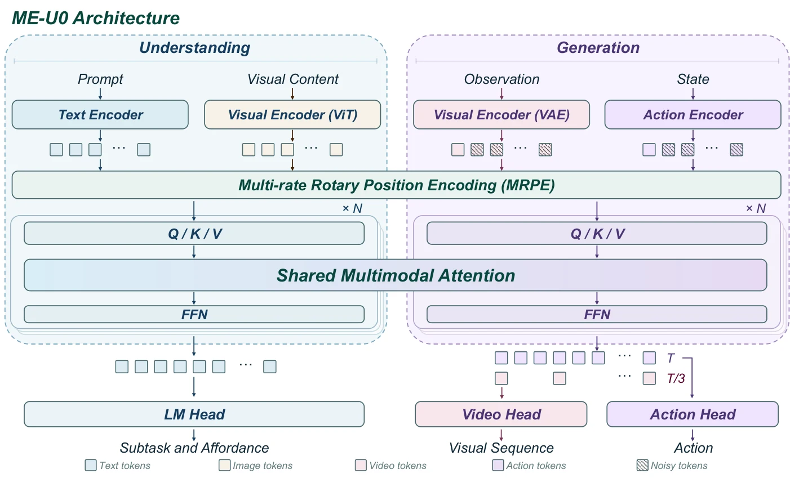

# MachEmbodied-U0: Unified Understanding and Generation Model for Embodied Intelligence

- **首次提交**：2026-09-22
- **arXiv 主分类**：cs.RO
- **核验日期**：2026-09-24
- **整理来源**：用户提供的 2026-09-23 周报正式条目，按独立论文卡片补充原文核验
- **全文**：[HTML](https://arxiv.org/html/2609.25627)
- **作者**：Haoran Wen, Wenfu Wang, Kunsong Shi, Jingke Wang, Wancheng Feng, Yiren Zhang, Yueran Zhao, Xuancheng Zhang, Nanfei Ye, Xingru Chen, Zhaohong Sun, Chengmin Yang, Zikang Yu, Penghao Bi, Jia Shi, Yu Liu, Kun Zhan, Yan Xie
- **年份与发表**：2026，Technical Report / arXiv
- **arXiv ID**：2609.25627
- **DOI**：10.48550/arXiv.2609.25627
- **论文**：[arXiv](https://arxiv.org/abs/2609.25627)
- **项目**：[Project](https://machembodied.com/ME-U/ME-U0.html)
- **代码**：[GitHub](https://github.com/MachEmbodied/ME-U0)
- **数据**：预训练约4,200小时robot + egocentric demonstrations；未打包公开
- **模型**：仓库明确说明model weights未随代码打包
- **AlphaXiv**：[AlphaXiv](https://alphaxiv.org/abs/2609.25627)
- **类别标签**：World Action Model, VLA, Multi-Modal Dynamics, Egocentric Data
- **证据等级**：已核验原文方法与实验；关键比较与限制见各节

- **代表图**：Figure 6 · 理解专家与生成专家通过共享多模态注意力联合建模语义、视觉和动作

来源：[论文原图](https://arxiv.org/html/2609.25627v1/pipeline.png)；[全文与图注](https://arxiv.org/html/2609.25627)。

## 当前挑战

动作策略缺少对未来场景的结构化描述，而纯视频世界模型又未必突出任务相关对象和子目标。统一多模态未来状态时，不同本体和视频/动作采样频率进一步增加对齐困难。

## 研究动机

ME-U0试图统一understanding与generation：subtask prediction和affordance grounding先提供task-relevant结构，generation expert随后联合预测RGB、depth、surface normal、optical flow和actions。

## 技术方案

**过程**：understanding expert预测subtask/affordance → Mixture-of-Transformers与generation expert交互 → flow matching联合预测multi-modal visual dynamics和action；MRPE对齐不同temporal rate。

**输入**：视觉、语言、机器人状态。

**输出**：subtask、affordance、future RGB/depth/normal/flow以及robot actions。

understanding expert 提供 subtask/affordance 条件，generation expert 预测多模态未来和动作；Multi-rate RoPE 用物理时间对齐不同采样率。预训练用额外结构监督，下游 LIBERO/RoboDojo post-training 只用基准原生监督，应区分两个阶段的数据需求。

[原文方法](https://arxiv.org/html/2609.25627)

### 方法细节与实现

**理解分支。**视觉语言专家以自回归文本预测当前子任务，以及任务相关对象框、交互点和操作语义；损失为 next-token 交叉熵。理解 token 只能访问当前观测和状态，注意力阻止其读取未来训练目标，避免把预测答案泄漏给语义理解。

**生成分支。**MoT 的共享多模态注意力联合处理未来视觉和动作。RGB、深度、法线或光流均表示为三通道视觉目标，依据输入提示选择生成模态，共用视频 VAE 潜空间和输出投影；不是四种模态各设一个独立几何预测头。动作每个时刻对应一个 token，经专用输出头预测流速度并以 Euler 步同步更新。

**多频率位置编码。**视频被时间下采样，而动作保持原始采样频率。MRPE 给同一视频 latent 对应的一段动作共享时间索引，再在位置编码的另一轴上为段内动作分配不同序号，既保留跨模态时间对齐，又不丢失动作先后顺序。几何和光流监督扩展了目标类型，但仍不等于显式求解三维动力学。

[对应方法原文](https://arxiv.org/html/2609.25627#S3)

## 实验结果

约4,200小时预训练；RoboDojo score 17.66，LIBERO 99.0%，LIBERO-Plus 82.5%。

RoboDojo-Sim 的 17.66 是过程 Score，SR 实际为 11.18%；并未超过表中全部 VLA（例如 DM0.5 的 Score 24.90）。LIBERO 99.0% 也低于 OpenWAM-α 的 99.3%；LIBERO-Plus 82.5% 低于部分 VLA。优势应限定为多模态预训练后的竞争力；memory 子集 SR 7.00%/Score 8.42，暴露无显式历史记忆的短板。

[原文实验与表格](https://arxiv.org/html/2609.25627)

**全面性不等于每项领先。**约4,200小时混合数据支持多任务统一训练。RoboDojo 的综合分17.66与二元成功率11.18是不同指标；LIBERO 99.0略低于表中99.3的对照，LIBERO-Plus82.5也不是所有VLA最高。记忆相关任务仍弱，说明增加输出模态尚未解决持续状态维护和长期执行问题。

[实验与设置原文](https://arxiv.org/html/2609.25627)

## 代码与数据

GitHub 已确认公开 post-training 与 LIBERO/RoboDojo evaluation 代码；项目页本次连接重置，开放状态以可访问的官方仓库为依据。README 明确说明model weights、datasets和simulator assets并未打包，需要用户自行准备。

## 局限、失败案例与开放问题

完整系统同时改变semantic understanding、geometry/motion supervision和action generation，当前外部benchmark无法单独说明哪个world modality贡献最大；LIBERO也接近ceiling。

## 总结讨论

**阅读者分析**：是“多模态结构化future state + action”的大型系统实例，可作为3D/4D WAM强baseline参考。
