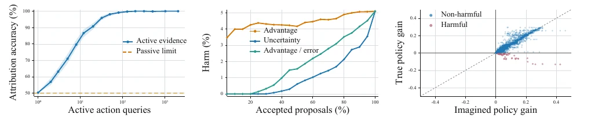

# Dual-Frontier: When Can an Agent Trust Its World Model?

- **首次提交**：2026-09-22
- **arXiv 主分类**：cs.AI
- **核验日期**：2026-09-24
- **整理来源**：用户提供的 2026-09-23 周报正式条目，按独立论文卡片补充原文核验
- **全文**：[HTML](https://arxiv.org/html/2609.26293)
- **作者**：Huatai Zhu, Qiang Chen, Ziqian Kou, Wenhao Li, Fei Wang, Yichao Cao, Xiu Su, Yi Chen
- **年份与发表**：2026，arXiv
- **arXiv ID**：2609.26293
- **DOI**：10.48550/arXiv.2609.26293
- **论文**：[arXiv](https://arxiv.org/abs/2609.26293)
- **项目 / 代码 / 数据 / 模型**：未核验到独立公开入口
- **AlphaXiv**：[AlphaXiv](https://alphaxiv.org/abs/2609.26293)
- **类别标签**：Counterfactual Reasoning, World Model Reliability, Identifiability
- **证据等级**：已核验原文方法与实验；关键比较与限制见各节

- **代表图**：Figure 1 · 主动证据、规划资格与想象更新的受控验证

来源：[论文原图](https://arxiv.org/pdf/2609.26293#page=7)；[全文与图注](https://arxiv.org/html/2609.26293)。

## 当前挑战

一次失败无法自动区分决策规则与世界模型的责任。低像素预测误差也不一定对应低决策损失；如果只观察被动轨迹，有些反事实归因根本不可识别。

## 研究动机

论文问的是：当world-model-guided action失败时，究竟是decision rule错了还是world model错了？作者把return loss分为counterfactual components，并证明仅观察passive trajectories时，即使finite horizon也无法总是识别这两个成分。

## 技术方案

**过程**：计算predicted advantage与decision-relevant WM error bound；只有前者超过certified error时才promote model-guided decision，否则优先收集world-model verification evidence。

**输入**：agent policy、world-model prediction、observed interaction evidence。

**输出**：带verification gate的decision policy和confidence certificate。

先定义固定模型到策略算子和参照策略下的损失分解，再对具体“使用模型做决策”的请求建立误差与估计不确定性界；预测优势超过证据支持的总误差后才推进 Agent，否则优先验证世界模型。这是针对使用场景的可靠性证书，不是模型的一次性通用可信标签。

[原文方法](https://arxiv.org/html/2609.26293)

### 方法细节与实现

**信任必须绑定具体用途。**固定一个世界模型和策略操作后，问题是“这一次规划或想象更新是否值得采用”，而不是给模型一个永久可信分数。模型在常见观察上的预测准确，不保证对未尝试动作的反事实后果准确；同样的被动数据可能与多种干预响应相容。

**双边界与证书。**方法分别维护可支持规划的范围和可支持想象学习/策略改进的范围。候选提议需要把估计优势与世界模型误差、估计不确定性共同比较，只有通过相应保证的提议才被提升为可使用行为。校准证据可复用，避免每次请求都从零审计；主动查询把证据预算投向影响当前决策的未知行为。

**理论条件与实现范围。**保证依赖有限世界、可获得的交互证据及误差校准假设，不是从任意离线视频中自动识别反事实因果效应。受控实验用16状态、4动作以及4/8/12的规划时距，之后在工具调用任务检验路由规则。工具使用上的效果尚不能直接推广到连续接触控制。

[对应方法原文](https://arxiv.org/html/2609.26293#S3)

## 实验结果

在Llama-3.1-8B和Qwen3-8B tool-use benchmark上，相比最强competing rule，Success平均提升约11.57/11.07个百分点，Accuracy提升5.93/5.83个百分点。

主实验是 BFCL v4、API-Bank、NexusRaven 等工具调用任务。表 2 的 Llama 消融，Advantage-only 的 Success/Acc 为 84.57/91.37，完整为 91.62/95.71；去掉 world-model error 为 87.31/93.19，支持将预测优势与不确定性分开。理论假设包括固定接口、适当误差上界和校准/采样条件，不能直接由任意视觉 loss 导出证书。

[原文实验与表格](https://arxiv.org/html/2609.26293)

**看效果也看拒绝代价。**BFCL v4/API-Bank/NexusRaven 上，Llama-3.1-8B 的平均成功指标由Agent-only63.46到Dual-Frontier91.62，而Always-WM为50.81，表明无条件用模型可能更差。拒绝提议和额外查询都消耗预算，因此除成功率外，还应看接受率、证据成本和校准条件；这些是“可信使用”的组成部分。

[实验与设置原文](https://arxiv.org/html/2609.26293)

## 代码与数据

本次未核验到公开代码。

## 局限、失败案例与开放问题

主要实验不是robotics；模型误差certificate需要自身假设和校准条件成立。

## 总结讨论

**阅读者分析**：虽然不是embodied WAM，但它对“因果/反事实world model”研究方法非常重要：不是先把模型称为causal，而是先明确哪些failure component可识别、哪些不可识别。
