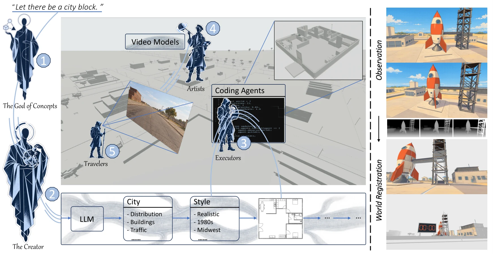

# Code Plans, Diffusion Renders: Open-Ended Generative World Modeling

- **作者**：Zixun Fang, Yawen Shao, Kai Zhu, Jie Xiao, Shihan Chen, Yu Liu, Xueyang Fu, Yang Cao, Wei Zhai, Zheng-Jun Zha
- **年份与发表**：2026，arXiv 预印本
- **arXiv ID**：2609.26458
- **首次提交**：2026-09-22
- **论文**：[arXiv](https://arxiv.org/abs/2609.26458)
- **全文**：[HTML](https://arxiv.org/html/2609.26458)
- **AlphaXiv**：[AlphaXiv](https://alphaxiv.org/abs/2609.26458)
- **类别标签**：可执行世界模型, 视频生成, 多智能体, 长时记忆, 3D/4D
- **arXiv 主分类**：cs.CV
- **核验日期**：2026-09-24
- **证据等级**：已核验原文方法、实验与局限；以下数值为作者报告，分析另行标注
- **项目**：[项目](https://becauseimbatman0.github.io/CoDeR)

- **代表图**：Figure 2 · 代码 Agent 维护白盒世界，扩散 Artist 将几何与动作代理渲染为视频

来源：[论文原图](https://arxiv.org/html/2609.26458v1/method.png)；[全文与图注](https://arxiv.org/html/2609.26458)。

## 当前挑战

开放世界需要维持看不见的状态、规则、离屏演化和多实体交互。仅把历史视频继续生成下去，难以明确保存这些信息；纯代码白模世界又缺乏视觉丰富度。

## 研究动机

CoDeR 先用代码构建持续存在的世界，再用视频生成模型呈现观察。除逻辑/视觉分工外，它强调把已生成的外观注册回世界，从而在返回区域或改变视角时复用。

## 技术方案

**过程**：God of Concepts 给出意图；Creator 分解规则与逻辑空间；Executors 编写可组合的 Three.js 白模和状态逻辑；Travelers 选择观察路径并交互；Artist 以视频模型把白模观测转换成外观丰富的视频，再通过深度完成 Observation as World Registration。

- **输入**：用户文字/图像概念、世界规则和探索者的交互与视角。
- **过程**：God of Concepts 给出意图；Creator 分解规则与逻辑空间；Executors 编写可组合的 Three.js 白模和状态逻辑；Travelers 选择观察路径并交互；Artist 以视频模型把白模观测转换成外观丰富的视频，再通过深度完成 Observation as World Registration。
- **输出**：可执行的白模世界、持续实体状态和相应视频观察。

Visual Cue Hacking 使用白模的深度/Canny 等线索生成多风格训练配对，减少直接白模条件造成的生硬渲染外观。人类场景使用 SMPL-H；Artist 采用 MiniMax H3，LoRA 调整主干并全量训练 ControlNet 分支。[方法 §3](https://arxiv.org/html/2609.26458#S3)

### 方法细节与实现

**显式白盒与扩散外观。**Creator 根据概念生成 Three.js 世界的布局与逻辑，Executor 运行结构与动作，Artist 根据代理观测渲染高质量视频，Traveler 驱动探索与观察。世界结构作为可持续修改的代码资产存在，人物动作通过 SMPL-H 等代理表达，视觉样式由扩散生成补充。

**结构约束如何传递。**深度及边缘线索把白盒世界的相机、几何和运动连接到 Artist，观察与深度注册用于保持后续生成参照。视觉 cue hacking 使用适配生成器的控制提示，使低保真代理能触发更丰富的外观；但这种接口仍可能丢失细接触关系，生成器也可能偏离代理。

**训练与开放世界能力。**Artist 的适配采用 MiniMax H3、LoRA，32张A800训练200步。可扩展世界来自代码可追加场景、Agent可继续规划，以及渲染器可持续生成的组合；它不是单个视频模型在无限长度上维持精确状态的证明，也不直接保证世界里每个对象都物理可交互。

[对应方法原文](https://arxiv.org/html/2609.26458#S3)

## 实验结果

Artist 在 32 张 A800 上训练 200 步、batch 16，片段为 124 帧、1280×704。WorldScore 的 10 项平均分为 87.88；ABot-World、Matrix-Game 3.0、LingBot-World 分别为 69.24、74.20、74.79。Motion Magnitude 是分数的一部分，高平均分不能单独等同于精确物理正确性。

消融中，去掉 Visual Cue Hacking，Content Alignment 为 82.48，完整模型为 98.44；去掉 Observation as World Registration，Subject Consistency 为 84.63，完整模型为 96.31。它们支持外观适配与回写记忆的贡献，开放多 Agent/离屏自主演化仍主要依靠系统实例展示。[实验 §4](https://arxiv.org/html/2609.26458#S4)

**长程边界。**WorldScore为87.88，较强对照为74.79；约5,000帧后仍可能退化，人物手部形变和穿插也未解决。相对短片质量提升应与长程结构/身份一致性分别评估，若用于机器人世界模拟，还需接触和动作响应测试，而不能只依赖视频评分。

[实验与设置原文](https://arxiv.org/html/2609.26458)

## 总结讨论

**阅读者分析**：与 Code World Model 同属“代码管状态、生成模型管外观”，CoDeR 更强调角色分工、逻辑空间组合和观察回写。这里“物理规则可执行”取决于写入的规则与碰撞实现，并不表示模型从数据识别到了真实物理。

## 代码与数据

官方项目页已确认；论文声明代码和权重将公开，本次尚未核验到对应可下载仓库及模型文件，不把“将公开”记成“已开源”。

## 局限、失败案例与开放问题

附录展示约 5,000 帧后的画质退化：Artist 仅在固定窗口训练，分块延展仍积累误差。白模中的手形畸变与物体穿透会传递到视频。尚需验证回写错误外观后能否纠正、跨视角几何的定量稳定性，以及与真实机器人交互的连接。
