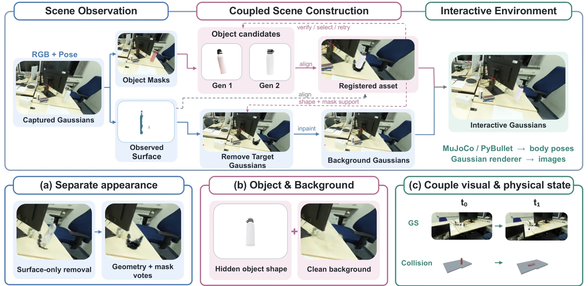

# ϕ-RIE: From Photorealistic Reconstruction to Interactive Environments

- **首次提交**：2026-09-22
- **arXiv 主分类**：cs.RO
- **核验日期**：2026-09-24
- **整理来源**：用户提供的 2026-09-23 周报正式条目，按独立论文卡片补充原文核验
- **全文**：[HTML](https://arxiv.org/html/2609.26795)
- **作者**：Runyi Yang, Deheng Zhang, Xiaoye Wang, Kanzhi Wu, Lei Sun, Ajad Chhatkuli, Kunyu Peng, Luc Van Gool, Danda Pani Paudel
- **年份与发表**：2026，arXiv
- **arXiv ID**：2609.26795
- **DOI**：10.48550/arXiv.2609.26795
- **论文**：[arXiv](https://arxiv.org/abs/2609.26795)
- **项目**：[PhiRIE](https://insait-institute.github.io/PhiRIE/)
- **代码 / 数据 / 模型**：项目页有代码入口，但对应仓库本次返回 404；下载状态待核验
- **AlphaXiv**：[AlphaXiv](https://alphaxiv.org/abs/2609.26795)
- **类别标签**：3D Reconstruction, Interactive Environment, 3DGS, Simulator
- **证据等级**：已核验原文方法与实验；关键比较与限制见各节

- **代表图**：Figure 2 · 联合构建独立物体和背景高斯，并将视觉资产与物理状态同步

来源：[论文原图](https://arxiv.org/html/2609.26795v1/main.png)；[全文与图注](https://arxiv.org/html/2609.26795)。

## 当前挑战

静态 3DGS 能渲染，不代表能在机器人仿真中移动对象。取出对象会暴露缺失背景，生成补全资产还可能与真实坐标、尺度和碰撞几何失配。

## 研究动机

普通3DGS能render但不能交互。ϕ-RIE将selected object从reconstruction中拆出来，构建可移动simulation asset，同时完成被对象遮挡的background，使visual state和physical state保持注册。

## 技术方案

**过程**：Scene Observation收集几何/appearance evidence → coupled asset reconstruction和source removal/background completion → registration retry与physical acceptance → simulator integration。

**输入**：photorealistic 3DGS scene和selected objects。

**输出**：保留原场景外观、但部分对象可移动/接触的interactive environment。

将对象资产构建与原位置移除/背景补全联合处理；用观察证据选择候选并执行注册重试，物理接受检查后接入模拟器。资产外观、碰撞代理和世界坐标注册承担不同职责，应分别评价。

[原文方法](https://arxiv.org/html/2609.26795)

### 方法细节与实现

**为什么不能直接移动原高斯。**照片重建的3DGS保留了可见表面外观，却可能把物体、背景和遮挡关系混在一起。将某个物体简单抠出并移动，会暴露缺失背面、残留幽灵和背景空洞。ϕ-RIE 因而同时处理独立对象资产与移除对象后的背景。

**耦合场景构建。**对象候选由生成/重建后端产生，并根据观测表面进行注册；候选几何不仅决定对象外观，还影响哪些原高斯应从背景删除。系统据此联合选择对象候选和背景表示，避免对象与背景分别优化却无法组合。TRELLIS、ReconViaGen 等后端提供资产先验，不是从观测中唯一恢复不可见形状。

**视觉与物理状态联动。**对象拥有物理碰撞表示和高斯视觉表示，模拟器推进刚体状态后同步更新渲染姿态，可选外观协调减少新旧资产接缝。MuJoCo/PyBullet承担物理步进，高斯渲染负责视觉；照片级外观与真实物理参数准确性是两个独立要求。

[对应方法原文](https://arxiv.org/html/2609.26795#S3)

## 实验结果

50个ScanNet++ scenes上，在相同retention下evidence selection + registration retry使matched F1@20mm从0.336提升到0.383；严格筛选可进一步改善质量但会显著减少保留asset数量。

表 2 在同样保留 1800 个对象、其中 566 个可匹配评测对象时，固定优先级 F1@20mm=0.336、CD=7.638 cm；完整方法为 0.383、5.720 cm，耗时由 35.68 增至 70.82 分钟/场景。严格 acceptance 使 F1 达 0.425，但仅保留 399 个、匹配 134 个对象，属于质量—覆盖率权衡，不能当作无代价提升。

[原文实验与表格](https://arxiv.org/html/2609.26795)

**保留与匹配口径。**50场景发出1,871个对象请求，保留1,800个、匹配评测566个；严格保留设置则是399个、匹配134个。主F1为0.383、CD为5.72，对照0.336/7.638；严格子集F1升至0.425伴随覆盖缩小。平均约70.82分钟/场景，说明高保真交互转换仍有明显离线成本。

[实验与设置原文](https://arxiv.org/html/2609.26795)

## 代码与数据

已核验官方项目页。它链接到 `insait-institute/PhiRIE` 并展示 release 入口，但 2026-09-24 访问该 GitHub 仓库返回 404，当前不能确认代码、权重或资产可公开下载。

## 局限、失败案例与开放问题

论文自己的interaction study显示repair与destination reconstruction仍会显著减少可执行成功数量，说明asset compatibility和hidden geometry completion仍是瓶颈。

## 总结讨论

**阅读者分析**：它连接Feedforward/3D reconstruction和world simulator，值得关注“从可看3D重建到可交互世界状态”的研究接口。
