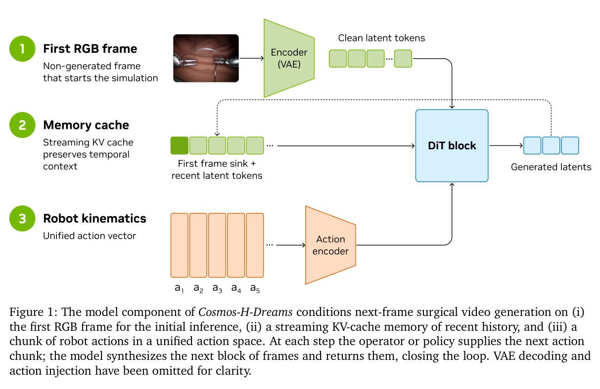
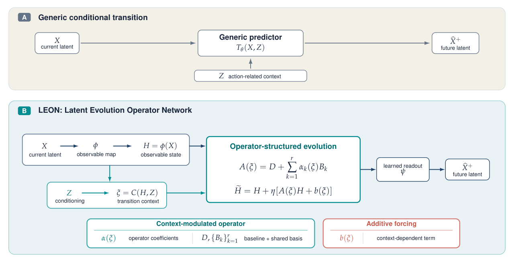

# 知域每周论文更新：2026-08-30

**报告标签**：周报, Embodied In-context Learning, In-context Imitation Learning, VLA, World Action Model, 世界模型, HOI, 第一视角, 3D/4D, 流式生成, 长时记忆, 因果建模, 前馈重建

> 本报告合并两份独立 agent 的 2026-08-30 周报，按 arXiv ID 和规范化标题去重，并补入用户指定的 One Video, One World 与 Towards in-the-wild Egocentric 3D Hand-Object Pose Estimation。最终形成 34 篇正式条目。

## 本期结论

- **规模**：两份来源报告的正式条目并集为 32 篇；4 篇重复条目已融合，不重复计数。额外补入 2 篇后共 34 篇。
- **馆藏变化**：本地导入前，34 篇中仅 One Video, One World（arXiv:2606.31388）已在馆藏；其余 33 篇为新增候选。导入器应为既有论文追加本周报来源，而不是创建重复卡片。
- **具身 ICL**：Zero-WAM、RA-VLA、PonderPounce 分别代表完整人类视频条件、行为检索增强与 episode-context engine；真正需要审计的是替换或打乱上下文后行为是否随之改变，而不只是 few-shot 成功率。
- **World Action Model**：本周方法同时覆盖跨具身数据、潜在动作、稀疏/异步测试期想象、4D Gaussian 状态、operator-structured transition、长时记忆与动作跟随诊断，说明 WAM 的分歧已从“是否预测未来”转向“预测何种状态、如何消费、如何验证动作作用”。
- **HOI 与 3D/4D**：MILO、One Video, One World 与 HOPformer 分别提供 LRM 几何脚手架、simulation-ready 实例级 4D mesh，以及野外第一视角手—物 3D pose/contact 接口，适合串成感知—重建—交互预测链路。
- **证据边界**：报告将作者明确主张、论文实验支持和阅读判断分开；时间自回归、action conditioning、privileged grounding 或 action-shuffle 诊断均不自动构成结构因果模型或因果识别。

## 检索、去重与证据方法

- **时间窗口**：来源周报主要覆盖 2026-08-24 至 2026-08-30 的 arXiv 新提交或实质更新；两篇用户指定补充论文不受该窗口限制。
- **去重键**：依次使用 arXiv ID、DOI 与规范化标题；来源报告的 4 个重合 ID 为 2608.27033、2608.23565、2608.23863、2608.26103。
- **来源**：arXiv 摘要/HTML/PDF、论文官方项目页与代码仓库；Hugging Face Papers 用于补充结构化元数据和发现官方链接；当 arXiv HTML 尚未同步时，使用有效论文 PDF 或 AlphaXiv 交叉确认。
- **配图**：每篇正式条目均使用可直接渲染的 arXiv HTML 原图、既有馆藏已验证原图，或从有效论文 PDF 提取的本地 Fig. 1。远程图片已要求 2xx 响应与 `image/*` MIME。
- **范围限制**：代码、数据和权重的开放状态以核验时的官方页面为准；没有链接写为待核验，不据聚合页推断资源存在。

## 研究版图与建议

1. **上下文是否真正控制策略**：把相关演示、错配演示、无演示和历史打乱作为必要干预，联合报告动作差异、任务成功率与检索命中率。
2. **动作—未来耦合的评测本身已成为研究对象**：WorldEcho、R2M-Bench、Where World Models Break 分别覆盖动作敏感性、重访一致性与自然输入失效，应与标准 benchmark 成功率并列。
3. **3D/4D 状态接口正在成熟**：GaussianWAM、4DGS-WAM、OVOW、MILO 和 HOPformer 提供从显式场景、实例网格到接触姿态的多种接口；需要直接比较这些状态是否改善接触预测、物体响应和闭环控制。
4. **测试期想象没有统一答案**：LAWA 倾向训练期未来监督、测试期丢弃生成，GlanceWAM 强调稀疏异步想象；应在相同延迟和算力预算下评估何时想象、想象什么、策略如何读取。
5. **长时与流式系统需要固定预算协议**：ReWorld、WALL-SS、StreamAV-Bench 和长时音视频生成工作应共同报告缓存大小、回访间隔、音画同步、端到端延迟和动态对象状态保持。

## 已收录与待核验

- **已收录并追加来源**：One Video, One World（2606.31388）。
- **本期正式新增候选**：其余 33 篇；最终新增数量以导入器的馆藏级去重结果为准。
- **待人工核验线索**：BehaviorWorldGen（2608.22187）、SR-WM（2608.22294）与 DreamMimic（2608.22278）保留为后续线索，本报告不将其作为正式编号条目。

---

## 1. MILO: Reconstructing Humans and Objects in Interaction using Large Reconstruction Models

- **作者**：Agniv Chatterjee, Georgios Pavlakos
- **年份与发表**：2026，ECCV 2026（arXiv 首发 2026-08-27）
- **arXiv ID**：2608.27407
- **DOI**：暂无（以 arXiv 为准）
- **论文**：[arXiv](https://arxiv.org/abs/2608.27407) · [HTML 全文](https://arxiv.org/html/2608.27407)
- **正式出版**：ECCV 2026
- **项目**：[项目页](https://ac5113.github.io/MILO)
- **代码**：待项目页/仓库发布确认（本窗口未见公开仓库）
- **数据**：实验基于公开 HOI 数据集（论文正文），未见新发布数据
- **模型**：基于 LRM 预训练模型（未发布微调权重）
- **AlphaXiv**：[AlphaXiv 检索该 arXiv ID](https://alphaxiv.org/abs/2608.27407)
- **类别标签**：3D HOI, 前馈重建, LRM, ECCV
- **证据等级**：全文结构已核验 + 摘要核验（实验数字未逐项复核）
- **更新类型**：新论文
- **知域匹配结果**：未发现已有记录
- **现有知域 ID**：无
- **本次变化**：—

- **代表图**：Figure 1 : We present MILO , an approach for reconstructing 3D human-object interactions from a single image. Given an input photo (left), MILO uses a Large Reconstruction Model to predict a combined human-object mesh (center). This mesh is interpreted (right) by identifying human and object parts, fitting a SMPL-H body to the human part, and optionally an object template to the object part. The examples illustrate a… 来源：[论文图](https://arxiv.org/html/2608.27407v1/teaser.png)

### 核心内容与 Insight
单图 3D HOI 重建长期依赖把参数化人体模型和物体模板拟合到 2D 的重投影与接触约束。本文反其道而行：**用 LRM 输出的网格作为几何脚手架**。LRM 网格天然保留人-物相对排布与邻近线索，于是把重建重构为"解读 LRM 网格"——分割人/物、做模板对齐，再经人体优化（root 拟合、姿态拟合）恢复参数化交互。Insight 在于：与其在 2D 上对抗深度歧义与遮挡，不如借用前馈重建模型已经隐式解出的 3D 结构，再在其上做语义解读。

### Pipeline
**输入**：单张 RGB 图像。
**过程**：LRM 前馈重建得到场景网格（脚手架）→ 3D 关键点估计 → 人体模型拟合（root / pose）→ 点云分割出人/物 → 物体模板对齐（template alignment）→ 人-物接触估计。
**输出**：参数化人体网格 + 对齐的物体网格 + 接触标注，即在单图上的 3D HOI 重建。

### 实验与证据
在 3D HOI 重建的公开基准上比较 SOTA（含 Open3DHOI 等 baseline），并做接触估计、网格几何影响、与单独重建人/物的对比、以及消融。作者披露的主要局限：性能受底层 LRM 质量与点云分割精度制约；小物体的 LRM 输出有待精化。消融表明网格几何质量与分割精度是主要瓶颈，这与其方法依赖脚手架一致。证据等级：以上结论由论文实验直接支持；具体数值本轮未逐项复核。

### 代码与数据
实验基于公开数据集；本窗口未检索到官方仓库或微调权重发布，复现依赖 LRM 开源生态（如项目页所述）。

### 局限、失败案例与开放问题
- 受 LRM 质量上界约束；小物体重建是明确短板；
- 点云分割精度直接影响结果（作者列为待改进点）；
- 未来方向：LRM 输出精化、更强的 instance-level 推理、更优接触估计。

### 与知域的关系
与知域前馈重建主线（VGGT、DynamicVGGT、SAM 3D 系）直接衔接，是"LRM 脚手架 → 语义解读"范式在 3D HOI 的首批代表，接续 DynVGGT 的交互/接触感知方向；也与 EgoGrasp、OpenHOI 的 HOI 语义互补。

## 2. CLAP: Cross-Embodiment Video World Models are Zero-Shot Physical Simulators

- **作者**：Kechen Liu, Ola Shorinwa
- **年份与发表**：2026，arXiv 预印本（首发 2026-08-27）
- **arXiv ID**：2608.27406
- **DOI**：暂无
- **论文**：[arXiv](https://arxiv.org/abs/2608.27406)
- **正式出版**：暂无
- **项目**：[项目页](https://omni-clap.github.io)
- **代码**：作者声明全量开源（all code and models），仓库地址见项目页
- **数据**：互联网规模异构视频（人+机器人）+ DROID/Bridge/YAM/G1 数据
- **模型**：系列动作条件视频世界模型（end-effector / language / latent 三种动作空间）
- **AlphaXiv**：[AlphaXiv 检索](https://alphaxiv.org/abs/2608.27406)
- **类别标签**：交叉具身, 视频世界模型, 零样本模拟, DROID
- **证据等级**：仅摘要核验（未读取全文实验细节）
- **更新类型**：新论文
- **知域匹配结果**：未发现已有记录
- **现有知域 ID**：无
- **本次变化**：—

- **代表图**：Figure 1: We introduce CLAP , a cross-embodiment learning framework that trains action-conditioned video models on diverse human and robot video data to learn fundamental physical priors that are critical for fine-grained dynamics prediction. 来源：[论文图](https://arxiv.org/html/2608.27406v1/teaser.png)

### 核心内容与 Insight
SOTA action-conditioned 视频模型通常绑定单一具身，无法利用异构视频中的通用物理信号。CLAP 的核心主张：**时空动力学由普适物理规律支配，与执行者无关**。为桥接差异巨大的动作空间，CLAP 用 end-effector 姿态、语言指令、潜在动作三路 reconcile；并以 curriculum 两阶段训练——先在无标签视频上以潜在动作学习物理先验，再 grounding 到 end-effector 动作空间做零样本真实部署。这是"跨具身预训练配方"的代表作。

### Pipeline
**输入**：异构视频（人类+多种机器人）+ 三种动作条件（end-effector / 语言 / 潜在动作）。
**过程**：curriculum 阶段一（无标签视频 + 潜在动作，学物理先验）→ 阶段二（grounding 到 end-effector 动作空间）→ 少样本适配（few-shot adaptation）。
**输出**：跨具身、跨动作空间的视频世界模型，可零样本部署到真实任务。

### 实验与证据
在 DROID 等挑战环境上，CLAP 接近或超过单具身 SOTA 视频模型；few-shot 适配后性能进一步提升。跨 DROID、Bridge、双手机器人（YAM）、G1 人形等形态均有模型。证据等级：摘要层面核验；"zero-shot physical simulator"与基准对比的统计细节待全文确认。

### 代码与数据
作者明确开源全部代码与模型，项目页 omni-clap.github.io 提供入口——这是该工作最可复现的部分。

### 局限、失败案例与开放问题
- 跨具身动作对齐的忠实度缺标准化评测（与本周 WorldEcho 的问题直接相关）；
- "零样本物理模拟"的物理保真度（接触、刚体动力学）未在摘要披露，需全文核验；
- 异构数据源的尺度/具身校准成本未量化。

### 与知域的关系
直接落在"Video / World Action Model"关注方向，是交叉具身 WAM 预训练的关键参照；与已收录的 OSCAR（omni-embodiment）、Scaling Cross-Embodiment World Models 同主线，可并入交叉具身专题。

## 3. EMPIRE: Explicit Manipulation Planning as a Learnable Intermediate Representation for Egocentric Hand-Motion Forecasting

- **作者**：Wen Wang, Ruibing Hou, Hong Chang, Shiguang Shan, Xilin Chen
- **年份与发表**：2026，arXiv 预印本（首发 2026-08-23）
- **arXiv ID**：2608.22449
- **DOI**：暂无
- **论文**：[arXiv](https://arxiv.org/abs/2608.22449)
- **正式出版**：暂无
- **项目**：无独立项目页（见论文）
- **代码**：[GitHub](https://github.com/wangwen-banban/EMPIRE)
- **数据**：EMPIRE-651K（骨架-到-MANO 转换 + 时间窗构建 + 标注，含人工审计）
- **模型**：两阶段（规划 + 动作生成）框架，VLM + DiT
- **AlphaXiv**：[AlphaXiv 检索](https://alphaxiv.org/abs/2608.22449)
- **类别标签**：Egocentric, 手部动作预测, 操作规划, 双手, VLM
- **证据等级**：全文结构已核验 + 摘要核验
- **更新类型**：新论文
- **知域匹配结果**：未发现已有记录
- **现有知域 ID**：无
- **本次变化**：—

- **代表图**：Figure 1: EMPIRE at a glance. Stage I learns to plan; Stage II learns to act with the planner frozen. 来源：[论文图](https://arxiv.org/html/2608.22449v1/empire_method_teaser_v2.png)

### 核心内容与 Insight
egocentric 双手手部动作预测长期被当作"观测→未来动作"的端到端映射，VLM 方法往往忽略驱动手-物交互的底层操作过程，且端到端优化会让动作生成梯度干扰已学到的操作感知表示。EMPIRE 的 Insight：**把"显式操作规划"作为可学习中间表示，两阶段解耦**——先学"规划"（从多模态上下文捕捉手-物交互进程），再学"动作"（冻结规划表示，条件生成未来双手动作），阻断规划与运动之间的梯度串扰。

### Pipeline
**输入**：egocentric 观测（视频/帧）+ 多模态上下文。
**过程**：Stage I Learn to Plan（显式操作计划学习）→ Stage II Learn to Act（冻结规划器表示，DiT 生成动作）；部署时 Plan-then-Act；用骨架-到-MANO 转换构建 651K 数据，含图文标注与操作计划标注及人工审计。
**输出**：未来双手（bimanual）手部动作/MANO 运动。

### 实验与证据
评估了预测精度、训练/推理效率，并回答"何时操作规划有帮助"；消融覆盖模型组件、阻止运动梯度更新 VLM、DiT 容量。证据等级：论文实验直接支持"显式规划中间表示 + 梯度隔离"的有效性；具体数值未逐项复核。

### 代码与数据
代码已在 [GitHub](https://github.com/wangwen-banban/EMPIRE) 公开；EMPIRE-651K 数据构成（骨架转 MANO、时间窗、图文+操作计划标注、人工审计）随论文描述。

### 局限、失败案例与开放问题
- 依赖 egocentric 观测质量与骨架-到-MANO 转换精度；
- 规划表示的手工角色/阶段设定可能限制开放世界泛化；
- 双手交互的长视界预测与罕见操作模式的覆盖待验证。

### 与知域的关系
与知域 Egocentric 关注方向高度契合，与 HandsOnWorld、EgoGrasp、MEgoHand 形成"生成/估计/预测"互补；其"操作计划作为中间表示"思想可迁移到 egocentric 世界模型的动作抽象层。

## 4. 4DGS-WAM: Bridging Past and Future with an Object-Centric World Action Model based on 4D Gaussian Splatting

- **作者**：Yueen Ma, Zenglin Xu, Irwin King
- **年份与发表**：2026，arXiv 预印本（首发 2026-08-26，作者标注 work in progress）
- **arXiv ID**：2608.25956
- **DOI**：暂无
- **论文**：[arXiv](https://arxiv.org/abs/2608.25956)
- **正式出版**：暂无
- **项目**：无独立项目页
- **代码**：未公开
- **数据**：公开仿真/真机数据（论文正文）
- **模型**：4DGS 表示 + 策略（动作预测）+ 世界模型（splat 变换预测）
- **AlphaXiv**：[AlphaXiv 检索](https://alphaxiv.org/abs/2608.25956)
- **类别标签**：对象中心世界模型, 4D Gaussian Splatting, WAM, 动态背景
- **证据等级**：全文结构已核验 + 摘要核验
- **更新类型**：新论文
- **知域匹配结果**：未发现已有记录
- **现有知域 ID**：无
- **本次变化**：—

- **代表图**：Figure 4: Future prediction on KITTI-MOT scenes. The three rows use horizons h = 1 h{=}1 , h = 2 h{=}2 , and h = 1 h{=}1 , respectively. Left to right: ground truth, Epona, DriveDreamer-2, Envision4D, and policy-fed 4DGS-WAM. Epona and DriveDreamer-2 use the given future camera; Envision4D and 4DGS-WAM use their predicted cameras. The 4DGS-WAM panels include the frozen fusion underlay described in the text. 来源：[论文图](https://arxiv.org/html/2608.25956v1/figures/qualitative/future_prediction_examples.jpg)

### 核心内容与 Insight
主流 WAM 在 2D 视频上操作：视觉质量好，但缺乏单对象的显式空间结构，且反复生成冗余背景。点云可表示 3D 但跨视角对齐/累积难。4DGS-WAM 的 Insight：**用显式 4D Gaussian Splatting 把动态对象与静态背景分开建模**——策略预测未来 actor 动作，世界模型预测观测到的对象 splat 的变换；已观测到的静态背景无需为未来状态重新生成。这构成对象中心的、持久的 4D 表示，让过去帧承载背景、把生成预算留给对象。

### Pipeline
**输入**：2D 观测序列（多视角/单视角）。
**过程**：4DGS 表示（动态对象 vs 静态背景分离）→ 策略网络（预测动作）→ 世界模型（预测动态对象 splat 的几何变换 + 残差运动/外观传输）→ 背景复用。
**输出**：未来对象 splat 状态（可渲染为未来帧）与动作预测。

### 实验与证据
评估了未来预测与过去重建（含定性结果），消融覆盖策略损失、世界模型几何损失、光度与总损失等。作者标注"work in progress"，证据等级以自报告实验为主。

### 代码与数据
本窗口未见代码/数据发布。

### 局限、失败案例与开放问题
- 对象中心划分依赖初始分割质量；
- 4DGS 表示在复杂光照/拓扑变化下的稳定性；
- 与文本/语言条件 WAM 的衔接尚未展开。

### 与知域的关系
对象中心 4D 表示是"流式生成（StreamingHOI 类）"与"世界模型"的交汇点；与已收录的 iMaC（动作→运动与接触图）、Object-Centric World Models 可对照阅读。

## 5. Riemann-1.0: An Embodied World Action Model for Physical AI

- **作者**：Haofeng Sun, Jiangbo Pei, Fei Kang, Zexiang Liu, Yaokun Li, Boyi Jiang, Hua Xue, Cindy Zhou, Wei Li, Yichen Wei, Mengyin An, Fanliang Zhao
- **年份与发表**：2026，arXiv 预印本（首发 2026-08-27）
- **arXiv ID**：2608.27033
- **DOI**：暂无
- **论文**：[arXiv](https://arxiv.org/abs/2608.27033)
- **正式出版**：暂无
- **项目**：[项目页](https://riemann-dynamics.github.io/Riemann-1.0-Website)
- **代码**：待项目页确认
- **数据**：[Galaxea-Open-World Dataset](https://huggingface.co/datasets/GalaxeaAI/Galaxea-Open-World-Dataset) · [InternData-A1-LeRobot-v3.0](https://huggingface.co/datasets/InternRobotics/InternData-A1-LeRobot-v3.0-by-embodiment)
- **模型**：完全因果自回归 WAM（多视角视觉+机器人状态+动作统一序列）
- **AlphaXiv**：[AlphaXiv 检索](https://alphaxiv.org/abs/2608.27033)
- **类别标签**：World Action Model, 因果自回归, 多具身预训练, Physical AI
- **证据等级**：仅摘要核验
- **更新类型**：新论文
- **知域匹配结果**：未发现已有记录
- **现有知域 ID**：无
- **本次变化**：—

- **代表图**：Figure 1 : Overview of Riemann-1.0 . Riemann-1.0 integrates a unified embodied data infrastructure, Progressive Embodied Pretraining, and a fully causal World Action Model into a unified framework for embodied intelligence. The resulting model simultaneously serves as an executable robot policy and an action-conditioned visual world simulator, achieving state-of-the-art performance across both simulation benchmarks a… 来源：[论文图](https://arxiv.org/html/2608.27033v1/teaser.png)

### 核心内容与 Insight
Riemann-1.0 把多视角视觉观测、机器人状态、具身特定动作放进**单一因果自回归序列**，将"机器人动作与世界演化"表示为因果状态转移。与联合生成、video-first 预测、解耦建模等既有 WAM 范式不同，它用同一模型同时承担在线策略执行与动作条件世界模拟——既是可执行策略，也是多具身视觉世界模拟器。配套提出渐进式具身预训练：统一从 egocentric 人类视频、手持夹爪演示、异构机器人轨迹学习。

### Pipeline
**输入**：多视角观测 + 机器人状态 + 动作 token 的统一因果序列。
**过程**：渐进式多具身预训练（人类视频→夹爪→异构机器人轨迹）→ 统一 World Action Modeling 目标 → 在线自回归执行/模拟。
**输出**：动作（作为策略）与未来观测/世界演化（作为模拟器）。

### 实验与证据
摘要层面核验；作者主张其同时作为策略与世界模拟器优于基于联合生成/视频优先/解耦的范式。具体基准、消融与统计待全文核验。证据等级：仅摘要可见。

### 代码与数据
发布了 Galaxea-Open-World 数据集与 InternData-A1 关联数据集链接（HF），项目页已上线；模型权重/代码公开状态待确认。

### 局限、失败案例与开放问题
- 单序列长上下文的计算成本与视觉 token 压缩；
- 多具身统一目标下各具身性能的平衡；
- 因果自回归序列的"世界一致性"（长程几何/物理一致）待评测。

### 与知域的关系
落在 World Action Model 主线核心，与已收录的 GigaWorld-Policy、Galaxea G0.5（统一自回归流）、OSCAR 直接相关；其"单模型双角色（策略+模拟器）"是对 WAM 范式的强声明，值得专题跟踪。

## 6. GaussianWAM: Distilling Geometry and Semantics from 3D Gaussian Fields into World-Action Models

- **作者**：Zijian Zhang, Yuqing Jiang, Weitao Zhou, Minglei Li, Jinhao Zhang, Yao Mu, Xiaofan Li, Hao Zhao, Haibao Yu
- **年份与发表**：2026，arXiv 预印本（首发 2026-08-25）
- **arXiv ID**：2608.24714
- **DOI**：暂无
- **论文**：[arXiv](https://arxiv.org/abs/2608.24714)
- **正式出版**：暂无
- **项目**：无独立项目页
- **代码**：[GitHub](https://github.com/TuojingAI/GaussianWAM)
- **数据**：LIBERO、LIBERO-Plus、RoboTwin + 真机
- **模型**：视频 DiT 系 WAM（FastWAM-Style Dual-Expert MoT / Cosmos-Policy-Style Unified DiT）+ 3D Gaussian 教师
- **AlphaXiv**：[AlphaXiv 检索](https://alphaxiv.org/abs/2608.24714)
- **类别标签**：WAM, 3D Gaussian, 几何语义蒸馏, 机器人操作
- **证据等级**：全文结构已核验 + 摘要核验
- **更新类型**：新论文
- **知域匹配结果**：未发现已有记录
- **现有知域 ID**：无
- **本次变化**：—

- **代表图**：GaussianWAM Fig. 2：训练期构建 3D Gaussian teacher，并向 WAM 蒸馏语义、深度、覆盖率和有效区域监督。来源：[Fig. 2 原图](https://arxiv.org/html/2608.24714v1/assets/framework_gaussian4X.drawio.png)

### 核心内容与 Insight
WAM 的视频潜在表示主要为视觉预测优化，不显式保持跨视角几何结构与空间局部的对象相关语义。GaussianWAM 的 Insight：**用 3D Gaussian field 作为组织几何与语义监督的中间载体**——冻结几何/视觉基础模型提供深度、相机参数与密集语义特征，绑定到共享 Gaussian 基元上，渲染出空间对齐的语义、深度、覆盖目标，蒸馏进 WAM 的当前观测表示。所有教师模型、Gaussian 组件在训练后可丢弃，测试期不增开销。

### Pipeline
**输入**：同步多视角观测。
**过程**：几何/语义特征提取 → Gaussian 场初始化与多视角拟合 → 离线条理缓存（offline teacher cache）→ 渲染对齐的语义/深度/覆盖目标 → 蒸馏进当前观测表示（FastWAM-Style / Cosmos-Policy-Style 主干）。
**输出**：几何与语义增强的 WAM 表示，用于机器人操作。

### 实验与证据
在 LIBERO、LIBERO-Plus、RoboTwin 与真机操作上评估；消融覆盖 Gaussian 场统一的效果、Gaussian 监督各组件贡献。证据等级：论文实验直接支持其训练期表示增强有效性；跨环境数字未逐项复核。

### 代码与数据
代码已在 [GitHub](https://github.com/TuojingAI/GaussianWAM) 公开，可复现其 LIBERO/RoboTwin 流程。

### 局限、失败案例与开放问题
- 需要同步多视角 + 冻结基础模型的深度/相机，训练数据准备成本高；
- Gaussian 监督对未见过的物体/场景的泛化未充分论证；
- 训练期开销与真机样本效率的权衡。

### 与知域的关系
与知域 GeoSem-WAM（几何语义感知 WAM）、GWM-VLA 直接同源，是"几何语义监督注入 WAM"一族的又一实证，可与已收录条目做交叉比对。

## 7. LAWA: Latent Action as Intention Enables Efficient Future Imagination for World Action Models

- **作者**：Xiang Li, Yupeng Zheng, Songen Gu, Huailiang Ma, Feng Yu, Xian Nie, Shanshuai Yuan, Yujie Zang, Weize Li, Shuai Tian, Moyang Liu, Ya-Qin Zhang
- **年份与发表**：2026，arXiv 预印本（首发 2026-08-25）
- **arXiv ID**：2608.24882
- **DOI**：暂无
- **论文**：[arXiv](https://arxiv.org/abs/2608.24882)
- **正式出版**：暂无
- **项目**：[项目页](https://getterupper.github.io/LAWA)
- **代码**：待项目页确认
- **数据**：公开机器人演示数据
- **模型**：WAM + 离散潜在动作 tokenizer（动作无关预训练增强）
- **AlphaXiv**：[AlphaXiv 检索](https://alphaxiv.org/abs/2608.24882)
- **类别标签**：WAM, 潜在动作, 意图表示, 测试期想象, 效率
- **证据等级**：全文结构已核验 + 摘要核验
- **更新类型**：新论文
- **知域匹配结果**：未发现已有记录
- **现有知域 ID**：无
- **本次变化**：—

- **代表图**：Figure 1: Conceptual and quantitative comparison of WAM paradigms. Fast-WAM, our primary performance baseline, removes test-time future imagination but generalizes worse; Joint-WAM predicts future observations and serves as the efficiency reference. LAWA treats latent actions as future intentions, substantially improving performance over Fast-WAM while matching Joint-WAM at lower latency. Moreover, LAWA obtains large… 来源：[论文图](https://arxiv.org/html/2608.24882v1/teaser.png)

### 核心内容与 Insight
WAM 测试期生成未来观测带来显著延迟；Fast-WAM 直接去掉该过程换效率，但本文作者在 matched implementation 下发现 **Fast-WAM 泛化更差**，尤其在稀缺演示与 OOD 场景。LAWA 提出第三条路：用紧凑**潜在动作作为"意图"的操作性表示**，实现高效的测试期未来想象而不生成未来观测——离散 tokenizer 经动作无关预训练增强，把"未来意图"编码进潜在动作，兼顾效率与想象收益。

### Pipeline
**输入**：当前观测 + 动作。
**过程**：离散潜在动作 tokenizer（动作无关预训练增强）→ 潜在动作=意图表示 → 测试期以意图驱动未来想象（不生成观测）→ 策略解码。
**输出**：动作序列（带意图结构）。

### 实验与证据
在 matched 实现下对比 Fast-WAM 与未来感知变体，报告 Fast-WAM 泛化劣势（稀缺演示、OOD）；消融/效率分析见正文。证据等级：论文实验支持其设计；对 Fast-WAM 的结论是"作者实现内"对比，需独立复现。

### 代码与数据
项目页上线，代码公开状态待确认。

### 局限、失败案例与开放问题
- 对 Fast-WAM 的对比基于自述 matched implementation；
- 潜在动作作为意图的语义可解释性；
- 与 GlanceWAM（异步生成）的实时性/成功率权衡未直接对照。

### 与知域的关系
直接关系"流式生成"与 WAM 效率路线，与已收录 Efficient-WAM、FlowWAM、RepWAM 形成"测试期生成策略"家族，值得在 WAM 效率专题中对照。

## 8. JEPA-x: Cross-Predictive Physics Grounding for Forecastable Latent Dynamics

- **作者**：Kehan Wen, Ziming Li, Siyuan Luo, Fan Shi
- **年份与发表**：2026，arXiv 预印本（首发 2026-08-25，v2 2026-08-26，审稿中）
- **arXiv ID**：2608.24044
- **DOI**：暂无
- **论文**：[arXiv](https://arxiv.org/abs/2608.24044)
- **正式出版**：审稿中（Under review）
- **项目**：无独立项目页
- **代码**：未公开（论文描述套件与协议）
- **数据**：自建多族物理套件（含 per-family 统计检验）
- **模型**：交叉预测 JEPA（视觉+物理双 view 共享预测器）
- **AlphaXiv**：[AlphaXiv 检索](https://alphaxiv.org/abs/2608.24044)
- **类别标签**：JEPA, 世界模型, 物理 grounding, 潜在动力学, 因果归纳偏置
- **证据等级**：全文结构已核验 + 摘要核验
- **更新类型**：新论文
- **知域匹配结果**：未发现已有记录
- **现有知域 ID**：无
- **本次变化**：—

- **代表图**：Figure 2: Unified privileged-state interface. A scene is represented by a fixed set of object slots, together with end-effector (EE) and table tokens; unused object slots are masked. Each object token encodes SDF geometry G i G_{i} , extents e i e_{i} , rotation R i R_{i} , and position t i t_{i} . Masked self-attention followed by learned-query attention pooling maps the resulting token set to the physical latent z… 来源：[论文图](https://arxiv.org/html/2608.24044v3/unified_representation.png)

### 核心内容与 Insight
自预测模型中编码器与预测器联合优化，可能共同适应"易预测但弱受物理约束"的潜在转移。JEPA-x 的 Insight：**把视觉观测与物理状态当作同一动作条件轨迹的两个 view，用共享预测器同时推进两者，并把任一 view 的预测匹配到另一模态的未来表示**——迫使预测器学到视觉与物理两种描述共享的转移规则。物理分支仅训练期使用，部署零开销。

### Pipeline
**输入**：视觉观测 + 动作 + 特权物理状态（训练期）。
**过程**：共享预测器在潜在空间推进视觉与物理两个 view → 交叉预测（视觉预测匹配物理未来、物理预测匹配视觉未来）→ 训练期特权、部署去掉物理分支。
**输出**：可预测的潜在动力学（用于规划/控制）。

### 实验与证据
在自建多族物理套件上评估：JEPA-x 提升 forecastability（fresh-predictor probe、被操纵对象解码 probe、多任务）与多任务控制；消融覆盖 cross-only / share-only / regress / distill / align-only / shuffle 等变体，并报告 per-family 统计检验。证据等级：论文实验直接支持其主张；套件为自建，跨套件泛化待独立验证。

### 代码与数据
套件与协议在论文附录描述；本轮未检索到公开代码/数据。

### 局限、失败案例与开放问题
- 特权物理状态要求训练期可获取（仿真友好、真机需状态估计）；
- "物理分支仅训练期"意味着部署泛化依赖训练分布的物理覆盖；
- 属于 action-conditioned prediction + privileged supervision，不做 intervention/counterfactual identification。

### 与知域的关系
与知域 Causal-JEPA、Is Forward Prediction Enough 直接同源，是"JEPA 世界模型的物理 grounding"路线的下一环；为知域因果世界模型专题补充"训练信号层面 grounding"的实证对照，应明确区分其未做因果识别。

## 9. WorldEcho & WorldSync: Do Robotic World Models Really Follow Actions?

- **作者**：Sixiang Chen, Jiaming Liu, Jixian Wu, Yichen Guo, Tinghao Wang, Siyuan Qian, Hao Chen, Jiajun Cao, Jian Tang, Shanghang Zhang
- **年份与发表**：2026，arXiv 预印本（首发 2026-08-25）
- **arXiv ID**：2608.24885
- **DOI**：暂无
- **论文**：[arXiv](https://arxiv.org/abs/2608.24885)
- **正式出版**：暂无
- **项目**：无独立项目页（代码未见）
- **代码**：未公开
- **数据**：基于公开机器人演示数据构建评测集（专家+off-expert 分布）
- **模型**：动作条件世界模型 + 对齐训练（WorldSync）
- **AlphaXiv**：[AlphaXiv 检索](https://alphaxiv.org/abs/2608.24885)
- **类别标签**：世界模型评测, 动作服从, 对齐, 策略评估
- **证据等级**：全文结构已核验 + 摘要核验
- **更新类型**：新论文
- **知域匹配结果**：未发现已有记录
- **现有知域 ID**：无
- **本次变化**：—

- **代表图**：Figure 1: Overview of our diagnose–improve–validate pipeline. WorldEcho probes action-conditioned world models with demonstrated and diverse off-expert queries, jointly evaluating visual integrity and SE ⁡ ( 3 ) \mathrm{SE}(3) end-effector alignment to expose visual collapse and action mismatch. Guided by this diagnosis, WorldSync broadens the training distribution over action consequences, grounds intermediate video… 来源：[论文图](https://arxiv.org/html/2608.24885v1/figure1.png)

### 核心内容与 Insight
动作条件世界模型被当作学习模拟器，但"生成的未来忠实反映任意合法动作"是个未验证假设；既有评测局限在专家演示内，off-expert 动作服从未被评估。WorldEcho 用更宽动作分布 + 视觉完整性与 SE(3) 轨迹对齐来探测动作服从；**诊断显示：现有世界模型能执行专家动作，但面对多样化 off-expert 轨迹要么忽略命令、要么产出视觉无效 rollout**。WorldSync 从三个正交轴补强：分布覆盖（distributional coverage）、表示 grounding（representational grounding）、干预效果对齐（intervention-effect alignment）。

### Pipeline
**输入**：状态/观测 + 动作（专家与 off-expert 分布）。
**过程**：WorldEcho 评测（动作查询构建、视觉完整性评估、end-effector 轨迹对齐、integrity-gated 评估协议）→ 诊断 → WorldSync 三轴对齐训练（coverage expansion、action-forcing、intervention-effect supervision）。
**输出**：更忠实服从动作的世界模型。

### 实验与证据
基准诊断报告 off-expert 性能缺口、失败分解、扩展评测；对齐后动作服从提升。证据等级：论文实验支持"现有模型 off-expert 动作服从差"与"WorldSync 改善服从"；各环境推广性待全文确认。

### 代码与数据
未公开代码；评测集构建基于公开数据。

### 局限、失败案例与开放问题
- 评测协议的覆盖率仍取决于动作分布采样；
- intervention-effect 对齐是否真正提升真实策略评估仍需下游验证。

### 与知域的关系
与知域 WorldSimProbe（模拟器忠实度诊断）直接互补，是"世界模型评测方法论"分支的关键新作；其 off-expert 视角值得并入知域评测专题。

## 10. 4DStreamCtrl: Interactive Video Generation with Online 4D Control

- **作者**：Shiqian Li, Chenguo Lin, Zhiguang Liu, Yu Tang, Jiarong Ou, Rui Chen, Yixin Zhu
- **年份与发表**：2026，arXiv 预印本（首发 2026-08-26，v2 2026-08-27）
- **arXiv ID**：2608.25479
- **DOI**：暂无
- **论文**：[arXiv](https://arxiv.org/abs/2608.25479)
- **正式出版**：暂无
- **项目**：[项目页](https://4dstreamctrl.github.io/)
- **代码**：待项目页确认
- **数据**：OpenVidHD-Motion（in-the-wild 视频挖掘 3D 运动监督）
- **模型**：3D 点轨迹条件视频模型 + 流式蒸馏（DMD 对抗蒸馏 + ODE 对）
- **AlphaXiv**：[AlphaXiv 检索](https://alphaxiv.org/abs/2608.25479)
- **类别标签**：流式生成, 交互视频, 3D 点轨迹, 相机控制, DMD
- **证据等级**：全文结构已核验 + 摘要核验
- **更新类型**：新论文
- **知域匹配结果**：未发现已有记录
- **现有知域 ID**：无
- **本次变化**：—

- **代表图**：Figure 1: Overview of 4 D S t r e a m C t r l capabilities. (a) Motion transfer . Given a source video (top row), we extract decomposed 4D representations of camera motion, human motion, and background structure (middle row), which transfer to a new scene via image style transfer while preserving the original 3D-consistent motion (bottom row). (b) Joint 4D control . 3D point tracks, camera parameters, and depth are u… 来源：[论文图](https://arxiv.org/html/2608.25479v2/overview.png)

### 核心内容与 Insight
现有交互视频控制在三个维度各自残缺：相机参数法只能动视角、2D 轨迹法忽略深度与遮挡、3D 方法仅离线固定长度——**没有一种同时做到"相机+物体 3D 一致控制 + 实时流式生成"**。4DStreamCtrl 的 Insight：把相机运动、物体轨迹、深度统一进**单一 3D 点轨迹表示**，一个模型在单次前向中同时做联合相机与物体控制、深度编辑、运动迁移；用 in-the-wild 视频挖掘 3D 运动监督（OpenVidHD-Motion）并配两阶段训练（3D 运动条件视频模型 + 流式蒸馏）实现交互式流式 4D 控制。

### Pipeline
**输入**：源视频 + 3D 点轨迹控制（相机/物体/深度）。
**过程**：3D 运动条件视频模型（per-track 正弦嵌入、潜在网格光栅化、track/depth 分支融合、参数高效微调、两阶段课程）→ 流式蒸馏（ODE 对生成、DMD 对抗蒸馏）→ 在线 3D 控制。
**输出**：受控未来的流式视频。

### 实验与证据
联合物体与相机控制、运动迁移、交互式流式控制均有实验；消融覆盖 3D vs 2D 条件、motion head、训练课程、蒸馏、随机种子、控制点数量、attention sink。局限：依赖单目 3D 估计、固定密度轨迹表示、流式学生与教师存在 gap。证据等级：论文实验直接支持；单目估计噪声对其评测的影响需注意。

### 代码与数据
项目页上线；数据与代码发布状态待确认。

### 局限、失败案例与开放问题
- 单目 3D 估计作为监督的噪声传导；
- 固定密度轨迹表示限制长程/大位移控制；
- 流式学生与教师的质量差距。

### 与知域的关系
与"流式生成（StreamingHOI）"关注方向直接对应，是交互式流式视频生成的代表；与已收录 Causal Forcing++、LongLive、Stream4D 同属流式生成主线，并叠加 3D 轨迹控制维度。

## 11. TacForcing: Streaming Action Generation with Execution-Time Tactile Feedback

- **作者**：Jianbo Zhou, Boyuan Zhao, Yuzheng Zhang, Yiyang Chen, Wenxin Chen, Qiuyue Li, Xiangyang Gu, Yuhan Cao, Xiao Xia, Yanzhe Hu, Zhijie Deng
- **年份与发表**：2026，arXiv 预印本（首发 2026-08-26）
- **arXiv ID**：2608.25798
- **DOI**：暂无
- **论文**：[arXiv](https://arxiv.org/abs/2608.25798)
- **正式出版**：暂无
- **项目**：无独立项目页
- **代码**：未公开
- **数据**：仿真 + 真机接触丰富操作数据
- **模型**：流式动作专家（block-wise flow 调度）+ 执行感知触觉注意力（EATA）
- **AlphaXiv**：[AlphaXiv 检索](https://alphaxiv.org/abs/2608.25798)
- **类别标签**：流式动作生成, 触觉反馈, 接触丰富操作, Flow Matching
- **证据等级**：全文结构已核验 + 摘要核验
- **更新类型**：新论文
- **知域匹配结果**：未发现已有记录
- **现有知域 ID**：无
- **本次变化**：—

- **代表图**：Figure 1 : Overview of TacForcing . The VLM encodes the visual observation and language instruction once, and the resulting task context is reused throughout streaming generation. The Streaming Action Expert progressively refines action blocks according to block-specific flow times, allowing successive blocks to become ready for sequential execution. After each ready block is executed, the resulting tactile feedback… 来源：[论文图](https://arxiv.org/html/2608.25798v1/Framwork.png)

### 核心内容与 Insight
接触丰富操作中，接触状态在动作视界内会显著演化，但 chunk-based VLA 用执行前观测预测整个动作块，触觉条件在执行期已过期；现有触觉响应方案多依赖分离的高频控制器，增加架构与训练复杂度。TacForcing 的 Insight：**用流式动作专家取代标准动作专家，动作生成条件于执行期演化的触觉观测**，并引入 Execution-Aware Tactile Attention（EATA）把触觉条件限制在临近执行的 action 上，从时间错配根源上解决"触觉过时"。

### Pipeline
**输入**：观测 + 动作流 + 执行期触觉观测（block-level 更新）。
**过程**：block-wise flow 调度（流式动作生成）→ 执行期触觉更新 → EATA（临近执行动作被触觉条件化）→ 训练（仿真+真机）。
**输出**：随执行期触觉演化的流式动作序列。

### 实验与证据
在接触丰富操作（仿真 + 真机）上评测，含消融与表征-动力学分析；报告流式触觉条件相对固定触觉条件的时间错配缓解。证据等级：论文实验直接支持；任务集与规模待全文确认。

### 代码与数据
未公开代码。

### 局限、失败案例与开放问题
- 触觉传感的部署依赖（真机传感可用性）；
- block 粒度选择对触觉响应延迟的影响；
- 与高频触觉控制器路线的直接对比。

### 与知域的关系
落在"流式生成"与"接触丰富操作"交汇；与知域 World Models for Learning Dexterous HOI from Human Videos、EgoGrasp 的接触语义互补，为 WAM/策略的流式触觉条件化提供设计模板。

## 12. ReWorld: An Interactive World Model with Long-Horizon Memory

- **作者**：Zhifei Chen, Luozhou Wang, Guibao Shen, Dongyu Yan, Shuai Yang, Tianshuo Xu, Yihua Du, Wei Wang, Tianyi Gui, Lianghua Huang, Yingcong Chen
- **年份与发表**：2026，arXiv 预印本（首发 2026-08-24）
- **arXiv ID**：2608.23565
- **DOI**：暂无
- **论文**：[arXiv](https://arxiv.org/abs/2608.23565)
- **正式出版**：暂无
- **项目**：[项目页](https://zhifeichen097.github.io/ReWorld/)
- **代码**：待项目页确认
- **数据**：8 源数据引擎（Unreal 渲染飞行、游戏漫游、真实视频，统一到单一物理动作尺度）
- **模型**：混合 per-head 注意力窗口（多数头近邻 + 少数全局头）+ 固定预算 KV cache + pose 索引 landmark bank
- **AlphaXiv**：[AlphaXiv 检索](https://alphaxiv.org/abs/2608.23565)
- **类别标签**：交互世界模型, 长视界记忆, 流式, KV cache, 可进入媒体
- **证据等级**：全文结构已核验 + 摘要核验
- **更新类型**：新论文
- **知域匹配结果**：未发现已有记录
- **现有知域 ID**：无
- **本次变化**：—

- **代表图**：Figure 2 : Overview of ReWorld. Left: a metric-aligned data pipeline places UE-rendered, real-world, and game footage on a single physical action scale, and palindrome routes—the camera retracing its own path—supply revisit supervision (Sec. 3 ). Middle: teacher-forcing training turns the bidirectional backbone into a streaming world model, with a DMD LoRA trained alongside for few-step real-time inference (Secs. 2.2… 来源：[论文图](https://arxiv.org/html/2608.23565v1/figures/wanworld_framework.png)

### 核心内容与 Insight
交互世界模型要同时满足三件事：服从用户动作、记住展示过的地点、实时流式。三者结构性冲突：控制要短视界、记忆要无界视界。ReWorld 的 Insight：**训练期分离、推理期约束**——混合 per-head 注意力窗口让多数头盯近期、少数全局头盯全程历史，随机头路由防止能力绑定特定头，随机 chunk 丢弃让稀疏历史进入分布；推理期全部历史活在固定预算下：有界 KV cache + pose 索引 landmark bank，按当前 pose 检索最近 landmark。

### Pipeline
**输入**：用户动作 + 历史帧流。
**过程**：训练（混合窗口注意力 + 随机头路由 + 随机 chunk 丢弃 + metric-scale 数据引擎统一 8 源）→ 推理（固定预算 KV cache + pose 索引 landmark 检索）→ 流式生成。
**输出**：实时、可重访（记得去过地点）的交互视频流。

### 实验与证据
21 页正文，含记忆保持（revisit）与交互控制评估；数据引擎的尺度校准是其记忆能力的根基。证据等级：摘要核验 + 结构核验，具体数字未逐项复核。

### 代码与数据
项目页上线；数据引擎与代码公开状态待确认。

### 局限、失败案例与开放问题
- 跨源数据尺度校准的隐性偏差（真实 vs 渲染）；
- "记忆"仍以视觉一致性代理衡量，与 R2M-Bench 的评测视角互补；
- landmark bank 的覆盖与检索失败场景。

### 与知域的关系
与知域 EgoSim、EgoForge、minWM、LongLive 同属"交互/可进入世界模型"主线，其"记忆预算"设计与 R2M-Bench 评测形成闭环，建议同专题收录。

## 13. LD4WAM: Learning Latent Dynamics from Human Videos for World Action Models

- **作者**：Zhenhao Shen, Jiaqi Liang, Jasper Lu, Feng Jiang, Yuran Wang, Chuanbo Wei, Jiayi Liu, Jianchun Yang, Qize Yu, Jiadi You, Ce Hao, Guanqi He
- **年份与发表**：2026，arXiv 预印本（首发 2026-08-23）
- **arXiv ID**：2608.22403
- **DOI**：暂无
- **论文**：[arXiv](https://arxiv.org/abs/2608.22403)
- **正式出版**：暂无
- **项目**：无独立项目页
- **代码**：依赖 [LeRobot](https://github.com/huggingface/lerobot) 与 [AgiBot-World](https://github.com/OpenDriveLab/AgiBot-World) 生态
- **数据**：人类视频（egocentric/手持）+ 公开机器人数据
- **模型**：Latent Dynamics Model（语义重建 + 真实运动对齐）+ WAM 配对
- **AlphaXiv**：[AlphaXiv 检索](https://alphaxiv.org/abs/2608.22403)
- **类别标签**：WAM, 人类视频, 潜在动力学, 跨具身, 运动重定向
- **证据等级**：全文结构已核验 + 摘要核验
- **更新类型**：新论文
- **知域匹配结果**：未发现已有记录
- **现有知域 ID**：无
- **本次变化**：—

- **代表图**：Figure 1: Overview of LD4WAM. Left: a unified pretraining dataset of 5,000 + 5{,}000+ hours human and robot videos. Middle: a Latent Dynamics Model distills motion-aligned latent dynamics via semantic and motion (Delta EE) supervision; in the World Dynamics Action Model, learnable queries carry these latent dynamics to bridge the video and action experts. Right: qualitative and quantitative results on RoboTwin and re… 来源：[论文图](https://arxiv.org/html/2608.22403v1/LD4WAM_Teaser_final.png)

### 核心内容与 Insight
人类视频因多样性与低成本在 WAM 训练中越来越重要，但多数 WAM 只从视频学像素级未来帧预测，动力学不可直接执行；运动重定向虽恢复可执行动作，却留大跨具身视觉鸿沟。LD4WAM 的 Insight：**用"运动对齐的潜在动力学"作为具身无关表示**，桥接视频先验与低层动作——Latent Dynamics Model 同时做语义重建与真实运动对齐，再与 WAM 配对，把人类视频的动力学转成可执行的动作先验。

### Pipeline
**输入**：人类视频 + 机器人动作数据。
**过程**：Latent Dynamics Model（语义重建 + 真实运动对齐）→ 运动对齐潜在动力学（具身无关）→ 与 WAM 配对训练 → 动作解码。
**输出**：可由人类视频驱动的 WAM 动作先验。

### 实验与证据
在公开机器人基准上评估跨具身迁移收益。证据等级：摘要核验 + 结构核验，具体数字待全文确认。

### 代码与数据
实现基于 LeRobot 与 AgiBot-World 开源生态（可复现路径清晰）；新增代码未见独立仓库。

### 局限、失败案例与开放问题
- 运动对齐在双手/复杂交互下的退化；
- 跨具身体态差异的表示覆盖；
- 人类视频中动作标注缺失时的弱监督上限。

### 与知域的关系
与知域 TraceGen、Vid2WAM、Latent Policy Steering 的"跨具身/人类视频到 WAM"主线一致，是"运动对齐潜在动力学"这一表示的又一实证。

## 14. WAM-OPD: On-Policy Distillation for World Action Models

- **作者**：Liuhaichen Yang, Zhuang Jiang, Chenchao Sheng, Zezhi Tang
- **年份与发表**：2026，arXiv 预印本（首发 2026-08-23）
- **arXiv ID**：2608.22364
- **DOI**：暂无
- **论文**：[arXiv](https://arxiv.org/abs/2608.22364)
- **正式出版**：暂无
- **项目**：无独立项目页
- **代码**：未公开
- **数据**：公开机器人演示数据
- **模型**：video-first WAM + 冻结教师 + 学生 on-policy 蒸馏
- **AlphaXiv**：[AlphaXiv 检索](https://alphaxiv.org/abs/2608.22364)
- **类别标签**：WAM, 蒸馏, on-policy, 部署一致性
- **证据等级**：仅摘要核验（全文 37KB HTML，未细读实验表）
- **更新类型**：新论文
- **知域匹配结果**：未发现已有记录
- **现有知域 ID**：无
- **本次变化**：—

- **代表图**：Figure 1 : Overview of WAM-OPD . The student alone acts in the environment and determines the history distribution. A frozen teacher labels each student history with coherent video and action targets. The student action branch consumes its own stop-gradient video plan, matching deployment. Video, action, and flow-matching losses update only JointLoRA parameters in the shared student blocks. The precise objective is g… 来源：[论文图](https://arxiv.org/html/2608.22364v1/figures/wam_opd_method_v0.png)

### 核心内容与 Insight
WAM 加速蒸馏时学生可能丢失任务能力，并随后遇到离线数据覆盖差的状态。WAM-OPD 研究能否用 **on-policy 蒸馏（OPD）** 修复学生而不依赖稀疏奖励强化学习：学生进入环境执行、决定历史分布；冻结教师为学生历史打上一致的视频与动作目标；学生动作分支在自己的生成视频下训练——让蒸馏分布与部署分布一致。

### Pipeline
**输入**：离线数据（初始）+ 学生部署时采集的历史。
**过程**：学生 on-policy 执行 → 冻结教师标注学生历史（视频+动作目标）→ 学生动作分支在自生成视频预测下训练 → 部署一致性提升。
**输出**：被 OPD 修复的加速学生 WAM。

### 实验与证据
摘要层面：报告 OPD 可在不引入稀疏奖励 RL 下修复蒸馏学生。证据等级：仅摘要核验；样本量与环境数待全文确认。

### 代码与数据
未公开。

### 局限、失败案例与开放问题
- 教师标注质量决定上限；
- on-policy 收集的安全与成本；
- 与稀疏奖励 RL 路线的系统对比。

### 与知域的关系
属于 WAM 训练配方分支（蒸馏/对齐），与已收录 Self Forcing、Causal Forcing 的蒸馏主线互补，是"部署一致性蒸馏"的新证据。

## 15. LpWM: A Case for Sparse Representations in World Models

- **作者**：Yilun Kuang, Yash Dagade, Quentin Le Lidec, Lucas Maes, Randall Balestriero, Yann LeCun
- **年份与发表**：2026，arXiv 预印本（首发 2026-08-24）
- **arXiv ID**：2608.22764
- **DOI**：暂无
- **论文**：[arXiv](https://arxiv.org/abs/2608.22764)
- **正式出版**：暂无
- **项目**：无独立项目页
- **代码**：未公开
- **数据**：公开/仿真世界模型基准
- **模型**：稀疏表示世界模型（JEPA 系）
- **AlphaXiv**：[AlphaXiv 检索](https://alphaxiv.org/abs/2608.22764)
- **类别标签**：JEPA, 稀疏表示, 潜在动力学, 表示几何, 理论
- **证据等级**：仅摘要核验
- **更新类型**：新论文
- **知域匹配结果**：未发现已有记录
- **现有知域 ID**：无
- **本次变化**：—

- **代表图**：(a) Support Jaccard Heatmap. 来源：[论文图](https://arxiv.org/html/2608.22764v1/fig_piecewise_heatmap_r14c14.png)

### 核心内容与 Insight
JEPA 系模型把特征匹配到最大熵分布（如各向同性高斯）得到稠密表示以避免坍塌，但**稠密表示是否是最利于建模动力学的几何？**LpWM 论证：非线性 Lipschitz 动力学可被高维 action-conditioned 线性动力学任意逼近，因此稀疏表示几何可能让动作条件潜在动力学更容易建模，并研究稀疏表示中涌现的动力学结构。

### Pipeline
**输入**：观测序列 + 动作。
**过程**：理论（Lipschitz 动力学→高维线性逼近）→ 稀疏表示世界模型设计 → action-conditioned 潜在动力学学习 → 规划/控制评估。
**输出**：稀疏潜在动力学世界模型。

### 实验与证据
理论部分为可逼近性结果（存在性论证）；实验部分待全文核验。证据等级：仅摘要核验；应把理论"可逼近"与实验"更优"分开解读。

### 代码与数据
未公开。

### 局限、失败案例与开放问题
- 理论可逼近 ≠ 现实学习器必然更优；
- 稀疏表示的码本/稀疏度选择；
- 与稠密 JEPA 的经验差距规模。

### 与知域的关系
与 Causal-JEPA、Gaussian-JEPA 同属"JEPA 世界模型表示几何"专题，提供"稀疏 vs 稠密"的新对比轴，建议并入知域 JEPA 主题。

## 16. GeoWAM: Visual Geometry World Action Models for Autonomous Driving

- **作者**：Yiren Lu, Xin Ye, Jiaming Liu, Philip Jacobson, Jin Yao, Yi-chung Chen, Liam Merino, Dhruva Dixith Kurra, Min Cai, Tom Lampo, Yu Yin, Danhua Guo
- **年份与发表**：2026，arXiv 预印本（首发 2026-08-24）
- **arXiv ID**：2608.23486
- **DOI**：暂无
- **论文**：[arXiv](https://arxiv.org/abs/2608.23486)
- **正式出版**：暂无
- **项目**：[项目页](https://yiren-lu.com/project_pages/geowam)
- **代码**：待项目页确认
- **数据**：驾驶场景数据集
- **模型**：视觉几何增强的驾驶 WAM
- **AlphaXiv**：[AlphaXiv 检索](https://alphaxiv.org/abs/2608.23486)
- **类别标签**：自动驾驶, WAM, 视觉几何, 世界模型
- **证据等级**：仅摘要核验
- **更新类型**：新论文
- **知域匹配结果**：未发现已有记录
- **现有知域 ID**：无
- **本次变化**：—

- **代表图**：Figure 1 : Video and geometry world models represent scene dynamics differently. Given the same current observation, a video world model predicts how pixel values evolve over time. The underlying 3D transformations remain implicit in these pixel changes and are therefore difficult to recover. In contrast, a geometry world model predicts future 3D structure, whose evolution explicitly exposes the underlying spatial tr… 来源：[论文图](https://arxiv.org/html/2608.23486v2/GeoWAM_teaser.png)

### 核心内容与 Insight
把视觉几何信号注入驾驶世界动作模型，用几何约束强化动作条件未来预测（与 GeoSem-WAM 的几何语义路线同源，但面向驾驶域）。具体方法与实验数字本轮未读取全文，摘要层面确认其属于"几何增强驾驶 WAM"。

### Pipeline
（待全文核验）预期为视觉几何先验 → 驾驶 WAM 动作条件预测。

### 实验与证据
仅摘要核验；驾驶场景基准结果待全文确认。

### 代码与数据
项目页上线（yiren-lu.com/project_pages/geowam）；代码状态待确认。

### 局限、失败案例与开放问题
待全文核验；长程几何一致性、罕见驾驶事件覆盖是驾驶 WAM 的普遍开放问题。

### 与知域的关系
与知域 DA-WAM、GWM-VLA 同属"驾驶/几何 WAM"主线，建议与 DA-WAM 对照收录进驾驶世界模型专题。

## 17. NVIDIA Cosmos-H-Dreams: Real-Time Generative Physics Simulation for Surgical Robotics

- **作者**：Javier Gamazo Tejero, Lukas Zbinden, Keyur Sheth, Raghavendra K M, Nadim Daher, Diego Granero Maraña, Filip Binkiewicz, Patrick Thornycroft, Mahdi Azizian, Sean D. Huver
- **年份与发表**：2026，arXiv 预印本（首发 2026-08-25，v2 2026-08-27）
- **arXiv ID**：2608.24199
- **DOI**：暂无
- **论文**：[arXiv](https://arxiv.org/abs/2608.24199)
- **正式出版**：暂无
- **项目**：NVIDIA Cosmos 生态（[huggingface](https://huggingface.co) 相关模型页）
- **代码**：随 Cosmos 生态发布状态待确认
- **数据**：Open-H-Embodiment 语料 + 具身/手术特定数据
- **模型**：action-conditioned 手术视频世界模型（teacher→student 蒸馏，Self Forcing 因果 few-step）
- **AlphaXiv**：[AlphaXiv 检索](https://alphaxiv.org/abs/2608.24199)
- **类别标签**：生成式物理仿真, 手术机器人, 流式, 蒸馏, FlashDreams
- **证据等级**：仅摘要核验
- **更新类型**：新论文
- **知域匹配结果**：未发现已有记录
- **现有知域 ID**：无
- **本次变化**：—

- **代表图**：Cosmos-H-Dreams Fig. 1：首帧、流式 KV cache 与机器人运动学共同条件化实时手术视频生成。 来源：[论文图](https://arxiv.org/pdf/2608.24199)

### 核心内容与 Insight
手术机器人生成式仿真缺乏实时交互；动物/尸体实验昂贵难复现，经典模拟器难做到照片真实与软组织动力学。Cosmos-H-Dreams 集成三件套：action-conditioned 生成模型（Cosmos-H-Surgical-Simulator，在 Open-H-Embodiment 大语料上微调）+ teacher-to-student 蒸馏配方（Self Forcing 因果 few-step）+ 基于 NVIDIA FlashDreams 的流式推理部署栈，把被动视频生成器变成**实时可交互的手术世界模拟器**。

### Pipeline
**输入**：手术/内镜观测 + 动作。
**过程**：多具身手术视频世界模型预训练 → 具身/手术特定 post-train → 双向 teacher → Self Forcing 因果 few-step student 蒸馏 → FlashDreams 流式推理。
**输出**：实时交互的手术场景模拟（视频流）。

### 实验与证据
摘要层面确认其实时性与照片真实软组织动力学主张；定量指标（延迟、保真）待全文核验。证据等级：仅摘要核验。

### 代码与数据
依赖 Cosmos 生态；模型/权重公开状态待确认。

### 局限、失败案例与开放问题
- 手术领域的分布外解剖/器械泛化；
- 软组织物理保真 vs 计算成本的权衡；
- 临床验证缺口。

### 与知域的关系
属于"Video / World Action Model"在垂直领域（手术）的落地，与知域 Causal Forcing（流式蒸馏）、Self Forcing 的蒸馏技术直接关联。

## 18. TrAct: Bridging Robot Control and Visual Prediction with Visual Tracks

- **作者**：Zhi Cao, Howard Ji, Kevin Zhang, Kuangzhi Ge, Li Fei-Fei, Jiajun Wu, Huang Huang
- **年份与发表**：2026，arXiv 预印本（首发 2026-08-25）
- **arXiv ID**：2608.24101
- **DOI**：暂无
- **论文**：[arXiv](https://arxiv.org/abs/2608.24101)
- **正式出版**：暂无
- **项目**：无独立项目页（Li 组工作通常无公开代码）
- **代码**：未公开
- **数据**：公开机器人数据
- **模型**：Vision-Language-Action-and-Track 模型（VLAT）
- **AlphaXiv**：[AlphaXiv 检索](https://alphaxiv.org/abs/2608.24101)
- **类别标签**：视觉轨迹, 世界模型, VLA, 机器人决策, 具身无关表示
- **证据等级**：仅摘要核验
- **更新类型**：新论文
- **知域匹配结果**：未发现已有记录
- **现有知域 ID**：无
- **本次变化**：—

- **代表图**：Figure 1: Overview of TrAct. TrAct uses VLAT (left, purple), pretrained on large-scale cross-embodiment data, to propose candidate action–track pairs. TWM (middle, gray) rolls out the visual outcome for each candidate conditioned on the tracks, and VLAC (middle, green) selects the highest-reward rollout; the robot executes the paired action. Visual tracks thus serve as an intermediate interface between future predict… 来源：[论文图](https://arxiv.org/html/2608.24101v1/img/splash.png)

### 核心内容与 Insight
机器人动作高度具身特定、与图像空间视觉变化弱对齐，作为世界模型条件信号效力有限；**视觉轨迹（visual tracks）是具身无关的任务相关点运动表示**，提供密集图像空间引导以支撑精准的未来视频预测。TrAct 以 visual tracks 为"控制与预测之间的中间接口"，VLAT 联合预测候选动作与轨迹。

### Pipeline
**输入**：观测 + 语言指令。
**过程**：VLAT（联合预测候选动作 + 视觉轨迹）→ 世界模型以轨迹为条件做未来预测 → 决策。
**输出**：动作 + 未来视频预测。

### 实验与证据
仅摘要核验；benchmark 与消融待全文确认。

### 代码与数据
未见公开代码（Li 组惯例）。

### 局限、失败案例与开放问题
- 轨迹点的选取与密度；
- 长视界轨迹的漂移；
- 与 4DGS-WAM 类"对象中心表示"的关系未直接对照。

### 与知域的关系
与知域 FlowWAM（光流作为统一动作表示）、PointAction（3D 点作为动作表示）同属"以稠密/稀疏视觉结构为动作-预测中间表示"主线。

## 19. GlanceWAM: Sparse Test-Time Imagination for World-Action Models

- **作者**：Linhan Wang, Zijian An, Mingyuan Zhang, Chen Dai, Yi Xu, Can Cui, Zichong Yang, Yinlin Chen, Lifeng Zhou, Chang-Tien Lu
- **年份与发表**：2026，arXiv 预印本（首发 2026-08-25）
- **arXiv ID**：2608.23927
- **DOI**：暂无
- **论文**：[arXiv](https://arxiv.org/abs/2608.23927)
- **正式出版**：暂无
- **项目**：无独立项目页
- **代码**：[GitHub](https://github.com/linhanwang/GlanceWAM)
- **数据**：公开机器人数据
- **模型**：单视频 DiT（异步 proposer + 控制流解耦）
- **AlphaXiv**：[AlphaXiv 检索](https://alphaxiv.org/abs/2608.23927)
- **类别标签**：WAM, 测试期想象, 异步推理, 实时控制, 稀疏生成
- **证据等级**：仅摘要核验
- **更新类型**：新论文
- **知域匹配结果**：未发现已有记录
- **现有知域 ID**：无
- **本次变化**：—

- **代表图**：Figure 1: Synchronous imagination versus sparse lookahead foresight. (a) Prior WAMs couple future generation to the action chunk at control rate, incurring heavy multi-step sampling latency over near-static horizons. (b) GlanceWAM decouples timescales: it glances ahead asynchronously to imagine a single latent lookahead frame seconds into the future ( H f ≈ 3 H_{f}\approx 3 s) on a slow clock, pipelining imagination… 来源：[论文图](https://arxiv.org/html/2608.23927v1/fig_teaser_v3.png)

### 核心内容与 Insight
WAM 面临两难：控制频率下的同步视频生成延迟过高，弃掉测试期视觉想象又损失任务成功率。GlanceWAM 的 Insight：**当想象以异步方式离关键路径生成、并直接在潜在空间被消费时，能同时拿到实时推理与更高成功率**——异步 proposer 以慢时钟预先"瞥一眼"未来几秒的单帧 lookahead，主策略直接消费潜在表示，避免同步生成的延迟代价。

### Pipeline
**输入**：当前观测 + 动作流。
**过程**：异步 proposer（慢时钟，后台生成单帧 lookahead）→ 潜在空间直接消费 → 控制流解耦。
**输出**：实时动作 + 稀疏未来想象。

### 实验与证据
仅摘要核验：报告异步离关键路径想象同时达成实时推理与更高成功率。证据等级：仅摘要；与 LAWA（不生成）的对照待读全文。

### 代码与数据
[GitHub](https://github.com/linhanwang/GlanceWAM) 已公开。

### 局限、失败案例与开放问题
- lookahead 单帧的信息上限；
- 异步调度在算力波动下的确定性；
- 与"完全不生成"（LAWA/Fast-WAM）的严格对比。

### 与知域的关系
与 LAWA、Efficient-WAM 构成"测试期想象策略"三元组，直接关系到 WAM 实时化的研究路线选择。

## 20. LEON: Making Latent Evolution Explicit — Operator-Structured Transitions for World Action Models

- **作者**：Xiaoxiao Lu, Yunlong Dong, Jiahao Shi, Ye Yuan
- **年份与发表**：2026，arXiv 预印本（首发 2026-08-27）
- **arXiv ID**：2608.27259
- **DOI**：暂无
- **论文**：[arXiv](https://arxiv.org/abs/2608.27259)
- **正式出版**：暂无
- **项目**：无独立项目页
- **代码**：未公开
- **数据**：公开机器人数据
- **模型**：Latent Evolution Operator Network（算子结构潜在转移）
- **AlphaXiv**：[AlphaXiv 检索](https://alphaxiv.org/abs/2608.27259)
- **类别标签**：WAM, 潜在转移结构, 算子网络, 表示学习
- **证据等级**：仅摘要核验
- **更新类型**：新论文
- **知域匹配结果**：未发现已有记录
- **现有知域 ID**：无
- **本次变化**：—

- **代表图**：LEON Fig. 1：通用潜在转移与 operator-structured evolution 的结构对比。 来源：[论文图](https://arxiv.org/pdf/2608.27259)

### 核心内容与 Insight
WAM 越来越多地在潜在表示空间做场景演化预测（避免全外观生成），但潜在转移普遍用 Transformer 预测器实现，其归纳结构围绕 token 交互而非时间演化。LEON 的 Insight：**把"转移实现"当作独立于预测表示与策略耦合的架构选择**，用学习到的算子结构显式建模潜在演化，让时间演化归纳偏置进入潜在动力学。

### Pipeline
**输入**：观测 + 动作 → 潜在状态。
**过程**：算子结构化潜在转移（替代 Transformer token 交互）→ 动作条件演化。
**输出**：显式演化的潜在状态序列。

### 实验与证据
仅摘要核验：报告算子结构转移相对 Transformer 潜在转移的改进。证据等级：仅摘要；消融与统计待全文。

### 代码与数据
未公开。

### 局限、失败案例与开放问题
- 算子结构的表达能力上限；
- 连续性/平滑性假设在长视界的漂移。

### 与知域的关系
为 WAM 家族增加"潜在转移架构"对比轴，与知域 RepWAM、SLIM-0.5B 的潜在表示设计直接相关。

## 21. DreamLedger: Where to Refuse World-Model Imagination Using Execution-Settled Credit

- **作者**：Xianyao Li, Ruitong Tian, Rui Min, Fang Xu, Jing Du
- **年份与发表**：2026，arXiv 预印本（首发 2026-08-24，v2 2026-08-26）
- **arXiv ID**：2608.23863
- **DOI**：暂无
- **论文**：[arXiv](https://arxiv.org/abs/2608.23863)
- **正式出版**：暂无
- **项目**：无独立项目页
- **代码**：未公开
- **数据**：公开机器人数据
- **模型**：执行结算信用文件（执行可靠性记账）
- **AlphaXiv**：[AlphaXiv 检索](https://alphaxiv.org/abs/2608.23863)
- **类别标签**：世界模型可靠性, 执行信用, 拒绝想象, 部署
- **证据等级**：仅摘要核验
- **更新类型**：新论文
- **知域匹配结果**：未发现已有记录
- **现有知域 ID**：无
- **本次变化**：—

- **代表图**：Fig. 1: DreamLedger overview. Top: real Franka tabletop deployment: a consumed prediction is frozen as a claim (endpoint within R R ; actual wrist-camera view); settled history quotes p ^ \hat{p} and gates reliance; attributable execution evidence updates the books; every spend is audit-replayable (all values are deployment records). Bottom: the same ledger core, with host models unchanged, spans three simulated doma… 来源：[论文图](https://arxiv.org/html/2608.23863v2/teaser.png)

### 核心内容与 Insight
机器人开始基于世界模型预测行动，但可靠性仍用"当下瞬时、模型内部"的信号表达——预测现在看起来可信，却不知道同类想象过去是否失败过。DreamLedger 把可靠性当作**持久化部署对象**：一份执行结算信用文件，记录被消费的预测被现实兑现的频次，按运行工况、区域、预测视界索引，每次使用前查询；每条预测注册为 claim、无人工标注地与到达的现实结算；低信用缩短依赖或触发观测。

### Pipeline
**输入**：世界模型预测 + 执行现实。
**过程**：预测注册为 claim → 与现实结算（无标注）→ 信用文件按工况/区域/视界索引更新 → 消费前门控（低信用缩短依赖/触发观测）。
**输出**：带执行结算信用的可靠性门控。

### 实验与证据
仅摘要核验：报告信用门控减少灾难性依赖。证据等级：仅摘要；门控收益的规模与基准待全文。

### 代码与数据
未公开。

### 局限、失败案例与开放问题
- 信用结算的延迟（预测兑现周期长则信用滞后）；
- 区域/工况离散化的粒度；
- 与概率性不确定度量（如 ensemble/confidence）的对比。

### 与知域的关系
属世界模型"可靠性/拒绝"机制，与知域 FACT（failure-aware causal training）、Where World Models Break 形成评测-机制-部署闭环。

## 22. Where World Models Break: Natural-Input Failure Discovery

- **作者**：Zhanpeng Shi, Zi Liang, Rong Feng, Shiqin Tang, Xuyang Chen, Hongzong Li
- **年份与发表**：2026，arXiv 预印本（首发 2026-08-23）
- **arXiv ID**：2608.22421
- **DOI**：暂无
- **论文**：[arXiv](https://arxiv.org/abs/2608.22421)
- **正式出版**：暂无
- **项目**：无独立项目页
- **代码**：未公开
- **数据**：公开世界模型基准 + 自然输入采集
- **模型**：失效发现协议（针对罕见条件-动作组合）
- **AlphaXiv**：[AlphaXiv 检索](https://alphaxiv.org/abs/2608.22421)
- **类别标签**：世界模型评测, 失效发现, 灾难性失败, 安全性
- **证据等级**：仅摘要核验
- **更新类型**：新论文
- **知域匹配结果**：未发现已有记录
- **现有知域 ID**：无
- **本次变化**：—

- **代表图**：Figure 1: Problem, structured search, and independent evidence. Aggregate evaluation can miss a small region of legal inputs (left). BasinLens represents legal conditions as typed coordinates, maintains the evaluated set, forms global-surrogate and typed-frontier proposal pools, and queries their merged acquisition until returning a finite-budget discovery record (center). Held-out-seed re-evaluation and fresh radius… 来源：[论文图](https://arxiv.org/html/2608.22421v1/aaai_fig1_failure_discovery.png)

### 核心内容与 Insight
世界模型预测动作条件未来，其灾难性预测失败会沿控制管线传播；但既有评测用"一般查询下良性生成的均值误差"聚合，无法压力测试罕见/未见条件-动作组合下的灾难性崩溃。本文把**自然输入失效发现**形式化，针对这类系统性风险设计失效压力测试。

### Pipeline
**输入**：自然（非合成）输入 + 动作条件。
**过程**：失效发现协议（采样罕见组合、灾难性阈值判定、失败归因）。
**输出**：失效模式清单与触发条件。

### 实验与证据
仅摘要核验；"自然输入"的采集与失败判据待全文。

### 代码与数据
未公开。

### 局限、失败案例与开放问题
- 罕见组合的采样完备性；
- 灾难性阈值的主观性；
- 与 WorldEcho（off-expert 分布）的评测互补而非替代。

### 与知域的关系
与 WorldSimProbe、WorldEcho 同属"世界模型失效诊断"专题，为知域评测方法论补充"灾难性失效"视角。

## 23. EchoWM: Open and Enterable Omnimodal World Models

- **作者**：Songchun Zhang, Yaowei Li, Junhao Zhuang, Weiyang Jin, Haoyu Wang, Xin Lu, Yilang Sun, Shiyi Zhang, Haoran Li, Xiaoxiao Ma, Yuming Li, Yijun Liu
- **年份与发表**：2026，arXiv 预印本（首发 2026-08-24）
- **arXiv ID**：2608.23189
- **DOI**：暂无
- **论文**：[arXiv](https://arxiv.org/abs/2608.23189)
- **正式出版**：暂无
- **项目**：无独立项目页
- **代码**：未公开
- **数据**：异构视听+轨迹数据引擎
- **模型**：omnimodal 世界模型（720p 视频+环境音+音乐+语音联合生成）
- **AlphaXiv**：[AlphaXiv 检索](https://alphaxiv.org/abs/2608.23189)
- **类别标签**：可进入世界模型, 多模态生成, 6-DoF 轨迹, egocentric
- **证据等级**：仅摘要核验（42 页长文）
- **更新类型**：新论文
- **知域匹配结果**：未发现已有记录
- **现有知域 ID**：无
- **本次变化**：—

- **代表图**：Figure 2 : Gameplay recordings with native game audio. Representative frames from the internally collected gameplay corpus span six activity categories, with synchronized native-game audio waveforms shown below the visual sequences. 来源：[论文图](https://arxiv.org/html/2608.23189v1/data_vis.png)

### 核心内容与 Insight
EchoWM 面向"可进入的生成媒体"：连续导航下联合生成 720p 视频、环境音、音乐与语音。交互围绕**相机意图**组织：第一人称场景指定观察者运动，第三人称场景从数据学习相机-角色动态（无需视角特定控制器）；离散命令与连续位姿映射到共享 metric-scale 相对 6-DoF 轨迹，数据集级校准保持异构数据的运动幅度。

### Pipeline
**输入**：导航命令（离散/连续位姿）+ 历史帧。
**过程**：相机意图 → metric-scale 相对 6-DoF 轨迹 → 视听联合生成（视频+环境音+音乐+语音）→ 数据集级校准。
**输出**：可导航的多模态媒体流。

### 实验与证据
仅摘要核验；42 页长文的实验细节（导航保真、视听同步、记忆保持）待全文。

### 代码与数据
未公开。

### 局限、失败案例与开放问题
- 跨数据源运动尺度校准；
- 视听联合生成的长程一致；
- 语音/音乐的语义控制边界。

### 与知域的关系
与知域 EgoSim、EgoForge、minWM 的"可进入/交互世界模型"主线一致，增加多模态（音+语音）维度，建议同专题。

## 24. R2M-Bench: Evaluating Revisit Memory via Relative Consistency in Interactive Video World Models

- **作者**：Qiwen Gu, Bingjie Gao, Rui Chen, Geng Li, Jifan Li, Qishuai Wen, Li Niu, Jing Tang, Xiangxiang Chu, Junqiao Zhao
- **年份与发表**：2026，arXiv 预印本（首发 2026-08-27）
- **arXiv ID**：2608.27328
- **DOI**：暂无
- **论文**：[arXiv](https://arxiv.org/abs/2608.27328)
- **正式出版**：暂无
- **项目**：无独立项目页
- **代码**：[GitHub](https://github.com/AMAP-ML/R2MBench)
- **数据**：基于现有交互世界模型评测场景构建
- **模型**：评测基准（非生成模型）
- **AlphaXiv**：[AlphaXiv 检索](https://alphaxiv.org/abs/2608.27328)
- **类别标签**：评测基准, 重访记忆, 交互世界模型, 相对一致性
- **证据等级**：仅摘要核验
- **更新类型**：新论文
- **知域匹配结果**：未发现已有记录
- **现有知域 ID**：无
- **本次变化**：—

- **代表图**：Figure 2 : Overview of R2M-Bench. (a) Absolute first-visit/revisit similarity is not sufficient evidence of memory because motion magnitude and rendering stability can inflate the raw score. (b) R2M-Bench evaluates navigation-style generated rollouts by detecting leave-and-return revisit pairs from commanded trajectories, then compares each revisit pair with a gap-matched baseline and a short-range reference and repo… 来源：[论文图](https://arxiv.org/html/2608.27328v1/overview_compressed.png)

### 核心内容与 Insight
首访与重访帧高度相似并不能证明世界模型"记住了"场景——中间的 rollout 可能只是变化很小。绝对重访分数对渲染稳定性、重复内容、失败运动敏感。R2M-Bench 用**可观测的重访选择性一致性**评测记忆：对每个检测到的重访，用同一 rollout 内的两个控制对做对照——gap-matched 非重访对（测通用时间稳定性）与短程对（估短视界一致性），从而剥离"本来就稳定"的混淆。

### Pipeline
**输入**：交互世界模型 rollout。
**过程**：检测重访对 → 构造 gap-matched 非重访控制对 + 短程控制对 → 计算重访选择性一致性 → 打分。
**输出**：重访记忆评测分（排除渲染稳定性混淆）。

### 实验与证据
仅摘要核验：方法上最严谨的评测设计之一（控制对剥离混淆）；覆盖范围与模型池待全文。

### 代码与数据
[GitHub](https://github.com/AMAP-ML/R2MBench) 已公开。

### 局限、失败案例与开放问题
- "记忆"仍是生成一致性的代理；
- 重访检测的召回；
- 与 ReWorld 记忆设计（landmark bank）可直接互测。

### 与知域的关系
与知域 WorldSimProbe 的"评测方法论"分支相关，与 ReWorld、minWM 等可进入世界模型的"记忆"维度直接配套。

## 25. GameWAM: A World Action Model for Video Games

- **作者**：Yuncheng Guo, Zhanqiu Zhang, Yiwen Guo, Weijia Li
- **年份与发表**：2026，arXiv 预印本（首发 2026-08-25）
- **arXiv ID**：2608.26200
- **DOI**：暂无
- **论文**：[arXiv](https://arxiv.org/abs/2608.26200)
- **正式出版**：暂无
- **项目**：[项目页](https://yunncheng.github.io/GameWAM)
- **代码**：待项目页确认
- **数据**：同步 gameplay 与 GUI 轨迹（自建）
- **模型**：WAM（并行视觉+键盘/鼠标动作生成，block-causal 条件 + flow matching；gameplay/GUI 模式切换；block-cycle control）
- **AlphaXiv**：[AlphaXiv 检索](https://alphaxiv.org/abs/2608.26200)
- **类别标签**：World Action Model, 视频游戏, 原生闭环控制, GUI 控制, 长视界
- **证据等级**：全文结构已核验 + 摘要核验
- **更新类型**：新论文
- **知域匹配结果**：未发现已有记录
- **现有知域 ID**：无
- **本次变化**：—

- **代表图**：Figure 1: Overview of GameWAM. GameWAM jointly models future visual observations and native actions for closed-loop gameplay and GUI control. 来源：[论文图](https://arxiv.org/html/2608.26200v1/gamewam_overview.png)

### 核心内容与 Insight
现代视频游戏兼具第一人称感知、快速视觉变化、持久世界状态与异构原生控制；既有游戏 agent 直接映射视觉→动作但缺显式世界动力学建模，交互式游戏世界模型又只预测视觉未来而不做任务策略。GameWAM 是（作者声称）**首个面向原生闭环 gameplay 与 GUI 控制的 WAM**：并行视觉与动作生成过程 + block-causal 条件 + flow matching；为处理异构原生控制，每步预测 gameplay/GUI 模式并按模式特定分布与连续动作归一化生成动作；用 block-cycle control 预测超出承诺视界的长视界交互。

### Pipeline
**输入**：游戏画面帧 + 任务上下文。
**过程**：并行视觉/动作生成（block-causal 条件 + flow matching）→ 每步 gameplay/GUI 模式预测 → 模式特定动作分布 + 连续动作归一化 → block-cycle control 长视界预测。
**输出**：未来视觉观测 + 可执行的键盘/鼠标动作轨迹。

### 实验与证据
摘要核验 + 结构核验；在原生闭环 gameplay 与 GUI 控制基准上评测。证据等级：摘要层面；具体环境与胜率/进度指标待全文。

### 代码与数据
项目页 yunncheng.github.io/GameWAM 上线；代码状态待确认。

### 局限、失败案例与开放问题
- 同步 gameplay/GUI 轨迹构建的成本与覆盖；
- 模式切换误判对动作分布的影响；
- 长视界 block-cycle 预测的误差累积。

### 与知域的关系
落在 World Action Model 主线在"开放世界游戏"领域的应用，与知域 GigaWorld-Policy、Galaxea G0.5 的"统一动作+世界"思路互补，可并入 WAM 专题。

## 26. WALL-SS: Scaling Long-horizon World Models via Next-Scale Autoregression

- **作者**：Maeve Zhang, Rain Sun, Xiang Wang, Cyril Zhang, Shalfun Li, Meng Cao, Howard Lu, Ethan Chen, Harry Jhou, KZ Zheng, Lights Shi, Regis Cheng
- **年份与发表**：2026，arXiv 预印本（首发 2026-08-26）
- **arXiv ID**：2608.26239
- **DOI**：暂无
- **论文**：[arXiv](https://arxiv.org/abs/2608.26239)
- **正式出版**：暂无
- **项目**：无独立项目页
- **代码**：未公开
- **数据**：公开机器人/仿真数据
- **模型**：Scale-wise Autoregressive Scaling 世界模型（动作条件 next-scale 预测 + 跨尺度 action-injection + 尺度级 residual diffusion）
- **AlphaXiv**：[AlphaXiv 检索](https://alphaxiv.org/abs/2608.26239)
- **类别标签**：世界模型, 长视界, 尺度级自回归, 流式, 机器人仿真
- **证据等级**：仅摘要核验
- **更新类型**：新论文
- **知域匹配结果**：未发现已有记录
- **现有知域 ID**：无
- **本次变化**：—

- **代表图**：Figure 1 : Overview of WALL-SS . WALL-SS learns action-grounded visual dynamics from heterogeneous robot and UMI demonstrations. Given a task instruction, an initial multi-view observation, and prescribed robot actions, the model generates visual futures through coarse-to-fine next-scale autoregression and propagates state over streaming time using bounded time–scale memory. Generated observations can be recursively… 来源：[论文图](https://arxiv.org/html/2608.26239v1/overview.png)

### 核心内容与 Insight
机器人世界模型的统一生成式表述应把动作与后果关联、支持灵活视界与连续交互、并支持奖励驱动优化；但 clip 级未来预测做不到。WALL-SS 用**尺度级自回归（Scale-wise Autoregressive Scaling）**生成视觉未来：把具身轨迹表示为时间上交错的观测与动作的因果序列，让动作依赖的状态转移显式、天然支持变长生成、经可复用因果状态的流式扩展、以及经序列概率的直接优化。为支撑长视界，每个未来观测按 coarse-to-fine 生成，同层级内配三个组件：action-conditioned next-scale prediction（尺度对齐动作表示注入）、跨尺度 action injection、尺度级 residual diffusion。

### Pipeline
**输入**：观测 + 动作序列（交错的因果轨迹）。
**过程**：动作条件 next-scale 预测（coarse→fine）→ 跨尺度 action 注入 → 尺度级 residual diffusion → 可复用因果状态流式扩展。
**输出**：长视界、动作可控的未来视觉流。

### 实验与证据
仅摘要核验：报告动作-未来耦合改善与长视界有效性。证据等级：仅摘要；数字与消融待全文。

### 代码与数据
未公开。

### 局限、失败案例与开放问题
- 尺度层级数量与计算成本；
- 流式扩展下的记忆/状态复用误差；
- 与 action-conditioned 扩散主线的系统性对比。

### 与知域的关系
与知域 DA-WAM、Discrete-WAM、minWM 的"变长/流式长视界世界模型"主线一致，其"尺度级自回归 + 可复用因果状态"是对流式生成的又一设计，建议并入流式/长视界专题。

## 27. Zero-WAM: In-Context World-Action Modeling from Human Videos for Open-Ended Task Generalization

- **作者**：Jiaming Zhou, Qihang Zhang, Gangwei Xu, Cunxin Fan, Yujie Zhao, Ruilin Wang, Yiming Luo, Shuai Yang, Xing Zhu, Yujun Shen, Junwei Liang, Yinghao Xu
- **年份与发表**：2026，arXiv 预印本（v1：2026-08-26；v2：2026-08-27）
- **arXiv ID**：2608.26103
- **DOI**：无正式出版 DOI；arXiv DataCite DOI 为 `10.48550/arXiv.2608.26103`
- **论文**：[arXiv](https://arxiv.org/abs/2608.26103) · [HTML 全文](https://arxiv.org/html/2608.26103v2) · [PDF](https://arxiv.org/pdf/2608.26103)
- **正式出版**：未核验到
- **项目**：[Zero-WAM](https://robbyant-research.github.io/Zero-WAM/)
- **代码**：未核验到公开仓库
- **数据**：HumanGen（作者报告 74.2K 人类视频—机器人轨迹 ICL 对、8.6K 任务）；未核验到公开下载
- **模型**：未核验到公开权重
- **AlphaXiv**：[AlphaXiv](https://alphaxiv.org/abs/2608.26103)
- **类别标签**：Embodied ICL, In-context Imitation Learning, World Action Model, Human Video, Robot Manipulation, Cross-task Generalization
- **证据等级**：A-（已阅读全文方法与主要实验；数据、代码和权重开放状态仍未确认）
- **更新类型**：新论文
- **知域匹配结果**：未匹配（arXiv ID 与规范化标题均未命中）

- **代表图**：Figure 2 : Data construction and in-context human video generation. Top: Task-diverse VA data provide task-balanced robotic video-action pre-training data, while HumanGen contains Pre-train ICL (External), Pre-train ICL (In-house), Simulation ICL, and Real-world ICL pairs. Bottom: the in-context human video generation pipeline converts task-sampled robot videos into human video instructions. 来源：[论文图](https://arxiv.org/html/2608.26103v2/data_combine_v1.1.png)

### 核心内容与 Insight

Zero-WAM 将具身 ICL 明确定义为：部署时以一段人类操作视频规定未见任务，不更新模型参数，由机器人策略把视频中的目标状态变化翻译为自身 embodiment 下的动作。论文真正解决的是“模型可能无视上下文”的捷径问题：仅做 next-chunk prediction 时，训练任务的局部机器人历史常已足够预测下一步，因此作者加入 in-context future chunk prediction（IFP），迫使主干表示吸收人类视频提供的长程任务信息。

### Pipeline

- **输入**：人类任务演示视频（可附语言）、当前及历史机器人观测与动作。
- **过程**：先以任务均衡方式整理机器人 video-action 数据；再用 VLM、图像编辑和视频生成模型，把机器人轨迹自动转换成语义匹配但背景、视角、物体和 embodiment 可变化的人类视频，构成 HumanGen；模型以人类视频为 prefix memory，因果预测未来机器人视频块，再由 action Transformer 解码动作；IFP 训练分支从当前主干表示预测多个跨步未来视频块，部署时移除。
- **输出**：未来机器人视频块与可执行动作块。

### 实验与证据

RoboTwin 2.0 按任务划分 43 个训练任务和 7 个完全未见测试任务，每任务每个随机种子运行 100 次闭环 rollout，共 3 个种子。Zero-WAM 的宏平均成功率为 46.95%±0.72%，LingBot-VA 为 17.45%±1.40%，WAN-Action 为 10.98%±1.07%；7 个任务全部领先，但最难的三块堆叠仍只有 9.00%±2.16%。真实双臂 Franka 上，物体放容器、三物体顺序操作、双桌腿插入分别为 53.3%、33.3%、16.7%，对照 LingBot-VA 为 43.3%、10.0%、0%。作者还做了人类视频条件、IFP 和任务均衡预训练消融；这些结果支持上下文有贡献，但完整模型同时改变预训练数据、条件模态与目标函数，不能把全部增益单独归因于 ICL。

### 代码与数据

项目页公开，论文详细披露 HumanGen 构建流程和组成；本轮未核验到 HumanGen、训练代码或模型权重的公开下载。HumanGen 中人类视频由生成模型自动合成并经 VLM 筛选，规模大，但真实性、失败过滤误差和生成模型偏差需要独立审计。

### 局限、失败案例与开放问题

训练耗时约 15,360 GPU 小时；HumanGen 依赖闭源或外部生成模型，语义一致性仍可能失真；模拟评测只有 7 个未见任务，真实实验每类 30 次试验且成功率仍有限；“zero-shot”是对测试任务无参数更新，不代表模型没有使用同类任务、目标物或机器人数据。人类视频是否被真正使用，应继续做错配视频、顺序反转视频、相同首帧不同目标视频等反事实测试，而不仅是去掉视频。

### 与知域的关系

这是具身 ICL 与 WAM 的直接交叉：它把人类视频从预训练数据提升为部署时任务接口，并把未来视觉预测作为跨 embodiment 的中介。可与 Vid2Robot、ICRT、ViVLA、SeeTraceAct、RICL 对照：Zero-WAM 更强调完整任务演化和未来世界状态，而不是直接复制示范动作或只提取静态技能向量。

## 28. RA-VLA: Retrieval-Augmented VLA for Test-Time Adaptation

- **作者**：Sanghwan Jang, Minjin Jeon, Minsoo Kim, Seongjin Choi, Dongha Kim, Hwanjo Yu
- **年份与发表**：2026，ICML 2026；arXiv v1：2026-08-26
- **arXiv ID**：2608.25585
- **DOI**：无正式出版 DOI；arXiv DataCite DOI 为 `10.48550/arXiv.2608.25585`
- **论文**：[arXiv](https://arxiv.org/abs/2608.25585) · [HTML 全文](https://arxiv.org/html/2608.25585v1) · [PDF](https://arxiv.org/pdf/2608.25585)
- **正式出版**：论文自述 ICML 2026；本轮未核验 proceedings 页面
- **项目**：未核验到独立官方项目页
- **代码**：未核验到公开仓库
- **数据**：使用 LIBERO；真实 UR5e 环境每任务采集 30 条专家演示，未核验到公开下载
- **模型**：以 GR00T N1.5 为统一 VLA backbone；未核验到 RA-VLA 权重
- **AlphaXiv**：[AlphaXiv](https://alphaxiv.org/abs/2608.25585)
- **类别标签**：Embodied ICL, In-context Imitation Learning, Retrieval-Augmented VLA, Test-time Adaptation, Robot Manipulation
- **证据等级**：A-（已阅读全文方法、主要实验与消融；代码和正式出版页未核验）
- **更新类型**：新论文
- **知域匹配结果**：未匹配（arXiv ID 与规范化标题均未命中）

- **代表图**：Figure 1 : Adaptation bottleneck in existing ICIL frameworks. Existing ICIL methods (a) prioritize superficial visual similarity over functional intent in context retrieval, (b) fail to effectively leverage contextual guidance, and (c) exhibit significant computational overhead for larger contexts. While this overhead is plotted for RICL, other ICIL baselines follow a nearly identical trend. 来源：[论文图](https://arxiv.org/html/2608.25585v1/intro.png)

### 核心内容与 Insight

RA-VLA 针对 ICIL 的两个具体失败：检索器按视觉相似而非行为功能找示范，以及 VLA 即使拿到正确示范仍受预训练行为惯性支配。它不把整条演示粗暴拼进上下文，而是先检索行为对齐的局部片段，再在 action head 中注入这些片段；训练时用 contextual adherence margin，要求相关上下文产生的动作误差显著低于随机无关上下文。这个“相关/无关上下文干预”比仅做 no-context 消融更能检验策略是否真正使用示范。

### Pipeline

- **输入**：当前双视角 RGB、语言指令、机器人本体状态，以及每个未见任务 1–5 条专家演示组成的 buffer。
- **过程**：滑窗切分专家轨迹并离线缓存视觉语言特征；轻量检索器按余弦相似度选 top-K 片段，检索器以同任务轨迹的 DTW 动作对齐作为正样本学习行为表征；flow-matching action head 逐层接收检索片段；相关与随机上下文之间施加回归 margin，并以检索动作均值初始化去噪动作。
- **输出**：适配未见任务的动作 chunk；目标任务部署时不更新权重。

### 实验与证据

LIBERO 使用四个 suite 轮流留一整套为未见任务，每个 held-out task 提供 3 条专家演示并评测 50 次；RA-VLA 四套平均成功率 38.45%，最强对照 RICL-R 为 20.85%，绝对提升 17.60 个百分点。真实 UR5e 留一任务评测，每个未见任务提供 4 条示范、12 次试验；RA-VLA 平均 56.25%，RICL-R 为 35.42%。行为对齐检索器把 LIBERO-Goal 上 RA-VLA 从 10.2% 提升至 53.2%；contextual sensitivity 从去掉 adherence loss 后的 0.0353 提升到 0.3639，并伴随成功率提升。作者还报告独立编码与缓存使延迟随检索片段数量近似恒定。

### 代码与数据

论文基于 GR00T N1.5、LIBERO 和自采 UR5e 数据；本轮未找到官方代码、权重或真实演示数据下载。因训练阶段需要未见测试任务之外的任务来学习检索器和 adherence，所谓 training-free adaptation 只指新目标任务部署阶段无权重更新，不是整个系统无需训练。

### 局限、失败案例与开放问题

DTW 正样本依赖训练演示动作，行为距离对不同 embodiment、速度和坐标系的稳健性尚未充分证明；LIBERO 的 suite-level 留出比随机任务留出严格，但仍是同一模拟生态；真实评测每任务仅 12 次；示范 buffer 的错误、恶意或次优轨迹会直接污染检索与控制。论文也指出 demonstration buffer 存在数据注入安全风险。后续应报告错误检索率、上下文错配校准、跨 embodiment 检索和大 buffer 的端到端延迟。

### 与知域的关系

RA-VLA 补上知域具身 ICL 中“检索增强 VLA”这一脉络，与 ICRT 的长序列 next-token ICL、RICL 的动作融合、Zero-WAM 的完整人类视频条件互补。它最值得复用的是行为相关检索与 context adherence 审计，可用于检查 WAM/VLA 是否只是依赖当前观察和训练先验。

## 29. PonderPounce: A Pretrained MLLM as an Episode Context Engine for Robot Control

- **作者**：Jaeyoon Jung, Sungkyung Kim, Yunsung Lee, Youngjae Yu
- **年份与发表**：2026，arXiv 预印本（v1：2026-08-25）
- **arXiv ID**：2608.24115
- **DOI**：无正式出版 DOI；arXiv DataCite DOI 为 `10.48550/arXiv.2608.24115`
- **论文**：[arXiv](https://arxiv.org/abs/2608.24115) · [HTML 全文](https://arxiv.org/html/2608.24115v1) · [PDF](https://arxiv.org/pdf/2608.24115)
- **正式出版**：未核验到
- **项目**：[PonderPounce](https://worv-ai.github.io/ponderpounce/)
- **代码**：未核验到公开仓库
- **数据**：使用 RoboMME 与 RoboCasa-DC；未发布新数据集
- **模型**：Ponder 初始化自 Qwen3.5-9B/0.8B，Pounce 初始化自 π0.5 或 GR00T N1.5；未核验到公开权重
- **AlphaXiv**：[AlphaXiv](https://alphaxiv.org/abs/2608.24115)
- **类别标签**：Embodied ICL, Episode Context, Robot Memory, Demonstration Conditioning, Dual-system VLA, MLLM
- **证据等级**：A-（已阅读全文方法、实验、干预与局限；真实机器人证据缺失，代码权重未核验）
- **更新类型**：新论文
- **知域匹配结果**：未匹配（arXiv ID 与规范化标题均未命中）

- **代表图**：Figure 1: Pretrained MLLM context as scalable robot memory. Unlike designs processing context within the controller or through purpose-built memory, PonderPounce retains history in Ponder ’s context and asynchronously routes cognition to Pounce . This separation keeps context processing off the action path and lets System 2 scale without changing the controller architecture. 来源：[论文图](https://arxiv.org/html/2608.24115v1/figures/PP-Title.png)

### 核心内容与 Insight

PonderPounce 把具身 ICL 扩展为更宽的 episode-context learning：上下文不仅是任务前给定的演示，还包括执行过程中不断累积的观察、先前 cognition 和部分可见事件。慢系统 Ponder 用预训练 MLLM 的原生 causal context 保存这些信息，快系统 Pounce 不重读全部历史，只接收最新连续 cognition token 及其 age。其关键假设是：MLLM 预训练获得的长上下文整合能力可以通过低带宽 latent 接口迁移给机器人控制器。

### Pipeline

- **输入**：指令、可选演示、持续追加的 episode 观察、当前本体状态。
- **过程**：Ponder 以 append-only causal context 累积历史，并在较慢时钟上产生 transition 判断、内部子目标/演示推理及 cognition carrier；Pounce 在快时钟上接收当前观察、指令、本体状态、最新 cognition 与其陈旧年龄，flow matching 生成动作；两者联合端到端训练，部署中通过 KV cache 与异步调度避免反复编码全部上下文。
- **输出**：20Hz 回放的动作 chunk，以及只在内部使用的 cognition/子目标状态。

### 实验与证据

RoboMME 16 个记忆任务、每任务 50 个 episode，PonderPounce 在基础数据规模上平均 60.83%，9× 数据上 75.54%；FrameSamp+Modul 分别为 44.51% 和 57.88%。在相同 Pounce 架构和接口下，9B context engine 比 0.8B 高 10.79 个百分点，但这只证明规模相关，不隔离参数量、预训练质量和优化差异。RoboCasa-DC 五个 held-out demonstration-conditioned 任务上，PonderPounce 为 12.5%±0.9%，SeeTraceAct 为 11.6%；关闭 cognition 降至 8.6%±0.4%。绝对成功率较低，且公开 baseline 无误差条，不能据此声称广泛领先。持续刷新干预显示只在 transition 更新 cognition 会从 60.83% 降至 1.83%，说明当前 checkpoint 强依赖高频上下文更新。

### 代码与数据

项目页公开，但本轮未核验到代码或权重。系统推理延迟报告为 cognition refresh p50 78 ms、action invocation 25 ms，并借助 KV cache 与 fused kernel 支持 20Hz 动作播放；这属于作者环境的 batch-1 测量，不等于并发吞吐或端侧成本。RoboMME 使用模拟器派生的 transition、subgoal 与 demonstration-reasoning 标注，监督成本未量化。

### 局限、失败案例与开放问题

仅评测两个模拟 benchmark，缺少真实机器人验证；9B MLLM 加 3–3.6B controller 的训练和推理成本高；上下文限制为 16K token；RoboMME baseline 未获得同等推理监督，架构与监督因素纠缠；连续 cognition 与单独训练的文本子目标接口性能差异小于运行间波动。需要用相同监督预算、错配演示、历史反事实、长期上下文溢出和真实延迟测试来判断其 ICL 能力。

### 与知域的关系

PonderPounce 位于 ICL、具身记忆和 fast-slow VLA 的交叉点。与 Zero-WAM/RA-VLA 的部署前示范上下文不同，它强调执行期间持续更新的 episode context；与 RoboTTT 的部署时 fast-weight 更新不同，它在推理阶段保持模型参数不变，只更新 causal cache 和 cognition。因此知域应把“token/cache 状态适应”和“参数状态适应”分开索引。

## 30. Long-Horizon Audio-Visual Generation for Persistent Stories and Interactive Worlds

- **作者**：Nan Duan, Haoyang Huang, Weiyang Jin, Haoran Li, Yaowei Li, Yuming Li, Yijun Liu, Xin Lu, Xiaoxiao Ma, Yanwen Ma, Yaofeng Su, Yilang Sun, Haoyu Wang, Zeyue Xue, Songchun Zhang, Junhao Zhuang
- **年份与发表**：2026，arXiv
- **arXiv ID**：2608.23383
- **DOI**：10.48550/arXiv.2608.23383
- **论文**：[arXiv](https://arxiv.org/abs/2608.23383)
- **正式出版**：无已核验正式出版页
- **项目**：[JoyAI-Echo-1.5](https://echo-team-joy-future-academy-jd.github.io/Echo-1.5-Page/)
- **代码**：未发现公开实现
- **数据**：未发现公开数据集
- **模型**：未发现公开权重
- **AlphaXiv**：[AlphaXiv](https://alphaxiv.org/abs/2608.23383)
- **类别标签**：长视频生成, Audio-Visual Generation, Interactive World, 长时记忆
- **证据等级**：全文已核验
- **更新类型**：新论文
- **知域匹配结果**：当前本地馆藏未匹配（按 arXiv ID 与规范化标题核验）

- **代表图**：Figure 1 : Two-stage data construction pipeline of JoyAI-Echo-1.5. Raw videos are quality-filtered and organized into an identity-centric Memory corpus and a high-quality corpus with broader resolution, language, and multi-shot coverage. 来源：[论文图](https://arxiv.org/html/2608.23383v2/echolong_data_pipeline.png)

### 核心内容与 Insight

JoyAI-Echo-1.5 包含长视频和世界模型两个变体：前者用可组合跨镜头记忆保持角色外观与声音身份，后者把多种控制输入统一为度量 6-DoF 相机轨迹。其关键 Insight 是将身份记忆、几何控制和自生成 rollout 训练统一到一个音视频生成框架。

### Pipeline

**输入**：文本、图像、全镜头音频/说话人线索、历史镜头记忆，或导航控制。

**过程**：聚合跨镜头视觉和语音身份；将控制校准为 6-DoF 轨迹并进行几何条件注入；以渐进 teacher forcing 和长短期 Self-Gradient Forcing 将双向骨干转成因果少步生成器。

**输出**：跨镜头身份一致的长音视频，或可控制的交互世界视频。

### 实验与证据

作者报告长视频变体在跨镜头一致性、画质、文本对齐和语音保真度上优于比较方法；世界模型变体在 WBench 平均 81.7，并在 SANA-WM-Bench 的画质和长时持续性上领先。跨模型计算预算和数据差异限制了“全面领先”的外推。

### 代码与数据

项目页公开，代码、数据和权重未核验为公开。

### 局限、失败案例与开放问题

系统由两个目的不同的变体组成，统一能力边界需谨慎解释。音频身份、视觉身份和几何控制可能相互牵制；长时间交互中的错误恢复尚缺少标准化证据。

### 与知域的关系

与流式生成、Video World Model 和长时一致性直接相关，可补足仅关注静音视频世界模型的路线。

## 31. StreamAV-Bench: A Comprehensive Benchmark for Streaming Audio-Video Generation

- **作者**：Kaiqi Liu, Haoxuan Zeng, Jingqi Liu, Jiacong Fang, Ziqi Cai, Yunyao Mao, Henglin Liu, Yu Sheng, Shuchen Weng, Boxin Shi
- **年份与发表**：2026，arXiv
- **arXiv ID**：2608.26336
- **DOI**：10.48550/arXiv.2608.26336
- **论文**：[arXiv](https://arxiv.org/abs/2608.26336)
- **正式出版**：无已核验正式出版页
- **项目**：[Hugging Face Organization](https://huggingface.co/StreamAVBench)
- **代码**：官方评测资源已公开（见项目组织页）
- **数据**：[StreamAVBench Dataset](https://huggingface.co/datasets/StreamAVBench/StreamAVBench)
- **模型**：不适用
- **AlphaXiv**：[AlphaXiv](https://alphaxiv.org/abs/2608.26336)
- **类别标签**：Streaming Generation, Audio-Video, Benchmark, Interactive World
- **证据等级**：全文已核验
- **更新类型**：新论文
- **知域匹配结果**：当前本地馆藏未匹配（按 arXiv ID 与规范化标题核验）

- **代表图**：Figure 1: We present StreamAV-Bench, a comprehensive benchmark for streaming audio-video generation. (a) The benchmark includes a progressive track to assess instruction adherence and long-horizon stability, and an interactive track to measure interactive response alongside state retention and reuse. (b) The benchmark covers content complexity in both tracks and update complexity in the interactive track, with 320 ex… 来源：[论文图](https://arxiv.org/html/2608.26336v1/teaser.png)

### 核心内容与 Insight

该基准不再只评估生成完成后的整段视频，而是区分持续接收单一提示的渐进轨和按时间更新指令的交互轨，覆盖指令遵循、长时稳定、响应、状态保留与复用。它把“流式性”从系统宣称变成独立测量维度。

### Pipeline

**输入**：全局提示或按序到达的提示更新，以及系统逐块生成的音视频。

**过程**：在 320 个专家核验场景上运行 13 个系统；使用专家模型、MLLM 与细粒度 checklist 计算 32 个维度。

**输出**：渐进和交互两条赛道的综合/分项得分与失败类型。

### 实验与证据

评测覆盖 8 类场景、5 类音频域、5 类主体和 4 种视觉风格。分析直接支持当前系统存在随时间漂移及交互响应瓶颈；但评审器偏差和不同系统访问方式可能影响排名。

### 代码与数据

官方 Hugging Face 组织页及数据集可访问，复现条件显著强于本期多数模型论文；仍应核验各被测闭源系统的版本固定方式。

### 局限、失败案例与开放问题

自动评审不能替代用户对交互延迟、可控性和语义错误的感知；32 个维度之间的权重会影响总分。音视频版权和隐私不是该基准主要覆盖点。

### 与知域的关系

可直接用于 StreamingHOI、流式世界模型和长时音视频生成的评价设计，尤其适合补充短片指标无法测到的状态复用与响应延迟。

## 32. Platonic Representation Hypothesis on World Models

- **作者**：Wenhow Li, Chengwei Ma, Hui Xiong, Ying-Cong Chen, Lei Zhang
- **年份与发表**：2026，arXiv
- **arXiv ID**：2608.23720
- **DOI**：10.48550/arXiv.2608.23720
- **论文**：[arXiv](https://arxiv.org/abs/2608.23720)
- **正式出版**：无已核验正式出版页
- **项目**：[Project Page](https://sellerbubble.github.io/platonic-representation-hypothesis-on-world-models/)
- **代码**：项目页未核验到完整公开实现
- **数据**：使用既有 DINO-WM 实验设置；无独立新数据发布已核验
- **模型**：未发现公开权重
- **AlphaXiv**：[AlphaXiv](https://alphaxiv.org/abs/2608.23720)
- **类别标签**：World Model, Representation Learning, Predictive Consistency, Model Stitching
- **证据等级**：全文已核验
- **更新类型**：新论文
- **知域匹配结果**：当前本地馆藏未匹配（按 arXiv ID 与规范化标题核验）

- **代表图**：Figure 1 : The Platonic Representation Hypothesis on World Models. World models initialized from heterogeneous visual priors are optimized under the same transition objective ( s t → s t + 1 s_{t}\to s_{t+1} ). Predictive consistency acts as a selective pressure that can drive their internal predictor representations toward a shared latent structure. 来源：[论文图](https://arxiv.org/html/2608.23720v2/images/good.jpg)

### 核心内容与 Insight

论文提出 Predictive Consistency Assumption：共享状态转移预测目标会促使使用不同视觉编码器的世界模型形成几何相似、可映射的潜在结构。核心贡献不是新生成器，而是把“表征趋同”与可执行的 model stitching 联系起来。

### Pipeline

**输入**：相同动力学任务上使用不同视觉编码器训练的 DINO-WM。

**过程**：比较内部表征几何；学习跨模型特征映射；将一个模型的中间表征拼接到另一个模型后测量预测/控制性能变化。

**输出**：表征相似度、拼接兼容性及任务性能。

### 实验与证据

异构编码器模型出现更接近的内部几何，且线性/受限映射后的拼接只产生有限性能下降，支持“存在转移兼容结构”。这不证明所有世界模型收敛到唯一真实世界表征，也不排除共同数据和目标诱导的表面同构。

### 代码与数据

项目页可访问；完整代码、权重和逐实验配置未核验为公开。

### 局限、失败案例与开放问题

实验集中在 DINO-WM 家族及共享预测目标；对生成式视频 WAM、多模态动作模型和不同数据分布的可迁移性未知。表征相似性是相关证据，不是因果识别。

### 与知域的关系

为 VGGT/DynamicVGGT、WAM 和动作表征之间共享 latent space 的研究提供分析工具，可能支持跨骨干拼接、蒸馏和模块复用。

## 33. One Video, One World: Turning Monocular Video into Physical 4D Scenes

**作者：** Junhao Chen, Boran Zhang, Mingjin Chen, Henghaofan Zhang, Saining Zhang, Congcong Zhu, Hao Zhao, Ruqi Huang, Zhihao Li, Yufei Wang  
**年份与发表：** 2026，作者与 arXiv 标注 Accepted by ECCV 2026；截至核验日尚未发现可核对 DOI 的正式 proceedings 页面  
**arXiv ID：** 2606.31388  
**DOI：** 无独立出版 DOI；仅有 arXiv DataCite DOI 10.48550/arXiv.2606.31388  
**可靠入口：** [arXiv](https://arxiv.org/abs/2606.31388)｜[HTML 全文](https://arxiv.org/html/2606.31388v1)｜[项目页](https://onevideooneworld.github.io/)｜[官方代码](https://github.com/SparcAI-Inc/OVOW)｜[AlphaXiv](https://alphaxiv.org/abs/2606.31388)  
**类别标签：** Video-to-4D, 实例级网格, 物理仿真, 单目重建, 场景分解  
**证据范围：** 已核验 arXiv v1 全文、实验与失败案例附录、官方项目页、主代码仓库及其许可证/复现说明。

**代表图：** One Video, One World，Fig. 2，单目视频经实例分解、网格重建和时空位姿恢复得到物理 4D 场景的前三阶段。来源：[Fig. 2 原图 PNG](https://arxiv.org/html/2606.31388v1/pipe_to_tracking.png)

### 当前挑战

现有单目 4D 重建多输出辐射场、Gaussian 或点云，适合渲染却缺少物理模拟需要的封闭网格、实例分离、统一尺度和标准化接口；单对象网格/骨骼方法又难以覆盖多对象场景和非刚体运动。与此同时，既有指标偏向 PSNR/SSIM/LPIPS，没有检查场景布局、实例分离、接触和重力稳定性，也缺少“视频—实例级 4D 网格场景”成对数据。

### 研究动机

OVOW 试图把互联网或机器人单目视频变成可编辑、可仿真的结构化资产，而不是只追求新视角外观。作者以直接顶点形变统一静态、刚体和非刚体运动，避免预定义骨架与类别特定 rigging；再用显式接触装配把各实例接入 Blender/URDF 等物理工作流。该方向与 4D world model 的数据基础设施直接相关，但系统本身是训练免除的多模型编排管线，不是学习到的物理动力学模型。

### 技术方案

- **输入：** 单段 RGB 单目视频（系统也支持单图）；可选择远程或本地 Qwen3-VL，其他阶段调用预训练视觉、3D 与跟踪模型。
- **过程：** Qwen3-VL 发现、命名并把实例分为 static/rigid/deformable，SAM3 生成逐帧掩码；静态/刚体对象经 FLUX.2 amodal inpainting 与 Hi3DGen 得到封闭网格，非刚体经 Motion324 得到拓扑一致的网格序列；利用 VGGT 场景几何、RoMa v2 稠密对应和 FoundationPose 做迭代 render-match-optimize，恢复度量尺度、朝向和逐帧 6-DoF 位姿，并把全局刚体运动与局部顶点形变分离；最后用 RANSAC 地面、接触投影与实例间最近表面约束消除漂浮/穿透，恢复 HDR 环境光并导出场景。
- **输出：** 实例分离、封闭且带逐帧刚体位姿/非刚体顶点动画的 4D mesh scene，以及可用于 Blender 物理模拟、编辑和 URDF/GLB 工作流的结构化资产。

### 实验结果

- **实验设置：** 作者构造两个各含 120 个合成场景的 benchmark：OVOW-3D-Scene-Bench 为静态场景，OVOW-4D-Scene-Bench 至少含一个刚体运动对象。指标包括场景 AABB/OBB IoU、Hungarian 匹配后的 Object-IoU、photometric loss、negative CLIP、耗时和显存；因此它们衡量结构与外观，但不覆盖真实视频的完整 ground-truth 4D 几何。
- **实验事实：** 静态 benchmark 上，OVOW 的 Scene-IoU-OBB 0.218、Object-IoU 0.190、PL 5.70、N-CLIP 1.87 为表中最佳；Scene-IoU-AABB 0.130 低于 VIGA 的 0.156，单图耗时 272 s 也不是最快。
- **实验事实：** 4D benchmark 上，OVOW 的 AABB/OBB/Object IoU 为 0.180/0.440/0.210，PL/N-CLIP 为 2.90/1.43，表中均领先；3.35 s/frame 明显快于所列单图对照的 103–788 s，但这种比较利用了视频内摊销，不能理解为所有端到端设置严格同预算。
- **实验事实：** 验证集上各阶段报告 95.4% motion-category accuracy、93.1%/88.7% 刚体/非刚体重建成功率、92.4% pose recovery、86.8% 最终有效场景率和 82.7% 重力模拟稳定率。超参数表显示迭代次数从 3 增到 5 时 IoU-B 仅由 0.78 到 0.79，接触阈值与装配轮数附近较稳定。
- **作者主张：** OVOW 是首个从单目视频生成实例级、simulation-ready 4D mesh scene 的 training-free 系统，并可作为合成 Video-to-4D 成对数据的引擎。
- **阅读判断：** 表格支持其在作者新建合成 benchmark 上的结构指标和运行效率优势，也展示了物理引擎中的稳定输出；但“首个”和“simulation-ready”的外延依赖作者的任务定义，82.7% 稳定率也说明并非普遍物理可用。benchmark、方法和指标均由同一工作提出，需要独立数据与外部复现检验泛化。

### 总结讨论

OVOW 最值得关注的是输出接口：从渲染型 4D 表示转向实例级封闭网格、位姿、形变和接触关系，使单目视频可进入仿真与编辑工具链。其优势来自把多个强基础模型组织成明确的结构化管线；同样，任何上游分割、深度、生成或跟踪错误都会传播。它可用作 4D world-model 的伪标签/数据引擎，但不应把几何装配稳定性扩大为真实摩擦、关节或复杂接触动力学已被识别。

### 代码与数据

官方主仓库已发布完整管线、smoke tests、benchmark evaluator 和批处理脚本。OVOW 自有代码为 MIT，但仓库整合 FoundationPose、Motion324、SAM3 等多种非商业或专用许可证组件，因此整体仅限非商业研究/评估，不是 OSI 意义的开源发行版。复现建议 Linux、NVIDIA GPU ≥40 GB、约 120 GB 磁盘，需下载约 55 GB 权重；benchmark 仓库提供评测器与协议，ground truth/data 另在 Hugging Face 发布。生成步骤非固定 seed，官方只保证流程产物而非逐位一致。

### 局限、失败案例与开放问题

- 对象通常超过 10 个、很小或强遮挡时，VLM/SAM 场景分解会漏实例或误判运动类别；VGGT 的实例尺度和位置也随之恶化。
- 拓扑变化（破碎、液体、从袋中取物）违反一致网格假设；极大形变如展开成团布料也会产生严重网格伪影。
- 高遮挡（论文举例 >80%）、稀有类别、透明/反光/细薄/弱纹理对象、运动模糊和剧烈光照变化会影响生成、深度或跟踪。
- 当前装配只处理重力对齐接触和简单堆叠，不建模关节、摩擦依赖或 deformable-deformable 接触；“物理就绪”不能解释为完整物理参数已恢复。
- 大幅或快速相机运动会破坏 VGGT 几何与尺度恢复；系统不重建墙、地板和室外地形等背景。
- 依赖多套重量级模型、混合许可证和较高硬件/磁盘成本，训练免除不等于低成本或易部署。

## 34. Towards in-the-wild Egocentric 3D Hand-Object Pose Estimation

- **作者**：Siddhant Bansal, Zhifan Zhu, Shashank Tripathi, Jiahe Zhao, Michael J. Black, Dima Damen
- **年份与发表**：2026，arXiv 预印本
- **arXiv ID**：2606.30598
- **DOI**：无独立出版 DOI；arXiv DataCite DOI 为 `10.48550/arXiv.2606.30598`
- **论文**：[arXiv](https://arxiv.org/abs/2606.30598) · [HTML 全文](https://arxiv.org/html/2606.30598v1) · [PDF](https://arxiv.org/pdf/2606.30598)
- **项目**：[EPIC-Contact](https://sid2697.github.io/epic-contact/)
- **代码与模型**：[HOPformer](https://github.com/Sid2697/HOPformer)
- **数据**：EPIC-Contact，2.3K clips / 62.3K frames，含稠密双射 3D 手—物接触对应与配准网格
- **AlphaXiv**：[AlphaXiv](https://alphaxiv.org/abs/2606.30598)
- **类别标签**：HOI, 第一视角, 3D/4D, 手-物姿态估计, 接触建模, EPIC-Contact
- **证据等级**：A-（已核验 arXiv HTML 全文、项目页、代码入口与论文实验；尚未独立复现）
- **更新类型**：补充论文
- **知域匹配结果**：当前本地馆藏未匹配（按 arXiv ID 与规范化标题核验）

- **代表图**：Figure 1 : ( Left ) We introduce EPIC-Contact, an in-the-wild egocentric dataset for 3D hand-object pose estimation. Unlike typical in-lab MoCap datasets that require specialised equipment and capture limited backgrounds/object instances, EPIC-Contact provides diverse, cluttered real-world interactions with posed 3D hand–object meshes derived from dense, bijective contact annotations. ( Right ) Existing learning-base… 来源：[论文图](https://arxiv.org/html/2606.30598v1/teaser_v4.2.png)

### 当前挑战

野外第一视角 RGB 中的双手与物体经常互相遮挡，接触又具有多解性；现有方法多依赖实验室 MoCap 数据，训练分布中的背景、物体实例和相机条件远窄于真实日常交互。缺少同时提供手、物体、接触对应和姿态网格的真实数据，也使模型很难用接触几何约束消除纯视觉歧义。

### 研究动机

论文同时补数据与模型：EPIC-Contact 把 EPIC-KITCHENS 风格的野外第一视角片段转成带稠密、双射 3D 接触对应的手—物网格数据；HOPformer 则把双手先验显式送入物体姿态解码器，使网络不必分别估计后再做脆弱的后处理配准。这里的关键不是把接触当标签装饰，而是用手部几何作为物体姿态的条件信息。

### 技术方案

- **输入**：单帧第一视角 RGB 图像。
- **过程**：共享视觉编码器提取图像特征；手部分支预测双手姿态并形成 hand priors；跨注意力解码器以手先验调制物体特征，联合回归双手和物体的 3D 姿态；EPIC-Contact 的稠密接触对应为野外数据提供几何监督。
- **输出**：双手 3D 姿态、物体 6D/3D 姿态以及可用于接触误差计算的手—物网格关系。

### 实验结果

- **数据与设置**：论文在实验室数据集 ARCTIC 与新建的野外 EPIC-Contact 上评估，分别考察受控场景精度和真实分布泛化。
- **作者报告**：HOPformer 在 ARCTIC 上达到 82.4% success rate，比当时最佳方法高 6.2 个百分点；在 EPIC-Contact 上成功率接近翻倍，同时 contact deviation 降低 75%。
- **证据边界**：这些数字支持联合手—物建模和手先验在作者两套协议下有效，但新数据集、指标和方法由同一工作提出，仍需外部复现与跨物体类别验证；不能由接触误差下降直接推出动力学或因果交互已被建模。

### 总结讨论

这项工作为知域的 HOI 与 3D/4D 主线提供了比纯 2D 手框、掩码或视频流更强的状态接口：真实第一视角输入可以映射到带接触关系的手—物 3D 状态。它尤其适合作为世界模型的观测编码或评测信号，但本身是单帧姿态估计，不包含跨时跟踪、动作条件未来预测或接触动力学。

### 代码与数据

项目页公开 EPIC-Contact、HOPformer 代码与 checkpoints 入口；官方仓库可访问。具体数据许可、下载规模、训练环境和 checkpoint 复现误差以项目页与仓库最新说明为准。

### 局限、失败案例与开放问题

- 单帧估计无法保证跨时间身份与姿态连续性，不能替代 4D track 或动作条件状态转移模型；
- 强遮挡、未见物体类别、透明/反光物体和手外观域偏移仍可能破坏手先验；
- EPIC-Contact 的接触标注虽显著扩大野外监督，但 2.3K clips 仍不足以穷尽开放世界物体与接触类型；
- 后续应把 per-frame pose、持续 4D correspondence、接触事件和物体响应联合评测。

### 与知域的关系

直接补齐“野外第一视角 RGB → 双手/物体 3D pose + contact”的中间层，可与 EgoGrasp、OpenHOI、MILO 以及动态 4D 重建工作形成状态估计—几何重建—未来预测链路；同时为 HOI 世界模型提供真实接触监督和失败分析基准。
