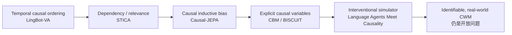
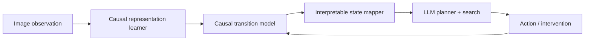

# 因果世界模型：代表工作、技术脉络与因果边界

**检索日期：2026-08-19**  
**范围：** world model + causal representation / intervention / counterfactual reasoning。本文只讨论具有代表性的因果世界模型工作，不把一般 action-conditioned video model 自动归入严格因果学习。

> **核心判断：** 当前所谓 Causal World Model 实际横跨三种不同层级：正式因果结构学习、通过训练目标注入因果归纳偏置，以及仅具有时间因果顺序的生成式世界模型。三者不能混用。

---

## 1. 一页结论

目前最值得关注的工作可分为四条路线：

| 路线 | 代表工作 | 核心贡献 | 因果强度 | 主要短板 |
|---|---|---|---|---|
| **显式因果表征与结构** | Language Agents Meet Causality、CBM | 学 causal variables、dependency graph 或最小因果状态 | 强 | 依赖较强识别假设或已分解状态，真实视觉扩展困难 |
| **因果归纳偏置的预测模型** | Causal-JEPA | 用 object-level latent masking 强迫模型依赖实体交互 | 中强 | 学到的是稳定 predictive dependency，并非可识别 SCM |
| **鲁棒决策的因果理论** | Robust Agents Learn Causal World Models | 证明 robust adaptation 与 causal model knowledge 的关系 | 强理论 | 主要是简化 CBN 和 synthetic setting |
| **因果感知或时间因果模型** | STICA、LingBot-VA | object relevance、action-conditioned dynamics、causal attention | 中弱 | dependency 或 autoregressive ordering 不等于 intervention |

从学术成熟度看：

- **理论最干净：** Robust Agents、Causal World Model unifying perspective。
- **经验结果最亮眼：** Causal-JEPA；其关键价值是用 objective 而非复杂架构制造 interaction necessity。
- **最接近正式视觉 causal simulator：** Language Agents Meet Causality。
- **最接近实际机器人规模化：** LingBot-VA，但其“causal”主要是时间顺序和 action-to-future dynamics。
- **最值得借鉴的状态观：** CBM；世界模型无需重建所有信息，只需保留 intervention- and task-relevant variables。

### 因果强度阶梯

这里的箭头表示“因果主张更强”，不表示右侧方法在所有任务上都更好。

---

## 2. Causal-JEPA：用对象级遮挡迫使模型学习交互

**论文：** *Causal-JEPA: Learning World Models through Object-Level Latent Masking*  
**作者：** Heejeong Nam et al.  
**年份：** 2026，ICML 2026  
**入口：** [arXiv](https://arxiv.org/abs/2602.11389)｜[代码](https://github.com/galilai-group/cjepa)

*图 1. Causal-JEPA 训练框架。来源：论文 Fig. 1。*

### 核心思想

仅把视频编码为 object slots，并不能保证模型理解 object-object interaction。普通 predictor 很容易依靠目标对象自身的历史轨迹做外推。

Causal-JEPA 将某个对象的大部分历史 latent trajectory 整体遮挡，只保留最早的 identity anchor，迫使模型利用其他对象、动作和 proprioception 恢复该对象状态：

\[
\{O^j\}_{j\neq i},a_t,p_t \rightarrow \hat O^i_t,\hat O^i_{t+1:t+k}.
\]

这相当于对 predictor 的 **latent observability** 做干预，使 interaction reasoning 成为完成预测任务的必要条件。

### 关键证据

- CLEVRER 反事实问答中，相同架构仅加入 object-level masking，per-question accuracy 从 **47.68 提升到 68.81**。
- Push-T MPC 中，C-JEPA 达到 **88.67%** success，接近 DINO-WM 的 91.33%。
- 仅使用 patch-based world model 约 **1.02%** 的 latent features，规划速度超过 **8 倍**。

### 因果边界

论文没有声称恢复真实 causal graph。其理论结论是：masking 鼓励模型学习 intervention-stable predictive dependencies；存在 latent confounding 或部分可观测时，这些 dependency 不一定是真实 causal parents。

**判断：** 这是目前“因果归纳偏置如何落到 world-model objective”最干净的代表作，但不是正式 causal identification。

---

## 3. A Unifying Perspective：什么条件下世界模型才能称为因果

**论文：** *A Unifying Perspective on Causal World Models: From Observations to Representations to Structure*  
**作者：** Avinash Kori, Fabrizio Russo  
**年份：** 2026，arXiv preprint  
**入口：** [arXiv](https://arxiv.org/abs/2608.13456)

### 核心思想

这是一篇概念和理论框架论文，而非新 SOTA model。它将 CWM 分解为：

\[
x_t \rightarrow v_t \rightarrow r_t \rightarrow G_r,
\]

其中分别对应原始观测、实体表征、关系状态和因果关系结构。模型还应支持 intervention-conditioned transition、counterfactual generation 和 utility-aware decision making。

最重要的校正是：

\[
P(r_{t+1}\mid r_t,a_t)
\neq
P(r_{t+1}\mid r_t;do(a_t=a))
\]

除非满足 consistency、positivity，以及 action randomized 或 no-unmeasured-confounding 等识别条件。

### 证据与局限

- 无实证实验，价值在于统一概念和识别条件。
- 没有解决 entity/relational state 如何从真实图像可靠发现。
- 不应将其作为 empirical baseline，但适合作为定义 Causal World Model 的理论基准。

**判断：** 这篇最适合用来约束论文表述，防止把普通 action-conditioned prediction 直接称为 causal inference。

---

## 4. Language Agents Meet Causality：从图像学习因果模拟器供 LLM 规划

**论文：** *Language Agents Meet Causality: Bridging LLMs and Causal World Models*  
**作者：** John Gkountouras et al.  
**发表：** ICLR 2025  
**入口：** [ICLR](https://proceedings.iclr.cc/paper_files/paper/2025/hash/5c5bc3553815adb4d1a8a5b8701e41a9-Abstract-Conference.html)｜[arXiv](https://arxiv.org/abs/2410.19923)｜[代码](https://github.com/j0hngou/LLMCWM)

*图 2. 从视觉观测学习 causal variables 和 transition model，并将模型 rollout 交给语言智能体规划。来源：论文 Fig. 2。*

### 核心思想

LLM 的常识可能与当前环境不一致，因此 agent 应从自身交互数据中学习 environment-specific causal world model，再将 latent causal state 转成语言供 LLM 查询和搜索。

该方法基于 BISCUIT 风格的 causal representation learning，学习：

\[
I_t\rightarrow z_t^{causal}, \qquad
(z_t^{causal},a_t)\rightarrow z_{t+1}^{causal}.
\]

### 关键证据

- GridWorld 2-step planning：causal-aware agent 约 **0.95**，LM-only 约 0.20。
- iTHOR 2-step：约 **0.58 vs. 0.25**；4-step：约 **0.44 vs. 0.11**。
- Open、Toggle 等简单状态变换推断较准；Pickup、Put 等涉及位置和多对象关系的动作明显更难。

### 因果边界

它比 Causal-JEPA 更接近正式 causal representation learning，但依赖 intervention patterns 足够丰富、不同 causal variables 可区分等假设。实验仍集中在 GridWorld 和 iTHOR，真实世界 scalability 未验证。

**判断：** 当前“causal latent simulator 用于 counterfactual planning”的核心 anchor。优点是因果语义较强，缺点是识别假设和环境复杂度受限。

---

## 5. Robust Agents Learn Causal World Models：鲁棒智能为何需要因果模型

**作者：** Jonathan Richens, Tom Everitt  
**发表：** ICLR 2024 Oral  
**入口：** [arXiv](https://arxiv.org/abs/2402.10877)

### 核心思想

论文从理论上证明：若 agent 能在足够丰富的局部机制变化下保持低 regret 并快速适应，其内部知识必须能恢复环境的近似 causal model；反之，因果模型也足以支持这类鲁棒适应。

\[
\text{robust adaptation under mechanism shifts}
\Longleftrightarrow
\text{causal-model knowledge}.
\]

### 证据与局限

- 在随机生成的 causal environments 中，agent regret 降低时，恢复出的 causal-model error 同步下降。
- 贡献主要是理论 justification，不是视觉 world-model architecture。
- 设定以简化 causal Bayesian networks 为主，未覆盖一般复杂 mediated MDP，也没有真实视觉或机器人实验。

**判断：** 适合回答“为什么 world model 需要 causality”，不适合作为视觉模型的直接 baseline。

---

## 6. CBM：最小、可复用的因果状态抽象

**论文：** *Building Minimal and Reusable Causal State Abstractions for Reinforcement Learning*  
**方法：** Causal Bisimulation Modeling  
**作者：** Zizhao Wang et al.  
**发表：** AAAI 2024  
**入口：** [AAAI](https://ojs.aaai.org/index.php/AAAI/article/view/29507)｜[arXiv](https://arxiv.org/abs/2401.12497)

### 核心思想

好的 world state 不应最大化重建信息，而应只保留当前任务真正需要的 causal variables。CBM 先学习跨任务复用的 causal dynamics，再沿 reward dependency 回溯 causal ancestors，形成 task-specific state mask：

\[
\text{factored state}
\rightarrow \text{causal dynamics graph}
\rightarrow \text{reward ancestors}
\rightarrow \text{minimal policy state}.
\]

### 关键证据

- 在 Robosuite manipulation 和 DMC tasks 中测试，并显式加入 controllable / uncontrollable distractors。
- implicit dynamics model 的 causal graph recovery 优于 explicit predictor。
- 多个任务中达到接近 oracle abstraction 的 sample efficiency。

### 因果边界

其输入已经是 factored low-dimensional state，解决的是 known factors 之间的 causal abstraction，而不是从 RGB/video 中发现未知 causal variables。

**判断：** 最重要的启发是“minimal intervention-relevant state”，不是把所有可预测视觉信息都塞入 world state。

---

## 7. STICA：面向决策的对象级因果相关性

**论文：** *Object-Centric World Models for Causality-Aware Reinforcement Learning*  
**作者：** Yosuke Nishimoto, Takashi Matsubara  
**发表：** AAAI 2026  
**入口：** [AAAI](https://ojs.aaai.org/index.php/AAAI/article/view/39642)｜[arXiv](https://arxiv.org/abs/2511.14262)

*图 3. STICA 的 object-centric world model：从图像中抽取对象 token，并预测对象级未来状态。来源：论文 Fig. 1(a)。*

### 核心思想

STICA 将图像拆成 object tokens，用 Transformer world model 预测 token dynamics，再由 policy/value network 估计 token-level cause-effect relevance，以 causality-aware attention 聚焦影响奖励与决策的对象。

### 关键证据

在 OCVRL 中，STICA 的 final success 分别达到：Object-goal **0.737**、Interaction **0.333**、3D Reaching **0.867**，均优于文中 TWM 与 DreamerV3 对照。消融显示 causality-aware attention 比单纯 object-centric representation 更关键。

### 因果边界

这里的 causality 更接近 learned relevance / dependency，没有显式 \(do(\cdot)\)、counterfactual evaluation 或 causal graph identification。

**判断：** 它证明“为决策选择关键对象”有实际价值，但不应被表述为已经恢复真实 causal structure。

---

## 8. LingBot-VA：规模化机器人世界模型中的“时间因果”

**论文：** *Causal World Modeling for Robot Control*  
**作者：** Lin Li et al.  
**年份：** 2026，arXiv  
**入口：** [arXiv](https://arxiv.org/abs/2601.21998)｜[代码](https://github.com/Robbyant/lingbot-va)

*图 4. LingBot-VA 联合建模 video latent 与 action stream 的整体框架。来源：论文 Fig. 2。*

### 核心思想

LingBot-VA 在统一 autoregressive diffusion framework 中联合学习 video latent 与 action stream，让未来视觉变化为 action prediction 提供密集 dynamics supervision，并通过 ground-truth observation feedback、KV cache 和异步执行形成闭环控制。

### 关键证据

- 约 5.3B 参数规模，公开描述包含约 16K 小时 robot data。
- 在 RoboTwin 2.0、LIBERO 和真实机器人长时序任务上取得强结果；论文报告 LIBERO 平均约 **98.5%**。
- 结果主要证明大规模 video-action pretraining 对控制有效。

### 因果边界

其“causal”主要指：

\[
action \rightarrow future\ visual\ dynamics
\]

以及 autoregressive causal attention / temporal ordering。论文不包含 causal graph discovery、intervention identification、SCM 或 counterfactual benchmark。

**判断：** 它是强 robot world-action model，但从严格因果学习看，应归为 causality-motivated generative world model。

---

## 9. 横向比较

| 工作 | 表征 | Intervention | Counterfactual | Planning / control | 最准确的定位 |
|---|---|---|---|---|---|
| Causal-JEPA | object slots | latent observability masking | counterfactual-like；CLEVRER QA | Push-T MPC | causal inductive bias |
| Unifying Perspective | entity / relation / graph | 理论定义 | 理论要求 | conceptual | 识别条件与统一框架 |
| Language Agents Meet Causality | learned causal latents | action / interaction | causal rollout | LLM + search | causal representation + simulator |
| Robust Agents | causal Bayesian network | mechanism shifts | 理论支持 | robust decision | 强理论、弱 embodied |
| CBM | factored state | implicit in dynamics | 非核心评估 | RL | minimal causal abstraction |
| STICA | object tokens | 无正式 intervention | 无 | RL | dependency / relevance |
| LingBot-VA | video-action latents | action-conditioned | 无正式评估 | real robot | temporal/action causality |

### 最容易混淆的三个概念

1. **预测依赖不等于因果关系。** Attention 或 dependency score 只能说明变量对当前 predictor 有用。
2. **action conditioning 不自动等于 intervention。** 行为策略与隐藏状态共同影响 action 时，observational transition 不能直接解释为 \(do(a)\)。
3. **causal attention 不等于 causal inference。** 在 Transformer 中屏蔽未来 token 只保证信息顺序，不提供结构识别。

---

## 10. 总结

这几项工作形成了一条清楚的研究脉络：

\[
\text{future prediction}
\rightarrow
\text{structured/object-centric prediction}
\rightarrow
\text{interaction-forcing objective}
\rightarrow
\text{explicit causal state and intervention}
\rightarrow
\text{counterfactual planning}.
\]

当前最成熟的成果仍分布在不同环节：Causal-JEPA 擅长通过目标函数制造交互推理需求；Language Agents Meet Causality 更接近完整 causal simulator；CBM 强调最小因果状态；Robust Agents 提供理论必要性；STICA 和 LingBot-VA 则展示了较弱因果概念在决策与机器人规模化中的工程价值。

因此，对现阶段文献最稳妥的总括是：

> **Causal World Model 尚未形成统一范式。前沿已经从“能否预测未来”转向“预测是否依赖正确且干预稳定的变量”，但真实高维环境中的可识别因果状态、机制变化和反事实评测仍未被统一解决。**

---

## 参考文献

1. Nam et al., *Causal-JEPA: Learning World Models through Object-Level Latent Masking*, 2026.
2. Kori and Russo, *A Unifying Perspective on Causal World Models*, 2026.
3. Gkountouras et al., *Language Agents Meet Causality*, ICLR 2025.
4. Richens and Everitt, *Robust Agents Learn Causal World Models*, ICLR 2024 Oral.
5. Wang et al., *Building Minimal and Reusable Causal State Abstractions for Reinforcement Learning*, AAAI 2024.
6. Nishimoto and Matsubara, *Object-Centric World Models for Causality-Aware Reinforcement Learning*, AAAI 2026.
7. Li et al., *Causal World Modeling for Robot Control*, 2026.
8. Lippe et al., *BISCUIT: Causal Representation Learning from Binary Interactions*, 2023.
9. Wang et al., *Causal Dynamics Learning for Task-Independent State Abstraction*, ICML 2022.
