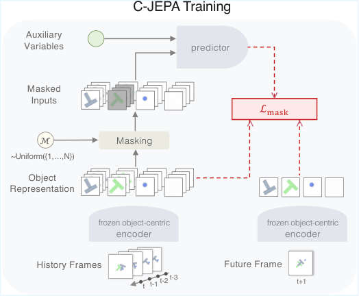
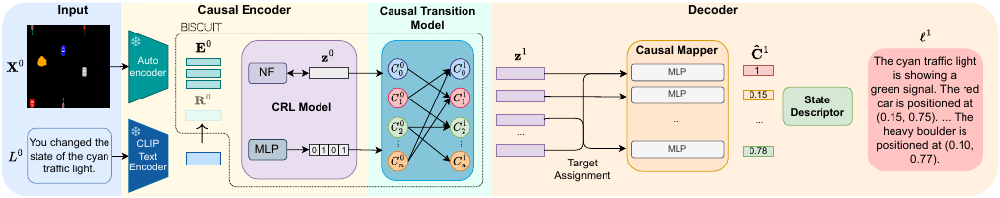
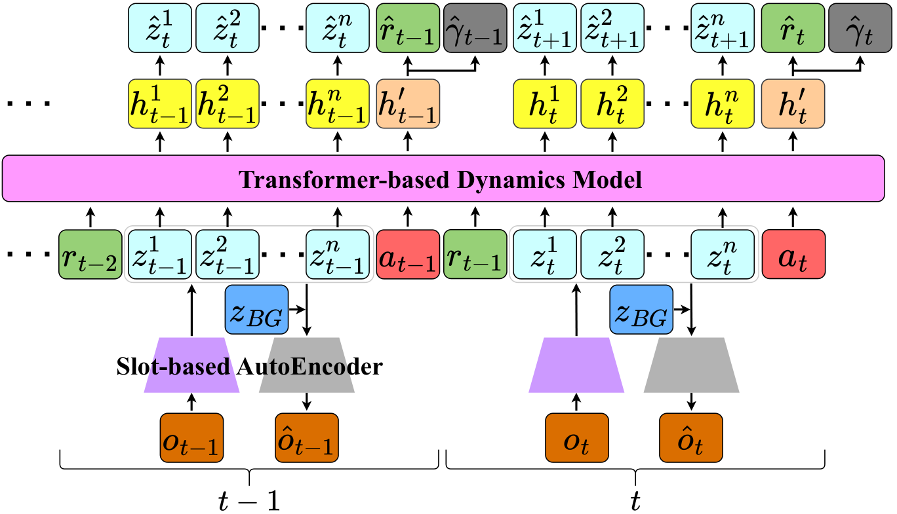
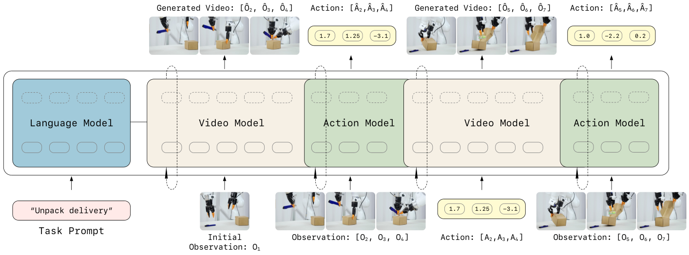

# 世界模型的因果建模与反事实推理：论文梳理与证据审计

**检索与核对日期：2026-08-20**  
**主题范围：** causal world model、causal representation learning、intervention、counterfactual reasoning，以及与机器人控制相关的预测式世界模型。  
**阅读范围：** 下列九篇主论文均核对了可获得的全文、附录/补充材料、正式发表页或作者公开页、代码仓库；不是仅依据标题或摘要。第二篇为观点/理论稿，没有实验。尚未由正式 proceedings 索引的会议状态会明确标注。

> **总判断：** 这组论文中的“因果”至少有三种不同含义，不能混写：
>
> 1. **强因果：** 明确变量、结构因果模型、干预语义、可识别性或反事实；
> 2. **中等强度：** 通过对象遮挡、机制不变性、奖励祖先等归纳偏置学习稳定依赖，但不恢复完整 SCM；
> 3. **弱因果/时间因果：** action-conditioned prediction、单向 attention 或“预测未来”，不等于 `do(·)` 或反事实识别。

---

## 1. 快速定位

| 论文 | 最准确的定位 | 干预/结构 | 反事实证据 | 经验范围 | 阅读结论 |
|---|---|---|---|---|---|
| Causal-JEPA | 对象级遮挡带来的因果归纳偏置 | latent observability masking；不恢复 SCM | CLEVRER 反事实问答 | 合成物理 + Push-T | 中等强度因果 |
| A Unifying Perspective | CWM 的概念、接口与可识别性框架 | 明确讨论 `do`、混杂、等价类 | 理论要求，无实验 | 无 | 强概念，未经验验证 |
| Language Agents Meet Causality | 因果表征 + latent simulator + LLM 规划 | BISCUIT 式交互机制 | 多步状态推演/规划 | GridWorld、iTHOR | 九篇中最接近可查询因果模拟器 |
| Robust Agents Learn CWM | 鲁棒策略可被用来恢复因果模型 | 局部机制变化、CID/CBN | 理论性 | 简化二元决策任务 | 强理论，弱 embodied |
| CBM | 最小、任务相关、可复用的因果状态抽象 | dynamics graph + reward ancestors | 非核心 | factored state RL | 强状态抽象，非视觉变量发现 |
| STICA | 对象相关性/依赖用于决策 | learned relevance attention | 无 | Safety Gym、OCVRL | 作者明言不是 causal inference |
| LingBot-VA | 大规模自回归 video-action world model | 时间顺序和动作条件 | 无正式反事实评测 | 仿真 + 真实机器人 | 强工程模型，弱 Pearl 式因果 |
| VLA-JEPA | 未来 latent prediction 作为 VLA 训练正则 | block-causal mask | 无 | LIBERO、SimplerEnv、真实机器人 | 预测式/不变性导向，不是 SCM |
| Mask World Model | 用未来语义 mask 过滤视觉捷径 | 几何信息瓶颈 | 无 | LIBERO、RLBench、真实机器人 | 鲁棒表征，不是反事实模型 |

### 术语边界

- `P(s'|s,a)` 只有在 action 可视为外生干预，或满足无未测混杂、positivity、consistency 等条件时，才可直接承担 `P(s'|s,do(a))` 的含义。
- Transformer 的 causal mask 只限制信息从过去流向未来；它不识别变量之间的结构因果关系。
- “在 counterfactual QA 上更准”说明表征有助于该 benchmark 的反事实题型，不自动证明模型拥有可迁移的个体层反事实 SCM。

---

## 2. Causal-JEPA: Learning World Models through Object-Level Latent Masking

**作者：** Heejeong Nam, Quentin Le Lidec, Lucas Maes, Yann LeCun, Randall Balestriero  
**年份与发表：** ICML 2026，OpenReview camera-ready；早期 arXiv/仓库标题为 *Learning Causal World Models through Object-Level Latent Interventions*，最终版改为当前标题。  
**可靠入口：** [ICML/OpenReview PDF](https://openreview.net/pdf?id=VMAHQDOtjp)｜[arXiv 2602.11389](https://arxiv.org/abs/2602.11389)｜[官方代码](https://github.com/galilai-group/cjepa)



*配图：* **Causal-JEPA: Learning World Models through Object-Level Latent Masking，Fig. 1**。来源：[论文原文](https://arxiv.org/html/2602.11389)。图展示冻结的对象编码器、对象轨迹遮挡、历史重建与未来 latent 预测。

### Insight

对象中心表征本身不保证模型学习对象交互。若目标对象的历史轨迹完整可见，预测器可能只做惯性外推。Causal-JEPA 将一个对象的大部分历史 latent 整体遮挡，只保留最小身份锚点，迫使模型从其他对象、动作与本体状态中恢复它；关键不在更复杂的架构，而在**制造必须使用跨对象影响才能完成的训练任务**。

### Pipeline

| 环节 | 输入 | 处理 | 输出 |
|---|---|---|---|
| 对象编码 | 视频帧 | 冻结的 SAVi/VideoSAUR 等对象编码器 | 每帧 object slots |
| 对象级遮挡 | slots 历史 | 选择对象并遮挡其轨迹，仅留身份 anchor | masked slot sequence |
| 联合预测 | 其余对象、可选 action/proprioception | predictor 同时重建被遮挡历史并预测未来 latent | 目标对象历史与未来 latent |
| 下游 | learned slots | VQA 头或 latent-space MPC | 问答答案或控制动作 |

### 实验与证据

- **CLEVRER：** 10,000/5,000/5,000 train/val/test，视频 128 帧、480×320；评价 descriptive、predictive、explanatory、counterfactual VQA（原文 §4.1、Table 1–3）。
- 在 VideoSAUR 编码下，object mask 从 0 增至 4 后，总体准确率 **82.79→89.40**；counterfactual per-question **47.68→68.81**，提升 21.13 个百分点。该对照支持“对象级遮挡带来增益”，但仍是 CLEVRER 内分布题型。
- **失败/非单调性：** SAVi 编码下 mask=2 的 counterfactual 为 **60.19**，mask=4 降到 **34.06**，甚至低于不遮挡的 **41.10**。因此“遮得越多越因果”不成立，效果依赖 slot 质量和可恢复信息量（Table 2）。
- **Push-T MPC：** C-JEPA mask=1 成功率 **88.67%**；DINO-WM 为 **91.33%**，OC-JEPA 为 **76.00%**（Table 6）。对象 latent 只占 patch 特征预算约 **1.02%**；单张 L40S、50 条候选轨迹的规划时间约 **673 s vs. 5,763 s**，报告为 3 个 seed 平均。
- 所有模型在预提取对象 embedding 上训练，单 GPU、30 epochs、batch 256。论文未给出真实机器人或跨域视频验证。

### 主张、证据与判断

- **作者明确主张：** masking 学到的是被遮挡对象的 *influence neighborhood*，即预测上最小充分的上下文。
- **实验实际支持：** 该目标在两个对象编码器和两个 benchmark 上改善若干反事实 QA/控制指标，并显著压缩规划 latent。
- **阅读判断：** 这是 causal inductive bias，不是 causal parent identification。作者也明确承认 influence neighborhood 可能包含后代或混杂相关变量。

### 开放情况与局限

- 代码公开；CLEVRER、Push-T 为已有公开数据/环境。仓库可训练复现，但预训练对象编码器及具体环境版本仍需按 README 配置。
- 依赖对象分解质量；未与真实 temporal causal graph 对齐验证；没有 `do`-calculus、个体反事实或隐藏混杂识别；复杂接触、遮挡和真实机器人未覆盖。

---

## 3. A Unifying Perspective on Causal World Models: From Observations to Representations to Structure

**作者：** Avinash Kori, Fabrizio Russo  
**年份与发表：** 2026，arXiv 预印本；v1 于 2026-08-13 提交，距本次检索仅 7 天，尚无正式同行评审版本。  
**可靠入口：** [arXiv 2608.13456](https://arxiv.org/abs/2608.13456)｜[HTML 全文](https://arxiv.org/html/2608.13456)
**代表图：** A Unifying Perspective on Causal World Models，Fig. 1，从预测到干预与反事实能力的世界模型因果阶梯。来源：[Fig. 1 原图 PNG](https://arxiv.org/html/2608.13456v1/figures/Causal_Ladder_of_World_Models.png)


### Insight

论文把 CWM 拆成“观测→表征→关系结构→干预/效用”的接口链，并强调真正困难的是**各层之间的兼容可识别性**：视觉变量通常只能在 slot permutation、仿射变换等等价类下识别，只要转换同时保持 transition、action、utility 和 policy 接口，未必需要恢复唯一的“真变量命名”。

### Pipeline / 形式化接口

```text
raw observation x_t
  -> encoder phi
entity-indexed representation v_t
  -> relational map psi
relational state r_t (diagonal: attributes; off-diagonal: relations)
  -> structured transition / intervention model
future state, counterfactual rollout, utility-aware decision
```

论文将世界模型写为包含观测、动作、关系状态、transition 与 utility 的组合对象，并区分 observation、intervention、counterfactual 三层能力（原文 Definition 3、Fig. 1）。

### 证据范围

- **没有实验、数据集、baseline、消融或代码。** 它是观点与形式化框架论文，不应作为实证 SOTA 引用。
- 论文明确讨论 causal sufficiency：缺失共同原因会使关系学习混杂；不能直接在 raw pixels 上假设有可解释的 pixel-level causal DAG。
- 强 identifiability 在高维世界中往往不现实，论文主张以可保持决策接口的等价类为目标。

### 主张、证据与判断

- **作者明确主张：** CWM 应连接感知、实体/关系表征、结构、干预和 utility，而不是只做 next-frame prediction。
- **论文提供的支持：** 定义、命题与文献统一；没有新经验验证。
- **阅读判断：** 很适合作为本课题的概念规范和审稿清单，但其中“统一”仍是 proposal，算法实现、部分可观测、latent confounding 和真实评测均待完成。

### 开放情况与局限

- 仅论文，无代码/数据。
- 版本很新且未同行评审；应低于正式会议论文置信度使用。未来工作部分也承认需发展具体算法、经验测试和对 partial observability 的扩展。

---

## 4. Language Agents Meet Causality: Bridging LLMs and Causal World Models

**作者：** John Gkountouras, Matthias Lindemann, Phillip Lippe, Efstratios Gavves, Ivan Titov  
**发表：** ICLR 2025  
**可靠入口：** [ICLR 正式页面](https://proceedings.iclr.cc/paper_files/paper/2025/hash/5c5bc3553815adb4d1a8a5b8701e41a9-Abstract-Conference.html)｜[arXiv 2410.19923](https://arxiv.org/abs/2410.19923)｜[官方代码](https://github.com/j0hngou/LLMCWM)



*配图：* **Language Agents Meet Causality，Fig. 2**。来源：[论文原文](https://arxiv.org/html/2410.19923)。图展示图像因果表征、语言动作条件 transition、状态语言化以及 LLM 搜索规划。

### Insight

LLM 的常识可能与当前环境机制不一致。论文不让 LLM 凭语言先验想象环境，而是从 agent 交互中学习 environment-specific causal latents 和 transition，再把 rollout 转成语言供 LLM 查询。因果世界模型在这里是 LLM 的**外部、可更新模拟器**。

### Pipeline

| 输入 | 模块 | 输出 |
|---|---|---|
| 相邻图像、action/interactions | BISCUIT 式 causal representation learner | 解耦 latent causal variables |
| latent state + 文本动作 embedding | causal transition model | 下一 latent state |
| 少量带名称的 causal-variable supervision | causal mapper / state descriptor | 可读状态描述 |
| 目标 + 模型生成状态描述 | LLaMA 3 + 修改的 RAP/MCTS | 动作计划 |

### 实验与证据

- **数据：** GridWorld 与 iTHOR；训练 10,000 条×100 steps，validation/test 各 1,000×100，另有 100 个 ICL episodes；N-step 评测每个 N 使用 100 episodes（Appendix B.1, Table 5）。autoencoder 另使用约 10 倍无标签随机样本，比较数据预算时不能忽略。
- **因果状态推演，Table 2：** iTHOR 的 1/2/4-step accuracy 为 **0.824/0.680/0.630**，LM-only 为 **0.482/0.285/0.110**；GridWorld 的 1/2/4/6/8-step 为 **0.954/0.922/0.829/0.797/0.758**，LM-only 为 **0.391/0.220/0.085/0.045/0.005**。
- **规划，Table 4：** iTHOR 2/4-step success **0.58/0.44 vs. 0.25/0.11**；GridWorld 2/4/6/8-step **0.95/0.73/0.46/0.42 vs. 0.20/0.11/0.08/0.06**。对照使用同一 LLM，但 baseline 范围不宽，表中未报告置信区间。
- **失败案例：** 扩展 3,000 样本分析中，iTHOR Toggle/Open/NoOp accuracy 为 **0.957/0.926/0.962**，Put/Pickup 仅 **0.506/0.431**。作者归因于 3D 坐标独立性与二元交互机制假设不匹配（§5.3）。
- 训练使用 A100；autoencoder 约 1–2 天，flow + language head 约 0.5–1 小时（Appendix B.3）。

### 主张、证据与判断

- **作者明确主张：** learned CWM 能减少 LLM 在未知环境中的多步状态推演错误并改善规划。
- **实验实际支持：** 在两个模拟环境、固定 action vocabulary 和同一 LLM 对照下，短到中等 horizon 明显改善。
- **阅读判断：** 这是九篇中因果语义最接近 causal representation + simulator 的系统，但不是完全无监督：最终变量命名需要少量标签，并继承 BISCUIT 的可识别性假设。

### 开放情况与局限

- 代码、数据生成脚本和部分预训练模型公开。
- 仅简单模拟环境；没有真实机器人、开放词汇动作或强视觉域移；长时 rollout 仍累积误差；Pickup/Put 暴露连续空间和多对象关系建模不足。

---

## 5. Robust Agents Learn Causal World Models

**作者：** Jonathan Richens, Tom Everitt  
**发表：** ICLR 2024  
**可靠入口：** [Google DeepMind 论文页](https://deepmind.google/research/publications/49666/)｜[ICLR 正式 PDF](https://proceedings.iclr.cc/paper_files/paper/2024/file/44a2b9f7bf9aec3f1fa333ad875b0ee0-Paper-Conference.pdf)｜[arXiv 2402.10877](https://arxiv.org/abs/2402.10877)

### Insight

论文反转了常见问题：不是先给 agent 一个 causal model 看它是否鲁棒，而是问“如果策略能对足够丰富的机制变化保持低 regret，我们能否从策略行为中提取环境因果模型？”在一组 causal influence diagram 假设下，答案近似是肯定的。

### Pipeline

```text
environment family under local interventions
  -> robust/optimal policy oracle
  -> carefully chosen decision queries
  -> recover DAG orientation + distributions over utility ancestors
  -> predict/adapt under new mechanism shifts
```

输出是可从策略响应中**恢复**的 causal model；定理并不证明神经网络内部显式存储了唯一 SCM。

### 理论与实验支持

- Theorem 1–3 将对局部机制变化的最优性/低 regret 与 causal graph、utility ancestors 上联合分布的可恢复性联系起来。
- 附录实验在 **1,000 个随机二元 causal Bayesian networks** 上运行因果发现；两个 binary latent 的简化任务中，normalized regret 约 30% 时方向识别接近 **90%**，随机基线约为机会水平。
- 实验是 theorem 的 sanity check，不是视觉世界模型评测；没有机器人、复杂 MDP 或高维 observation。

### 主张、证据与判断

- **作者明确主张：** 对足够丰富局部干预保持鲁棒的 agent 必须包含可提取的 causal knowledge。
- **论文实际支持：** 在其形式化假设下给出证明，并用小型 synthetic CBN 验证恢复算法随 regret 变化的趋势。
- **阅读判断：** “robustness implies causality”不能无条件外推到普通 OOD benchmark；关键前提是 shift family 足够丰富且 agent 对这些 shift 真正鲁棒。

### 开放情况与局限

- 截至检索日，论文与 DeepMind 页面未链接可核实的官方代码。
- 原文局限包括：要求几乎所有环境变量的局部干预；regret 较大时关系不可识别；主结果针对 unmediated decision tasks。后续 NeurIPS 2025 工作已扩展到 mediation，见补充推荐。

---

## 6. Building Minimal and Reusable Causal State Abstractions for Reinforcement Learning

**作者：** Zizhao Wang, Caroline Wang, Xuesu Xiao, Yuke Zhu, Peter Stone  
**发表：** AAAI 2024，38(14):15778–15786  
**可靠入口：** [AAAI 正式页面](https://ojs.aaai.org/index.php/AAAI/article/view/29507)｜[正式 PDF](https://ojs.aaai.org/index.php/AAAI/article/download/29507/30841)｜[arXiv 2401.12497](https://arxiv.org/abs/2401.12497)

### Insight

世界状态不是越完整越好。CBM 用可跨任务复用的 dynamics dependency graph，加上任务特定 reward parents，回溯出 reward 的 causal ancestors；策略只看这个最小集合，从而排除可控和不可控干扰变量。

### Pipeline

| 输入 | 模块 | 输出 |
|---|---|---|
| 已 factored 的低维 state、action、next state | implicit energy-based dynamics | 条件依赖/动态图 |
| state、task reward | causal reward model | reward parents |
| dynamics graph + reward parents | ancestor tracing / causal bisimulation | task-specific state mask |
| masked state | SAC | policy/value |

Dynamics 可跨任务复用，reward model 与抽象需要随任务更新。

### 实验与证据

- 环境覆盖 Robosuite Block Pick/Stack、Tool-use 系列以及 DMC Cheetah/Walker。每个任务加入 **20 个 controllable distractors**（action 随机投影）和 **20 个 uncontrollable distractors**（独立均匀噪声）。
- graph recovery 使用 3 seeds；state abstraction/RL 使用 5 seeds。为公平比较，baseline 共享 implicit dynamics backbone，RL 均使用 SAC（实验设置与 Appendix）。
- implicit graph 的平均识别准确率相对 explicit 至少提升约 3 个百分点；abstraction accuracy 在所有报告任务上至少提升约 20 个百分点。学习曲线以 5 seeds、每次 50 test episodes 报告均值和标准误。
- CBM 在 Pick、Cheetah、Walker 等任务接近使用 ground-truth abstraction 的 oracle；这支持“去除无关 state 能改善样本效率”，但 OOD shift 主要由人工干扰变量构造。

### 主张、证据与判断

- **作者明确主张：** causal bisimulation 可形成 minimal、task-specific 且 dynamics-reusable 的 state abstraction。
- **实验实际支持：** 在已知 state factorization 和合成 distractors 下，变量筛选与 RL 学习优于完整 state 和若干抽象 baseline。
- **阅读判断：** 它解决“从已知变量中选什么”，不解决“从 RGB 中发现变量是什么”。这一输入假设是迁移到视觉世界模型的最大缺口。

### 开放情况与局限

- 截至检索日，论文/AAAI 页面未提供可核实的官方代码链接。
- 依赖 observed factored state 和变量边界；DMC 的真实 causal graph 本身不完全明确；干扰变量被设计为简单、隔离；没有个体反事实或真实机器人 OOD 评测。

---

## 7. Object-Centric World Models for Causality-Aware Reinforcement Learning

**方法名：** STICA  
**作者：** Yosuke Nishimoto, Takashi Matsubara  
**发表：** AAAI 2026  
**可靠入口：** [AAAI 正式页面](https://ojs.aaai.org/index.php/AAAI/article/view/39642)｜[正式 PDF](https://ojs.aaai.org/index.php/AAAI/article/download/39642/43603)｜[arXiv 2511.14262](https://arxiv.org/abs/2511.14262)｜[官方代码](https://github.com/nishimoto0430/STICA)



*配图：* **Object-Centric World Models for Causality-Aware Reinforcement Learning，Fig. 1(a)**。来源：[AAAI 论文 PDF](https://ojs.aaai.org/index.php/AAAI/article/download/39642/43603)。图展示 slot/background 分解和对象级 dynamics。

### Insight

像素世界模型会把背景和任务无关物体也带入想象。STICA 先把图像分成对象 slots 与静态背景，再为对象 token 学一个与回报相关的 causality score，用它门控 policy/value attention；更准确地说，这是**面向决策的对象相关性选择**。

### Pipeline

```text
RGB observation
  -> slot autoencoder: object slots + static background
  -> Transformer dynamics: next slots, reward, discount
  -> imagined trajectories
  -> causality-score MLP + gated Transformer policy/value
  -> action distribution and value
```

### 实验与证据

- **Safety Gym 8 个对象丰富任务：** normalized mean **5.49**，DreamerV3 **4.06**、TWM **3.83**、TD-MPC2 **1.15**、PPO 归一为 1.00；除 PointGoal1 外 STICA 在表中均最好（Table 1）。
- **OCVRL 3 任务：** 3 runs 的 final success 分别为 **0.737/0.333/0.867**；TWM 为 **0.727/0.080/0.772**，DreamerV3 为 **0.677/0.156/0.697**（Table 2）。
- 消融显示：单独 object-centric WM 增益有限；Transformer policy/value、背景分离和 causal attention 共同贡献。只有 3 runs，统计稳定性有限。

### 主张、证据与判断

- **作者明确限定：** 原文将 causality 定义为 token-level dependency，并明确写明不是 causal inference 语境下的 causality。
- **实验实际支持：** 对象分解和任务相关 attention 在这些 RL benchmark 上提高 return/success。
- **阅读判断：** causality score 可能是 reward relevance、attention utility 或相关性，不能解释为真实因果边、干预效应或反事实机制。

### 开放情况与局限

- 训练代码公开。
- benchmark 小、仅 3 runs；无 SCM、`do`-intervention、graph recovery、counterfactual test；slot failure、遮挡和真实机器人未系统评估。

---

## 8. Causal World Modeling for Robot Control（LingBot-VA）

**作者：** Lin Li, Qihang Zhang, Yiming Luo, Shuai Yang, Ruilin Wang, Fei Han, Mingrui Yu, Zelin Gao, Nan Xue, Xing Zhu, Yujun Shen, Yinghao Xu  
**年份与发表：** arXiv 2026，当前为 v2（2026-03-22）。作者仓库标注 RSS 2026；截至检索日未在 RSS 正式论文列表中核到独立 proceedings 条目，故本文保守记为“作者声明的 RSS 2026 / arXiv 版本”。  
**可靠入口：** [arXiv 2601.21998](https://arxiv.org/abs/2601.21998)｜[HTML 全文](https://arxiv.org/html/2601.21998)｜[官方代码](https://github.com/robbyant/lingbot-va)｜[模型权重](https://huggingface.co/robbyant/lingbot-va)



*配图：* **Causal World Modeling for Robot Control，Fig. 2**。来源：[论文原文](https://arxiv.org/html/2601.21998)。图展示 video stream 预测未来 latent、action stream 通过 inverse dynamics 解码动作，以及两者的 MoT 交互。

### Insight

将机器人策略拆成“想象未来视觉变化”和“从期望变化反推动作”两部分，并在统一自回归序列中交织 video/action tokens。KV cache 保留长历史，真实 observation 持续纠偏，异步推理把下一段预测与当前动作执行重叠。

### Pipeline

| 输入 | 模块 | 输出 |
|---|---|---|
| 多视角 RGB、语言、历史动作 | Wan2.2 causal VAE + T5 | video latents + instruction features |
| 历史 video/action tokens | 5B video stream + 350M action stream 的 MoT | 未来 visual latents |
| 当前/未来 latent + 历史 | inverse-dynamics flow matching | action chunk |
| 实时 observation queue | KV cache + FDM-grounded asynchronous loop | 闭环机器人控制 |

总参数约 **5.3B**；训练时联合 dynamics loss 和 inverse-dynamics loss。

### 实验与证据

- **数据：** AgiBot、RoboMind、InternData-A1、OXE/OpenVLA subset、UMI（除 DexUMI）、RoboCOIN 及内部数据，共约 **16K 小时**；各源 90/10 train/validation。内部数据使完整去重、泄漏和数据成分审计无法由外部完成（§4.1）。
- **RoboTwin 2.0：** 50 tasks；所有比较模型用 2,500 clean + 25,000 randomized demos。LingBot-VA Easy/Hard **92.93/91.55**，Motus **88.7/87.0**，π0.5 **82.7/76.8**（Table 1）。
- **LIBERO：** 每 task 50 demos，每 suite 500 evaluation trials，3 seeds；平均 **98.5%**，Long **98.5%**。但多数 baseline 数字从 X-VLA 汇总而来，不是全部在同一代码栈重跑（Table 2 注释）。
- **真实机器人：** 6 tasks、每 task 50 demos；LingBot-VA 与 π0.5 各 20 交替 trials，报告 success 与 progress。Make Breakfast 为 **75% SR / 97% progress**；论文报告六任务均优于 π0.5，但每任务 20 次使估计方差仍较大（Appendix A）。
- **消融：** naive async 在 RoboTwin Easy 仅 **74.3**，加入 FDM grounding 为 **90.4**，完整模型 **92.9**；仅从 WAN 初始化后训练为 **80.6**。异步方案任务时间约快 2×，但完整表也显示性能与同步版并非完全相同（Table 3）。
- 预训练 **1.4T tokens**；论文未报告总 GPU 数、能耗或总训练时长，无法评估完整计算成本。

### 主张、证据与判断

- **作者明确主张：** 自回归 video-action modeling 改善长时记忆、数据效率、闭环控制与泛化。
- **实验实际支持：** 在给定预训练数据和多个机器人 benchmark 上，控制 success 高，长 horizon 与少样本适配对 π0.5 有优势。
- **阅读判断：** “causal”主要是 temporal arrow、causal attention 和 action-conditioned dynamics。没有 causal graph、干预目标识别、SCM 或 counterfactual benchmark，因此不能据此声称掌握结构因果或反事实推理。

### 开放情况与局限

- 代码与部分模型权重公开，许可证可核；完整 16K 小时语料包含内部数据，不能完全复现。
- 5.3B 视频生成带来高计算与时延；论文自己指出视频与真实 dynamics 不对齐和执行漂移会导致失败，并将更高效压缩、触觉/力觉/音频列为未来方向。

---

## 9. VLA-JEPA: Enhancing Vision-Language-Action Model with Latent World Model

**作者：** Jingwen Sun, Wenyao Zhang, Zekun Qi, Shaojie Ren, Zezhi Liu, Hanxin Zhu, Guangzhong Sun, Xin Jin, Zhibo Chen  
**年份与发表：** arXiv 2026；作者项目/仓库标注 ECCV 2026。ECCV 2026 将于 2026-09 举行，截至检索日 Springer/ECVA proceedings 尚未公开，因此正式出版页待补。  
**可靠入口：** [arXiv 2602.10098](https://arxiv.org/abs/2602.10098)｜[HTML 全文](https://arxiv.org/html/2602.10098)｜[项目页](https://ginwind.github.io/VLA-JEPA/)｜[官方代码](https://github.com/ginwind/VLA-JEPA)｜[模型权重](https://huggingface.co/ginwind/VLA-JEPA/)

### Insight

未来帧不必生成像素，只需作为训练期 target 教 VLA 当前表示保留可预测、与动作相关的状态变化。V-JEPA2 的未来 embedding 是 teacher target；机器人推理时可以丢掉 world-model branch，只保留 VLM 与 action head，因而把世界模型当作**训练正则/表征教师**而不是在线规划器。

### Pipeline

```text
current RGB + instruction
  -> Qwen3-VL / student tokens + latent action tokens
future frames (training only)
  -> frozen V-JEPA2 target encoder
student tokens + block-causal predictor
  -> predicted future V-JEPA2 embeddings
robot data: joint latent prediction loss + flow-matching action loss
inference: current observation + language -> action chunk
```

### 实验与证据

- **预训练/后训练数据：** Something-Something-v2 约 220K 人类视频、DROID 约 76K 高质量轨迹、LIBERO 约 2K expert demos；真实任务每项 100 demos。训练使用 8×A100（§4.1）。
- **LIBERO：** 每 task 50 episodes、每 suite 500；Spatial/Object/Goal/Long 为 **96.2/99.6/97.2/95.8**，平均 **97.2**，OpenVLA-OFT **97.1**、π0.5 **96.9**（Table 1）。优势很小且未报告随机 seed/std，不能称为稳定显著领先。
- **LIBERO-Plus：** 7 类视觉/空间扰动平均 **79.5**，OpenVLA-OFT **69.6**；去掉人类视频预训练降至 **62.9**（Table 3）。这比原始 LIBERO 更能支持“human video 改善视觉鲁棒性”。
- **关键消融边界：** 去掉人类视频后原始 LIBERO 平均仍有 **96.1**，部分普通 benchmark 甚至不降；收益主要出现在 LIBERO-Plus，而不是所有设置普遍提升。
- **公平性：** SimplerEnv 表中的一些 baseline 使用不同训练数据，带星号方法还使用仿真 expert demonstrations；不能把表中排名解释为严格同预算比较。
- **失败案例：** 论文报告模型较少违反机器人安全边界，但会因细粒度语言理解不足而抓错物体；π0.5 更能遵循目标文字，却出现越界。还观察到重复 grasp 等失败（§4.4）。

### 主张、证据与判断

- **作者明确主张：** latent world modeling 与人类视频能增强 VLA 的 state-transition understanding 和 OOD robustness。
- **实验实际支持：** 对 LIBERO-Plus 扰动有明显增益；原始 LIBERO 的优势非常小，且缺少方差。
- **阅读判断：** block-causal predictor 是自回归信息约束，不是 causal discovery。该工作没有 `do`、结构图或反事实指标；应归为 predictive representation learning。

### 开放情况与局限

- 代码、训练说明与 checkpoints 公开；完整数据依赖已有大型数据集。
- 缺少多 seed/statistical uncertainty；baseline 数据预算不完全一致；真实任务少；细粒度语言 grounding 是明确失败模式；没有验证 learned latent 是否对应可干预因果变量。

---

## 10. Mask World Model: Predicting What Matters for Robust Robot Policy Learning

**作者：** Yunfan Lou, Xiaowei Chi, Xiaojie Zhang, Zezhong Qian, Chengxuan Li, Rongyu Zhang, Yaoxu Lyu, Guoyu Song, Chuyao Fu, Haoxuan Xu, Pengwei Wang, Shanghang Zhang  
**年份与发表：** ICML 2026；OpenReview camera-ready 页眉标注 PMLR 306。早期标题为 *Predicting What Matters: Robust Generalist Robot Policy Learning via Future Semantic Mask*；截至检索日 PMLR 独立落地页尚未被检索索引。  
**可靠入口：** [arXiv 2604.19683](https://arxiv.org/abs/2604.19683)｜[HTML 全文](https://arxiv.org/html/2604.19683)｜[OpenReview PDF](https://openreview.net/pdf?id=CWerqtOXif)｜[官方代码](https://github.com/LYFCLOUDFAN/mask-world-model)
**代表图：** Mask World Model，Fig. 2，以未来语义 mask 作为预测瓶颈并向动作策略提供中间特征的整体框架。来源：[Fig. 2 原图 PNG](https://arxiv.org/html/2604.19683v2/mwm.png)


### Insight

RGB future prediction会浪费容量重建纹理、光照和背景。MWM 改为预测未来 semantic masks，把对象身份、布局、接触和运动压进低带宽几何瓶颈；action policy 读取 mask-predictive intermediate features。训练需要离线 mask，推理只需 RGB，不在线调用 segmenter。

### Pipeline

| 阶段 | 输入 | 模块 | 输出 |
|---|---|---|---|
| world-model pretraining | 4 帧多视角 RGB；未来 mask targets | conditional diffusion/latent mask predictor | 5 帧未来 mask latent 与中间特征 |
| policy training | 当前视觉 + world-model features | diffusion action policy | 36-step action chunk |
| deployment | raw RGB | recurrent horizon control；10 Euler steps | 执行首个动作后重规划 |

### 实验与证据

- **LIBERO：** 每 suite 用 held-out validation 选 checkpoint，再评 500 episodes。MWM Spatial/Object/Goal/LIBERO-10 为 **0.988/1.000/0.982/0.960**，平均 **0.983**；GE-ACT **0.965**，π0 **0.942**（Table 1）。没有报告 seed/std，近饱和差异需谨慎。
- **表文不一致：** Table 1 中 Cosmos + Latent IDM 平均为 **0.919**、MWM-C2 为 **0.918**，但正文写成从 **0.873 提升到 0.918**。因此不能依据正文声称 C2 优于该表中 baseline；报告应以表格并标注冲突。
- **RLBench：** 从 100 个任务中只选 6 个，每任务 20 episodes；MWM **68.3%**，FiS-VLA **50.0%**、CogACT **42.5%**、π0 **33.3%**、GE-ACT **30.8%**（Table 2）。每 task 20 次使成功率步长为 5 个百分点，且不代表完整 100-task benchmark。
- **真实 Franka：** 4 tasks，每 task 50 demos，20 trials；ID 平均 **67.5%**，π0 **38.8%**、GE-ACT **23.8%**；appearance OOD 平均 **42.1%**，对照 **19.2/12.5%**（Table 3）。同数据训练增强了公平性，但 trial 数仍小。
- 论文另做 token pruning/视觉扰动压力测试，支持 mask bottleneck 对背景变化更稳；没有直接证明其表征是 causal variables。

### 主张、证据与判断

- **作者明确主张：** 未来 mask prediction 让策略聚焦 action-relevant geometry，改善 OOD robustness。
- **实验实际支持：** 在视觉扰动、6-task RLBench 子集和 4 个真实任务上，成功率高于所选 baseline。
- **阅读判断：** 这是信息瓶颈与几何监督带来的稳健性，不是因果识别。mask 会主动丢弃纹理/颜色；若任务本身依赖颜色、材质或文字，这可能成为失败源，但论文未充分覆盖该反例。

### 开放情况与局限

- 代码仓库公开，但 README 说明当前 release 主要保留 LIBERO 与核心实现；RLBench、真实机器人流程和完整预训练数据并未全部打包。训练 masks 需借助外部 RoboEngine/segmentation pipeline 生成。
- 依赖 mask 质量和类别体系；checkpoint 逐 suite 选择；无随机波动；部分 baseline 比较/正文数字不一致；没有 SCM、反事实或因果图评测。

---

## 11. 分类脉络与趋势

### 11.1 从“预测全部”到“预测决策相关部分”

Dreamer 类像素/latent dynamics 追求可预测未来；Causal-JEPA 用对象遮挡制造交互需求；VLA-JEPA 只对齐 future latent；MWM 只预测 future mask；CBM 只保留 reward ancestors。共同趋势是：**world state 的价值由下游干预和决策充分性决定，而非重建保真度。**

### 11.2 从对象 token 到关系与机制

对象中心化能降低维度，却不自动产生因果。STICA 停在对象相关性；Causal-JEPA 学 influence neighborhood；Language Agents/BISCUIT 开始给 latent 交互机制明确语义；Unifying Perspective 则要求进一步显式化关系结构、干预接口与等价类。

### 11.3 两条目前尚未汇合的路线

- **严格因果路线：** 可识别性与反事实语义较强，但依赖已知/可分解变量、观测到的干预目标或简单模拟环境。
- **规模化世界模型路线：** 数据、视频预测和机器人控制很强，但“因果”通常只到 action-conditioned dynamics 或 temporal masking。

真正的开放问题是把二者汇合：在真实部分可观测、多实体、带隐藏混杂的环境中，学习可校准、可干预、可反事实查询且能实时控制的 compact state。

### 11.4 建议的研究评测矩阵

后续课题不宜只报 task success，至少应同时覆盖：

| 维度 | 推荐检查 |
|---|---|
| 表征 | 变量/对象可识别性、slot permutation 等价、跨 seed 稳定性 |
| 结构 | graph precision/recall、方向、隐藏混杂敏感性 |
| 干预 | 已见/未见 intervention target、机制变化、组合干预 |
| 反事实 | factual consistency、intervention accuracy、个体层 counterfactual error |
| 决策 | ID/OOD return、长 horizon、扰动恢复、规划效率 |
| 公平性 | 相同数据/预训练/参数/算力、统一 checkpoint 选择、置信区间 |
| 泄漏 | 视频与 benchmark 去重、内部数据披露、语言/视觉模板重合 |

---

## 12. 补充推荐工作

以下推荐于 **2026-08-20** 检索并去除了同一工作的预印本/正式版重复。前六篇直接补足因果与反事实主线；后四项代表大团队的规模化世界模型，但不把它们误列为严格因果推理。

### 12.1 直接相关：因果表征、干预与反事实

| 工作 | 发表 | 与课题的关系 | 推荐理由与边界 |
|---|---|---|---|
| [CoPhy: Counterfactual Learning of Physical Dynamics](https://openreview.net/pdf/f00a0eeedb2a7f893adea8ba02e04d6836be26b0.pdf) | ICLR 2020，Meta/INRIA/SFU 等 | 从观察到的物理实验和修改后的初始条件预测 alternative future | 直接做视觉物理反事实，是 benchmark/问题定义锚点；但为合成 3D，作者的“super-human”只限该设定。[代码/数据](https://github.com/fabienbaradel/cophy) |
| [Causal Discovery in Physical Systems from Videos (V-CDN)](https://proceedings.neurips.cc/paper/2020/hash/6822951732be44edf818dc5a97d32ca6-Abstract.html) | NeurIPS 2020，MIT/多伦多/NVIDIA | 从视频关键点推断物体关系图并做 dynamics/counterfactual rollout | 把 perception、graph inference、物理预测连起来；系统仍限简化多体/布料，真实复杂性有限。 |
| [CausalWorld](https://openreview.net/pdf?id=SK7A5pdrgov) | ICLR 2021，MPI/Mila/ETH | 机器人操控中可对质量、颜色、尺寸等变量执行 `do` intervention | 适合严谨区分 appearance shift 与 mechanism shift；是 benchmark，不是 causal world-model 算法。[代码](https://github.com/rr-learning/CausalWorld) |
| [CITRIS](https://proceedings.mlr.press/v162/lippe22a.html) | ICML 2022，UvA/MIT-IBM/Qualcomm | 从带 intervention-target 标注的时序图像识别多维 causal factors | 有明确 identifiability 定理，是视觉因果表征的重要基线；实验主要是 3D rendered sequences，依赖干预目标可见。 |
| [BISCUIT](https://proceedings.mlr.press/v216/lippe23a/lippe23a.pdf) | UAI 2023，UvA/MIT-IBM/Qualcomm | 干预目标未知但 action 与每个变量的作用可由 binary interaction 描述 | 是 *Language Agents Meet Causality* 的直接方法基础，覆盖 iTHOR/CausalWorld；二元机制假设对连续操控较强。[代码](https://github.com/phlippe/BISCUIT) |
| [Variational Causal Dynamics](https://openreview.net/pdf?id=V9tQKYYNK1) | TMLR 2023，Oxford/MPI | 利用机制跨环境不变性学习模块化 dynamics，并在稀疏机制变化后快速适配 | 适合“可复用机制”方向；实验仍以 state/image simulation 为主。[代码](https://github.com/applied-ai-lab/VCD) |
| [Learning World Models with Identifiable Factorization (IFactor)](https://papers.neurips.cc/paper_files/paper/2023/hash/65496a4902252d301cdf219339bfbf9e-Abstract-Conference.html) | NeurIPS 2023，CMU/南京大学等 | 按 action/reward relevance 把 latent 分为四块并给出 block-wise identifiability | 连接可识别表征与 control sufficiency，是 CBM 的重要邻近工作；不是完整 SCM。[代码](https://github.com/AlexLiuyuren/IFactor) |
| [Agents Robust to Distribution Shifts Learn Causal World Models Even Under Mediation](https://papers.neurips.cc/paper_files/paper/2025/hash/6fe10a4c0d680609f0560920bd9ade4a-Abstract-Conference.html) | NeurIPS 2025 | 将 *Robust Agents* 扩展到 action 会改变环境的 mediated、multi-agent、POMDP 场景 | 对原论文局限的直接修补，理论相关度极高；仍主要是可提取性理论，不是大规模视觉模型。 |

### 12.2 技术邻近：大团队、规模化预测世界模型

| 工作 | 团队/发表 | 为什么值得纳入 | 因果边界 |
|---|---|---|---|
| [V-JEPA 2](https://ai.meta.com/research/publications/v-jepa-2-self-supervised-video-models-enable-understanding-prediction-and-planning/) | Meta，2025 | 超过 1M 小时视频预训练；V-JEPA2-AC 用少量 DROID 视频做零样本机器人规划，是 Causal-JEPA/VLA-JEPA 的直接技术底座 | latent prediction 和 planning，不恢复 SCM 或个体反事实 |
| [Genie: Generative Interactive Environments](https://deepmind.google/research/publications/60474/) | Google DeepMind，ICML 2024 | 11B 世界模型从无动作标注互联网视频学习 latent actions 和可控环境，是交互式世界模型规模化的重要节点 | latent controllability 不等于可识别 causal variables；Genie 2/3 目前更多是官方技术演示而非同等完整论文证据 |
| [Cosmos World Foundation Model Platform](https://arxiv.org/abs/2501.03575) | NVIDIA，2025 | 开放权重/模型栈，面向 physical AI 的视频生成、tokenization 与后训练；MWM 也将 Cosmos 类模型作为对照 | 物理生成先验很强，未提供结构因果或反事实识别保证 |
| [General Agents Need World Models](https://icml.cc/virtual/2025/poster/44620) | Google DeepMind 等，ICML 2025 | 证明能泛化到多步目标的 general policy 可被提取出越来越精确的 predictive transition model | 作者和 Causal Incentives 页面均强调这里是 predictive world model，**不必然是 causal model** |

### 推荐优先级

1. **做“反事实物理推理”基线：** CoPhy、V-CDN、CausalWorld。
2. **做“视觉因果变量可识别性”：** CITRIS、BISCUIT、VCD。
3. **做“任务最小状态/控制”：** IFactor、CBM、Causal-JEPA。
4. **做“规模化机器人世界模型”：** V-JEPA 2、LingBot-VA、VLA-JEPA、MWM；研究设计中必须另加干预/反事实评测，不能只用 success rate 代替因果证据。

---

## 13. 最终结论

当前最可信的研究脉络不是“世界模型已经学会因果”，而是：

```text
像素/latent 未来预测
  -> 对象与任务相关信息瓶颈
  -> 交互稳定的 predictive dependencies
  -> 可识别 causal variables / mechanisms
  -> intervention-conditioned simulation
  -> calibrated counterfactual planning
```

- **Causal-JEPA** 的贡献是用训练目标制造跨对象推理需求；
- **Language Agents Meet Causality** 把可学习 causal simulator 接到 LLM 规划；
- **CBM/IFactor** 说明决策状态应最小且 action/reward sufficient；
- **Robust Agents 系列** 给出“何种鲁棒性足以推出因果知识”的理论；
- **LingBot-VA、VLA-JEPA、MWM** 展示预测世界模型对机器人控制的工程价值，但尚未证明结构因果和个体反事实能力。

因此，本课题最有价值的下一步不是再给普通 video predictor 加上“causal”名称，而是建立同时包含**真实视觉、明确干预、隐藏混杂、组合机制变化、个体反事实和下游控制**的统一评测，并报告数据/算力公平性与统计不确定性。
