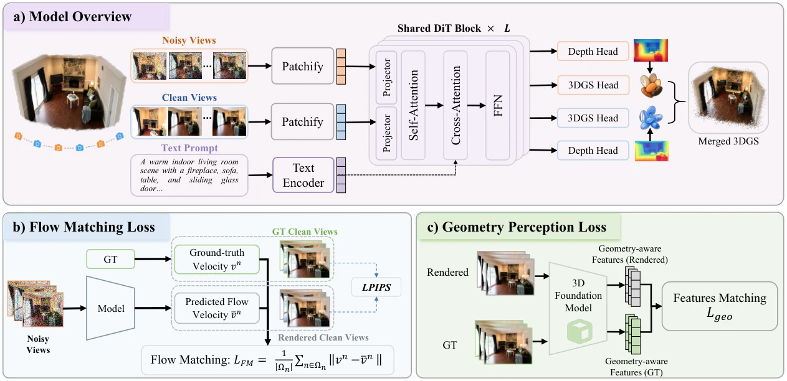
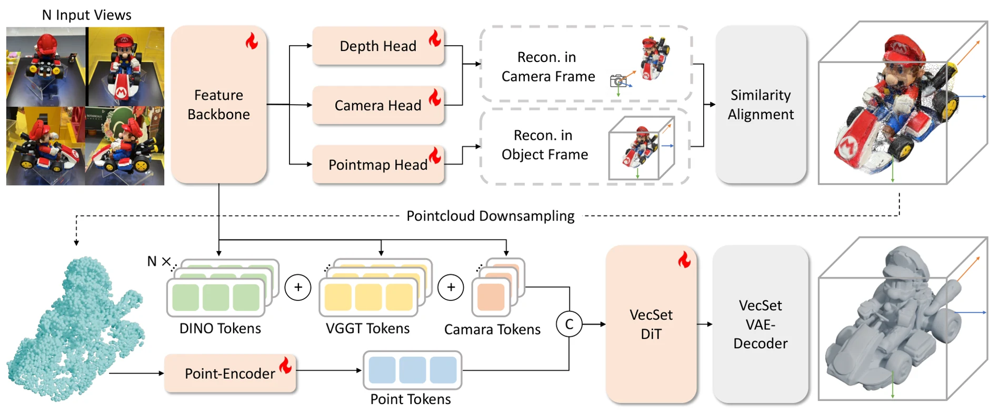
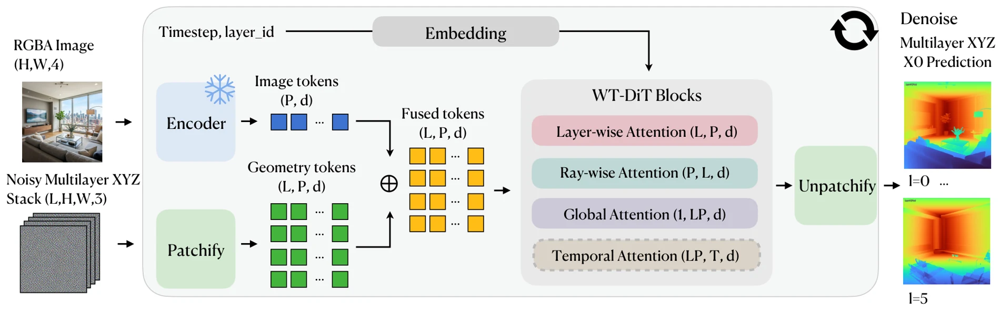
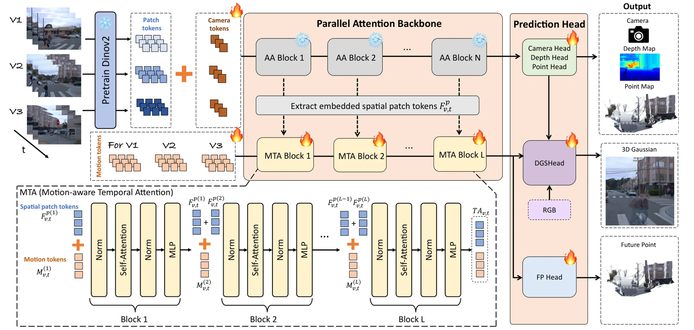
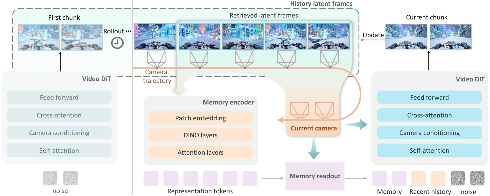

# 3D/4D 生成与重建：从几何潜空间到统一世界表征

**更新日期**：2026-09-24

**报告标签**：3D/4D, 世界模型, 视频生成, 自监督与预测表征

> 以 GAE、Gen3R、PixWorld、RecGen3D / UniRecGen 和 World Tracing 为核心，梳理重建证据与生成先验如何在潜空间、渲染目标、规范几何和遮挡表示中结合，再讨论如何走向动态、持久的 4D 世界。

生成与重建正在相互进入对方的核心问题：重建要补全未观测区域，生成要保持观测约束和可检验几何。真正值得比较的已不是“用了扩散还是用了 Transformer”，而是**哪些状态由观测确定，哪些内容由先验补出，二者在哪个表示和目标函数中相遇**。

本专题以馆藏论文为基础，补入 Gen3R、PixWorld、RecGen3D 三张独立卡片，核验版本分别为 v2、v1、v3。PixWorld 是这里讨论的三维场景工作；RecGen3D 是 UniRecGen 的新名称，同一 arXiv ID 只保留一条记录。下文先比较方法机制，再审查实验支持，最后讨论动态扩展；涉及研究判断的段落明确标注为综合分析。

[toc]

## 一、先明确任务：统一的究竟是什么

从一张室内照片恢复正面墙壁，与生成镜头转向后看见的房间，是不同的不适定问题。前者应尽可能服从输入证据；后者通常存在多个合理答案。把两者统一，不是把未知部分当成确定事实，而是在同一系统中协调**观测忠实度、未见区域完整度和跨视图一致性**。

| 任务 | 主要输入与输出 | 需要回答的问题 | 典型工作 |
| --- | --- | --- | --- |
| 场景级生成与重建 | 一张/多张场景图 → 新视图、深度、相机、点云或 3DGS | 生成的不同视角是否对应同一三维场景？ | [Gen3R](https://arxiv.org/abs/2601.04090)、[GAE](https://arxiv.org/abs/2609.24981)、[PixWorld](https://arxiv.org/abs/2607.05373) |
| 对象级生成式重建 | 未标定的对象多视图 → 完整 mesh | 怎样补出背面，同时保留这个实例的特殊形状？ | [RecGen3D / UniRecGen](https://arxiv.org/abs/2604.01479) |
| 像素对齐的遮挡补全 | 图像/短视频 → 同一射线上的多层三维点 | 可见表面与隐藏表面能否共用一个几何接口？ | [World Tracing](https://arxiv.org/abs/2606.13652) |
| 大基线新视角合成 | 图像/视频、几何估计、目标相机 → 新视角视频 | 旧视角可见证据怎样指导新遮挡区生成？ | [UniWorld-View](https://arxiv.org/abs/2608.04701) |
| 动态几何恢复 | 时序图像 → 运动点图、动态高斯与速度 | 怎样分开相机运动和对象运动，并维持时间对应？ | [DynamicVGGT](https://arxiv.org/abs/2603.08254) |

**静态场景的多视角视频不等于动态 4D。**相机移动可以产生一段视频，但世界内对象不一定发生运动。动态 4D 还需要在统一时间和空间框架下解释形变、速度、遮挡变化及持续身份。也应区别“能从 latent 解码几何”与“长期持有并更新同一份几何资产”：前者是表示能力，后者是系统状态管理能力。

## 二、方法版图：重建与生成在五个位置相遇

| 路线 | 生成变量 / 中间接口 | 观测约束进入哪里 | 最终产物 | 关键取舍 |
| --- | --- | --- | --- | --- |
| Gen3R：外观与几何联合潜变量 | Wan 外观 latent + 压缩 VGGT token | 几何重建损失、潜变量分布对齐、条件图像 | RGB、深度、相机、点云 | 复用强视频先验；保留两个 codec 及其误差 |
| GAE：几何原生共享潜空间 | 压缩 DA3 多层特征的单一 latent | 冻结几何读出、RGB 重建、token 与关系约束 | 同一 latent 解码 RGB 与几何 | 改善生成变量本身；codec 仍是信息瓶颈 |
| PixWorld：渲染监督下的像素生成 | 含噪 RGB 多视图；中间预测 3DGS | 干净观测、相机、可微渲染、深度与几何感知损失 | 可渲染 3DGS | 跳过独立 VAE/RAE；依赖相机与几何教师 |
| RecGen3D：重建后约束原生生成器 | 规范点云 + 多视图特征 → VecSet latent | 显式几何控制与稠密视觉上下文 | 对象三角 mesh | 完整资产接口；需处理规范坐标与重建噪声 |
| World Tracing：可见与隐藏几何共用张量 | 像素网格上的多层 XYZ | 图像特征、逐层几何监督与混合噪声日程 | 相机坐标多层点图 | 对齐输入又能补背面；层数与视锥仍限制覆盖 |

这五种方式不构成一条简单的替代链。Gen3R 和 GAE 主要讨论**什么潜变量适合生成**，PixWorld 讨论**监督是否直接经过可渲染三维输出**，RecGen3D 讨论**怎样把观测几何变成原生对象生成器的控制信号**，World Tracing 讨论**可见与遮挡表面怎样共享结构化表示**。它们解决的是相互关联但不同层次的瓶颈。

## 三、Gen3R 与 GAE：几何特征如何成为可生成状态

### Gen3R：先使两个潜空间兼容，再联合采样

Gen3R 的起点是 VGGT 已有的多任务几何知识。它从四层中间 token 学习 adapter，压缩到与 Wan VAE 外观 latent 一致的时空形状及通道维度，再恢复几何 token。训练既约束 token 重建，也约束经原有预测头读出的相机、深度和点图，减少压缩对几何知识的破坏。

图 1：Gen3R 原文 Figure 2。左侧训练几何 adapter 并与外观 latent 对齐，右侧联合生成两种 latent 后分别解码。[原图](https://arxiv.org/html/2601.04090v2/fig/pipeline/gen3r_method_v7.png)。

仅让 adapter 重建好还不够。几何 token 与预训练外观 latent 的统计分布差异会增加扩散学习难度，因此模型加入 KL 分布对齐；随后将两种 latent 沿宽度拼接，微调 Wan2.1 联合去噪。单图、首尾双图和全序列输入通过条件掩码切换，重建评测不额外提供相机。输出点云由深度和相机反投影获得，并非直接生成一个可碰撞 mesh。

**实验支持。**作者用相同训练数据微调“先生成 RGB 再接 VGGT”的两阶段对照，联合方案在外观、几何和相机控制上更好；去掉分布对齐又使性能下降。这比单独展示漂亮视频更能说明联合潜空间的价值。但主结果存在明确取舍：Co3Dv2 单图生成中，Gen3R 的完整度误差 1.3811 优于 VGGT 的 4.3830，点云 Accuracy 误差（预测点到真值表面的距离）0.8284 却高于 VGGT 的 0.3291。它补得更全，不代表点云表面精度同步提高；这项汇总指标也没有单独隔离可见区域。[方法与消融](https://arxiv.org/html/2601.04090v2#S4)。

### GAE：让外观和几何共享一个经组织的潜空间

GAE 把问题再向表示层推进：若核心状态仍以外观为中心，几何就可能只是附加分支。它将冻结 DA3 的四层特征归一化、融合和压缩，在保留 patch 网格的基础上形成 64/128 通道的紧凑 latent，再恢复完整特征层级，经冻结几何头读出结构，同时训练 RGB 读出。冻结几何头的作用，是防止解码器通过重新适配掩盖压缩造成的信息损失。

图 2：GAE 原文 Figure 2。同一个潜变量承载外观和几何，先训练 codec，再学习条件 flow。[原图](https://arxiv.org/html/2609.24981v1/ngd_pipeline_overview.png)。

GAE 还强调**重建可解码性与生成可学习性不是一件事**。原始几何特征可能高度冗余、各向异性，生成器很难平滑地建模。C-RADIO 的逐 token 对齐改善语义组织，但可能破坏空间关系；DINOv2 的成对相似性约束补回 token 间关系。原文消融中，仅 token alignment 的 LDS/SRSS 为 0.020/0.030，加入关系损失后为 0.444/0.553，说明不能把语义特征对齐直接等同于几何结构保真。

**最有解释力的证据是受控 latent 比较。**固定生成器和训练协议后，GAE-64 在 RE10K / DL3DV 的 FVD 为 225.7 / 287.0，对照中最佳非 GAE latent 为 258.6 / 373.2，下降 12.7% / 23.1%。这支持“潜空间选择有独立贡献”，而不是仅证明更大的生成器更强。相机与几何一致性仍包含学习式估计和对齐步骤；公开继续训练权重也不是主表提交配置，应按版本复现。[受控实验](https://arxiv.org/html/2609.24981#S4)。

### 两者的共同进展与不同选择

**综合分析：**Gen3R 保留成熟外观 latent，用对齐后的几何 latent 扩展它；GAE 从几何特征出发，让外观与几何共同存在于一个生成状态。前者有利于复用现有视频模型，后者更直接地研究共享表征。两者都说明“把几何模型特征直接接到 DiT”不够，分布、空间关系和解码约束需要共同设计。

与此相邻的 [GeoNeXt / Video Generative Models as Geometry Learner](https://arxiv.org/abs/2608.28549) 利用视频模型联合学习 RGB、深度与法线，体现生成先验可以服务几何感知；但单图深度/法线还原与持久场景建模仍是不同任务，不能因都用了视频 latent 而归为完全相同路线。

## 四、PixWorld：从“生成 latent”转向“监督可渲染资产”

PixWorld 认为 codec 不只是效率工具，也可能成为重建保真度上限。它不再先编码到独立 VAE/RAE，而是把已标定的多视图分成干净观测与含噪待生成视图：前者保留实例证据，后者接受条件生成；全干净时系统就执行重建。

图 3：PixWorld 原文 Figure 2。flow matching 经过预测 3DGS 的可微渲染回传，几何感知损失补充跨视图结构约束。[原图](https://arxiv.org/html/2607.05373v1/pix_method_v4.png)。

网络联合处理两类 token，预测每个视图的深度和高斯属性，再使用相机反投影生成高斯中心。来自多个视图的高斯构成场景，由可微渲染返回图像。干净视图接受重建损失，含噪视图接受 flow 速度损失；另外的新视图渲染约束、DA3 伪深度、LPIPS 和冻结 π³ 几何特征共同训练。**这里在 RGB 像素域加噪和监督，不是在 3DGS 参数空间直接做扩散。**

为什么已有可微渲染还要几何感知？因为深度沿射线漂移、透明漂浮高斯、视角相关外观，都可能在有限视图下伪装成正确图像。PixWorld 用 π³ 同时读取渲染视图与真值视图，约束其多视图几何特征；训练只从渲染分支反传，并在远离纯噪声时启用该项。

**实验支持与配置差异。**RE10K 四视图重建 PSNR/LPIPS 为 26.21/0.138，YoNoSplat 的 with-pose 对照为 25.86/0.143；几何感知消融中 AUC@5 从 0.562 提升至 0.642。双图生成的 RE10K PSNR 则略低于 LVSM，说明统一模型的优势仍取决于指标。训练从头使用约 1.04B 模型、约 67K 多视图场景及 10M 单图，不能把性能全部归于“移除 VAE”一个因素。[实验与消融](https://arxiv.org/html/2607.05373v1#S4)。

论文附录的速度是 8 个关键帧、100 NFE、RTX 4090 约 15 秒；官方仓库后来展示四步蒸馏约 0.6 秒，但其权重及推理代码在核验时仍列为待发布。两者是不同配置。Gen3R 对照的关键帧数量也不同，不能将时间相除直接当作同输出条件的加速比。[速度附录](https://arxiv.org/html/2607.05373v1#A4)；[官方发布状态](https://github.com/SensenGao/PixWorld)。

**综合分析：**GAE 与 PixWorld 的分歧是可实验检验的：一种尝试构建更适合几何的压缩空间，另一种避免独立 codec 并让学习目标直接经过三维渲染。若要比较这两种假设，需要匹配相机条件、训练数据、分辨率、采样预算和输出接口；现有不同论文的排行榜不足以给出普适优劣。

## 五、RecGen3D 与 World Tracing：怎样忠实地生成不可见几何

### RecGen3D / UniRecGen：先建立规范几何锚点，再生成完整 mesh

对象重建与场景新视角生成的交付物不同。前者往往需要闭合、完整且保留实例结构的 mesh。RecGen3D 将未知相机的多张对象图交给 VGGT，再适配 Hunyuan3D-Omni；难点首先是把参考相机坐标转换成对象生成器理解的规范坐标。

图 4：RecGen3D v3 Figure 2。点图头提供规范坐标，深度与相机头保留原参考系，再通过相似对齐构造条件点云。[原图](https://arxiv.org/html/2604.01479v3/pipeline.png)。

它仅把 pointmap 头的监督改成规范坐标，保留深度和相机头的参考坐标约束。由深度反投影得到的点通过加权 Procrustes 对齐到规范点图，从而兼顾定位与表面精度。生成器一方面读取显式规范点云，另一方面读取完整 DINO token 加上 VGGT 几何特征和相机嵌入。这样既不会只剩稀疏结构，也不会让视觉条件失去多视图位置关系。

两阶段训练分别适配重建器和生成器，主实验在 GSO、Toys4K 各 100 个对象上用四张输入图评价。GSO 的 CD/F-score 为 0.0192/0.7384，ReconViaGen 为 0.0290/0.6069；但所有 mesh 均经 ICP 对齐，这证明的是对象形状而非真实世界绝对位姿。相同初始化的训练方式对照支持分阶段学习，真实遮挡、反光、薄壁和孔洞仍有失败。[原文实验](https://arxiv.org/html/2604.01479v3#S4)。

**综合分析：**这种模块化统一的价值在于保持接口清晰：重建输出可检查的几何证据，生成器补全表面。其弱点也清晰：错误锚点可能把生成器带向错误实例；规范 mesh 接回真实场景，还需恢复尺度、实例位姿与背景关系。它不能直接替代场景级 GAE 或 PixWorld。

### World Tracing：把“重建正面、生成背面”放进同一个表示

World Tracing 为每个输入像素预测沿相机射线由近到远的多个 XYZ 交点。第一层承载可见表面，后续层承载遮挡几何；所以重建和补全不是两份需要事后对齐的输出，而是同一像素网格的不同层。它保留了像素与几何的对应，适合将图像编辑或新视角条件接到显式几何。

图 5：World Tracing 原文 Figure 2。层内、射线方向和全局注意力共同处理多层几何，动态版额外加入时间注意力。[原图](https://arxiv.org/html/2606.13652v1/model_v4.png)。

这里同样称为 pixel-space flow，但变量是 **XYZ 点图**，不同于 PixWorld 的 RGB。训练通过 depth peeling 产生多层交点，对不存在的深层以前一有效交点填充；混合噪声日程协调偏确定性的可见面和更具多模态性的隐藏面。它提供对象、场景、动态三个变体，默认六层，输出本身不包含完整的隐藏面纹理。

**实验边界。**应同时读可见 L0 误差和全部层的覆盖指标。部分生成式比较采用八个 seed 中的最佳几何结果，不能作为单次采样可靠性；动态版的逐帧误差也不能替代长时对应稳定性。动态 ActionBench 上 WT-D 的 CD-L2 为 0.0291，落后 ActionMesh 的 0.0243，说明输出表示与真值形式会影响结论。[原文实验与附录](https://arxiv.org/html/2606.13652#S4)。

RecGen3D 把观测锚定到对象规范空间，World Tracing 把补全留在输入相机的像素网格。前者便于独立对象资产交付，后者便于保持输入对齐和可见性分层；实际系统可能需要两者之间的转换，而不必预设唯一正确的三维表示。

## 六、从 3D 走向 4D：需要补上的三种一致性

### 视角一致：新视图必须复用同一个场景

UniWorld-View 先估计几何，再将源点云重投影到目标相机，借助可见性掩码与法线过滤保留有效证据；扩散模型同时接收对齐的几何条件和完整源视频参考。它还通过生成同步多视图视频辅助后续 4DGS 优化。这是一种**几何引导生成、生成数据再帮助重建**的闭环管线，区别于 GAE/Gen3R 的联合潜变量和 PixWorld 的直接渲染目标。

大基线条件尤其重要：镜头外推时新露出的内容多，合理补全与精确复现不再重合。UniWorld-View 的 WorldScore 和 NVS 结果支持视角控制与系统质量，但不能独立证明所有遮挡区域都被恢复成真实形状。[方法及评测](https://arxiv.org/html/2608.04701#S3)。

### 时间一致：同一对象怎样运动，而不只是每帧各有一个对象

DynamicVGGT 将静态 pointmap 扩展为动态点图，引入时序注意力、未来点头和动态高斯速度，以统一参考系表达几何与运动。它代表“直接在几何状态中学习时间变化”，与对静态场景进行相机漫游不同。驾驶场景的验证不能自动转移为近距离手物接触能力。

图 6：DynamicVGGT 原文总体框架。时间建模进入几何预测和运动输出，而不仅是渲染视频的帧序。[原图](https://arxiv.org/html/2603.08254v1/totalpipelinev4.png)。

[Stream4D](https://arxiv.org/abs/2608.19556) 则把 4D 重建用于评价生成视频：静态重建奖励可能鼓励对象不动，动态重建配合运动先验用于减少这条取巧路径。它优化的是生成器的行为，不等于生成器内部已经持有可编辑 4D 资产。[Streaming4D](https://arxiv.org/abs/2609.00610) 关注分块生成与增量重建的调度，是另一个系统问题；这两篇名称相近，但机制与贡献不能混写。流式实现详见[流式与自回归交互视频专题](../../index.html#report=report-c7ced2c92d)。

### 重访一致：离开视野以后，状态是否仍然存在

[WorldCrafter](https://arxiv.org/abs/2609.24984) 通过历史潜变量和相机位姿维护隐式三维记忆，并按即将生成的视野读取固定预算的记忆 token。它解决的主要问题是长程重访和相机控制；“记住这面墙”与“导出这面墙的可靠碰撞面”仍需不同证据。

图 7：WorldCrafter 原文 Figure 2。目标视野查询历史记忆，把相关内容送回视频生成器。[原图](https://arxiv.org/html/2609.24984v1/pipeline.png)。

**综合分析：**现有进展分别加强了多视图结构、动态几何和长期记忆，但三者尚不能靠论文名称里的“World”自动合并。理想的动态生成系统应在新视角、时间推进、遮挡重现时更新同一状态，并区分静态环境、可动物体和暂时不确定的补全内容。JEPA 等预测状态的可读出性与可控制性，另见[隐式状态表征专题](../../index.html#report=topic-jepa-latent-state)。

## 七、全局重建与可交互资产：生成模型仍需要的基础设施

[Glob3R](https://arxiv.org/abs/2607.09225)、[GRF-Recon](https://arxiv.org/abs/2609.20012) 与 [FFVO](https://arxiv.org/abs/2609.13733) 分别从全局几何、长序列优化和相机解码补足坐标一致性。它们的作用不是给生成路线凑背景，而是处理一个实际接口：局部窗口内一致的潜变量或点云，如何进入大尺度、可重复定位的场景。

相机和尺度错误会污染后续所有层：新视图条件可能错误，生成补全与已观测表面可能错位，多对象资产也可能失去相对位置。因此评价 GAE、Gen3R 或 PixWorld 时，要记录相机是输入、预测还是经过真值对齐，不应把它们视为相同权限下的三维恢复。

生成完整表面以后，还需识别对象结构。[FAMOS](https://arxiv.org/abs/2609.20817) 从多状态点云提取部件、关节轴和已观测运动跨度；[AgentSTAR](https://arxiv.org/abs/2609.24487) 通过共享形状程序与逐帧状态拟合恢复结构。进一步的物理参数需要 [ForceTwin](https://arxiv.org/abs/2609.21751) 一类含交互和力观测的证据。完整 mesh、可动画关节和预测真实受力响应是三个不同交付层级，相关链路在[手物交互重建与生成专题](../../index.html#report=topic-contact-hoi)展开。

本专题将它们作为生成几何走向使用的接口，不以手部姿态和物理辨识取代生成—重建统一的主线。精品《3D/4D Geometric World Action Model》保留其原有动作模型论证。

## 八、怎样读实验：建立五条分开的证据链

| 能力 | 应看什么 | 主要混淆来源 |
| --- | --- | --- |
| 已观测证据保真 | 输入区域深度、表面精度、重投影误差 | 只看生成图好不好看，或用完整度掩盖可见面退化 |
| 未观测区域补全 | 完整度、隐藏面误差、多个样本分布 | 单个真值未必覆盖所有合理补全；best-of-N 与一次推理不同 |
| 多视图可渲染性 | held-out NVS、相机控制、独立几何检验 | PSNR、FVD 与几何误差不能互相替代 |
| 动态与持续身份 | 轨迹、场景流、遮挡重现、回环重访 | 静态高分可能来自冻结运动；逐帧低误差可能仍会换身份 |
| 可部署资产 | 输出格式、坐标/尺度、完整耗时、显存与公开实现 | 点云被当成 mesh，单步耗时被当成整条管线，演示被当成已开源 |

具体比较要保留以下四项协议。

1. **输入权限。**PixWorld 的 posed views、RecGen3D 的 unposed object views、Gen3R 不同模式的相机条件，不能省略在同一个排名里。背景去除、深度伪标签和真值相机都可能提供重要信息。
2. **几何对齐。**Umeyama/Sim(3)、ICP、尺度平移不变评价分别消除不同误差。对齐后形状准确不等于绝对位姿和尺度准确，更不等于可直接执行机器人动作。
3. **独立测量。**几何教师也是有偏估计器。PixWorld 用 π³ 训练特征与估计相机，需补充其他后端；GAE 通过多个模型的外部检查增强证据，但也不能替代全量真值。[RoboPhys-3D](https://arxiv.org/abs/2608.28718) 对重建后端的敏感性进一步说明，评价链本身必须接受检验。
4. **版本与计算预算。**GAE 继续训练权重、PixWorld 蒸馏版本、RecGen3D 更名版本都应绑定具体配置。报告 NFE、关键帧数量、分辨率和总耗时，比笼统写“实时”“一次前向”更有意义。

特别是 Gen3R 原文与 PixWorld 对照表中的 Gen3R 分数不可跨表直接拼接。前者的相机轨迹采样与后者的大跨度、双向/外推混合协议不同。新论文重跑旧方法得到不同数值，首先应该审查协议，而不是把差异直接当作方法退步。

## 九、综合判断：已经推进了什么，还缺什么

**已有证据支持的进展。**几何不再只作为生成视频后的检测结果。Gen3R 和 GAE 将它前移到生成状态；PixWorld 让目标函数经过三维渲染；RecGen3D 将其变成生成器控制条件；World Tracing 在表示中显式区分可见层和遮挡层。这些设计分别收紧了“看起来合理”与“结构上可解释”之间的距离。

**还没有被共同解决的问题。**一是生成先验可能覆盖实例证据，尤其在薄结构、遮挡和反射下；二是短片段或固定视角集合的一致性，尚不足以保证长程回环和持续对象身份；三是几何教师给出的误差既影响训练又影响评测。更强的画面指标不能代替这些检验。

**可检验的研究切口（综合分析）。**可以围绕“观测确定的状态 + 可修正的生成假设”组织下一阶段系统：记录可见性及来源，把隐藏区域作为可更新的分布；新视图到来时检验补全是否修正，而不是永远维护最早的幻想。一个有区分力的协议是先遮住对象背面，生成完整形状，再逐步补入真实背面与回环观察，分别测量已观测区域保持、隐藏区域修正、身份稳定和更新成本。它比继续只比较单次渲染质量更能检验统一表征是否真正支持世界建模。

阅读上建议先看 Gen3R、GAE、PixWorld 的表示与目标函数差异，再看 RecGen3D 和 World Tracing 的几何补全接口；最后进入 UniWorld-View、DynamicVGGT 与 WorldCrafter 的视角、时间和记忆问题。这样能形成连续的问题链，而不是把所有涉及“三维”和“生成”的工作平铺在一起。

## 参考文献与馆藏入口

以下按正文首次出现顺序列出。详细实现、资源状态和单篇实验见馆藏卡片；跨论文判断保留在本专题。

1. [Gen3R: 3D Scene Generation Meets Feed-Forward Reconstruction](https://arxiv.org/abs/2601.04090) · [馆藏卡片](../../index.html#paper=arxiv-2601-04090)
2. [GAE: Learning a Geometry-Native Latent Space for 3D-Consistent World Generation](https://arxiv.org/abs/2609.24981) · [馆藏卡片](../../index.html#paper=arxiv-2609-24981)
3. [PixWorld: Unifying 3D Scene Generation and Reconstruction in Pixel Space](https://arxiv.org/abs/2607.05373) · [馆藏卡片](../../index.html#paper=arxiv-2607-05373)
4. [RecGen3D: Reconstruction-Guided 3D Generation in a Shared Canonical Space](https://arxiv.org/abs/2604.01479) · [馆藏卡片](../../index.html#paper=arxiv-2604-01479)
5. [World Tracing: Generative Pixel-Aligned Geometry Beyond the Visible](https://arxiv.org/abs/2606.13652) · [馆藏卡片](../../index.html#paper=arxiv-2606-13652)
6. [UniWorld-View: Large-Baseline View Synthesis via Video Diffusion Models](https://arxiv.org/abs/2608.04701) · [馆藏卡片](../../index.html#paper=arxiv-2608-04701)
7. [DynamicVGGT: Learning Dynamic Point Maps for 4D Scene Reconstruction in Autonomous Driving](https://arxiv.org/abs/2603.08254) · [馆藏卡片](../../index.html#paper=arxiv-2603-08254)
8. [Video Generative Models as Geometry Learner](https://arxiv.org/abs/2608.28549) · [馆藏卡片](../../index.html#paper=arxiv-2608-28549)
9. [Stream4D: 4D-Consistency for Streaming Autoregressive Diffusion Video Models](https://arxiv.org/abs/2608.19556) · [馆藏卡片](../../index.html#paper=arxiv-2608-19556)
10. [Streaming4D: Accelerate 4D World Models via Block-wise Video Generation and Incremental Reconstruction](https://arxiv.org/abs/2609.00610) · [馆藏卡片](../../index.html#paper=arxiv-2609-00610)
11. [WorldCrafter: Consistent Video World Model with Implicit 3D-aware Memory](https://arxiv.org/abs/2609.24984) · [馆藏卡片](../../index.html#paper=arxiv-2609-24984)
12. [Glob3R: Global Structure-from-Motion with 3D Foundation Models](https://arxiv.org/abs/2607.09225) · [馆藏卡片](../../index.html#paper=arxiv-2607-09225)
13. [GRF-Recon: Global Ray-Field Optimization for Long-Sequence Feed-forward Reconstruction](https://arxiv.org/abs/2609.20012) · [馆藏卡片](../../index.html#paper=arxiv-2609-20012)
14. [FFVO: A Feedforward Pose Decoder for Long-Horizon Visual Odometry](https://arxiv.org/abs/2609.13733) · [馆藏卡片](../../index.html#paper=arxiv-2609-13733)
15. [FAMOS: Feed-Forward 3D Articulation Modeling from Sparse Observations](https://arxiv.org/abs/2609.20817) · [馆藏卡片](../../index.html#paper=arxiv-2609-20817)
16. [AgentSTAR: Agentic Shape Tracking and Reconstruction from Monocular Videos](https://arxiv.org/abs/2609.24487) · [馆藏卡片](../../index.html#paper=arxiv-2609-24487)
17. [ForceTwin: Physics-informed Digital Twins for Robotic Manipulation from Instrumented Human Interaction](https://arxiv.org/abs/2609.21751) · [馆藏卡片](../../index.html#paper=arxiv-2609-21751)
18. [RoboPhys-3D: A Comprehensive Embodied World Model Evaluation via 3D Reconstruction](https://arxiv.org/abs/2608.28718) · [馆藏卡片](../../index.html#paper=arxiv-2608-28718)
