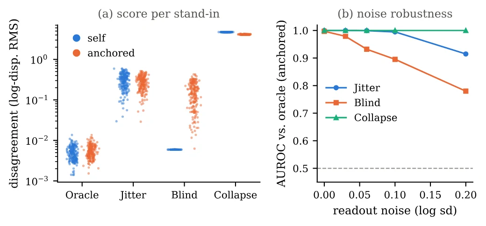

# 因果、反事实与可靠性：世界模型到底值得信任什么

**更新日期**：2026-09-24

**报告标签**：因果与反事实, 数据与评测, 世界模型

> 从时间因果、动作响应、机制结构到反事实识别建立证据层级，再连接失效诊断、物理锚定、选择性使用与更新价值。

本报告以现有馆藏为检索范围。正文区分方法事实、实验支持与综合判断；未完成全文核验的条目只作延伸线索，不据此建立定量排名。不同任务、输入权限、数据量和执行预算的成绩不直接横排。

物理规律、材料与接触约束，以及独立物理评价的系统比较，见[物理合理性专题](../../index.html#report=topic-physical-plausibility)。

[toc]

## 先拆开标题里同一个“causal”

“因果世界模型”在现有文献里可能指只读取过去的注意力、按动作预测未来、预设结构化依赖、干预后果预测，或者在特定假设下恢复机制。不同含义都可能有用，但不能把时间掩码或对象注意力当成结构因果识别的证据。

本专题把“模型是否因果”改写成可检查的问题：**它在什么输入、何种干预、哪些误差与识别假设下，可以可靠支持哪一次决策？** 这也把因果研究与实际世界模型评测连接起来，而不是只依据标题收集论文。

## 证据层级与对应反例

| 层级 | 需要证明什么 | 代表工作或对照 | 常见误读 |
| --- | --- | --- | --- |
| 时间因果 | 当前输出不使用未来输入 | [Causal World Modeling for Robot Control](https://arxiv.org/abs/2601.21998) | causal mask被当作学到了真实因果机制 |
| 动作条件响应 | 改变动作，预测按预期改变 | [WorldEcho/WorldSync](https://arxiv.org/abs/2608.24885)、[WorldSimProbe](https://arxiv.org/abs/2608.09298) | 输入里有动作就被称为遵循动作 |
| 结构归纳偏置 | 对象或路径约束改善任务 | [Causal-JEPA](https://arxiv.org/abs/2602.11389)、[CST-WM](https://arxiv.org/abs/2609.06302)、[STICA](https://arxiv.org/abs/2511.14262) | 人为设定/依赖注意力被称为发现因果图 |
| 干预与反事实能力 | 在明确干预和参考条件下预测替代后果 | [What-If World](https://arxiv.org/abs/2605.27589)、[VOID](https://arxiv.org/abs/2604.02296)、[部分可观测反事实WM](https://arxiv.org/abs/2609.05834) | 提示词编辑成功被当成唯一真实反事实 |
| 机制识别与理论保证 | 说明可恢复什么、依赖哪些假设 | [CBM](https://arxiv.org/abs/2401.12497)、[Robust agents learn causal world models](https://arxiv.org/abs/2402.10877) | 受控低维定理直接外推到视频基础模型 |

这些层级不是统一排行榜。一个任务可以只需要可靠的动作响应，不需要完整SCM；另一个任务若要求个体反事实，就必须讨论隐变量、可识别性与共享外生噪声，不能只展示两个不同提示生成的视频。

## 对象结构能提供什么，不能提供什么

Causal-JEPA通过对象级latent遮挡学习预测表征。VideoSAUR编码下，增加遮挡使反事实题准确率47.68→68.81；SAVi编码下mask=4反而为34.06，低于不遮挡的41.10。效果依赖对象slot质量与保留的信息，不支持“遮得越多越因果”。

CST-WM利用机器人运动不直接改变被跟踪目标自身状态的任务假设，阻断动作捷径；此假设在视觉跟踪中合理，但一旦机器人推拉物体，动作恰恰应该改变对象状态。结构先验能否迁移，首先要检查环境机制，而不是复用同一attention mask。

CBM从动力学依赖和奖励相关祖先构造最小状态；Robust agents的理论把一族局部干预下的决策鲁棒性与因果模型可恢复性联系起来。这些工作提供更强的形式化联系，但受限于变量、环境族和决策查询假设，不证明任意神经策略内部显式储存了唯一因果图。[Language Agents Meet Causality](https://arxiv.org/abs/2410.19923)进一步把学到的状态变化交给语言规划器，仍应把状态学习证据与LLM语言推理表现分开。

## 可靠性首先暴露在偏离专家的动作上

WorldSimProbe在多种任务与动作分布中诊断动作实现、虚假交互和原语动力学，发现偏离训练轨迹后保真度下降。只评估专家动作，可能让模型凭场景和任务习惯猜出未来；错误动作、反向动作和意外接触更能区分动力学与行为先验。

[Identifying Habit, Physics, and Nuisance](https://arxiv.org/abs/2609.09210)用动作替换、操作者变化、相机/外观扰动审计路径。结果为指定排除限制提供代理证据，而非无条件识别。[动作编码不变性研究](https://arxiv.org/abs/2609.23252)还说明：即便给定状态后两种动作写法数学等价，模型行为也未必相同。对动作敏感和对无关编码不敏感，需要同时满足。

[One Model, Two Physical Stories](https://arxiv.org/abs/2609.14833)发现文本物理回答与视频执行可以不一致；[EgoGenEval](https://arxiv.org/abs/2609.11172)将相机运动接地和场景状态保持分开。这些工作共同反对用一个“物理分数”概括所有机制。几何、动作执行、接触、材料和语言知识需要各自参照。

## 自一致不等于正确：要用外部证据锚定

图1：IMPLY原文图1，200个对象的受控验证。左图比较不同替代模型的自一致与锚定不一致分数，右图检验读出噪声对锚定AUROC的影响；忽略对象差异的Blind模型可逃过自一致检查，却被外部锚点揭示。[来源](https://arxiv.org/html/2609.12441#S4.F1)。

[IMPLY](https://arxiv.org/abs/2609.12441)使用两个真实校准推动，再检查多个候选速度能否由共同物理参数解释。在受控stand-in中，自一致AUROC0.70，加入锚定后1.00；真实模型的正确对象校准相关0.91，错误对象仅0.05。意义在于一组彼此协调的错误预测仍可能离真实物理很远，独立观测提供了识别这种情况的参照。

其范围是简单推动和可参数化动力学，不能把AUROC1.00推广为通用物理验证器。[VeriPhy](https://arxiv.org/abs/2609.03153)的工具测量与证据组合路线可作延伸，但馆藏尚未完成其全部误报、召回与标注一致性核验，不用它承担“已普遍可靠”的结论。

## 从预测误差到使用决策：监控、拒绝与更新

[FARM](https://arxiv.org/abs/2609.11445)在冻结世界模型内部读出失败信号，350条轨迹五折OOF得到AUROC85.68；Strict-Unseen下65.67，却低于STAC-Single的68.28。源任务检测优势不能自动转化成未见任务监控能力；0.2256 ms还是已有世界模型状态之后的增量开销。

[Dual-Frontier](https://arxiv.org/abs/2609.26293)进一步把可信范围绑定到规划或想象学习的具体提议，根据优势、误差和校准证据决定是否采用。它的受控有限世界与工具调用实验是明确适用范围，不能直接宣称获得通用连续机器人安全保证。

图2：更新/不更新分支共享初态与随机数，使不同触发器可对同一组效用标签评估。[来源](https://arxiv.org/html/2609.10954#S3)。

[Measuring the Value of World-Model Updates](https://arxiv.org/abs/2609.10954)把同一状态分叉为UPDATE与HOLD，测量ΔR。全尝试720个分叉与保留693个样本得到的平均收益不同；失败更新若被移除，会制造更乐观的结果。标签衡量固定更新机制的整体价值，包括更新步数与数据窗口，不只是更新时间选择是否正确。

## 一张可复用的证据审计表

| 主张 | 最低应补的证据 | 特别需要报告 |
| --- | --- | --- |
| 动作可控 | 固定观察、改变动作，并与真实执行对照 | off-expert、反向及无效动作 |
| 反事实正确 | 明确干预对象、保持量和参考后果 | 部分可观测下是否存在多种合理解释 |
| 机制可迁移 | 固定已学机制，改变环境/策略或参数 | 识别假设、额外适配数据 |
| 监控可靠 | 轨迹级独立划分、校准、未见任务 | 误报/漏报及阈值敏感性 |
| 更新有价值 | 同初态和随机数的更新/保持比较 | 全尝试结果、失败更新、环境交互成本 |

[IMPACT-VLA](https://arxiv.org/abs/2609.15005)用闭环模态替换和轨迹归因分析行为贡献，提供比单看attention更直接的干预证据；但其干预kernel、阶段划分及恢复行为也决定归因含义。[感知退化下的阶段可靠性](https://arxiv.org/abs/2609.07126)则提醒我们，平均任务成功率会遮蔽早期定位、接触和后期恢复之间的不同失败。

## 综合判断与阅读路径

**综合判断：**因果结构、反事实预测与可靠性门控是互补问题。值得信任的世界模型不一定要声称恢复完整SCM，但必须知道自己支持的输入与决策范围。当前更扎实的进展来自明确的干预对照、真实证据锚定和失败样本统计，而非把任何时间因果网络重新命名为因果模型。

先用WorldSimProbe和What-If World理解诊断，再读Causal-JEPA/CST-WM/CBM的结构及假设差异；随后读IMPLY、FARM、Dual-Frontier和更新价值协议，形成从误差发现到选择性使用的完整链条。

## 参考文献与馆藏入口

以下按正文首次出现顺序列出；原始论文、详细卡片与本报告中的跨论文判断分别保留。

1. [Causal World Modeling for Robot Control](https://arxiv.org/abs/2601.21998) · [馆藏卡片](../../index.html#paper=arxiv-2601-21998)
2. [WorldEcho & WorldSync: Do Robotic World Models Really Follow Actions?](https://arxiv.org/abs/2608.24885) · [馆藏卡片](../../index.html#paper=arxiv-2608-24885)
3. [WorldSimProbe: Diagnosing Simulator Faithfulness in Action-Conditioned World Models for Embodied Manipulation](https://arxiv.org/abs/2608.09298) · [馆藏卡片](../../index.html#paper=arxiv-2608-09298)
4. [Causal-JEPA: Learning World Models through Object-Level Latent Masking](https://arxiv.org/abs/2602.11389) · [馆藏卡片](../../index.html#paper=arxiv-2602-11389)
5. [CST-WM: A Causally Structured World Model for Embodied Visual Tracking](https://arxiv.org/abs/2609.06302) · [馆藏卡片](../../index.html#paper=arxiv-2609-06302)
6. [Object-Centric World Models for Causality-Aware Reinforcement Learning](https://arxiv.org/abs/2511.14262) · [馆藏卡片](../../index.html#paper=arxiv-2511-14262)
7. [What-If World: A Causal Benchmark for General World Models in Embodied Scenarios](https://arxiv.org/abs/2605.27589) · [馆藏卡片](../../index.html#paper=arxiv-2605-27589)
8. [VOID: Video Object and Interaction Deletion](https://arxiv.org/abs/2604.02296) · [馆藏卡片](../../index.html#paper=arxiv-2604-02296)
9. [Learning Counterfactual World Models for Embodied Reasoning under Partial Observability](https://arxiv.org/abs/2609.05834) · [馆藏卡片](../../index.html#paper=arxiv-2609-05834)
10. [Building Minimal and Reusable Causal State Abstractions for Reinforcement Learning](https://arxiv.org/abs/2401.12497) · [馆藏卡片](../../index.html#paper=arxiv-2401-12497)
11. [Robust agents learn causal world models](https://arxiv.org/abs/2402.10877) · [馆藏卡片](../../index.html#paper=arxiv-2402-10877)
12. [Language Agents Meet Causality -- Bridging LLMs and Causal World Models](https://arxiv.org/abs/2410.19923) · [馆藏卡片](../../index.html#paper=arxiv-2410-19923)
13. [Identifying Habit, Physics, and Nuisance in Robot World Models](https://arxiv.org/abs/2609.09210) · [馆藏卡片](../../index.html#paper=arxiv-2609-09210)
14. [Robot World Models Are Not Invariant to How the Actions Are Written](https://arxiv.org/abs/2609.23252) · [馆藏卡片](../../index.html#paper=arxiv-2609-23252)
15. [One Model, Two Physical Stories: Auditing Misalignment in Multi-Modal World Modeling](https://arxiv.org/abs/2609.14833) · [馆藏卡片](../../index.html#paper=arxiv-2609-14833)
16. [Beyond Visual Quality: Evaluating Physical Consistency under Ego-Motion with EgoGenEval](https://arxiv.org/abs/2609.11172) · [馆藏卡片](../../index.html#paper=arxiv-2609-11172)
17. [IMPLY: Physically Anchored Consistency for World-Model Rollouts](https://arxiv.org/abs/2609.12441) · [馆藏卡片](../../index.html#paper=arxiv-2609-12441)
18. [VeriPhy: Agentic Physical Reasoning for World Model Evaluation and Refinement](https://arxiv.org/abs/2609.03153) · [馆藏卡片](../../index.html#paper=arxiv-2609-03153)
19. [FARM: Reading Failure Signals from the Internal Predictive States of a Frozen Robotic World Model](https://arxiv.org/abs/2609.11445) · [馆藏卡片](../../index.html#paper=arxiv-2609-11445)
20. [Dual-Frontier: When Can an Agent Trust Its World Model?](https://arxiv.org/abs/2609.26293) · [馆藏卡片](../../index.html#paper=arxiv-2609-26293)
21. [Measuring the Value of World-Model Updates: A Counterfactual Utility Protocol for Continual Adaptation](https://arxiv.org/abs/2609.10954) · [馆藏卡片](../../index.html#paper=arxiv-2609-10954)
22. [IMPACT-VLA: Interaction-aware Multimodal Propagation Attribution via Counterfactual Trajectories for Vision-Language-Action Policies](https://arxiv.org/abs/2609.15005) · [馆藏卡片](../../index.html#paper=arxiv-2609-15005)
23. [Beyond Task Success: Stage-Wise Reliability of World Model Planning under Sensing Degradation](https://arxiv.org/abs/2609.07126) · [馆藏卡片](../../index.html#paper=arxiv-2609-07126)
