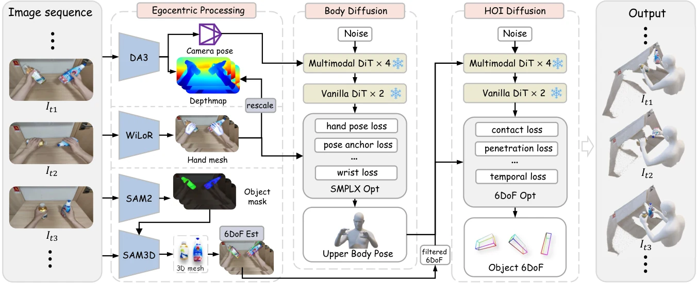
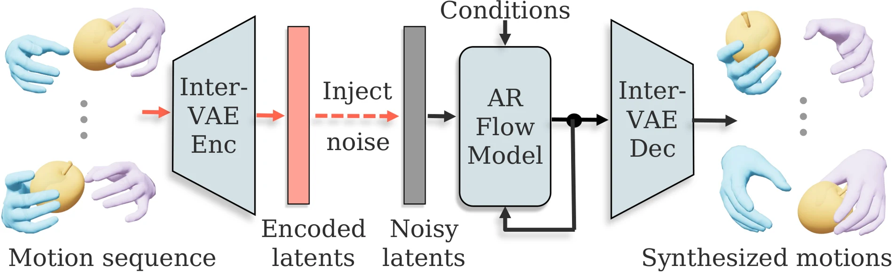
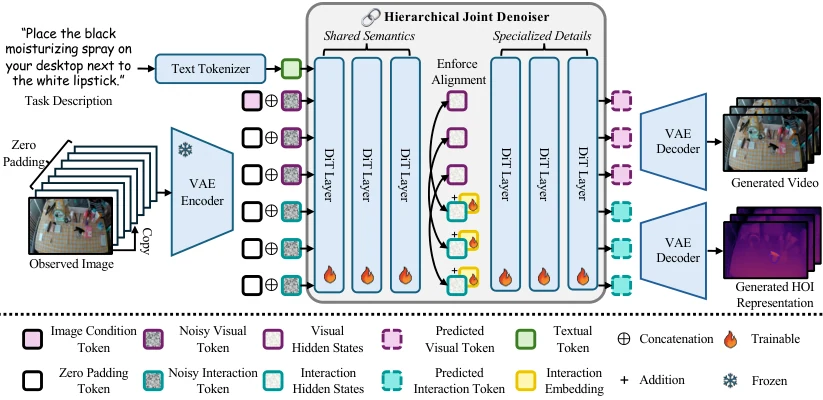
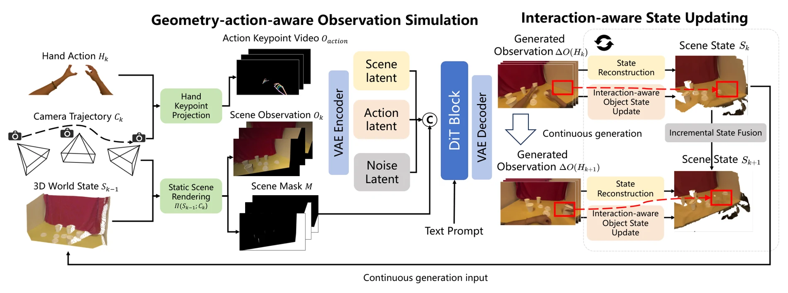

# 手物交互重建与生成：从单目视频、接触运动到可交互物理资产

**更新日期**：2026-09-24
**报告标签**：HOI, 3D/4D, 物理建模与仿真

> 手物交互不是分别重建一只手和一个物体，再把二者放在一起。关键是恢复或生成同一坐标系中的手部动作、对象结构与运动，以及连接二者的接触关系；若要成为可操作的世界，还需要解释施力后的对象响应。

本报告围绕现有馆藏的25篇工作展开，包含手部恢复、联合重建、对象资产恢复、动作生成、视频生成和物理辨识。AgentSTAR与ForceTwin是重点：前者提供交互场景中的结构化对象及其时序状态，后者提供由仪器化人类交互辨识的对象动力学。全身人—物交互和触觉控制作为相邻证据明确标注。正文核对原始论文的方法、关键实验和图注；跨论文的架构联系与研究建议标为“综合分析”，不视为已有端到端系统的实测结果。

物理规律、材料与接触约束，以及独立物理评价的系统比较，见[物理合理性专题](../../index.html#report=topic-physical-plausibility)。

[toc]

## 1. 研究问题：从“看见交互”走到“生成交互后果”

以开门为例，视频中看到手和门一起移动，仍有至少五个问题：相机是否也在移动；手是否真正抓住把手；门绕哪个轴旋转；手离开后门是否会自行回弹；换一个力度或负载后门会怎样运动。相应地，专题需要同时区分**几何、运动学、接触、动力学、视觉呈现**。

便于比较的状态定义是：相机状态C、手部状态H、对象形状G、对象位姿与关节状态Q、接触关系K，以及物理参数和机构状态Θ。重建从观测估计这些变量；动作生成预测H和Q的未来序列；视频生成产生观测；物理辨识解释动作或力如何改变Q。这里是本报告的分析框架，并非所有论文都显式输出这组状态。

| 方法族 | 核心输入与输出 | 代表工作 | 应先检查的边界 |
| --- | --- | --- | --- |
| 手与相机恢复 | 视频→手部关节/网格，部分含世界相机轨迹 | [DreamHand](https://arxiv.org/abs/2608.20308)、[ViDiHand](https://arxiv.org/abs/2606.30308)、[MINT](https://arxiv.org/abs/2609.04958) | 手恢复完整，不代表对象及接触已恢复 |
| 手—物联合重建 | 图像/视频→手、对象姿态及相对关系 | [HOPformer / EPIC-Contact](https://arxiv.org/abs/2606.30598)、[EgoGrasp](https://arxiv.org/abs/2601.01050) | 对象模板来源、世界尺度、遮挡与轨迹连续性 |
| 对象结构与物理资产 | 视频或测力交互→对象结构、关节、状态或动力学 | [AgentSTAR](https://arxiv.org/abs/2609.24487)、[ForceTwin](https://arxiv.org/abs/2609.21751) | 二者观测权限不同；几何与动力学尚非一个联合算法 |
| 三维交互动作生成 | 语言、几何/图像、初态→手与对象运动 | [HO-Flow](https://arxiv.org/abs/2604.10836)、[OpenHOI](https://arxiv.org/abs/2505.18947)、[MEgoHand](https://arxiv.org/abs/2505.16602) | 是否生成对象响应；是否仅有运动学约束 |
| 交互视频生成 | 首帧/场景、任务或手动作→未来视频 | [EgoHOI](https://arxiv.org/abs/2603.13615)、[Hand2World](https://arxiv.org/abs/2602.09600)、[HandsOnWorld](https://arxiv.org/abs/2607.02075)、[SCAR](https://arxiv.org/abs/2512.01677) | 手动作是给定条件还是生成目标；未来对象状态是否泄漏 |
| 场景持续更新 | 三维场景与动作→观察，部分再写回状态 | [Dexterous World Models](https://arxiv.org/abs/2512.17907)、[EgoSim](https://arxiv.org/abs/2604.01001) | 静态场景条件、可更新几何和真实动力学是不同能力 |

这几类方法可以组成数据与建模链路，但不能按一个总分横排。尤其是“由交互视频恢复对象”属于HOI资产构建的重要组成，不能因为不直接回归MANO手参数，就把AgentSTAR排除在专题之外；ForceTwin同样应纳入，但不能被描述成普通RGB视频的无传感器重建。

## 2. 重建入口：手、相机与对象必须在同一坐标系相遇

### 2.1 手部恢复：遮挡覆盖比只在检出帧上降低误差更重要

DreamHand和ViDiHand都利用视频生成预训练中的时空表征，但不是同一种使用方式。DreamHand以确定性的clean-latent前向读取视频特征，再解码双手轨迹，并通过射线几何处理相机与平移。ViDiHand先用关节和MANO网格的叠加渲染任务适配视频骨干，再用手部token分支与关节热图分支联合恢复姿态和平移。它们的共同价值是利用上下文恢复遮挡中的手，而不是每帧独立检测后再平滑。[DreamHand方法](https://arxiv.org/html/2608.20308)；[ViDiHand方法](https://arxiv.org/html/2606.30308)。

评价时要同时看检测覆盖、左右手身份、局部关节误差、绝对平移和时间稳定性。ViDiHand使用将漏检计入的coverage-aware指标；只统计共同检出的手时，一些专用方法仍能在局部姿态或相机平移上匹配或超过它。因此，较好的端到端可用性不能被简化成“所有手部指标均最好”。两项工作本身也没有联合辨识对象摩擦或接触力。

MINT把世界坐标问题向前推进：共享视频表示联合预测相机轨迹、视场角、相机坐标下的手状态及可观测性，再通过坐标变换形成世界空间双手运动。其EgoPipeline将多种几何和手部估计器组合成大规模监督来源。好处是统一推理；代价是伪标签中的尺度、相机漂移和漏手误差会影响训练。它仍需接上对象恢复模块才能构成完整HOI状态。[原文](https://arxiv.org/html/2609.04958)。

### 2.2 联合估计：手可以帮助定位物体，接触可以帮助约束轨迹

HOPformer用手姿态特征调制对象特征，联合预测双手和对象姿态；EPIC-Contact用稠密接触对应支持野外交互标注。它的对象网格由类别预测后从模型池检索，不能与AgentSTAR的逐实例程序形状恢复混称为同一种开放形状重建。其SR@0.05/0.1衡量顶点距离相对对象直径的阈值，不是机器人完成操作的比例。[方法与指标](https://arxiv.org/html/2606.30598#S4)。

EgoGrasp处理动态第一视角视频：先恢复相机、手与对象初始几何；通过光流与PnP跟踪对象6DoF；用掩码一致性过滤不可靠帧，再由HOI扩散先验补全轨迹。手腕局部坐标、抓取标签与手运动为补全提供条件，测试时优化再约束接触点相对运动、穿透与速度/加速度。这样，接触不仅是最后展示的标签，也参与决定对象轨迹。[方法](https://arxiv.org/html/2601.01050#S3)。

图1：EgoGrasp原文图2。空间感知、身体运动先验与HOI轨迹补全分工恢复世界空间交互。[原图与图注](https://arxiv.org/html/2601.01050#S3.F2)。

**综合分析：**补全不是重新观察到被遮挡的真实状态。先验可能产生连续、无穿透但错误的物体朝向。输出应区分高置信观测帧与先验补全帧；否则这些伪标签进入生成模型后，会把上游猜测当作确定的交互规律。

## 3. AgentSTAR：从交互视频恢复可编辑的对象结构与时序状态

AgentSTAR对本专题的意义是补齐“物体这一半”。它在规范空间中用Python/Blender程序定义对象形状、命名部件与关节，让同一形状跨帧共享；每帧只更新刚体位姿和关节变量。VLM查看参考帧与渲染结果，修订形状与机制假设；数值优化工具负责位姿搜索与时序检查。这种结构使对象身份、部件与轨迹有共同载体。[方法](https://arxiv.org/html/2609.24487#S3)。

图2：AgentSTAR原文图2。形状程序与姿态工具通过执行、渲染和比较共同优化对象。[原图与图注](https://arxiv.org/html/2609.24487)。

输入包括物体掩码和相机信息，可利用手部遮挡掩码，深度为可选信息；单目尺度仍需明确校准。输出是对象几何、关节结构与状态轨迹，不是完整双手重建。官方项目在ARCTIC、HOT3D展示中标注的“GT left/right hand”是手部真值参照，不能当作AgentSTAR估计的手。[项目页](https://agenticstar.github.io/)。

其实验说明优化流程的重要性：ARCTIC的跟踪EPE在完整配置下为5.59 cm，去时序工具为6.15 cm、去harness为11.26 cm，仅IoU目标的变体达到151.46 cm。HOT3D平移误差3.04 cm与旋转误差37.6°并存，也提示轮廓看起来重合不代表完整6D姿态准确。默认每视频预算10小时，应定位为离线对象资产恢复，而非实时手物跟踪。[实验](https://arxiv.org/html/2609.24487#S4)。

**综合分析：**它可与手部恢复结果共同提供结构化HOI资产；与EgoGrasp相比，其重点是让形状和关节假设接受视频检验，而不是主要依靠已有几何上的轨迹补全。遮挡、背面形状及对称对象仍会形成多解；程序可执行，也不等于已经知道对象的质量、摩擦和机构负载。

## 4. ForceTwin：从“怎样运动”推进到“需要怎样的力”

ForceTwin的采集由人手持带力传感器的夹具完成。同步工具位姿与六维力/力矩提供关节轴、状态及广义作用力的约束；物理模型可以独立于几何恢复先行估计，再与几何资产配准。它假设保留片段中夹具刚性无滑移抓住对象，目标部件近似单自由度转动或移动关节。[方法](https://arxiv.org/html/2609.21751#S3)。

图3：ForceTwin原文图1。人类探测提供位姿与接触wrench，估计关节及作用力模型，再关联几何以供控制和仿真使用。[原图与图注](https://arxiv.org/html/2609.21751#S3.F1)。

模型组合惯性、库仑摩擦、黏性阻尼、位置相关负载及非负状态相关阻尼。它要捕获的是“同一位置以不同速度开门，阻力可能不同”。测力解除了仅看运动时部分尺度歧义，但参数仍可能互相吸收；无记忆模型也不能完整表达回差、锁扣状态与静止粘滞。[局限](https://arxiv.org/html/2609.21751#S5)。

| 比较维度 | AgentSTAR | ForceTwin |
| --- | --- | --- |
| 主要观测 | 图像、掩码、相机，可选深度 | 仪器化人类交互的工具位姿与接触力/力矩 |
| 主要未知量 | 对象形状、部件、关节与逐帧状态 | 关节几何、有效动力学和机构阻力 |
| 验证重点 | 图像吻合、三维姿态与跟踪 | 力学拟合、实机目标完成程度和仿真用途 |
| 主要歧义 | 尺度、对称性、不可见形状 | 激励不足、参数补偿、未观测机构状态 |
| 互补价值 | 提供有结构的对象与运动资产 | 为几何资产补充实例相关的交互响应 |

**综合分析：**两者共同指向“几何与物理资产构建”，但尚不能直接拼成已验证系统。接入前必须统一世界坐标、尺度、关节零点与方向，并核对作用点和对象部件身份。ForceTwin的单关节假设也不能无条件推广到AgentSTAR重建的任意结构或软体物体。

## 5. 交互动作生成：生成手，还是联合生成手与对象

### 5.1 HO-Flow：把交互关系放进运动表征

HO-Flow用interaction-aware VAE压缩手与对象运动，将物体点云变换到手部各关节局部坐标，编码比世界坐标轨迹更细的相对几何。手与物体分别保留潜变量，再由条件于文本与对象几何的masked autoregressive模型和flow matching逐步生成运动。这比简单拼接两条轨迹更直接地保留接触附近的结构。[方法](https://arxiv.org/html/2604.10836#S3)。

图4：HO-Flow原文图2。交互感知VAE提供结构化运动latent，自回归flow matching预测后续latent。[原图与图注](https://arxiv.org/html/2604.10836#S3.F2)。

它在GRAB按对象划分，在OakInk未见形状上测试，并使用GraspXL模拟数据预训练。GRAB训练片段从首次接触开始，因此结果不能自然外推为任意场景中“发现目标—接近—首次接触—完成操作”的完整策略。论文的物理与接触评分也不等于机器人在力矩约束下执行成功。[数据协议](https://arxiv.org/html/2604.10836#S4.SS1)。

### 5.2 OpenHOI：用可供性连接语言任务与多阶段动作

OpenHOI让3D MLLM读取指令与对象点云，产生任务分解和连续可供性地图；扩散模型据此生成手物运动。采样时以可供性距离、穿透和段间连续性目标细化序列，减少目标区域错误及拼接断裂。这里的physical refinement主要体现几何与运动约束，不是通过测力辨识真实对象动力学。[方法](https://arxiv.org/html/2505.18947#S3)。

其失败分析承认空间指代不足，例如不能稳定指定一排柜子中的第二个；超过三个连续动作、约450帧后性能易退化。语言分解正确、接触位置正确、长程状态正确是三个独立要求，不能只由单段动作观感判断。[失败分析](https://arxiv.org/html/2505.18947#S4.SS5)。

### 5.3 MEgoHand与EMPIRE：未来手动作不等于完整对象未来

MEgoHand从RGB、语言、初始MANO状态出发，以单目深度补充空间信息，生成未来手部MANO轨迹；对象不是必须显式提供的模板，但未来对象位姿也不是其完整输出。因此它适合提供手动作先验，与联合生成对象状态的HO-Flow并非同一任务。[方法](https://arxiv.org/html/2505.16602#S3)。

[EMPIRE](https://arxiv.org/abs/2608.22449)进一步研究中间操作规划：第一阶段学习显式计划，第二阶段冻结规划模型，以计划隐藏状态和当前手状态条件化flow-matching动作生成器。它检验的是计划表示如何改善手运动预测，仍需另一个模块判断对象如何响应。[方法](https://arxiv.org/html/2608.22449)。

相邻工作[From Where to How / HIGFlow](https://arxiv.org/abs/2609.08636)先预测三维交互位置，再生成对齐的全身姿态。它提供“先决定交互发生在哪里，再决定身体怎样到达”的分解参考；输出是全身交互预测，不能当作精细手指接触生成的直接证据。

## 6. 交互视频生成：动作控制、接触监督与持久世界各解决什么

| 工作 | 主要条件与设计 | 输出与关键边界 |
| --- | --- | --- |
| Hand2World | 首帧、自由空间手势、相机轨迹；MANO轮廓+线框减少遮挡条件偏移；另有自回归蒸馏 | 手控制视频；长程仍会积累误差 |
| HandsOnWorld | 单目视频筛选与主体手识别；世界空间手表面射线与相机射线分开编码 | 手/相机可分别控制的视频；隐藏手表面状态并未全部显式编码 |
| EgoHOI | 手运动学、相机运动、首帧对象实体三类embedding注入DiT | 不要求未来对象真值的交互rollout；实体外观锚点不等于显式对象动力学 |
| SCAR | 首帧和任务；联合生成视频、轮廓接触代理与深度表示 | 交互导向的生成监督；通常不是给定任意精细手动作的模拟器 |
| Dexterous World Models | 静态三维场景渲染、手网格动作与相机条件 | 学习交互导致的视觉变化；静态资产条件不等于对象状态持续写回 |
| EgoSim | 几何与动作条件化观察生成，再重建并融合新的点云状态 | 提供持续场景更新；更新可能继承生成和重建错误 |

### 6.1 手控制：先把执行意图与可见性分开

Hand2World指出，真实接触视频中的手经常被物体遮挡，而用户输入的自由空间手势没有这种遮挡。直接用可见手掩码控制，容易把训练中的遮挡模式与动作混在一起；其完整MANO轮廓和线框将手几何从视频可见性中分离，再单独注入相机条件。[原文](https://arxiv.org/html/2602.09600#S3)。

HandsOnWorld处理另一种混淆：相机动和手动都可能改变二维投影。它以世界空间表面法线射线描述手，以相机射线描述视角，允许组合不同手与相机轨迹。但渲染只覆盖当前可见手表面；主体手检测失败或长时缺失仍影响控制标注。[方法与局限](https://arxiv.org/html/2607.02075#S5)。

**综合分析：**这两项工作改善动作输入的定义，不意味着已经识别了接触结果。评测应固定手动作改变物体状态，或固定物体改变相机，确认模型分别遵循控制与保持场景，而不是只复现常见视频模式。

### 6.2 接触表示：三维先验与可规模化二维监督的交换

EgoHOI通过手渲染、相机几何和首帧对象特征维护运动、视角与实体一致性。其physics-informed名称主要对应几何/运动学结构进入视觉生成，不能据此推断恢复了接触力或材料参数。[方法](https://arxiv.org/html/2603.13615#S3.SS3)。

SCAR以轮廓、接触区域代理和深度构造可规模化表示，联合去噪交互token与视觉token。其接触区域来自膨胀后手/物轮廓的交集，深度提供相对结构。这是有用的训练信号，但二维近邻在遮挡下可能是假接触；深度相邻也不代表已传递力。[方法](https://arxiv.org/html/2512.01677#S3)。

图5：SCAR原文图3。共享语义与模态细节模块共同生成RGB与交互表示；接触代理属于生成监督的一部分。[原图与图注](https://arxiv.org/html/2512.01677#S3.F3)。

### 6.3 持久状态：生成后再重建，可以记住，也可能固化错误

Dexterous World Models用场景渲染保留背景与视角结构，再用手动作条件生成动态观察。EgoSim显式增加状态写回：从生成片段估计深度、相机和实例，区分交互对象与静态背景，更新对象最后状态，再将新点云与已有场景对齐融合。[DWM](https://arxiv.org/html/2512.17907)；[EgoSim状态更新](https://arxiv.org/html/2604.01001#S3.SS3)。

图6：EgoSim原文图2。观察生成和三维状态更新构成持续模拟循环。[原图与图注](https://arxiv.org/html/2604.01001#S3.F2)。

**综合分析：**EgoSim解决了状态如何跨片段保存的问题，但“视频里出现门打开→重建门打开→以后继续看到门打开”仍可能是一条自洽的错误链。若要验证物理模拟能力，需要独立真实观测、显式对象约束或ForceTwin类的响应模型。持续一致性与真实动力学正确性应分开测量。

## 7. 从手物拓展到人—物：接触关系可迁移，任务范围不能混淆

[MILO](https://arxiv.org/abs/2608.27407)从单张图像出发，以大重建模型生成的人—物联合网格作为几何支架，再分割、拟合参数化人体和对象。它支持“先借助通用三维先验获得相对布局，再解释交互”的路线，但研究对象主要是全身人—物重建，不能替代手指级接触精度评估。

[HOI-Dyn](https://arxiv.org/abs/2507.01737)为人体与物体运动引入driver–responder关系，使生成的对象运动与人体变化更协调。其动态一致性损失是有方向的结构偏置；不能把这种偏置直接写成已识别的力学机制或因果效应。

[ReCHOIR](https://arxiv.org/abs/2609.10982)则处理换骨架、换体型后的交互保持：以部位级潜变量及稀疏接触条件调制人体动作，同时解码对象运动。与手物生成共同的问题是，相对几何一变，原来的动作轨迹未必继续满足接触；对照它有助于区分“复制运动”和“保持交互约束”。[原文方法](https://arxiv.org/html/2609.10982#S3)。

这三项纳入拓展阅读，是因为它们分别提供联合几何、对象响应与接触重定向的结构设计，而不是因为所有HOI都等同于灵巧手操作。

## 8. 通向执行：潜在世界模型、模拟触觉与实测接触

[DexWM](https://arxiv.org/abs/2512.13644)以细粒度三维手关键点和相机运动条件化未来视觉latent预测，并以手部一致性约束保留灵巧动作信息。它面向预测与规划，不负责直接输出写实视频；因此适合检验HOI表征能否帮助选择动作，而不是拿它与视频生成模型比较画质。

[DEX-X](https://arxiv.org/abs/2609.07747)把人类视频重建成仿真交互，利用模拟器补充触觉监督，再学习机器人视觉—触觉策略。它展示重建与控制之间的具体通路，同时把重建误差、接触模拟误差和本体映射误差带入同一系统。模拟得到的触觉不能标注成从视频直接测出的真实触觉。[方法与实验](https://arxiv.org/html/2609.07747)。

作为实测信号对照，[DexTouch-WM](https://arxiv.org/abs/2609.20649)依赖人和机器人上的兼容触觉采集及动作对齐来学习未来触觉；[TACIT](https://arxiv.org/abs/2609.24507)用示范中的未来接触事件监督接触前的空间注意力，运行时使用当前视觉触觉。前者是预测模型，后者的未来接触是训练标签。它们在专题中用于解释“接触从哪里来”，不将报告重新扩展为泛化的灵巧操作综述。

**综合分析：**从视频资产到实际执行，至少要逐级验证：手—物相对几何是否准确，接触是否成立，对象响应是否可信，机器人是否能满足速度/力矩与安全约束。某一环节表现好，不能替代后续环节的证据。

## 9. 实验如何读：把数值、单位与任务协议放在一起

下表仅比较每篇论文内部的证据，不构成跨任务排行榜。数字来自作者实验，未进行代码复现。

| 工作与协议 | 原文关键结果 | 能支持的判断与限制 |
| --- | --- | --- |
| ViDiHand，ARCTIC覆盖感知指标 | MPJPE-p 21.668 mm；FAcc 0.997 | 端到端覆盖与精度较强；不能与仅统计检出帧的MPJPE混用；[实验](https://arxiv.org/html/2606.30308) |
| EgoGrasp，H2O对象估计 | Global RRE 18.71°，GenPose2为28.53°；平移指标GenPose2略优 | 旋转优势不等于平移全面领先；EgoGrasp与若干基线使用的相机来源不同；[表3及说明](https://arxiv.org/html/2601.01050#S4.SS3) |
| AgentSTAR，ARCTIC消融 | 跟踪EPE 5.59 cm；无harness 11.26 cm | 执行管理与时序工具确实重要；计入10小时/视频预算；[实验](https://arxiv.org/html/2609.24487#S4) |
| HO-Flow，GRAB未见对象 | 训练47对象、测试4对象；未见测试17个文本—对象对 | 有形状泛化证据，测试规模仍有限；片段从首次接触开始；[协议](https://arxiv.org/html/2604.10836#S4.SS1) |
| Hand2World，自回归延长 | 81/162/324帧FVD为232.40/264.20/331.71；Cam-ERR为0.07/0.12/0.17 | 长度增加仍有质量与相机误差累积；不同长度的FVD只作该文协议下的诊断；[表4](https://arxiv.org/html/2602.09600#S4.SS4) |
| ForceTwin，9个对象—本体组合 | 目标完成程度87.3%，VLM先验59.7%、仅运动学56.9% | 支持实例动力学对控制的帮助；不是87.3%的二元成功率，也不保证参数唯一辨识；[实验](https://arxiv.org/html/2609.21751#S4) |
| DEX-X，真机cube picking | 完整28/30，去触觉11/30；多个未见形状仅约23.3%–26.7% | 触觉对该任务有效，跨对象泛化仍是独立难题；[表2–3](https://arxiv.org/html/2609.07747) |

一套面向整条链路的评测还应包括以下项目：

| 层次 | 应报告的量 | 应主动构造的失败场景 |
| --- | --- | --- |
| 观测恢复 | 检测覆盖、左右手身份、相机/尺度误差、形状和关节轴误差 | 手出视野、对称物体、遮挡、快速相机运动 |
| 联合交互 | 手—物相对位姿、接触位置/时刻、穿透、滑移、物体轨迹 | 手轨迹相似但接触对象不同，手靠近却未接触 |
| 生成与状态 | 动作跟随、对象响应、视角重访、跨片段身份、终态保持 | 开后再关、抓后放下、遮挡后重访、给定无效动作 |
| 物理与执行 | 力/力矩误差、未见速度/负载外推、完成度、真实成功与恢复 | 换负载、换摩擦、改变作用点、触发卡住/滑落 |

## 10. 综合分析：当前缺口在模块之间，怎样形成可验证的研究

**第一，恢复几何与恢复接触还没有统一的不确定性接口。**手、物体、相机各自准确，组合后仍可能互相穿透或虚假接触。一个具体方向是让共享对象结构约束手物轨迹，同时保留遮挡区域的多种候选状态。验证应固定上游输入，对照“独立恢复后拼接”“联合优化”“联合优化且保留多假设”，检查遮挡段及重新显露后的状态恢复，而不只看全序列均值。

**第二，生成器中的对象状态与用户看到的对象状态可能分离。**AgentSTAR式结构可提供对象与关节身份，EgoSim式系统可持续写回，视频生成器可提供外观，但三者之间尚需一致性验证。可先限定单个刚性/单关节对象，记录每一步状态变更，并比较渲染读回状态与计划状态；通过相机绕行和遮挡重访检测对象漂移。这里是拟议组合，不是文献已验证结果。

**第三，接触后果缺少可量化的实例物理约束。**HO-Flow/OpenHOI提供可用运动先验，ForceTwin提供测力后的实例响应。可以比较相同运动规划在默认物理参数、视觉估计参数与测力校准参数下的执行差异；测试负载与速度必须包含未参与辨识的条件。若仅训练对象、训练轨迹受益，应把贡献限定为实例校准，而非宣称通用物理推理。

这三条方向的共同要求是把任务缩到可测闭环：**恢复的结构能解释观测，生成的动作能形成接触，预测的接触能解释对象后果，执行后又能用新观测修正状态。**现有论文分别推进了这些环节，尚不能仅凭组合框图宣称全部成立。

## 11. 阅读路径与馆藏导航

若关注“从人类交互获得机器人可用资产”，建议按EgoGrasp→AgentSTAR→ForceTwin→DEX-X阅读，依次看联合轨迹、对象结构、物理响应与下游执行。若关注“生成未来交互”，先读HO-Flow/OpenHOI区分运动目标，再读Hand2World/EgoHOI/SCAR比较视频条件和监督，最后用EgoSim检查跨片段状态维护。若关注自动数据标注，先读DreamHand、ViDiHand、MINT和HOPformer，重点审查尺度、漏检、对象模板与遮挡补全。

本专题聚焦手物交互完整链路；通用重建背景见[3D/4D重建专题](../../index.html#report=topic-3d-reconstruction)，动作接口见[Visual Action专题](../../index.html#report=topic-visual-action)，程序世界建模见[代码与Agent专题](../../index.html#report=topic-code-agentic-world)。原精品《3D/4D Geometric World Action Model》保持原样。

## 参考文献与详细论文卡片

以下按正文首次出现顺序列出25篇既有馆藏。每篇的原始论文与详细卡片分别可打开；本报告中的综合分析不写回单篇论文事实字段。

1. [DreamHand: Repurposing Video Diffusion Models for Occlusion-Robust Egocentric 3D Hand Motion Recovery](https://arxiv.org/abs/2608.20308) · [馆藏卡片](../../index.html#paper=arxiv-2608-20308)

2. [The Surprising Effectiveness of Video Diffusion Models for Hand Motion Reconstruction](https://arxiv.org/abs/2606.30308) · [馆藏卡片](../../index.html#paper=arxiv-2606-30308)

3. [MINT: A Unified Model for World-Space Camera and Hand Motion Estimation from Scalable Egocentric Pipeline Supervision](https://arxiv.org/abs/2609.04958) · [馆藏卡片](../../index.html#paper=arxiv-2609-04958)

4. [Towards in-the-wild Egocentric 3D Hand-Object Pose Estimation](https://arxiv.org/abs/2606.30598) · [馆藏卡片](../../index.html#paper=arxiv-2606-30598)

5. [EgoGrasp: World-Space Hand-Object Interaction Estimation from Egocentric Videos](https://arxiv.org/abs/2601.01050) · [馆藏卡片](../../index.html#paper=arxiv-2601-01050)

6. [AgentSTAR: Agentic Shape Tracking and Reconstruction from Monocular Videos](https://arxiv.org/abs/2609.24487) · [馆藏卡片](../../index.html#paper=arxiv-2609-24487)

7. [ForceTwin: Physics-informed Digital Twins for Robotic Manipulation from Instrumented Human Interaction](https://arxiv.org/abs/2609.21751) · [馆藏卡片](../../index.html#paper=arxiv-2609-21751)

8. [HO-Flow: Generalizable Hand-Object Interaction Generation with Latent Flow Matching](https://arxiv.org/abs/2604.10836) · [馆藏卡片](../../index.html#paper=arxiv-2604-10836)

9. [OpenHOI: Open-World Hand-Object Interaction Synthesis with Multimodal Large Language Model](https://arxiv.org/abs/2505.18947) · [馆藏卡片](../../index.html#paper=paper-3cc64741b1)

10. [MEgoHand: Multimodal Egocentric Hand-Object Interaction Motion Generation](https://arxiv.org/abs/2505.16602) · [馆藏卡片](../../index.html#paper=arxiv-2505-16602)

11. [Egocentric World Model for Photorealistic Hand-Object Interaction Synthesis](https://arxiv.org/abs/2603.13615) · [馆藏卡片](../../index.html#paper=arxiv-2603-13615)

12. [Hand2World: Autoregressive Egocentric Interaction Generation via Free-Space Hand Gestures](https://arxiv.org/abs/2602.09600) · [馆藏卡片](../../index.html#paper=arxiv-2602-09600)

13. [HandsOnWorld: Unconstrained Egocentric Video Generation with Camera-Disentangled Hand Control](https://arxiv.org/abs/2607.02075) · [馆藏卡片](../../index.html#paper=arxiv-2607-02075)

14. [Open-world Hand-Object Interaction Video Generation Based on Structure and Contact-aware Representation](https://arxiv.org/abs/2512.01677) · [馆藏卡片](../../index.html#paper=arxiv-2512-01677)

15. [Dexterous World Models](https://arxiv.org/abs/2512.17907) · [馆藏卡片](../../index.html#paper=arxiv-2512-17907)

16. [EgoSim: Egocentric World Simulator for Embodied Interaction Generation](https://arxiv.org/abs/2604.01001) · [馆藏卡片](../../index.html#paper=arxiv-2604-01001)

17. [EMPIRE: Explicit Manipulation Planning as a Learnable Intermediate Representation for Egocentric Hand-Motion Forecasting](https://arxiv.org/abs/2608.22449) · [馆藏卡片](../../index.html#paper=arxiv-2608-22449)

18. [From Where to How: Continuous 4D Interaction Forecasting from Egocentric Video](https://arxiv.org/abs/2609.08636) · [馆藏卡片](../../index.html#paper=arxiv-2609-08636)

19. [MILO: Reconstructing Humans and Objects in Interaction using Large Reconstruction Models](https://arxiv.org/abs/2608.27407) · [馆藏卡片](../../index.html#paper=arxiv-2608-27407)

20. [HOI-Dyn: Learning Interaction Dynamics for Human-Object Motion Diffusion](https://arxiv.org/abs/2507.01737) · [馆藏卡片](../../index.html#paper=arxiv-2507-01737)

21. [ReCHOIR: Contact-guided Human Object Interaction Retargeting to Diverse Characters](https://arxiv.org/abs/2609.10982) · [馆藏卡片](../../index.html#paper=arxiv-2609-10982)

22. [World Models for Learning Dexterous Hand-Object Interactions from Human Videos](https://arxiv.org/abs/2512.13644) · [馆藏卡片](../../index.html#paper=arxiv-2512-13644)

23. [Dex-X: Learning Visual-Tactile Dexterous Manipulation From Human Videos with Simulated Interaction](https://arxiv.org/abs/2609.07747) · [馆藏卡片](../../index.html#paper=arxiv-2609-07747)

24. [DexTouch-WM: Learning Action-Conditioned Tactile World Models from Human Touch for Dexterous Robot Manipulation](https://arxiv.org/abs/2609.20649) · [馆藏卡片](../../index.html#paper=arxiv-2609-20649)

25. [TACIT: Tactile Contact Supervision for Spatial Attention in Dexterous Manipulation](https://arxiv.org/abs/2609.24507) · [馆藏卡片](../../index.html#paper=arxiv-2609-24507)
