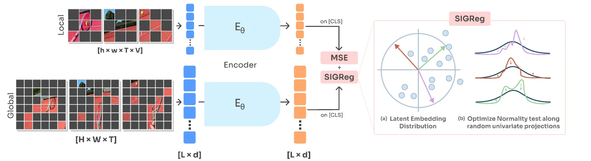
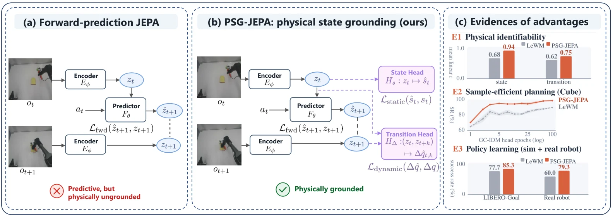
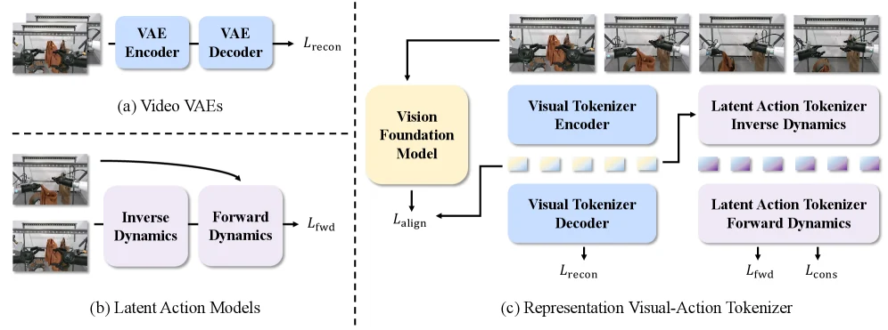

# JEPA与隐式状态表征：从可预测特征到可用于决策的世界状态

**更新日期**：2026-09-24
**报告标签**：表征学习与潜空间, 世界模型, 机器人学习

> 避免生成每一个像素，只是隐式世界模型的起点。真正的问题是：哪些状态必须保留，哪些变化应该忽略，潜空间距离是否反映动作后果，以及预测得到的状态能否支持规划和控制。

本期独立梳理15篇既有馆藏，以LeVJEPA、Causal-JEPA、PSG-JEPA和JEPA-x为主线，连接三维表征、生成tokenizer、动作条件预测及失败监控。V-JEPA 2以官方论文入口作为背景补充，不计入15篇馆藏。方法与关键实验以原始全文核对，跨论文联系与建议标为“综合分析”；不把所有带latent的模型归为JEPA。

[toc]

## 1. 先区分四件事：压缩、表征、状态与转移

**压缩表征**以降低存储或生成成本为主要目标；**语义表征**倾向保留辨识对象和动作所需的信息；**预测状态**需要保留决定未来演化的信息；**决策状态**还必须区分会导致不同动作选择与回报的情形。同一个latent可以兼具这些用途，但一种评测成功不能替代另外三种。

例如两个杯子外观相同、位置接近，却可能一个被手抓牢、另一个只是被遮挡。分类特征可以相似，动作条件未来却可能不同。反过来，背景灯光变化会显著改变像素，却未必改变下一步抓取动作。隐式表征学习要解决的是这种信息取舍，而不是将维度降得越低越好。

用简化记号说明接口：编码器得到状态z，预测器根据历史z和动作a预测未来z；可选解码器把z转回图像、几何或物理量；规划器用预测结果给候选动作评分。**训练中是否存在解码器、预测器是否接动作、部署时是否保留预测器**，是三条相互独立的分类轴。

| 类别 | 训练目标或结构 | 部署用途 | 代表馆藏 |
| --- | --- | --- | --- |
| 视频自监督表征 | 多视图一致性与防坍塌 | 冻结探针或下游适配 | [LeVJEPA](https://arxiv.org/abs/2608.27395) |
| 对象级预测表征 | 遮挡对象轨迹，预测其latent | 推理与潜空间规划 | [Causal-JEPA](https://arxiv.org/abs/2602.11389) |
| 物理监督的潜在动态 | 状态/变化监督或跨模态预测 | 视觉预测、策略、规划 | [PSG-JEPA](https://arxiv.org/abs/2608.06799)、[JEPA-x](https://arxiv.org/abs/2608.24044) |
| 三维静态资产表征 | 缺块潜在预测，学习采样稳定特征 | 检索、分类、补全 | [Gaussian-JEPA](https://arxiv.org/abs/2608.15651) |
| 面向生成的潜空间 | VFM语义或几何特征进入codec | 视频/多视角生成 | [VideoRAE](https://arxiv.org/abs/2607.14088)、[GAE](https://arxiv.org/abs/2609.24981) |
| 面向机器人任务的状态/动作token | 预测未来、表征对齐与策略联合训练 | 动作输出或在线候选评估 | [VLA-JEPA](https://arxiv.org/abs/2602.10098)、[RepWAM](https://arxiv.org/abs/2606.13674)、[DreamWAM](https://arxiv.org/abs/2608.04996) |

Gaussian-JEPA不包含时间转移和动作，因此是三维表征学习，不能直接称为可执行世界模型。VideoRAE与GAE包含重建和生成用途，也不因使用latent就变成无像素监督的JEPA。

## 2. JEPA的核心取舍：预测表示，但必须约束表示学成什么

典型JEPA用可见上下文预测目标区域或未来观察的embedding，而不要求重建所有像素。目标编码器、掩码策略、防坍塌约束及预测空间共同决定训练信号。其优势是可以忽略难以预测而与任务无关的细节；风险是编码器与预测器也可能共同选择一种“容易预测、却遗漏关键状态”的表示。

因此，低预测误差至少有三种解释：模型学会了动态；编码器滤掉了难预测但重要的信息；潜空间本身发生退化。要区分三者，必须同时审查表征分布、物理读出和下游控制，不能只看训练loss。

V-JEPA 2提供一个有用的背景分界：先以无动作视频进行表征预训练，再用机器人交互数据训练动作条件的V-JEPA 2-AC以支持图像目标规划。预训练的观察能力和后训练的控制能力来自不同阶段；不能把互联网视频预训练直接等同于已获得机器人动作响应。[Meta官方论文入口](https://ai.meta.com/research/publications/v-jepa-2-self-supervised-video-models-enable-understanding-prediction-and-planning/)。

### 2.1 LeVJEPA：把防坍塌机制简化，不等于把世界动态问题解决

LeVJEPA以共享编码器处理同一时间窗口的全局与局部视频视图，随机丢弃约95%的patch token；损失读取各视图CLS，结合局部—全局均方一致性与SIGReg。后者约束随机投影的分布接近各向同性高斯，减少依赖动量教师、停止梯度等架构不对称。两分支均接受梯度。[方法](https://arxiv.org/html/2608.27395)。

图1：LeVJEPA原文图1。局部/全局视图共享编码器，CLS一致性与SIGReg共同训练；随机丢弃token主要降低编码计算。[原图与图注](https://arxiv.org/html/2608.27395#S0.F1)。

论文支持的是所测预训练预算下的效率与下游表征质量。等FLOPs的ViT-B设置中，ImageNet-1K/SSv2/K400为61.0/40.4/44.6；VideoMAEv2为53.4/43.6/37.4，说明SSv2并未领先。block-causal注意力能限制信息读取方向，但这既不是动作条件状态转移，也不是结构因果识别。[实验](https://arxiv.org/html/2608.27395#S4)。

**综合分析：**应把LeVJEPA看作更简洁的视频表示学习起点。若要用它做世界模型，还要验证相邻动作造成的小状态差异是否保留、离开视野的对象是否可记忆，以及训练出的动作条件预测器是否在闭环中有用。

## 3. 可解码与可预测是不同问题：PSG-JEPA对照JEPA-x

### 3.1 PSG-JEPA：用本体日志给单状态与状态变化加监督

PSG-JEPA保留LeWM的编码器、动作条件预测器与SIGReg，新增两个只在训练期使用的头：单latent回归机器人本体状态；latent对回归多个时间跨度的净关节角变化。部署丢弃这两个头。它既约束“现在是什么”，也约束“经过一段动作改变了什么”。[方法](https://arxiv.org/html/2608.06799#S3)。

图2：PSG-JEPA原文图1。前向预测之外加入本体状态和转移监督，两个辅助头均不保留到部署。[原图与图注](https://arxiv.org/html/2608.06799#S0.F1)。

其探针显示末端yaw可读性改善；冻结表征下的同一目标条件逆动力学规划器也受益。但监督重点是本体状态，不是完整对象位姿、接触或物理参数。LIBERO策略实验还联合微调编码器，因此不能把全部策略收益解释成冻结latent已包含所有有用信息。[实验](https://arxiv.org/html/2608.06799#S4)。

具体而言，OGBench-Cube的末端yaw线性/浅MLP探针相关系数由LeWM的0.08/0.08提高到0.94/0.98；冻结latent、同一GC-IDM训练5个epoch时，成功率由80.7±1.9%到95.0±0.7%。前者衡量读出，后者还受逆动力学头训练预算影响；它不是与任意MPC规划器的普遍比较。去掉转移监督后该规划成功率降到81.3%，比单独给出最终均值更能支持多时距转移约束的作用。[探针与消融](https://arxiv.org/html/2608.06799#S4)。

### 3.2 JEPA-x：约束不同观测模态共享同一条状态转移

JEPA-x把图像和物理状态看作同一交互轨迹的两种视图。物理状态编码几何、尺寸、姿态及末端信息；共享预测器从两种历史出发，各自匹配视觉和物理的未来表征，形成同模态与跨模态四项预测损失。物理分支在部署时移除。[方法](https://arxiv.org/html/2608.24044#S4)。

关键区别是监督进入**转移关系**，而不仅是给当前视觉latent挂一个物理回归头。原文的物理输入不含速度、接触力、wrench或目标相对量；运动仍需由历史与动作推断。物理分支也不是固定的万能教师，而是与视觉分支联合学习。

实验把可解码性与可预测性拆开：冻结视觉编码器，丢弃共训练的预测器，再用统一的新预测器拟合动作条件动态。多任务设置下，相对rollout drift从0.361降到0.104，平均控制成功率从53.6%升到78.2%；直接回归物理状态并未复现这一组合收益。测试包含三训练种子，但多任务套件由作者构建，外部套件和真实机器人泛化仍需另验。[实验](https://arxiv.org/html/2608.24044#S5)。

| 问题 | PSG-JEPA | JEPA-x |
| --- | --- | --- |
| 训练时额外信号 | 机器人本体状态、跨时间净关节变化 | 同步几何/位姿等特权物理状态轨迹 |
| 约束位置 | 单latent和latent对的读出 | 共享动作条件预测器的跨模态未来 |
| 部署保留什么 | 视觉编码器与任务所需模块 | 视觉分支与动作条件预测器 |
| 最关键的证据 | 状态/变化读出与冻结表征下游收益 | 换新预测器后的forecastability与闭环收益 |
| 不能外推的结论 | 已恢复对象动力学或形式可识别性 | 训练不用物理状态，或已识别真实因果结构 |

**综合分析：**这组对照最值得保留的问题是：物理量能被解码出来，为什么仍可能不好预测？一种表示可以散乱地保留当前坐标，却让相同动作对应复杂、不稳定的latent变化；状态监督保证信息存在，转移监督进一步约束信息如何随动作演化。

## 4. 对象与几何结构：提高可解释性，也会引入新的依赖

Causal-JEPA在冻结的对象编码器上遮挡整条对象latent轨迹，仅保留身份锚点，再恢复被遮挡历史并预测未来。目的在于减少逐对象独立外推的捷径，使模型利用其他对象解释交互。在CLEVRER的VideoSAUR设置下，mask从0增到4，counterfactual问答准确率47.68→68.81；但SAVi设置下，mask=4反而低于不遮挡。收益依赖对象slot质量及可恢复信息量。[原文](https://arxiv.org/html/2602.11389)。

对象遮挡改变的是可观察信息，不等于向真实世界变量施加干预。该方法的对象组织有利于问答和紧凑规划，但不能据此把slot attention解释为SCM因果图。Push-T上Causal-JEPA成功率88.67%，DINO-WM为91.33%；其价值还包括特征和计算预算，而不是每项控制成绩都更高。

Gaussian-JEPA将类似潜在预测应用到静态3D Gaussian资产：在线编码器看上下文，EMA编码器看完整采样后为目标块提供latent监督。它不解码原始Gaussian属性作为预训练目标，主要改善重新采样、缺块观察下的表征稳定性。55%缺失时，部分检索R@1由Gaussian-MAE的19.80升至39.82；ModelNet40全微调分类则仅由92.54到92.63，主收益不在所有指标上。[原文](https://arxiv.org/html/2608.15651)。

**综合分析：**“隐式”与“几何”不是互斥概念。输入可以是显式三维资产，学习目标仍在latent；也可以从像素训练latent，再要求其保持几何关系。真正应比较的是状态信息、坐标结构、采样稳定性和动态可预测性，而不是把显式/隐式当作简单优劣排序。

## 5. 生成tokenizer提供的对照：语义、几何与重建如何兼容

VideoRAE将冻结视频基础模型的分层特征变成可解码的生成潜空间。与只用像素重建训练的codec相比，它把语义与宏观时空信息带入生成器输入。但重建FVD、生成FVD和动作预测误差是三套目标，不能从视频生成变好推断控制状态更充分。[原文](https://arxiv.org/html/2607.14088)。

GAE更强调几何原生latent：压缩几何特征，并通过解码RGB、深度、相机与点图等目标保持结构。受控生成比较中，GAE-64在RealEstate10K/DL3DV的FVD为225.7/287.0，最佳非GAE对照为258.6/373.2；但几何评测仍依赖估计器和对齐协议，尚非动作条件动力学或接触评测。[原文](https://arxiv.org/html/2609.24981)。

图3：GAE原文方法图。几何特征经紧凑codec形成latent，生成器在该空间建模，解码端恢复视觉与几何输出。[原图与图注](https://arxiv.org/html/2609.24981)。

RepWAM用冻结视觉基础模型对齐视觉token，并在共享空间中耦合逆动力学与前向动力学，形成视觉—动作tokenizer。其关键不是“latent越像语义越好”，而是同一表征要支持视觉内容、状态变化与动作学习。1.3B受控替换下，RoboTwin Easy/Hard成功率78.0/76.0→86.6/83.1，支持该设置中的tokenizer价值；真机每任务只有10次rollout，不能由此宣称普遍跨本体优势。[原文](https://arxiv.org/html/2606.13674)。

图4：RepWAM原文图1。视觉token对齐与IDM/FDM在同一空间连接状态和转移。[原图与图注](https://arxiv.org/html/2606.13674#S3.F1)。

## 6. 未来latent如何进入决策：训练辅助与在线规划要分开

| 用法 | 未来在何时发挥作用 | 代表工作 | 评测时应删除或替换什么 |
| --- | --- | --- | --- |
| 训练期表征监督 | 塑造动作token/策略，运行时不必rollout | VLA-JEPA、DreamWAM的no-rollout设置 | 去未来目标、换目标教师、固定数据和动作头 |
| 在线候选未来评估 | 每个动作候选有不同未来及评分 | [DA-WAM](https://arxiv.org/abs/2608.19085) | 用共享未来替代候选未来，固定候选集与评分预算 |
| 目标latent规划 | 展开动作序列，最小化预测与目标的距离 | [DUET-DINO](https://arxiv.org/abs/2609.10506)、[DexWM](https://arxiv.org/abs/2512.13644) | 固定planner后换encoder，固定encoder后换planner |
| 预测状态监控 | 从已有预测token读出失败风险 | [FARM](https://arxiv.org/abs/2609.11445) | 与当前视觉、动作不确定性、未见任务对照 |

VLA-JEPA用冻结V-JEPA 2提供未来状态监督，让VLM产生的latent action tokens承载转移信息，再条件化动作头。未来真值属于训练目标，不是部署输入；部署也不等同于对多个未来反复搜索。其原始LIBERO均值97.2与OpenVLA-OFT的97.1很接近，而LIBERO-Plus的79.5对69.6更能体现扰动鲁棒性收益。[方法与实验](https://arxiv.org/html/2602.10098)。

DreamWAM将未来监督拆成RGB、运动、几何和语义。LIBERO-Plus中，no-rollout由Fast-WAM的51.36到63.44，joint rollout由69.16到75.47。**综合分析：**不运行未来分支也能提高性能，说明至少部分收益来自训练时的信息约束；不能把全部增益都归因于执行期“想象”。[原文](https://arxiv.org/html/2608.04996)。

DA-WAM为每条驾驶候选轨迹预测独立未来latent，再评估安全与规划因素。其未来表征监督直接作用于专家匹配候选，其他候选更多依靠评分约束；所以“每候选都有未来”并不自动保证每个反事实未来都被独立真实轨迹验证。本专题保留架构论证，不将未统一复核的驾驶分数与机器人成功率混排。[方法](https://arxiv.org/html/2608.19085#S3)。

DUET-DINO让侧视和腕视表示交换信息，再用CEM规划。它在所测条件下发现DINOv3比V-JEPA 2更保留腕部细运动，这提醒我们视频预训练并不保证所有局部控制表征更优。真实angled-reach成功率26.7%，规划一步约15–17秒，表征与搜索成本都制约部署。[实验](https://arxiv.org/html/2609.10506)。

## 7. 不要混淆latent state、latent action和生成特征

状态latent描述当前观察或历史，动作latent描述状态变化或控制意图，生成器中间特征则可能同时混合噪声级别、外观与未来条件。它们不能只因维度相同就互换。

[What Matters for Latent Actions](https://arxiv.org/abs/2608.19613)在统一流程下比较41项设计，发现简单语义特征差分也有竞争力，而重建/探针代理只适合粗筛；跨latent维度时与下游控制的相关性还会下降。逆动力学编码器若访问未来帧，latent可能携带对象结果与不可执行信息，不能直接解释为因果动作变量。[原文](https://arxiv.org/html/2608.19613)。

对于手物交互，这一点尤其具体：相同手运动遇到不同摩擦会产生不同物体后果。如果把完整后果编码成“动作”，模型可能很好重建视频，却失去独立改变动作、观察后果的能力。与[手物交互专题](../../index.html#report=topic-contact-hoi)的连接应放在动作、对象状态与接触响应的接口上，而不是只连接两个latent张量。

## 8. 一套可复用的证据层级

| 证据 | 回答什么 | 仍未回答什么 |
| --- | --- | --- |
| 方差、协方差、有效秩与防坍塌 | 特征有没有退化为常量或低秩捷径 | 是否保留接触、速度、对象状态 |
| 分类/检索/可视化 | 是否有语义与采样稳定性 | 动作条件转移是否可靠 |
| 冻结latent的物理探针 | 物理量能否被统一读出 | 转移是否容易预测、是否可外推 |
| 新预测器与多步rollout | 表征是否支持独立于共训练器的动态建模 | 搜索动作分布中的误差是否可控 |
| 固定预算的规划/策略实验 | 对决策是否实际有用 | 收益是否能迁移到新对象/相机/硬件 |
| 执行中的失败监控与干预测试 | 能否识别越界，并检验响应真实性 | 监控分数是否已完成概率校准或因果识别 |

FARM提供最后一层的具体例子：在冻结VLA-JEPA内部预测状态上训练小型失败读出头，350条轨迹五折OOF的AUROC为85.68；Strict-Unseen下为65.67，低于STAC-Single的68.28。内部状态确实可能含有风险线索，但源任务上可读不等于未见任务上可靠，0.2256 ms也只是已有预测状态之后的增量监控成本。[实验](https://arxiv.org/html/2609.11445)。

跨论文实验至少应固定编码器容量、数据、动作信息、预测时距、规划搜索预算和微调权限。latent MSE还应配合静止预测基线、方差/有效秩及物理量误差，否则单纯缩小特征幅度或压低时间变化也可能得到较小loss。

## 9. 综合分析：值得保留的三个研究问题

**状态充分性。**同一图像下不同隐藏接触/负载是否能被历史区分？先在有限对象与动作集合中构造视觉近似、动态不同的成对情形，比较纯视觉预测、状态读出监督和转移监督。分别测物体、手/执行器和接触变量，避免本体探针改善掩盖对象状态缺失。

**预测结构。**将同一组冻结表征交给新预测器，比较一步与长程误差；再固定planner评估候选动作排序。若探针变好而新预测器与控制都未受益，应承认监督只增加了可读取信息，并未塑造更有用的动态空间。

**训练特权如何迁移。**JEPA-x和PSG-JEPA依赖训练期物理或本体数据；人类互联网视频通常没有这些量。可以用高置信重建提供部分监督、对遮挡与尺度不确定性加权，并保留真实状态子集检验。但伪几何与实测物理不是同等证据，必须单列噪声敏感性和跨域验证。

阅读顺序建议：先以V-JEPA 2背景和LeVJEPA理解预训练，再读PSG-JEPA→JEPA-x区分读出与动态；用Causal-JEPA/Gaussian-JEPA检查结构化表征的边界；最后通过VLA-JEPA、DUET-DINO和FARM核对latent进入策略、规划与监控的不同路径。VideoRAE/GAE/RepWAM作为生成与动作tokenizer的对照分支。

## 参考文献与馆藏入口

15篇馆藏按首次出现顺序列出。V-JEPA 2的官方背景入口已在第2节单列，未作为新增论文卡片计数。

1. [LeVJEPA: Efficient & Scalable Video Pretraining without the Heuristics](https://arxiv.org/abs/2608.27395) · [馆藏卡片](../../index.html#paper=arxiv-2608-27395)

2. [Causal-JEPA: Learning World Models through Object-Level Latent Masking](https://arxiv.org/abs/2602.11389) · [馆藏卡片](../../index.html#paper=arxiv-2602-11389)

3. [Is Forward Prediction Enough? Physical State Grounding for JEPA World Models](https://arxiv.org/abs/2608.06799) · [馆藏卡片](../../index.html#paper=arxiv-2608-06799)

4. [JEPA-x: Cross-Predictive Physics Grounding for Forecastable Latent Dynamics](https://arxiv.org/abs/2608.24044) · [馆藏卡片](../../index.html#paper=arxiv-2608-24044)

5. [Gaussian-JEPA: Joint-Embedding Predictive Learning for 3D Gaussian Splats](https://arxiv.org/abs/2608.15651) · [馆藏卡片](../../index.html#paper=arxiv-2608-15651)

6. [VideoRAE: Taming Video Foundation Models for Generative Modeling via Representation Autoencoders](https://arxiv.org/abs/2607.14088) · [馆藏卡片](../../index.html#paper=arxiv-2607-14088)

7. [GAE: Learning a Geometry-Native Latent Space for 3D-Consistent World Generation](https://arxiv.org/abs/2609.24981) · [馆藏卡片](../../index.html#paper=arxiv-2609-24981)

8. [VLA-JEPA: Enhancing Vision-Language-Action Model with Latent World Model](https://arxiv.org/abs/2602.10098) · [馆藏卡片](../../index.html#paper=arxiv-2602-10098)

9. [RepWAM: World Action Modeling with Representation Visual-Action Tokenizers](https://arxiv.org/abs/2606.13674) · [馆藏卡片](../../index.html#paper=arxiv-2606-13674)

10. [DreamWAM: Beyond RGB Future Prediction for World Action Models](https://arxiv.org/abs/2608.04996) · [馆藏卡片](../../index.html#paper=arxiv-2608-04996)

11. [DA-WAM: Decision-Aligned Future Latents for Driving World Models](https://arxiv.org/abs/2608.19085) · [馆藏卡片](../../index.html#paper=arxiv-2608-19085)

12. [DUET-DINO: Simultaneous Cross-View World Modeling for Latent Planning in Robot Manipulation](https://arxiv.org/abs/2609.10506) · [馆藏卡片](../../index.html#paper=arxiv-2609-10506)

13. [World Models for Learning Dexterous Hand-Object Interactions from Human Videos](https://arxiv.org/abs/2512.13644) · [馆藏卡片](../../index.html#paper=arxiv-2512-13644)

14. [FARM: Reading Failure Signals from the Internal Predictive States of a Frozen Robotic World Model](https://arxiv.org/abs/2609.11445) · [馆藏卡片](../../index.html#paper=arxiv-2609-11445)

15. [What Matters for Latent Actions in Robot Learning](https://arxiv.org/abs/2608.19613) · [馆藏卡片](../../index.html#paper=arxiv-2608-19613)
