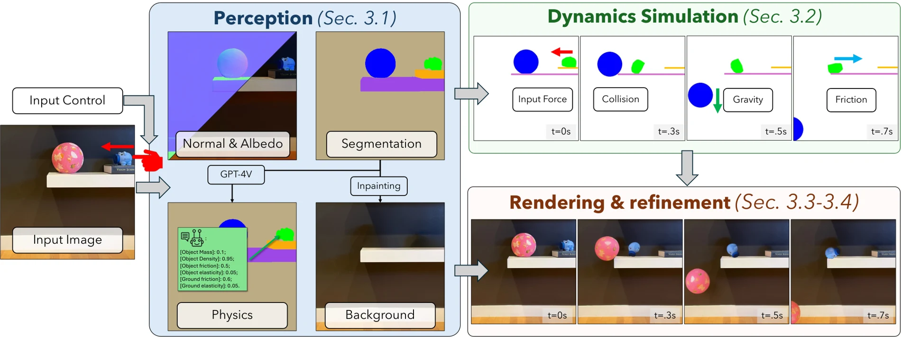
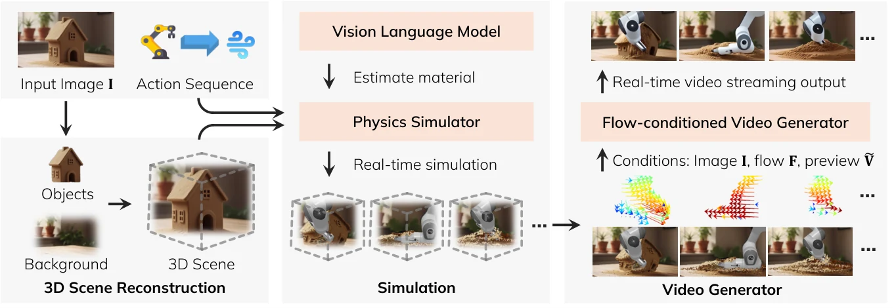
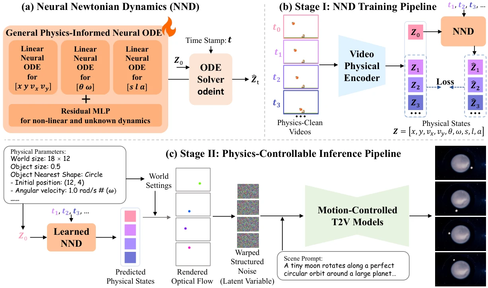
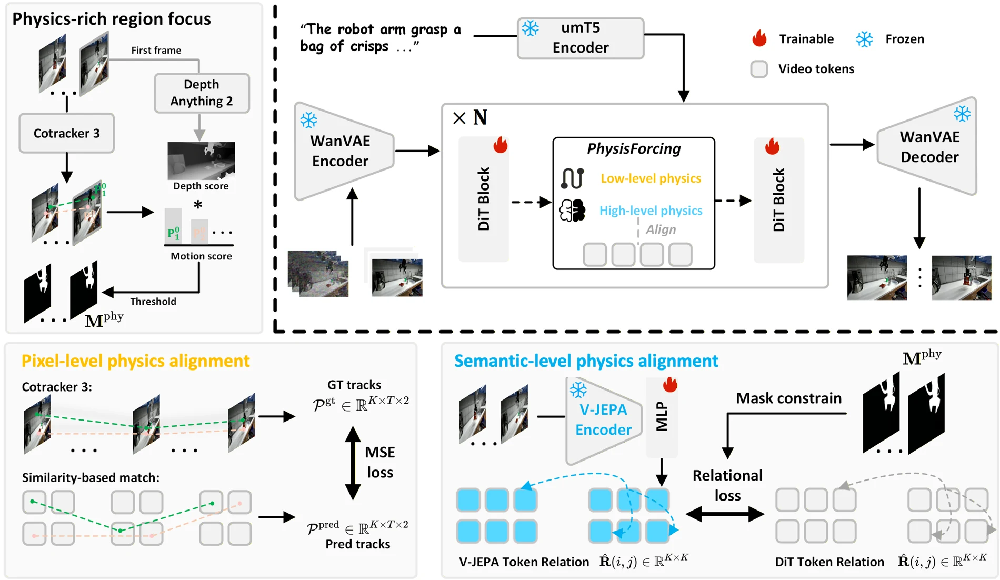
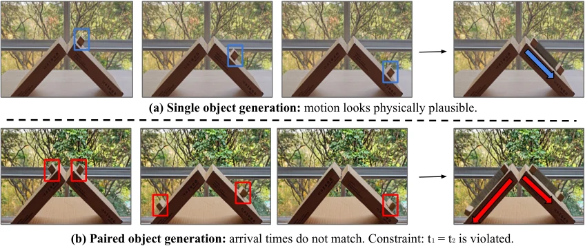
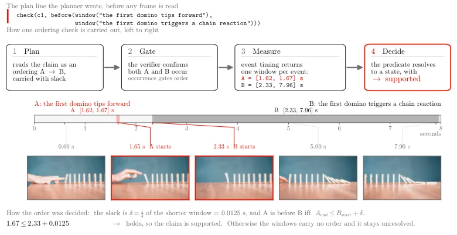

# 物理合理性：从视觉生成到可验证的动力学与交互

**更新日期**：2026-09-24

**报告标签**：物理建模与仿真, 世界模型, 数据与评测

> 围绕“物理约束从哪里来、进入模型的哪个环节、怎样接受独立检验”，比较显式模拟、学习式动力学、表征监督、奖励优化和真实交互校准，建立从视频观感到对象响应的证据链。

物理合理性应当成为独立研究主题。一个模型可能重建出形状正确的杯子，却让杯子在没有接触时移动；可能生成看似自然的碰撞，却在改变质量后仍给出相同结果；也可能能用文字说出正确规律，却在视频里执行错误。几何、语言知识和画面质量都是有用线索，但它们没有覆盖这些问题。

本专题以馆藏工作为范围，核心问题是：**在给定状态、动作、材料及边界条件下，模型是否产生可解释、可检验、可迁移的物理后果？**正文区分论文方法、实验支持与综合判断。模拟器提供的约束、从视频学到的统计规律和测力交互提供的参数证据分别讨论，不把所有带有 physics 的方法视为同一种能力。

[toc]

## 一、先定义“合理”：五种性质需要五类证据

| 性质 | 具体要求 | 应检查的证据 | 容易混淆的替代指标 |
| --- | --- | --- | --- |
| 形状与存在一致 | 刚体不凭空变形、复制或消失，遮挡前后保留身份 | 对象数量、形状、可见性与重访身份 | 画面清晰、纹理稳定 |
| 运动学一致 | 位姿、速度和关节运动相容，运动连续 | 轨迹、速度、关节约束、坐标及时间尺度 | 单纯平滑或低运动量 |
| 动力学一致 | 力、质量、惯量和运动变化符合所用模型 | 外力/冲量、加速度、功与能量收支 | 看起来像下落或碰撞 |
| 接触与材料一致 | 支撑、摩擦、碰撞和形变符合交互条件 | 接触时序、穿透、滑移、力位移关系 | 手与物体在二维图上靠近 |
| 干预与实例一致 | 同一对象在不同动作下可由共同参数解释 | 改动作、换对象、变材料、脱离专家轨迹的对照 | 一次正常任务成功，或多次预测自洽 |

动力学检验必须写明系统边界。例如，受外力驱动的对象不应机械地要求“动量恒定”；摩擦碰撞中机械能可以耗散；弹簧与重力也会储存或释放势能。正确的问题是相关力、冲量和能量收支能否解释变化，而不是给所有视频套一个守恒阈值。

**物理合理与实例准确还不同。**两条轨迹都可能满足牛顿定律，但只有一条符合眼前这个对象的质量、摩擦和初态。反过来，缺乏材料或隐藏状态时，真实未来本就可能有多种解释，应评价条件分布和不确定性，而不是无条件要求复制唯一参考视频。能表达不确定性，也不能免除基本接触和状态连续约束。

## 二、研究版图：把约束放在哪里

| 路线 | 物理依据 | 约束进入的位置 | 代表工作 | 首要验证问题 |
| --- | --- | --- | --- | --- |
| 显式模拟再生成 | 预设求解器、几何和材料参数 | 先更新状态，再生成观测 | [PhysGen](https://arxiv.org/abs/2409.18964)、[RealWonder](https://arxiv.org/abs/2603.05449)、[TourPhysics](https://arxiv.org/abs/2609.04911) | 参数是否可信？渲染是否服从模拟？ |
| 学习可解释动力学 | 物理结构、干净轨迹、状态监督 | 状态编码及转移模型 | [NewtonGen](https://arxiv.org/abs/2509.21309)、[PSG-JEPA](https://arxiv.org/abs/2608.06799) | 学会了哪种状态和运动族？外推是否成立？ |
| 物理相关监督对齐 | 轨迹、关系与语义物理标签 | 生成器中间特征及专家路由 | [PhysisForcing](https://arxiv.org/abs/2606.28128)、[ProPhy](https://arxiv.org/abs/2512.05564) | 教师知识是否对应可测动力学？ |
| 奖励与后训练 | 轨迹、碰撞、3D/4D 重建代理 | 生成策略更新 | [PhysRVG](https://arxiv.org/abs/2601.11087)、[VGGRPO](https://arxiv.org/abs/2603.26599)、[World-R1](https://arxiv.org/abs/2604.24764)、[Stream4D](https://arxiv.org/abs/2608.19556) | 模型改善了物理，还是利用了奖励盲区？ |
| 真实交互锚定 | 力、触觉、本体感觉和响应轨迹 | 参数辨识、状态预测与控制 | [ForceTwin](https://arxiv.org/abs/2609.21751)、[Agile-WAM](https://arxiv.org/abs/2609.20761) | 新对象、新速度和未见动作下是否仍有效？ |
| 独立评价与诊断 | 关系不变量、真实校准、重建、工具测量 | 训练外的检验环节 | [Principia](https://arxiv.org/abs/2609.04200)、[IMPLY](https://arxiv.org/abs/2609.12441)、[RoboPhys-3D](https://arxiv.org/abs/2608.28718)、[VeriPhy](https://arxiv.org/abs/2609.03153) | 评分本身测到了什么？误报和失效在哪里？ |

这些路线可以组合。显式模拟器也需要参数辨识，学习动力学也需要独立测试，奖励后训练也依赖感知教师。比较时要把训练期监督、推理期输入和评价期真值分开：推理时额外拿到真实质量或模拟器状态，与仅有一张图像，是不同的信息条件。

## 三、显式模拟：物理引擎负责状态，生成器负责观测

### PhysGen：以受控刚体运动建立模块边界

PhysGen 是理解这条路线的清晰起点。它先分割对象、估计外观及物理属性，用 GPT-4V 等视觉模型提供质量、摩擦、弹性参数，再通过 **二维图像空间的刚体模拟**计算受力和碰撞。对象纹理随模拟运动变换，视频扩散负责光照及外观细化。它没有从单图恢复完整三维接触世界。

图 1：PhysGen 原文 Figure 2。模拟器约束运动，生成模块改善外观；参数估计和最终渲染是两处独立误差来源。[原图](https://arxiv.org/html/2409.18964v1/method_v1.png)。

这使力、力矩和初态成为有明确含义的控制接口，但 VLM 根据外观给出的质量不是测量结果。即使 Pymunk 在给定参数下正确求解，参数错误仍会得到错误的真实预测。原文约三分钟一次生成，包含感知、模拟、渲染和细化，适合说明可控动画机制，而非实时接触控制。[原文方法与耗时](https://arxiv.org/html/2409.18964#S3)。

### RealWonder：把三维动作翻译成视频模型能读取的条件

RealWonder 从单张图建立可模拟三维场景，将力、机器人动作和相机运动先交给物理求解器，再转成光流与粗 RGB，条件化四步蒸馏视频模型。针对不同材料使用刚体、PBD、MPM 等求解器，展示了刚体、可变形体、流体和颗粒的动作条件视频。

图 2：RealWonder 原文 Figure 2。真实动作先产生物理状态与运动，再转成生成器可消费的视觉条件。[原图](https://arxiv.org/html/2603.05449v1/approach_eccv.png)。

原文报告 480×832 下 13.2 FPS，说明这一接口可以做成交互式系统；它不证明单图恢复的材料参数准确，也不等于完整机器人感知—规划—执行闭环的速度。应分别测量模拟状态误差、条件到视频的运动偏差，以及渲染是否额外引入模拟中不存在的形变。[方法与评测](https://arxiv.org/html/2603.05449#S3)。

### TourPhysics：长程交互还需要明确的状态更新规则

TourPhysics 的重点进一步转向持续状态。它从单图和声明式物理配置初始化，先为一个动作计算有限时段的物理与相机轨迹，再生成观测；在合成或重试期间保留已提交状态，接受观测后才发布终态并更新外观记忆。模拟器几何、生成条件深度和外观记忆各有用途，不能让一次渲染变化不经检验就改写物理状态。

**综合分析：**这类系统的价值，是把“状态按什么规则变化”和“看起来如何”拆开，使错误可定位。其物理正确性仍是条件性的：给定的几何、参数、求解器和边界条件必须适用。TourPhysics 的碰撞/形变指标主要对照模拟器配对渲染轨迹，并且获得额外物理配置；这验证渲染服从程度，不能替代真实对象测量。[输入权限与实验协议](https://arxiv.org/html/2609.04911v2#S4)。

## 四、学习式动力学：把物理放进状态，而不只放进提示词

### NewtonGen：可解释运动状态与残差动力学

NewtonGen 先从干净轨迹学习 Neural Newtonian Dynamics，再把未来状态转成光流等条件交给视频生成器。线性物理结构处理可建模运动，残差 MLP 吸收非线性或未知部分，用户可以改变初始位置、速度和运动参数。这里学习的核心对象是状态转移，视频主要承担外观表达。

图 3：NewtonGen 原文 Figure 2。先积分未来状态，再通过运动条件驱动视频；状态预测与最终视频应分别评价。[原图](https://arxiv.org/html/2509.21309v2/framework.png)。

**实验支持。**匀速 PIS-v 为 0.9830，接近参考轨迹的 0.9972；匀加速 PIS-ax 为 0.6568，仍低于参考 0.8489。真实下落视频训练相对模拟训练明显退化，显示状态提取噪声与数据域变化的重要性。不能只根据最简单运动的高分，推出复杂接触和材料变化也已解决。[实验与真实视频对照](https://arxiv.org/html/2509.21309v2#S5)。

物理结构加残差也有取舍：残差能弥补简化方程，却可能吸收相机误差、错误参数或未观测外力。若多个项共同拟合同一条轨迹，需要新的初态、速度或材料实验，才能判断模型学到了可迁移关系，还是仅在训练区间补偿误差。

### PSG-JEPA：物理相关状态可读出，不等于完整力学可识别

PSG-JEPA 用训练期本体状态和净关节变化监督视觉 latent，使其保留机器人姿态及变化信息；编码器和预测器不以本体为输入，部署时丢弃辅助头。在匹配规划头的 OGBench-Cube 设置中，五轮规划训练的成功率从 LeWM 的 80.7±1.9 提升到 95.0±0.7，支持这种状态约束对下游任务有价值。

但其主要监督是机器人运动状态，不是物体质量、摩擦或接触力。**综合分析：**可读出姿态、能预测未来、能辨识接触动力学是逐步增强的要求。该工作应被理解为物理状态表征的基础，而不是一项通用牛顿规律恢复结果。表征路线详见[JEPA 与隐式状态专题](../../index.html#report=topic-jepa-latent-state)。

## 五、监督对齐与物理奖励：不同信号纠正不同错误

### PhysisForcing 与 ProPhy：约束中间特征承载什么

PhysisForcing 在物理关键区域对齐两类信息：参考点轨迹约束局部运动，视频理解教师的关系特征约束交互实体之间的时空结构。监督发生在 DiT 中间特征，部署时无需运行这些教师。尽管标题使用 Physics Reinforced，它的核心机制是监督对齐，不应仅凭名称归为强化学习。

图 4：PhysisForcing 原文 Figure 2。低层运动与高层关系分别提供约束，二者都经过感知教师，仍可能继承教师误差。[原图](https://arxiv.org/html/2606.28128v1/figs/Fig2_Method.png)。

原文把它接入 Fast-WAM，在六个 RoboTwin 任务、每任务 200 次 rollout 的设置中，平均成功率从 68.2% 提升到 72.8%；但 shake_bottle 和 stack_bowls_two 两项下降。总体改善有下游证据，仍不能写成所有接触任务都更强，也没有直接测量对象受力。[下游实验](https://arxiv.org/html/2606.28128#S4)。

ProPhy 则把 VLM 提供的物理属性标注蒸馏到专家路由：先分配高层物理语义，再做 token 级细化。原文从 WISA-80K 抽取 20K 视频训练，用 600 个提示评 VideoPhy2/VBench。Wan2.1-1.3B 的 PC 从 57.8 到 65.0，Joint 从 24.8 到 26.5；视觉模型给出的语义物理判断改善，不等于测得质量、冲量或能量误差下降。错误专家路由引发不合适形变，说明路由与属性相关，但不足以证明专家对应唯一物理机制。[原文实验](https://arxiv.org/html/2512.05564v2#S4)。

### PhysRVG：用运动与碰撞信号优化生成策略

PhysRVG 在视频生成后训练中引入对象 mask、轨迹和碰撞相关奖励，并用 Mimicry–Discovery Cycle 在稳定模仿与奖励探索之间切换。它主要验证碰撞、自由落体、摆动和滚动等刚体运动，不宜把这些结果扩展到任意材料或多接触系统。

PhysRVGBench 上报告 IoU 0.64、轨迹偏移 15.03，对照 Magi-1 为 0.27/113.42。作者也报告全参数 RL 在有效 batch 640 下仍崩溃，因此稳定监督分支和参数高效更新是方法的重要组成。奖励是否可计算、优化是否稳定、评价是否独立，是三个需要分别验证的问题。[实验及稳定性分析](https://arxiv.org/html/2601.11087#S4)。

### VGGRPO、World-R1、Stream4D：几何奖励何时会误伤真实运动

| 工作 | 奖励主要观察什么 | 帮助纠正的错误 | 尚未直接约束的部分 |
| --- | --- | --- | --- |
| VGGRPO | 从视频 latent 读出的相机、点图及几何关系 | 视角漂移、重投影和轨迹问题 | 力、材料与接触响应 |
| World-R1 | 3D 重渲染、轨迹与视觉质量 | 跨视图结构和生成稳定性 | 动态场景中的独立对象机制 |
| Stream4D | 动态 4D 重建、运动先验和感知锚点 | 静态几何奖励引发的冻结运动 | 真实接触力与实例参数 |

静态重建容易奖励不动的场景；平滑指标也可能奖励错误但平滑的轨迹。World-R1 调整 3D 奖励权重以缓解动态性损失，Stream4D 则用动态重建与运动先验处理这一矛盾。**综合分析：**奖励必须对目标行为有区分力，同时防止“少动”“少接触”“选择容易重建的物体”等捷径。更高的 4D 重建分数是一类一致性证据，不是完整物理规律证明。[World-R1](https://arxiv.org/html/2604.24764)；[Stream4D](https://arxiv.org/html/2608.19556)。优化算法与模型内策略学习详见[强化学习专题](../../index.html#report=topic-reinforcement-learning)。

## 六、接触与实例参数：为什么真实交互证据不可替代

从视觉上相同的两扇门，可能因闭门器、摩擦和惯量差异，需要完全不同的操作力。只给门补上铰链轴，解决的是运动学；要预测推开速度、阻力和停止位置，还需要辨识动力学。

ForceTwin 用带力传感的手持夹具采集位姿与接触 wrench，估计关节结构、惯性、库仑摩擦、黏性阻尼，再用结构化残差描述随状态变化的机制负载。其配置相关项可能混合重力与弹簧等效应，不能自动解释成唯一可识别的机械弹簧。

图 5：ForceTwin 原文 Figure 1。同步运动与力证据用于建立物理 twin，再进入机器人控制。[原图](https://arxiv.org/html/2609.21751v1/figures/ForceTwin_PipelineFigure.png)。

原文九个对象—本体组合的目标完成率为 87%，VLM 参数先验与仅运动学 twin 分别为 60%、57%。它比外观演示更直接支持参数模型的实用价值；但有限轨迹仍可能使惯量、摩擦与残差互相补偿，未见速度和新负载下的检验仍重要。[原文实验](https://arxiv.org/html/2609.21751#S4)。

Agile-WAM 提供另一种接口：联合预测动作、未来视觉和触觉 latent，用近时距触觉帮助处理快速变化的接触。五个实机任务合计 63/100 成功，对照 VITA-VT 为 49/100，但插销任务并未领先。这支持触觉预测的任务价值，尚不等于获得可解释、精确的接触力学模型。[实验与预测时距](https://arxiv.org/html/2609.20761#S4)。

**综合分析：**显式参数辨识与隐式触觉预测可以互补：前者便于诊断和外推测试，后者能够容纳难以手写的局部现象。二者应共同接受力位移、滑移、接触时序和执行表现的检验。相关资产重建与运动生成链路见[手物交互专题](../../index.html#report=topic-contact-hoi)。

## 七、怎样评价物理：从单段观感到独立证据

### Principia：同场景关系可以揭示单对象看不出的错误

Principia 利用成对对象检验物理关系，例如相同坡度、相同摩擦、同步释放条件下，不同质量滑块应具有相同到达时间；小角度单摆的周期比应对应摆长比的平方根。重点是明确控制条件下的关系，而不是从画面盲猜绝对质量和重力。

图 6：Principia 原文 Figure 2。在匹配斜面和释放条件下，到达时序暴露了单独观察各条轨迹难以发现的问题。[原图](https://arxiv.org/html/2609.04200v1/Principa_teaser2.png)。

原文最终使用 529 个场景，包含 401 个实拍场景及编辑增强，覆盖八类现象；六个生成器的最高平均分为 0.419。这个分数与 VBench 约 0.8 属于不同构造的指标，不能相减解释为“物理能力下降了多少”，但可以说明视觉表现与关系约束并不同步。[主表与构建协议](https://arxiv.org/html/2609.04200#S4)。

有三项边界必须一起读。第一，计算 Principia 主分前会筛除基本运动方向不合要求的视频，因此需要同时看方向通过率与排除样本，避免只讨论可评价子集。第二，关系的标定不敏感依赖匹配几何、释放与投影条件；附录中抛体指标对横向相机扰动仍明显敏感，不能当作任意相机运动下都不变。第三，运动来自 SAM3 跟踪和事件阈值，遮挡、身份错误及严重形变会污染测量。它是受控宏观牛顿实验，不覆盖通用软体、流体或热学。

### IMPLY：自洽的错误需要用真实校准打破

IMPLY 不只逐条检查轨迹，而是问：同一对象在不同推动速度下的多组 rollout，能否由同一份质量和摩擦解释？再把两个真实观测到的校准推动纳入拟合，约束对象身份与参数。

图 7：IMPLY 原文 Figure 1。对象盲模型可以产生彼此一致的错误预测，外部校准使这种错误可被揭示。[原图与图注](https://arxiv.org/html/2609.12441#S4.F1)。

在 200 个对象、每对象五个速度的受控替代模型中，锚定将 AUROC 从 0.70 提高到 1.00。场景适配的 V-JEPA 2-AC 使用正确对象校准时，与真值的对象间相关为 0.91；换成别的对象校准后仅 0.05。锚定指标在 73% 对象上偏好正确证据，自一致性只有 52%。结果说明相互协调的预测仍可能对应错误对象；AUROC 1.00 也只适用于该受控设置。[完整协议](https://arxiv.org/html/2609.12441)。

### RoboPhys-3D：评价器自身的重建误差也要计入

RoboPhys-3D 将生成视频和参考视频送入相同三维重建流程，再分像素、几何、状态与任务层诊断。它覆盖 RoboTwin 2.0 的 50 个任务、5000 个 episode 和 25000 段多视图参考视频；相同流程处理参考视频，有助于看清哪些误差来自重建后端。

原文发现后端选择最多可造成 21.8% 的分数变化。这说明“重建后看起来合理”并非无条件真值，也提示高碰撞安全分可能与低动作实现程度共存。该协议仍主要在一个模拟平台和有限被测模型中验证；把真值视频也重建一次能暴露评价噪声，但不会消除生成视频与真实视频之间的重建域偏差。[方法与实验](https://arxiv.org/html/2608.28718)。

### VeriPhy：可追溯测量比一个总分更有用，但证据覆盖要单独审查

VeriPhy 在读取视频前把提示编译成待验证条件和执行计划，再调用分割、跟踪、深度、计数、OCR 等工具，保留证据来源，输出 supported、contradicted 或 unknown。工具式评价能说明“哪件事、何时、依据什么失败”，比单个整体评分更便于修正。

图 8：VeriPhy 原文 Figure 3。该图展示事件先后关系的测量链，不应被误标为力学方程验证。[原图](https://arxiv.org/html/2609.03153v1/fig_plan_chain.png)。

不过，原文 149 个核心视频的 304 条缺陷记录主要是事件、身份、文本和数量。VeriPhy 找到 228 条，召回 75%；同模型单次 VLM 找到 222 条、73%，而工具调用均值为 14.1 次，对照为 1 次。核心集中 **physical motion 只有七条，检出四条**，不足以支持通用物理违规检测的高精度结论。数据缺少正常视频，precision 无法直接测量；单标注员也没有提供标注者间一致性。[主表 3 与附录表 8](https://arxiv.org/html/2609.03153#S5)。

更关键的是修正环节：589 个视频经 critic 引导重写后，自身评价变好，但独立 VideoPhy-2 AutoRater 的物理维度没有改善。这不能证明修正必然无效，却说明现有结果没有独立确认物理质量提升。**综合分析：**可审计的程序执行是优势，测量覆盖和真实准确率仍需专门实验，不能由工具数量或“agentic”名称推导。[修正实验与局限](https://arxiv.org/html/2609.03153#S7)。

## 八、动作与多模态诊断：防止模型只演出熟悉的故事

[WorldSimProbe](https://arxiv.org/abs/2608.09298) 检查一条最基本的模拟器链路：输入动作是否先变成相应机器人运动，环境变化是否由已经实现的运动和交互支持。它在三个模拟平台、六个模型、超过 18000 个评价实例上构造受控测试；动作轨迹越偏离任务常见分布，动作实现保真度总体越差，平均 Spearman 相关为 −0.433。

这种协议可以揭示“机器人没有碰到物体，物体却按任务习惯移动”的虚假交互。普通专家轨迹测试很难发现它，因为场景、指令与动作高度相关，模型可以依据任务经验猜出下一步。因此物理评价需要无接触、反向、停止、失败动作和非典型速度，且保持初态和其他条件可比。

[One Model, Two Physical Stories](https://arxiv.org/abs/2609.14833) 再把同一模型的文字物理预测、生成视频和外部解析环境分别比较。文字答对规律，却在视频中不反弹，是内部不一致；两种模态一致地预测错误，则是外部不一致。跨模态一致检查与真实锚定需要同时存在。

这一层与因果研究相接，但不必宣称恢复完整结构因果模型。准确执行输入动作、遵循接触条件和响应实例参数，已经是明确可测的目标。识别假设、反事实与可靠性门控详见[因果与可靠性专题](../../index.html#report=topic-causality-reliability)。

## 九、统一实验设计：让每个改进有对应的反例

| 待验证主张 | 最小有效对照 | 需要保留的失败样本 |
| --- | --- | --- |
| 模拟器提高物理正确性 | 同初态下比较模拟状态、生成视频读出与真实响应 | 模拟正确但渲染偏离、参数错误但画面逼真 |
| 物理监督改善模型 | 相同数据、骨干和预算的普通微调，外加独立物理测量 | 教师跟踪失败、特定接触任务退化 |
| 奖励优化没有走捷径 | 匹配动作幅度、动态对象数，使用未参与训练的评价器 | 冻结、慢放、减少接触、隐藏难测物体 |
| latent 学到了物理状态 | 冻结表征探针与未见条件 rollout 分别测试 | 状态读出好但长程转移错误 |
| 参数辨识可以外推 | 保留速度、负载或作用方向作为测试集 | 多参数补偿、摩擦切换、机构极限附近失效 |
| 验证器可信 | 同时包含正常与异常视频，轨迹级划分和多人标注 | 误报、未知、工具失配与不可测样本 |

**推荐的共同测量链（综合分析）**是“输入动作 → 实际运动 → 接触事件 → 对象响应 → 渲染观测”。为每一段保存时间戳、坐标系、误差及证据来源，才能知道是动作被忽略、接触被幻觉化、动力学参数错误，还是画面生成背离状态。只保留最终任务成功率，会把这些原因混在一起。

若建立一个小而有区分力的评测集，可以先覆盖三类任务：固定材料下改变初速度的滑动/碰撞；固定外观下改变阻力的关节对象操作；固定初态下比较有效接触与擦边、悬空动作。分别评价轨迹、接触时序和力位移响应，并用相机扰动检查观测稳健性。它们比新增一个综合“物理分数”更容易定位方法贡献。

## 十、综合判断与阅读路径

**当前进展主要体现在三处。**显式模拟建立了可检查的状态更新；特征监督与奖励后训练改善了可观测运动和交互；真实校准与关系测试开始揭示自一致和视觉评分漏掉的错误。三者共同推动了物理合理性，但没有哪一类单独覆盖开放世界动力学。

**核心缺口是把实例证据、状态演化和生成观测持续对齐。**几何正确不保证受力正确；受控轨迹正确不保证不同材料下外推；模拟器正确不保证渲染服从；验证器能定位语义缺陷不保证能识别力学违规。更有价值的系统应说明适用的物理模型，记录参数来源和不确定性，并在新交互证据到来后修正状态或参数。

建议先读 PhysGen、RealWonder、NewtonGen，理解状态和渲染如何分工；再用 PhysisForcing、ProPhy、PhysRVG 对比不同训练信号；随后读 ForceTwin 和 IMPLY，理解实例校准为何必要；最后把 Principia、RoboPhys-3D、VeriPhy 与 WorldSimProbe 放在一起，建立覆盖关系规律、三维状态、可审计工具和动作执行的评测方案。

本专题负责物理约束与证据主线；[3D/4D 生成与重建](../../index.html#report=topic-3d-reconstruction)负责几何表征和资产，[流式生成](../../index.html#report=report-c7ced2c92d)负责实时推理与记忆。精品《3D/4D Geometric World Action Model》保持原样。

## 参考文献与馆藏入口

以下按正文首次出现顺序列出。本文不重复新增已存在的论文卡片。

1. [PhysGen: Rigid-Body Physics-Grounded Image-to-Video Generation](https://arxiv.org/abs/2409.18964) · [馆藏卡片](../../index.html#paper=arxiv-2409-18964)
2. [RealWonder: Real-Time Physical Action-Conditioned Video Generation](https://arxiv.org/abs/2603.05449) · [馆藏卡片](../../index.html#paper=arxiv-2603-05449)
3. [TourPhysics: Bringing Physics to World Models for Exploration and Manipulation from a Single Image](https://arxiv.org/abs/2609.04911) · [馆藏卡片](../../index.html#paper=arxiv-2609-04911)
4. [NewtonGen: Physics-Consistent and Controllable Text-to-Video Generation via Neural Newtonian Dynamics](https://arxiv.org/abs/2509.21309) · [馆藏卡片](../../index.html#paper=arxiv-2509-21309)
5. [Is Forward Prediction Enough? Physical State Grounding for JEPA World Models](https://arxiv.org/abs/2608.06799) · [馆藏卡片](../../index.html#paper=arxiv-2608-06799)
6. [PhysisForcing: Physics Reinforced World Simulator for Robotic Manipulation](https://arxiv.org/abs/2606.28128) · [馆藏卡片](../../index.html#paper=arxiv-2606-28128)
7. [ProPhy: Progressive Physical Alignment for Dynamic World Simulation](https://arxiv.org/abs/2512.05564) · [馆藏卡片](../../index.html#paper=arxiv-2512-05564)
8. [PhysRVG: Physics-Aware Unified Reinforcement Learning for Video Generative Models](https://arxiv.org/abs/2601.11087) · [馆藏卡片](../../index.html#paper=arxiv-2601-11087)
9. [VGGRPO: Towards World-Consistent Video Generation with 4D Latent Reward](https://arxiv.org/abs/2603.26599) · [馆藏卡片](../../index.html#paper=arxiv-2603-26599)
10. [World-R1: Reinforcing 3D Constraints for Text-to-Video Generation](https://arxiv.org/abs/2604.24764) · [馆藏卡片](../../index.html#paper=arxiv-2604-24764)
11. [Stream4D: 4D-Consistency for Streaming Autoregressive Diffusion Video Models](https://arxiv.org/abs/2608.19556) · [馆藏卡片](../../index.html#paper=arxiv-2608-19556)
12. [ForceTwin: Physics-informed Digital Twins for Robotic Manipulation from Instrumented Human Interaction](https://arxiv.org/abs/2609.21751) · [馆藏卡片](../../index.html#paper=arxiv-2609-21751)
13. [Agile-WAM: An Agile Tactile World Action Model for Contact-Rich Robot Control](https://arxiv.org/abs/2609.20761) · [馆藏卡片](../../index.html#paper=arxiv-2609-20761)
14. [Principia: Relational Physics Tests for Video Models](https://arxiv.org/abs/2609.04200) · [馆藏卡片](../../index.html#paper=arxiv-2609-04200)
15. [IMPLY: Physically Anchored Consistency for World-Model Rollouts](https://arxiv.org/abs/2609.12441) · [馆藏卡片](../../index.html#paper=arxiv-2609-12441)
16. [RoboPhys-3D: A Comprehensive Embodied World Model Evaluation via 3D Reconstruction](https://arxiv.org/abs/2608.28718) · [馆藏卡片](../../index.html#paper=arxiv-2608-28718)
17. [VeriPhy: Agentic Physical Reasoning for World Model Evaluation and Refinement](https://arxiv.org/abs/2609.03153) · [馆藏卡片](../../index.html#paper=arxiv-2609-03153)
18. [WorldSimProbe: Diagnosing Simulator Faithfulness in Action-Conditioned World Models for Embodied Manipulation](https://arxiv.org/abs/2608.09298) · [馆藏卡片](../../index.html#paper=arxiv-2608-09298)
19. [One Model, Two Physical Stories: Auditing Misalignment in Multi-Modal World Modeling](https://arxiv.org/abs/2609.14833) · [馆藏卡片](../../index.html#paper=arxiv-2609-14833)
