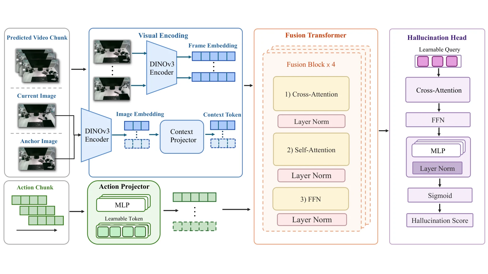

# 强化学习与世界模型：奖励优化、想象学习及执行校正

**更新日期**：2026-09-24

**报告标签**：强化与模仿学习, 世界模型, 数据与评测

> 区分优化视频生成器、在模型中学习机器人策略、把生成计划接地到物理控制三条路线，重点审查奖励代理、模型利用与真实执行证据。

本报告以现有馆藏为检索范围。正文区分方法事实、实验支持与综合判断；未完成全文核验的条目只作延伸线索，不据此建立定量排名。不同任务、输入权限、数据量和执行预算的成绩不直接横排。

物理规律、材料与接触约束，以及独立物理评价的系统比较，见[物理合理性专题](../../index.html#report=topic-physical-plausibility)。

[toc]

## 同样叫 reinforcement，优化对象可能完全不同

生成器通过GRPO获得更高几何奖励，与机器人通过交互获得更高任务回报，是两种学习问题。前者的“动作”可能是去噪步骤或生成轨迹；后者的动作是机器人实际控制。把二者都放进R1专题却不区分决策过程、奖励来源和真实反馈，会把视频质量提升误读为控制能力提升。

馆藏可以按三条主线整理：**生成器后训练**改善输出视频；**模型内策略优化**利用想象轨迹更新机器人策略；**物理执行学习**把参考运动落实到动力学约束下。候选搜索和教师蒸馏与它们相关，但不能仅凭on-policy或reward字样就归为RL。

## 三条主线与两类相邻方法

| 类别 | 学习或选择的对象 | 奖励/监督来自哪里 | 代表工作 |
| --- | --- | --- | --- |
| 视频生成后训练 | 视频扩散策略 | 几何重建、轨迹、物理规则、视觉偏好 | [VGGRPO](https://arxiv.org/abs/2603.26599)、[World-R1](https://arxiv.org/abs/2604.24764)、[PhysRVG](https://arxiv.org/abs/2601.11087)、[Stream4D](https://arxiv.org/abs/2608.19556) |
| 想象中的机器人策略优化 | VLA或控制策略 | 世界模型rollout及评分器 | [HaWMPO](https://arxiv.org/abs/2609.09941)、[Pelican-Sim](https://arxiv.org/abs/2609.12036)、[STICA](https://arxiv.org/abs/2511.14262) |
| 仿真/真实物理执行学习 | 跟踪策略、技能或风险敏感策略 | 模拟器状态、实际奖励、人工接管 | [生成视频计划的仿真接地](https://arxiv.org/abs/2609.10050)、[InterPrior](https://arxiv.org/abs/2602.06035)、[Intervention-Aware WM](https://arxiv.org/abs/2609.06009) |
| 推理时搜索与重排 | 从现有候选中选动作 | 预测价值、一致性或失败分数 | [Latent Policy Steering](https://arxiv.org/abs/2507.13340)、[World-Coherent Decoding](https://arxiv.org/abs/2609.02159) |
| 分布校正与蒸馏 | 学生网络 | 教师标注、监督损失 | [WAM-OPD](https://arxiv.org/abs/2608.22364)、[XPACE的恢复数据学习](https://arxiv.org/abs/2609.17372) |

[PhysisForcing](https://arxiv.org/abs/2606.28128) 的名称含Physics Reinforced，但核心是轨迹和语义关系对齐监督；[ProPhy](https://arxiv.org/abs/2512.05564) 通过物理标注及专家路由对齐。二者有助于理解物理约束，却不应替代真正策略梯度或回报优化方法的论证。

## 生成器奖励：必须问评分器偏爱了什么

VGGRPO用Latent Geometry Model直接从视频latent读取相机、点图等几何，计算平滑和重投影奖励，避免反复解码RGB后再估计几何。World-R1把生成结果提升到三维，组合重渲染、轨迹、视角判断和视觉质量奖励，并周期性降低3D奖励影响以缓解动态性损失。Stream4D改用动态4D重建及运动先验，针对静态几何奖励偏爱“少运动”的问题。

它们的共同风险是**优化评分器可测的部分，而非完整真实世界**。停止运动可以降低重投影误差；平滑错误轨迹可以提高平滑度；生成容易被重建网络理解的表面也可能提高几何评分。因而奖励提高后，应使用未参与训练的评价器、动态幅度/多样性指标及人工错误类型统计交叉检查。

PhysRVG将模仿稳定分支和物理奖励探索结合，作者报告纯RL初期不稳、全参数RL甚至在大batch下崩溃。它提示监督数据、参数约束和优化日程不是次要细节。不能把“加入物理reward”看成可直接复制到任意视频模型的通用配方。

## 模型内策略优化：幻觉会被策略主动利用

真实环境中罕见的“穿过物体”“抓住空气”在视频里可能显得成功；若评分器给高回报，策略会主动寻找这些区域。这个问题比平均预测误差更严重，因为优化会把访问分布推向模型最薄弱的地方。

图1：HaWMPO原文图2，幻觉感知模块HAM。预测视频、当前观察、初始锚点图像与动作共同输入网络，输出动作块级幻觉分数；分数越高表示预测越不可靠。[来源](https://arxiv.org/html/2609.09941#S3.F2)。

HaWMPO用幻觉感知分数调整Reward-Soft优化。在所选LIBERO设置中，成功率63.7%，相对初始策略48.7%和WMPO56.8%分别增加15.0与6.9个百分点。其幻觉检测在50个动作块上的AUROC为0.9375，但样本小、标签依赖人工定义；不能据此推断任何对象、动作和视界下都能正确识别模型误差。

Pelican-Sim把生成、策略评价、动作选择和优化串在一起，展示世界模型作为数据及回报来源的潜力。但同一个VLM评分器参与筛选和评价时，要防止循环验证。五个checkpoint上0.994的相关系数是很小样本的相关，不等于跨任务的绝对成功率校准。

STICA及[FIOC-WM](https://arxiv.org/abs/2511.02225)将对象状态、交互结构和策略学习连接起来；结构可以减少无关背景，但对象注意力或dependency score不自动构成真实因果图。[CBM](https://arxiv.org/abs/2401.12497)提供了更明确的奖励祖先状态抽象，在因子化低维状态及受控干预假设下评估复用；不能无条件外推到像素输入。

## 物理接地：生成计划是参考，不是控制真值

生成视频计划的仿真接地工作先筛选视频、重建手物轨迹，再用tracking-style RL学习可执行控制。其四种未见实机抓取位置各10次，共27/40成功，说明生成先验能经物理训练转为行为；人工筛选、HOI重建和模拟器共同提供了约束，不能只归功于视频模型。

InterPrior从参考模仿专家蒸馏可复用目标条件技能，再通过RL改善分布外执行。Intervention-Aware WM把人类接管概率加入潜在世界模型，联合优化回报和风险。这类方法能使用真实失败信号，但“操作者接管”包含个人阈值、经验和任务偏好，不等同客观危险的无偏标签。

## 哪些相似方法不能混算成RL收益

Latent Policy Steering用世界模型评价现有候选，策略候选若缺少正确动作，再准确的评分也无法选出成功行为。其30-demo平均仅33.2→35.5，horizon24时还可能低于行为克隆，展示了候选覆盖与多步误差的限制。

WAM-OPD通过冻结教师标注学生访问的历史，用监督蒸馏修复部署分布；on-policy描述采样来源，不等于使用回报优化。XPACE生成偏离专家后的恢复经验并过滤后再训练，也应先按合成数据学习分析，除非具体阶段明确采用RL目标。

## 如何设计可信的改进实验

| 问题 | 必要对照 | 应报告的失败 |
| --- | --- | --- |
| 奖励是否只被“刷高” | 未参与训练的评分器、真值状态、动态幅度匹配 | 低运动、重复纹理、伪接触等投机行为 |
| 世界模型是否提供有效学习信号 | 相同真实数据和rollout预算的无模型/不更新对照 | 长视界误差、分布外动作、错误高置信 |
| 搜索还是学习带来收益 | 固定候选数，比较只重排与更新策略 | 候选集中没有正确行为 |
| 更新是否真的值得执行 | 同状态分叉、更新与保持成对评估 | 更新失败、策略退化和所有被丢弃尝试 |

最后一项可借鉴[世界模型更新价值协议](https://arxiv.org/abs/2609.10954)：三任务全尝试平均更新收益均为负，说明固定微调机制不一定有益。它并非否定RL，而是要求把“每次更新都应变好”的假设变成可检验命题。

## 综合判断与阅读路线

**综合判断：**几何奖励解决输出约束，想象学习解决真实交互成本，物理控制学习解决参考到执行的可行性；三者可以组合，但误差也会相乘。最值得关注的不是采用GRPO还是其他算法的名称，而是奖励能否被操纵、模型在哪些访问分布可信，以及真实执行是否独立验证了改进。

先比较VGGRPO/World-R1/Stream4D的奖励来源，再读HaWMPO与Pelican-Sim的模型内学习；随后用视频计划接地和Intervention-Aware WM补足真实/仿真反馈，最后以更新价值协议检查收益归因。

## 参考文献与馆藏入口

以下按正文首次出现顺序列出；原始论文、详细卡片与本报告中的跨论文判断分别保留。

1. [VGGRPO: Towards World-Consistent Video Generation with 4D Latent Reward](https://arxiv.org/abs/2603.26599) · [馆藏卡片](../../index.html#paper=arxiv-2603-26599)
2. [World-R1: Reinforcing 3D Constraints for Text-to-Video Generation](https://arxiv.org/abs/2604.24764) · [馆藏卡片](../../index.html#paper=arxiv-2604-24764)
3. [PhysRVG: Physics-Aware Unified Reinforcement Learning for Video Generative Models](https://arxiv.org/abs/2601.11087) · [馆藏卡片](../../index.html#paper=arxiv-2601-11087)
4. [Stream4D: 4D-Consistency for Streaming Autoregressive Diffusion Video Models](https://arxiv.org/abs/2608.19556) · [馆藏卡片](../../index.html#paper=arxiv-2608-19556)
5. [HaWMPO: Hallucination-Aware World Model-based Policy Optimization for Generalist Robot Policy](https://arxiv.org/abs/2609.09941) · [馆藏卡片](../../index.html#paper=arxiv-2609-09941)
6. [Pelican-Sim 1.0: A General World Model Simulator for Embodied Intelligence](https://arxiv.org/abs/2609.12036) · [馆藏卡片](../../index.html#paper=arxiv-2609-12036)
7. [Object-Centric World Models for Causality-Aware Reinforcement Learning](https://arxiv.org/abs/2511.14262) · [馆藏卡片](../../index.html#paper=arxiv-2511-14262)
8. [Grounding Generated Video Plans in Simulation Towards Versatile Dexterous Controllers](https://arxiv.org/abs/2609.10050) · [馆藏卡片](../../index.html#paper=arxiv-2609-10050)
9. [InterPrior: Scaling Generative Control for Physics-Based Human-Object Interactions](https://arxiv.org/abs/2602.06035) · [馆藏卡片](../../index.html#paper=arxiv-2602-06035)
10. [How to Learn from What a Human Would Avoid? Intervention-Aware World Models with Real-World RL for Dexterous Manipulation](https://arxiv.org/abs/2609.06009) · [馆藏卡片](../../index.html#paper=arxiv-2609-06009)
11. [Latent Policy Steering with Embodiment-Agnostic Pretrained World Models](https://arxiv.org/abs/2507.13340) · [馆藏卡片](../../index.html#paper=arxiv-2507-13340)
12. [World-Coherent Decoding: Self-Verifying Test-Time Planning for World Action Models](https://arxiv.org/abs/2609.02159) · [馆藏卡片](../../index.html#paper=arxiv-2609-02159)
13. [WAM-OPD: On-Policy Distillation for World Action Models](https://arxiv.org/abs/2608.22364) · [馆藏卡片](../../index.html#paper=arxiv-2608-22364)
14. [XPACE: Joint World and Action Modeling from Heterogeneous Experience](https://arxiv.org/abs/2609.17372) · [馆藏卡片](../../index.html#paper=arxiv-2609-17372)
15. [PhysisForcing: Physics Reinforced World Simulator for Robotic Manipulation](https://arxiv.org/abs/2606.28128) · [馆藏卡片](../../index.html#paper=arxiv-2606-28128)
16. [ProPhy: Progressive Physical Alignment for Dynamic World Simulation](https://arxiv.org/abs/2512.05564) · [馆藏卡片](../../index.html#paper=arxiv-2512-05564)
17. [Learning Interactive World Model for Object-Centric Reinforcement Learning](https://arxiv.org/abs/2511.02225) · [馆藏卡片](../../index.html#paper=arxiv-2511-02225)
18. [Building Minimal and Reusable Causal State Abstractions for Reinforcement Learning](https://arxiv.org/abs/2401.12497) · [馆藏卡片](../../index.html#paper=arxiv-2401-12497)
19. [Measuring the Value of World-Model Updates: A Counterfactual Utility Protocol for Continual Adaptation](https://arxiv.org/abs/2609.10954) · [馆藏卡片](../../index.html#paper=arxiv-2609-10954)
