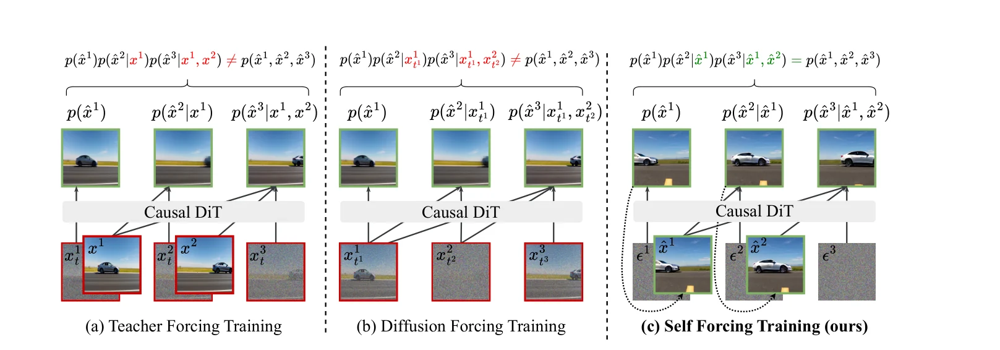
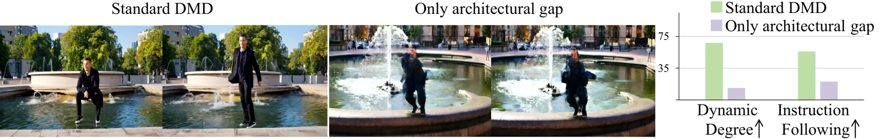
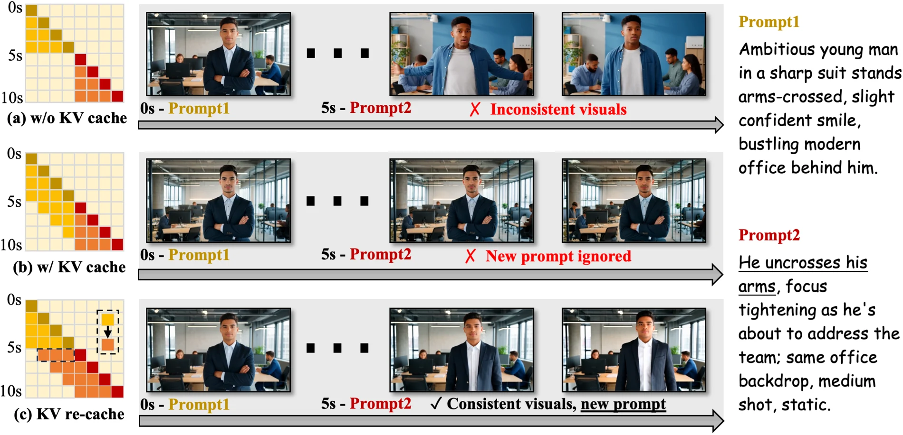

# 流式与自回归交互视频生成：蒸馏、长程记忆、几何控制与实时系统

**更新日期**：2026-09-24
**报告标签**：视频生成, 自回归扩散, 交互世界模型

> 流式生成要同时解决四件事：快速产出下一段、让模型适应自己的历史、在有限缓存下保持世界连续，以及让新控制及时影响画面。少步采样、自回归注意力、长期记忆和动作服从相互关联，却不能互相替代。

本专题恢复原“自回归交互视频”独立入口，保留[原十篇逐项精读](../reports/2026-08-21_ar_interactive_video.md)，在其基础上梳理15篇馆藏的技术关系，并补入几何奖励、在线4D控制和重访记忆。原精读中的方法、实验和复现细节继续可读；本篇重点建立跨论文框架。基础链路已核对原始论文，新增五项核对全文方法与评测设计；未逐项复核的速度或排名不作定量结论。

[toc]

## 1. 什么才算流式交互：必须同时量延迟、吞吐与控制响应

自回归表示按时间顺序生成，流式表示生成过程中持续输出；两者都不保证实时。一个系统可以每段算很久、最后以24FPS播放，仍不是24FPS的实时生成器。首帧很快，也不代表长期吞吐足以覆盖播放速度。

在交互系统中还存在第三个时间：用户发出新动作后，多久才能看到其影响。已提交的生成块、旧条件的KV缓存、视频解码和输出队列都会增加这段时间。因此最小性能报告应包括首帧延迟、稳态端到端FPS、控制到画面延迟、分辨率、块长、采样步数、GPU型号/数量、VAE是否计入。

| 层次 | 直接解决的问题 | 代表工作 | 单独不能保证的能力 |
| --- | --- | --- | --- |
| 少步分布匹配 | 降低生成所需网络前向次数 | [DMD](https://arxiv.org/abs/2311.18828)、[DMD2](https://arxiv.org/abs/2405.14867) | 图像蒸馏本身没有视频历史与交互 |
| 因果视频生成 | 先生成前段，不必等待整片联合求解 | [CausVid](https://arxiv.org/abs/2412.07772)、[MAGI-1](https://arxiv.org/abs/2505.13211) | 模型能无限长外推或立即响应用户 |
| 训练—执行分布匹配 | 学会条件在自己生成的历史上 | [Self Forcing](https://arxiv.org/abs/2506.08009) | 不自动解决所有初始化和缓存问题 |
| 因果学生初始化 | 使蒸馏目标适合因果信息约束 | [Causal Forcing](https://arxiv.org/abs/2602.02214)、[Causal Forcing++](https://arxiv.org/abs/2605.15141) | 不自动获得长期记忆和物理一致性 |
| 长程与系统效率 | 窗口、缓存、提示切换、量化与并行 | [LongLive](https://arxiv.org/abs/2509.22622)、[LongLive-2.0](https://arxiv.org/abs/2605.18739) | 高FPS不等于动作后果正确 |
| 在线世界控制 | 给少步因果模型接入相机/对象控制 | [minWM](https://arxiv.org/abs/2605.30263)、[4DStreamCtrl](https://arxiv.org/abs/2608.25479) | 几何控制不是力学模拟 |
| 一致性与记忆 | 动态结构奖励、重访、几何更新 | [Stream4D](https://arxiv.org/abs/2608.19556)、[Matrix-Game 3.5](https://arxiv.org/abs/2608.29910)、[R2M-Bench](https://arxiv.org/abs/2608.27328)、[Streaming4D](https://arxiv.org/abs/2609.00610) | 自一致不等于真实环境状态正确 |

这是一组可组合的技术维度，不是一条后者完全替代前者的排行榜。文献中的causal通常指时间注意力或信息可用性约束，不是结构因果模型。

## 2. 从DMD到CausVid：分布匹配为什么能减少采样步数

DMD不要求学生逐步复制教师的全部去噪过程，而是让少步生成分布接近教师分布。冻结的目标score描述教师分布，在线fake score拟合学生当前分布，两者之差提供分布匹配梯度；初版另用ODE样本对回归约束稳定训练。[DMD原文](https://arxiv.org/html/2311.18828)。

DMD2移除昂贵的ODE回归集，通过更频繁的fake-score更新减小梯度滞后，加入GAN损失提升质量；多步版本模拟更接近推理态的输入。该改进不是无代价的：fake score更新增加训练工作，GAN使用真实数据，也引入额外优化权衡。[DMD2原文](https://arxiv.org/html/2405.14867)。

CausVid把双向视频教师的能力迁移到因果、少步学生，用不对称分布匹配让学生可逐段输出。这里的架构差异很重要：教师可能同时访问整片，学生只能看过去。MAGI-1提供原生块级自回归flow模型的对照，说明自回归并不必须从DMD蒸馏而来；其开源模型规模、步数与延迟也不能与蒸馏1.3B学生混为同预算比较。[CausVid](https://arxiv.org/html/2412.07772)；[MAGI-1](https://arxiv.org/html/2505.13211)。

**综合分析：**蒸馏目标决定“少步模型应该生成怎样的分布”，历史输入协议决定“它在什么上下文下学习生成”。只有优化分布目标，而忽略历史来自真值还是模型自己，仍可能在长rollout中崩坏。

## 3. Self Forcing：训练必须遇到自己制造的历史

Teacher forcing使用真实或教师历史，部署却使用学生自己的输出；早期微小误差会改变后续输入，形成暴露偏差。Self Forcing直接进行自回归rollout，让下一块读取已生成历史的KV，再对学生实际访问的输出分布施加DMD、SiD或GAN等损失。它的核心贡献是训练输入分布，而不只是新换一种蒸馏损失。[原文](https://arxiv.org/html/2506.08009)。

图1：Self Forcing原文图1。训练中生成自己的前缀，减少训练历史与部署历史的差别。[原图与图注](https://arxiv.org/html/2506.08009)。

为控制内存，训练只对选定去噪步回传，缓存中的历史不进行完整反向传播。这样提高可训练性，但长程信用分配仍受截断影响。rolling KV又引入另一种分布差异：首块离开窗口后，缓存统计可能改变；论文以训练期屏蔽首块访问缓解闪烁。因此“用self rollout训练”与“缓存窗口怎么移动”应联合考虑。

frame-wise与chunk-wise也存在取舍。小块降低首次输出和控制生效的等待，却减少块内联合建模范围、增加调度频率；大块通常吞吐更好，但新控制可能需要等当前块结束。应直接测控制延迟，而不是只从FPS推断交互体验。

## 4. Causal Forcing系列：修正初始化目标，再降低轨迹制作成本

Causal Forcing指出，双向教师的整片ODE轨迹不一定是因果学生易于学习的映射。它先训练因果多步教师，再用该教师构造适合因果条件的ODE数据初始化少步学生，最后使用self-rollout分布匹配。其对照强调：相近DMD预算下，初始化仍会影响最终运动与指令跟随。[原文](https://arxiv.org/html/2602.02214)。

图2：Causal Forcing原文图3。“Standard DMD”与“Only architectural gap”条件下的生成对照及运动、指令跟随指标，展示教师—学生架构差异造成的退化。[原图与图注](https://arxiv.org/html/2602.02214)。

Causal Forcing++进一步用因果consistency distillation替代昂贵的离线因果ODE数据制作，保留后续分布匹配。其Stage 2受控比较将成本由11,600降到2,900 GPU·h，避免约1,900 GiB额外轨迹存储；这些是特定训练配置，不是任何视频模型都固定四倍加速。[原文](https://arxiv.org/html/2605.15141)。

必须注意“1-step/2-step”的口径：CF++的相关设置仍让第一帧使用4步，后续帧再减少步数。首帧延迟因此不会按全片平均步数同比下降；若测速排除了VAE，更不能直接等同端到端显示延迟。1-step也有更明显的指令与语义损失。

**综合分析：**Self Forcing解决学生历史分布，Causal Forcing解决初始化的信息约束，CF++解决初始化的数据/计算成本。三者是递进且部分正交的问题，不宜都概括成“更快的自回归扩散”。

## 5. LongLive：有限缓存怎样支持长视频和提示切换

LongLive面向超过短训练片段的流式生成。局部窗口控制内存，sink tokens提供稳定参照，长序列训练让模型接触更接近部署的缓存状态。提示变化后，旧KV含有旧文本影响：直接保留可能不服从新提示，清空又容易丢主体与背景；KV-recache重新编码历史，在延续内容和新条件之间折中。[原文](https://arxiv.org/html/2509.22622)。

图3：LongLive原文KV-recache示意。提示切换时，清空缓存损害视觉延续，直接保留缓存可能忽略新提示；重算缓存在二者之间取得折中。[原图与图注](https://arxiv.org/html/2509.22622)。

缓存只是用于注意力的计算状态，不天然等于持久世界状态。一个物体离开窗口后，sink与局部上下文可能保留外观线索，却没有保证其位置、开合状态或物品数量仍被准确记录。更长视频和更强重访记忆要分别验证。

LongLive-2.0把长视频训练、少步LoRA、NVFP4、序列并行、KV量化和异步VAE解码组合成系统。5B模型BF16为24.8 FPS/VBench 85.06，NVFP4 2-step为45.7 FPS/83.14，显示速度与质量有实际交换；其分辨率、Blackwell集群及端到端实现是数字的一部分。[原文](https://arxiv.org/html/2605.18739)。

量化节省的计算是否变成可见延迟收益，还取决于VAE、通信、缓存解量化和输出排队是否成为瓶颈。原生NVFP4的硬件收益也不能直接套到H100或A100。

## 6. 从文本续写到在线控制：minWM与4DStreamCtrl

minWM把相机条件接入双向基座，再经历因果适配、初始化和少步分布匹配；其PRoPE用投影关系将相机几何注入注意力。它表明控制条件需要贯穿教师、学生与score模型，而不是最后给少步模型附一个接口。[原文](https://arxiv.org/html/2605.30263)。

其数据对照也很有价值：在所测管线里，直接用感知估计的真实视频相机标签不一定能学到可靠控制，重建后渲染的受控相机数据更可用。这将问题指向控制标签质量、几何对齐与覆盖，而非单纯模型容量。

4DStreamCtrl把相机、物体运动与深度控制统一到三维轨迹条件，先训练可控模型，再蒸馏为少步流式学生。相较只有二维点移动，它能表达视角与对象的空间运动；但监督依赖单目三维估计，固定轨迹表示及学生蒸馏误差仍限制可靠性。[原文](https://arxiv.org/html/2608.25479)。

**综合分析：**控制表示至少应分清相机改变、执行器运动和对象响应。给定物体未来轨迹后忠实渲染，与仅给定手/机器人动作后推断物体响应，是两个难度不同的任务；评测不能把前者的高服从度解释成已经学会接触动力学。手部控制的细分讨论见[手物交互重建与生成](../../index.html#report=topic-contact-hoi)。

## 7. 几何、动态与重访：三个相似名称背后的不同任务

Stream4D是流式视频模型的后训练奖励设计。它指出静态三维重建评价可能偏好冻结画面，于是以动态4D重建、运动幅度与平滑/刚性约束、感知锚点共同评价rollout。其证据支持所测流式骨干上的一致性与运动保持；重建器偏差、自重建奖励以及场景依赖的运动先验仍需要独立评测。[原文](https://arxiv.org/html/2608.19556)。

Streaming4D则研究分块视频生成与增量重建的调度，让已生成块尽早进入几何更新，减少等待整段生成完成的串行成本。它主要回答怎样更快产出4D结果；不能与Stream4D的奖励学习混为同一方法，流水线并行也不自动降低长期状态误差。[原文](https://arxiv.org/html/2609.00610)。

Matrix-Game 3.5引入patch memory，在少步流式模型中检索历史几何/外观信息，并处理静态场景与动态主体。它代表把长期记忆作为独立模块维护的方向；若检索匹配或动态状态过期，旧记忆也可能把错误重新带回画面。本篇不将未经统一硬件和协议核对的速度数字用于排名。[原文](https://arxiv.org/html/2608.29910)。

R2M-Bench提供检验记忆的关键对照：首访与重访相似，可能只是整个视频没怎么变化。它用同rollout内时间间隔匹配的非重访对及短程对作为控制，考察重访是否具有额外一致性。该度量比直接帧相似更有针对性，但仍依赖重访检测和视觉代理，不等于完整验证隐藏对象状态。[原文](https://arxiv.org/html/2608.27328)。

| 能力 | 最直接的验证 | 容易混淆的替代指标 |
| --- | --- | --- |
| 动态几何一致性 | 固定控制下的轨迹、深度、身份及运动幅度 | 高静态重建分，但物体停止运动 |
| 重访记忆 | 与时间间隔匹配的非重访比较，再核对状态变化 | 两帧很像，却没有真正离开或发生变化 |
| 动作服从 | 多种合法动作，包括非专家动作及无效接触 | 只在专家轨迹上得到合理视频 |
| 物理后果 | 同场景改变力度、作用点或负载 | 给定未来对象轨迹后渲染正确 |
| 系统实时性 | 实测控制到画面的延迟及长时端到端吞吐 | 保存视频的播放FPS或只算DiT耗时 |

## 8. 关键实验：避免把不同协议拼成一个速度排行榜

| 工作与设置 | 证据 | 使用限制 |
| --- | --- | --- |
| Self Forcing，论文H100口径 | chunk-wise 17.0 FPS/首帧0.69 s；frame-wise 8.9 FPS/0.45 s | 小块首帧更快、吞吐更低；其他硬件演示另算 |
| Causal Forcing，同表对照 | Dynamic Degree 68，Self Forcing为57；VBench Total 84.04对83.74 | 运动分数的相对提升不是VBench总分提升19.3%；部分指标使用作者高运动prompt子集 |
| CF++，Stage 2初始化 | 因果CD 2,900 GPU·h，对照因果ODE 11,600 GPU·h | 成本含不同轨迹制作方式；不代表整条训练链都省四倍 |
| LongLive，提示切换消融 | KV-recache的主体一致性94.04，清空缓存89.59；清空缓存CLIP反而略高 | 指令贴合与身份保持存在取舍，不能只报一列 |
| LongLive-2.0，5B端到端 | BF16 24.8 FPS/85.06；NVFP4 2-step 45.7 FPS/83.14 | 720p、指定Blackwell集群；硬件、步数和质量一起报告 |

对应原始证据分别见[Self Forcing](https://arxiv.org/html/2506.08009)、[Causal Forcing](https://arxiv.org/html/2602.02214)、[CF++](https://arxiv.org/html/2605.15141)、[LongLive](https://arxiv.org/html/2509.22622)、[LongLive-2.0](https://arxiv.org/html/2605.18739)。更多数据、损失和代码状态保留于[原十篇精读](../reports/2026-08-21_ar_interactive_video.md)。

## 9. 综合分析：构建流式交互系统时，应按什么顺序验证

首先确定接口：文本切换、相机控制、三维对象轨迹与机器人动作分别需要不同监督。随后确定块长与端到端延迟预算，再选择少步蒸馏和训练历史协议；否则离线质量最佳的配置可能无法满足交互响应。

接着验证两个独立闭环。**生成闭环**检查模型使用自身前缀与真实部署缓存时是否稳定；**交互闭环**检查新输入是否及时、正确地改变世界，以及对象离开视野后能否恢复应有状态。长时质量不能只用短片平均指标外推。

最后检查几何和记忆模块是否带来可归因收益。固定生成器与控制输入，分别加入动态奖励、记忆检索和状态更新；评测静止、快速运动、遮挡重访、对象状态改变和错误控制。在速度之外报告错误积累、恢复能力与新增计算。这样才能区分“运行得更快”“持续得更久”“保持得更准”和“真正按动作演化”。

阅读顺序：DMD/DMD2建立分布匹配概念，CausVid→Self Forcing理解因果学生与自生成历史，再读Causal Forcing/CF++的初始化；LongLive/LongLive-2.0理解长期缓存与系统实现；minWM/4DStreamCtrl接入控制；最后以Stream4D、Matrix-Game 3.5和R2M-Bench审查几何与记忆。MAGI-1作为原生块级AR对照，Streaming4D作为生成—重建流水线对照。

## 参考文献与馆藏入口

15篇馆藏按首次出现顺序列出。恢复后的报告沿用原报告ID，已有分享链接继续有效。

1. [One-step Diffusion with Distribution Matching Distillation](https://arxiv.org/abs/2311.18828) · [馆藏卡片](../../index.html#paper=arxiv-2311-18828)

2. [Improved Distribution Matching Distillation for Fast Image Synthesis](https://arxiv.org/abs/2405.14867) · [馆藏卡片](../../index.html#paper=arxiv-2405-14867)

3. [From Slow Bidirectional to Fast Autoregressive Video Diffusion Models](https://arxiv.org/abs/2412.07772) · [馆藏卡片](../../index.html#paper=arxiv-2412-07772)

4. [MAGI-1: Autoregressive Video Generation at Scale](https://arxiv.org/abs/2505.13211) · [馆藏卡片](../../index.html#paper=arxiv-2505-13211)

5. [Self Forcing: Bridging the Train-Test Gap in Autoregressive Video Diffusion](https://arxiv.org/abs/2506.08009) · [馆藏卡片](../../index.html#paper=arxiv-2506-08009)

6. [Causal Forcing: Autoregressive Diffusion Distillation Done Right for High-Quality Real-Time Interactive Video Generation](https://arxiv.org/abs/2602.02214) · [馆藏卡片](../../index.html#paper=arxiv-2602-02214)

7. [Causal Forcing++: Scalable Few-Step Autoregressive Diffusion Distillation for Real-Time Interactive Video Generation](https://arxiv.org/abs/2605.15141) · [馆藏卡片](../../index.html#paper=arxiv-2605-15141)

8. [LongLive: Real-time Interactive Long Video Generation](https://arxiv.org/abs/2509.22622) · [馆藏卡片](../../index.html#paper=arxiv-2509-22622)

9. [LongLive-2.0: An NVFP4 Parallel Infrastructure for Long Video Generation](https://arxiv.org/abs/2605.18739) · [馆藏卡片](../../index.html#paper=arxiv-2605-18739)

10. [minWM: A Full-Stack Open-Source Framework for Real-Time Interactive Video World Models](https://arxiv.org/abs/2605.30263) · [馆藏卡片](../../index.html#paper=arxiv-2605-30263)

11. [4DStreamCtrl: Interactive Video Generation with Online 4D Control](https://arxiv.org/abs/2608.25479) · [馆藏卡片](../../index.html#paper=arxiv-2608-25479)

12. [Stream4D: 4D-Consistency for Streaming Autoregressive Diffusion Video Models](https://arxiv.org/abs/2608.19556) · [馆藏卡片](../../index.html#paper=arxiv-2608-19556)

13. [Matrix-Game 3.5: Enhancing Real-Time Streaming Interactive World Models with Patch Memory](https://arxiv.org/abs/2608.29910) · [馆藏卡片](../../index.html#paper=arxiv-2608-29910)

14. [R2M-Bench: Evaluating Revisit Memory via Relative Consistency in Interactive Video World Models](https://arxiv.org/abs/2608.27328) · [馆藏卡片](../../index.html#paper=arxiv-2608-27328)

15. [Streaming4D: Accelerate 4D World Models via Block-wise Video Generation and Incremental Reconstruction](https://arxiv.org/abs/2609.00610) · [馆藏卡片](../../index.html#paper=arxiv-2609-00610)
