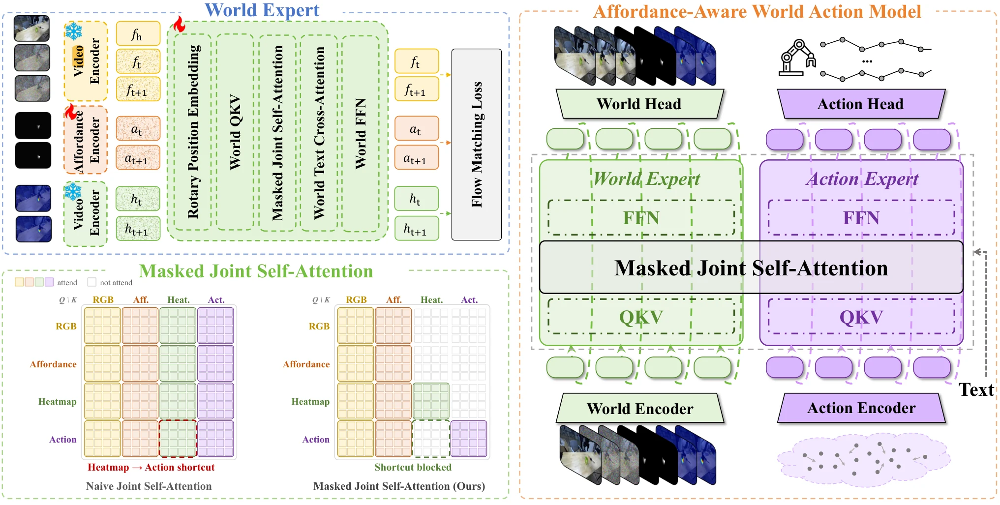

# Visual Action：从视觉运动到跨本体动作接口

**更新日期**：2026-09-24

**报告标签**：动作表征, 跨本体迁移, World Action Model

> 按控制意图、实际运动与环境响应区分视觉动作，比较渲染、光流、轨迹、骨架和潜在动作，并审查它们怎样变成可执行控制。

本报告以现有馆藏为检索范围。正文区分方法事实、实验支持与综合判断；未完成全文核验的条目只作延伸线索，不据此建立定量排名。不同任务、输入权限、数据量和执行预算的成绩不直接横排。

[toc]

## 核心判断：统一接口，首先要统一“动作”指什么

视觉动作的共同目标，是让人类视频、机器人轨迹和视频生成器共享一种描述运动的语言。但馆藏中至少混用了三类变量：**执行前给定的控制意图、执行器实际发生的运动、接触后环境发生的变化**。三者在成功示范中高度相关，在卡住、滑落、碰撞或控制误差出现时会分离。

例如“夹爪向左移10厘米”是命令；视频中夹爪只移动2厘米是实现结果；杯子被推倒是环境响应。把后两者写成输入条件，可以使未来预测更准，却可能把本应预测的答案提前提供给模型。系统设计必须先说明视觉动作来自规划、运动学渲染、当前感知，还是未来真实视频。

本专题聚焦动作接口本身。几何监督如何进入整个 WAM 的架构，仍以精品报告《3D/4D Geometric World Action Model》为主；这里不重写其论证。

## 五条路线：表达能力与获取代价的交换

| 路线 | 典型工作 | 保留的关键信息 | 成为控制接口还缺什么 |
| --- | --- | --- | --- |
| 渲染的主体运动 | [Visual Action Prompts](https://arxiv.org/abs/2508.13104)、[Robot-Factored WM](https://arxiv.org/abs/2607.22535)、[GeniWorld](https://arxiv.org/abs/2608.06332) | 机器人外形、相机投影与期望运动 | 本体模型、标定、控制器；名义运动与真实接触后运动的区别 |
| 稠密二维运动 | [FlowWAM](https://arxiv.org/abs/2607.13017)、[FlowVLA](https://arxiv.org/abs/2508.18269) | 每个可见像素的位移 | 相机运动分解、遮挡处理及本体动作解码 |
| 稀疏二维/三维轨迹 | [TrAct](https://arxiv.org/abs/2608.24101)、[PointAction](https://arxiv.org/abs/2606.03943)、[TraceGen](https://arxiv.org/abs/2511.21690)、[μ₀](https://arxiv.org/abs/2606.13769) | 可寻址点的持续运动 | 点身份、尺度、不可见部分及可达性 |
| 结构化骨架与交互区域 | [Skel-WAM](https://arxiv.org/abs/2609.21514)、[SkelWAM](https://arxiv.org/abs/2609.21983)、[AffordanceWAM](https://arxiv.org/abs/2609.22332) | 手/臂的共享拓扑，或任务相关区域 | 本体专属解码、接触模式与力学约束 |
| 学习的转移潜变量 | [Motus](https://arxiv.org/abs/2512.13030)、[RepWAM](https://arxiv.org/abs/2606.13674)、[WLA³](https://arxiv.org/abs/2609.15870) | 压缩后的观测变化及动作相关信息 | 表征是否混入外观、控制头是否真正依赖该变量 |

这不是从二维到三维、再到潜空间的线性升级。二维流容易从视频获得并复用视频骨干；三维轨迹更容易跨相机，但更依赖几何伪标签；潜变量灵活，却最难解释其中究竟包含了什么。应按数据和任务选接口，而不是把维度更高当作天然更优。

## 渲染动作：把运动学移出网络，也要隔离结果泄漏

Robot-Factored WM 的关键是**名义轨迹**：仅使用部署时已有的动作、初始状态、控制器和 URDF，在没有场景接触的环境里重放，再渲染机器人几何。网络负责预测名义动作进入真实场景后会发生什么。若用未来实测关节轨迹渲染条件，条件本身可能已经透露卡住、避障或失败结果。

其 DROID 泄漏审计中，nominal→nominal 的 LPIPS 为0.179，logged→logged 的 oracle 为0.174，而 logged训练→nominal测试恶化到0.187。更低离线误差不一定意味着更可部署；输入是否在决策时可得，优先于模型排行榜。Visual Action Prompts 的骨架方案也体现相同权衡：DROID 中 skeleton/mesh/depth 的 FVD 为141.8/120.4/119.7，骨架的主要优势是获取与共享便利，而非最精确的条件。

## 光流与轨迹：动作意图和对象响应应分开建模

FlowWAM 以相同视频格式编码 RGB 与光流，共享冻结 VAE 和视频骨干。策略模式生成两种未来，并由动作专家读取中间特征；世界模型模式固定目标 flow，仅生成 RGB。其 RoboTwin 监督使用移除背景和物体运动后的 robot-only 渲染流，因此不能把它描述为已经显式预测接触后的物体响应。腕部流不可用的区域还采用常量占位。

TraceGen 将轨迹提升到参考相机的三维坐标，再预测机器人、物体和工具上的点；μ₀改为语义交互点、事件级语言和样条轨迹，并让动作专家读取去噪特征。它们增强了持久点身份与跨视角表达，但自动跟踪、相机估计和深度误差会在同一伪标签中叠加。轨迹几何合理，也仍可能超出新机器人的可达空间。

[What Matters for Latent Actions](https://arxiv.org/abs/2608.19613) 在统一协议下比较41项设计选择，发现语义特征差分可以很强，光流质量却不稳定转化为控制收益。与 FlowWAM 的积极结果并不矛盾：前者比较转移编码和预训练配方，后者把显式流视频与生成及动作专家联合设计。应比较完整接口及受控消融，不能从不同系统抽出一个编码器名称就排出普遍优劣。

## 骨架与可供性：分别回答“怎么动”和“在哪里交互”

图1：Skel-WAM 原文方法图。双手共享21点拓扑；人机数据训练视频—关键点先验，机器人数据训练专属动作专家。动作梯度不回传共享骨干。[原图出处](https://arxiv.org/html/2609.21514#S3)。

名称相近的 SkelWAM 采用整条手臂的25D中心线/TCP/夹爪表示，还规范化机器人外观。去掉视觉规范化或共享动作表示，迁移成功率从43.3%降到0.0%/0.1%；去掉世界建模仅降到43.0%。这组消融说明主要贡献是本体接口统一，不能把总体提升都归因于“预测未来”。

图2：AffordanceWAM 原文方法图。动作读取 RGB 和标量可供性，热图监督参与训练但不能成为动作的额外前向外观通道。[原图出处](https://arxiv.org/html/2609.22332#S3)。

可供性更适合共享对象与交互区域，而不是精确复刻人体关节。AffordanceWAM 中，无该接口时加入人类视频使 RoboCasa 57.3%→55.1%；有该接口时63.7%→69.4%。相同的数据增量产生相反方向，更直接说明迁移依赖监督接口，而不是只依赖人类视频数量。

## 哪些证据足以支持选型

| 证据 | 实际支持 | 不足以支持 |
| --- | --- | --- |
| FlowWAM 在 RoboTwin Clean/Random 为92.94%/92.14% | 该数据与训练协议下，显式流接口可支撑高成功率 | 光流在所有编码器、任务和本体上最优 |
| μ₀ 在 RoboCasa 为30.25%，π0.5为42% | 轨迹生成质量与控制优劣需要分别测 | 三维轨迹天然胜过直接动作策略 |
| 潜在动作研究真机317/400对259/400 | 受控配方使成功率提高14.5个百分点 | 任意自监督转移 latent 都有同等收益 |
| [动作编码不变性审计](https://arxiv.org/abs/2609.23252) 中绝对/相对动作改变预测 | 信息等价的输入编码也会改变模型行为 | 数值动作只是一个无关的实现细节 |

工程上先建立“数值动作直接预测”的匹配基线，再逐项加入视觉接口；固定演示、骨干、动作头和训练步数。应同时检查未来真实状态泄漏、相机扰动、错误视觉动作、错误对象响应以及目标本体解码失败。最终指标至少包含闭环成功、恢复能力、总延迟和几何/接触诊断。

## 综合判断与阅读顺序

**综合判断：**最值得复用的是清楚的变量分工：执行器意图可由骨架、渲染或轨迹表示，环境响应另行预测，本体控制由独立接口落实。对于纯视频预训练，潜在动作是可扩展入口；对于几何可测的操作，显式轨迹和骨架更易诊断；对于跨人机数据，可供性提供语义共享，但不能代替力和接触状态。

先读 Robot-Factored WM 的输入可用性审计，再读 FlowWAM 和潜在动作设计比较；随后对照 TraceGen/μ₀与两篇 Skel 工作，最后看 AffordanceWAM 的人类数据控制实验。TrAct 的馆藏证据仍偏摘要层面，可用于定位路线，不宜承担决定性的定量结论。

## 参考文献与馆藏入口

以下按正文首次出现顺序列出；原始论文、详细卡片与本报告中的跨论文判断分别保留。

1. [Precise Action-to-Video Generation Through Visual Action Prompts](https://arxiv.org/abs/2508.13104) · [馆藏卡片](../../index.html#paper=arxiv-2508-13104)
2. [Robot-Factored World Models via Robot Rendering](https://arxiv.org/abs/2607.22535) · [馆藏卡片](../../index.html#paper=arxiv-2607-22535)
3. [GeniWorld: A Generalizable Interactive World Model for Robotic Manipulation via Visual Actions](https://arxiv.org/abs/2608.06332) · [馆藏卡片](../../index.html#paper=arxiv-2608-06332)
4. [FlowWAM: Optical Flow as a Unified Action Representation for World Action Models](https://arxiv.org/abs/2607.13017) · [馆藏卡片](../../index.html#paper=arxiv-2607-13017)
5. [FlowVLA: Thinking in Motion with a Visual Chain of Thought](https://arxiv.org/abs/2508.18269) · [馆藏卡片](../../index.html#paper=arxiv-2508-18269)
6. [TrAct: Bridging Robot Control and Visual Prediction with Visual Tracks](https://arxiv.org/abs/2608.24101) · [馆藏卡片](../../index.html#paper=arxiv-2608-24101)
7. [PointAction: 3D Points as Universal Action Representations for Robot Control](https://arxiv.org/abs/2606.03943) · [馆藏卡片](../../index.html#paper=arxiv-2606-03943)
8. [TraceGen: World Modeling in 3D Trace Space Enables Learning from Cross-Embodiment Videos](https://arxiv.org/abs/2511.21690) · [馆藏卡片](../../index.html#paper=arxiv-2511-21690)
9. [μ₀: A Scalable 3D Interaction-Trace World Model](https://arxiv.org/abs/2606.13769) · [馆藏卡片](../../index.html#paper=arxiv-2606-13769)
10. [Skel-WAM: A Hand-Skeleton-Conditioned World Action Model for Human-to-Robot Manipulation Transfer](https://arxiv.org/abs/2609.21514) · [馆藏卡片](../../index.html#paper=arxiv-2609-21514)
11. [SkelWAM: A Skeleton-Guided World-Action Model for Zero-Shot Cross-Embodiment Manipulation](https://arxiv.org/abs/2609.21983) · [馆藏卡片](../../index.html#paper=arxiv-2609-21983)
12. [AffordanceWAM: Affordance-Aware Joint World-Action Modeling for Robot Manipulation](https://arxiv.org/abs/2609.22332) · [馆藏卡片](../../index.html#paper=arxiv-2609-22332)
13. [Motus: A Unified Latent Action World Model](https://arxiv.org/abs/2512.13030) · [馆藏卡片](../../index.html#paper=arxiv-2512-13030)
14. [RepWAM: World Action Modeling with Representation Visual-Action Tokenizers](https://arxiv.org/abs/2606.13674) · [馆藏卡片](../../index.html#paper=arxiv-2606-13674)
15. [WLA³: World Latent Action Modeling for Semantics, Dynamics, and Kinematics](https://arxiv.org/abs/2609.15870) · [馆藏卡片](../../index.html#paper=arxiv-2609-15870)
16. [What Matters for Latent Actions in Robot Learning](https://arxiv.org/abs/2608.19613) · [馆藏卡片](../../index.html#paper=arxiv-2608-19613)
17. [Robot World Models Are Not Invariant to How the Actions Are Written](https://arxiv.org/abs/2609.23252) · [馆藏卡片](../../index.html#paper=arxiv-2609-23252)
