# 3D/4D Geometric World Action Model

> 论文分享 · 党灵伟 · 2026.09.18 · 北京海国瑞业 F304  

## 目录

[TOC]

## 汇报框架

同样使用深度、点或轨迹，几何信息在模型里可能承担完全不同的职责：

1. **监督表示**：训练时告诉策略哪些空间信息值得保留。
2. **预测未来**：在几何空间描述未来状态，供动作解码或规划使用。
3. **连接控制与预测**：用点运动或轨迹连接不同本体、策略与世界模型。

本次围绕一个具体问题展开：

> 这些模型如何利用几何信息，帮助机器人学习和选择动作？

后文按照 **表示选择 → 几何监督 → 未来状态 → 运动接口 → 跨本体迁移** 展开。

- 注：分类依据是模型的主要使用方式，可能有交叉。PointWorld 同时采用几何状态和几何动作条件；GAM 同时承担未来预测与动作生成。

---

## 一、表示选择：人类视频中的什么信息值得迁移？

### 本章总览

| 论文 | 比较对象 | 几何的职责 | 动作接口 | 实验回答的问题 |
| --- | --- | --- | --- | --- |
| [EgoWAM](https://egowam.github.io/) | Pixel、DINO、3D motion flow | 未来预测监督 | 共享骨干＋动作头 | 相同框架下，不同预测目标能从人类视频迁移什么能力？ |

### 1.1 EgoWAM

**论文标题：** [EgoWAM: World Action Models Beyond Pixels with In-the-Wild Egocentric Human Data](https://egowam.github.io/)  
**来源：** 作者项目页，标注 CoRL 2026 在审。

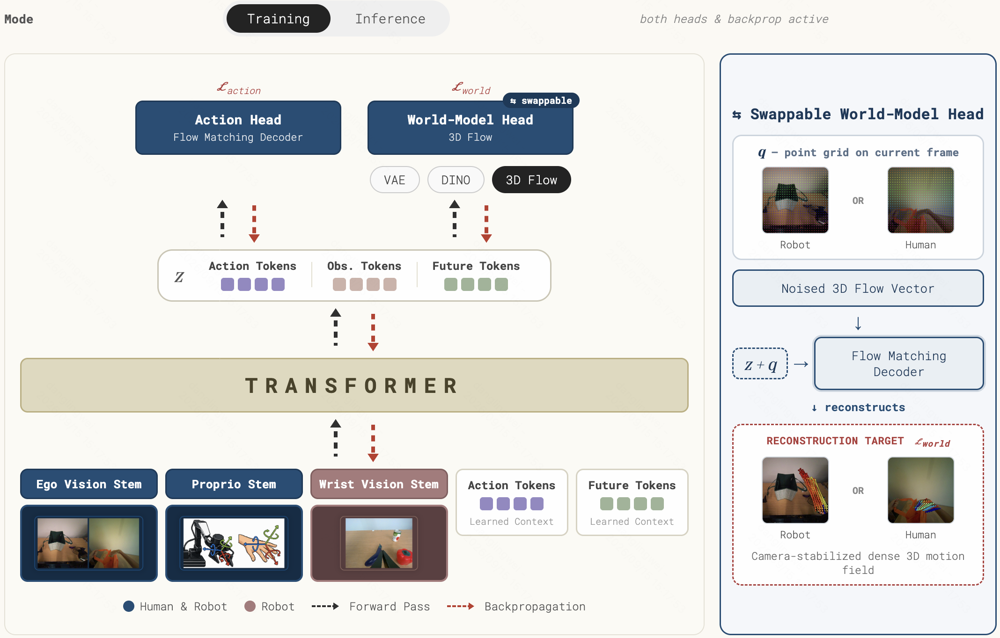

**核心 insight**

人类视频中的任务语义、物体运动与相机运动混合在一起。未来预测目标决定共享骨干保留哪些信息，因此也影响这些视频对机器人策略的帮助。

**方法概括**

- **输入：** 机器人示范、域内人类演示和自然第一视角人类视频。
- **过程：** 固定 HPT 骨干、动作头和数据配比，仅替换未来预测目标：Pixel、DINO 特征或 3D motion flow。
- **输出／部署：** 训练期联合学习动作与未来表示；推理期由策略输出机器人动作，世界预测头关闭。

**实验**

项目页在三个真实双臂任务中报告不同表示的收益分工：DINO 更突出新物体、新场景泛化，3D flow 更突出域内操作。Alignment Ablation 中，数据不对齐时 BC 为 20%，低于其 robot-only 的 40%，而 3D-flow 联合训练为 75%。这支持“预测目标影响对人机差异的承受能力”，完整统计和协议仍需以正式稿为准。[项目页 Performance / Alignment Ablation](https://egowam.github.io/)

**与主线的关系：** 将“预测什么”变成可比较的变量。下一章进一步探讨：这些监督怎样进入动作模型。

### 本章小结

表示的选择应对应需要迁移的能力。后续论文分别将几何放入训练监督、预测状态与动作接口，解决的瓶颈也随之变化。

## 二、几何作为监督：训练时学到什么，部署时留下什么？

### 本章总览

| 论文 | 几何表示／监督来源 | 作用位置 | 部署时保留什么 | 最有解释力的证据 |
| --- | --- | --- | --- | --- |
| [Spatial Forcing](https://arxiv.org/abs/2510.12276)   | VGGT 空间特征 | VLA 中间视觉表示对齐 | 经过对齐的策略 | 教师类型、对齐层与深度 probing |
| [Track4Action](https://arxiv.org/abs/2608.03727)   | 动作区间的 3D tracker 汇聚特征 | 学生 track queries 与动作头 | 当前观测学生路径 | 有／无 tracker 对齐的控制实验 |
| [WAM4D](https://arxiv.org/abs/2606.14048)   | registers 读出的未来深度 | 共享历史视频特征上的辅助梯度 | 视频—动作策略路径 | 几何头初始化与读出位置消融 |
| [MECo-WAM](https://arxiv.org/abs/2607.05468)   | VGGT 帧内及跨时刻几何关系 | 辅助 expert、渐退读取与关系蒸馏 | 原视频／动作专家 | 单独加 expert 与完整迁移机制的差异 |
| [GEM-4D](https://arxiv.org/abs/2605.22882)   | 稠密 4D 对应特征 | 视频与几何分支联合训练 | 视频生成与下游动作恢复 | 几何质量、仿真执行与人工视频评价 |

### 2.1 Spatial Forcing

**论文标题：** [Spatial Forcing: Implicit Spatial Representation Alignment for Vision-language-action Model](https://arxiv.org/abs/2510.12276)  

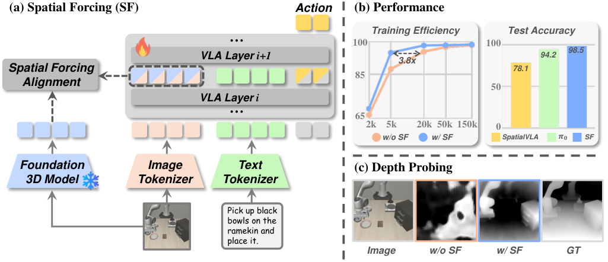

*原论文 Figure 1：左侧是几何教师与 VLA 中间层的对齐，右侧是训练效率、成功率和深度探测结果。[原图与图注](https://arxiv.org/html/2510.12276v2#S0.F1)*

**核心 insight**

几何模型可以提供可迁移的空间特征目标，让现有 VLA 的视觉表示保留更多三维信息，而不必改变机器人原生动作空间。

**方法概括**

- **输入：** 视觉、语言及机器人动作示范。
- **过程：** 冻结几何教师，将 VLA 某一层的视觉 token 投影并对齐到教师表示，同时学习动作。
- **输出／部署：** 使用经过空间对齐的 VLA 预测动作。

**实验**

Table 2 在相同 150K 训练步数、全量数据的组件实验中，对比无对齐、语义教师与几何教师：平均成功率分别为无对齐 92.7%、DINOv2 94.1%、VGGT 96.9%；VGGT 去掉位置编码为 94.7%。Figure 3 的深度 probing 则直接检查特征中的空间信息。这两类证据分别对应“表示含有什么”和“策略表现怎样”。[Tables 2–3 / Figure 3](https://arxiv.org/html/2510.12276v2)

**与主线的关系：** 提供几何作为外部教师的起点。Track4Action 将监督对象扩展到与动作区间对应的时序转移。

### 2.2 Track4Action

**论文标题：** [Track4Action: Distilling World-Centric 3D Tracker into Vision-Language-Action Policies](https://arxiv.org/abs/2608.03727)  

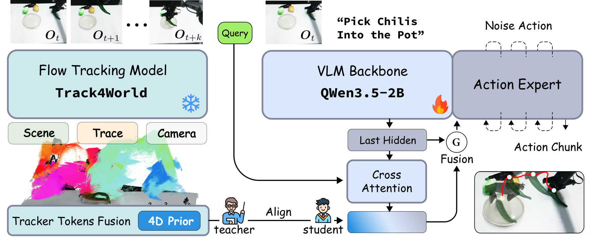

*原论文 Figure 2：左侧 tracker 读取完整示范区间；右侧学生由当前观测预测汇聚特征，经门控融合连接动作头。[原图与图注](https://arxiv.org/html/2608.03727v1#S2.F2)*

**核心 insight**

动作标签之外，同一段示范视频还记录了几何、运动和相机变化。可以将这段已发生的转移作为特权监督，训练只看当前观测的策略。

**方法概括**

- **输入：** 学生读取当前观测；冻结 Track4World 教师读取与 K 步动作对齐的 K+1 帧视频。
- **过程：** 汇聚教师的 scene、motion、camera 特征；学生 track queries 与其对齐，并通过 feature-wise gate 条件化动作头。
- **输出／部署：** 学生预测动作；教师及未来片段不参与推理，策略也无需输出逐点轨迹。

**实验**

| 对照 | 无 tracker 对齐 | Track4Action |
| --- | ---: | ---: |
| LIBERO 平均成功率 | 94.2% | 97.0% |
| LIBERO-Plus 零样本泛化 | 74.7% | 82.3% |
| 四个真实双臂任务平均成功率 | 42.5% | 67.5% |

真实实验每任务 10 次，指标为完整任务完成。相同学生框架中的有／无对齐比较，支持时序教师监督的贡献；真实任务的小样本规模限制了对细小差异的判断。[Tables 1–2 / Figure 4](https://arxiv.org/html/2608.03727v1)

**与主线的关系：** 时序几何可以被压缩成训练目标。下一篇更明确地区分前向读取与反向梯度。

### 2.3 WAM4D ✨

**论文标题：** [WAM4D: Fast 4D World Action Model via Spatial Register Tokens](https://arxiv.org/abs/2606.14048)  

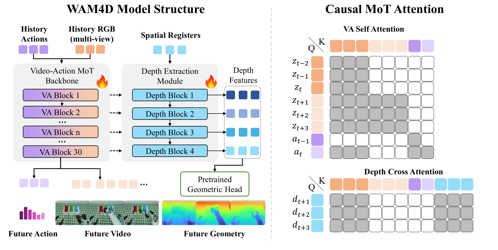

*原论文 Figure 2：左侧是寄存查询和几何读出，右侧展示视频—动作与深度分支的注意力结构。[原图与图注](https://arxiv.org/html/2606.14048v3#S3.F2)*

**核心 insight**

动作分支不读取几何 token，几何损失仍可通过共享历史特征改变策略。几何知识因此可以在训练时进入模型，而不要求部署时显式生成几何。

**方法概括**

- **输入：** 历史 RGB、历史动作、语言；未来 RGB、动作与深度提供训练目标。
- **过程：** spatial registers 仅读取自身和历史视频特征，经预训练几何头预测未来深度；深度梯度更新共享骨干。动作分支不读取 registers 和未来视频 token。
- **输出／部署：** 移除 registers、depth blocks 和几何头，仅预测动作块。

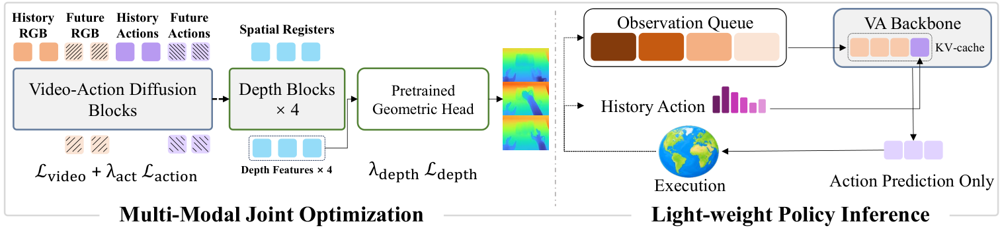

*原论文 Figure 3：左侧多目标训练，右侧动作推理。比较两侧可看出哪些几何组件被移除。[原图与图注](https://arxiv.org/html/2606.14048v3#S3.F3)*

**实验**

| 几何头设置 | 消融任务 Clean 成功率 |
| --- | ---: |
| 无深度监督 | 71.7% |
| 随机初始化、可训练 | 70.0% |
| 预训练初始化、冻结 | 75.2% |
| 预训练初始化、可训练 | 80.1% |

Table 8 支持“先验与读出方式影响辅助目标能否转化为控制收益”。Table 7 中视频指标和动作成功率最优的读出层不完全相同。全任务平均为 91.8%，与 Fast-WAM 持平、低于 LingBot-VA 的 92.3%；因此消融结果应解释为机制证据，而非所有设置下的优势。[Tables 1、7–8](https://arxiv.org/html/2606.14048v3)

**与主线的关系：** 分清前向信息和训练梯度。几何是否被动作直接读取，与几何是否影响策略，是两个问题。

### 2.4 MECo-WAM

**论文标题：** [Learning 4D Geometric Priors for Inference-Efficient World Action Models（MECo-WAM）](https://arxiv.org/abs/2607.05468)  

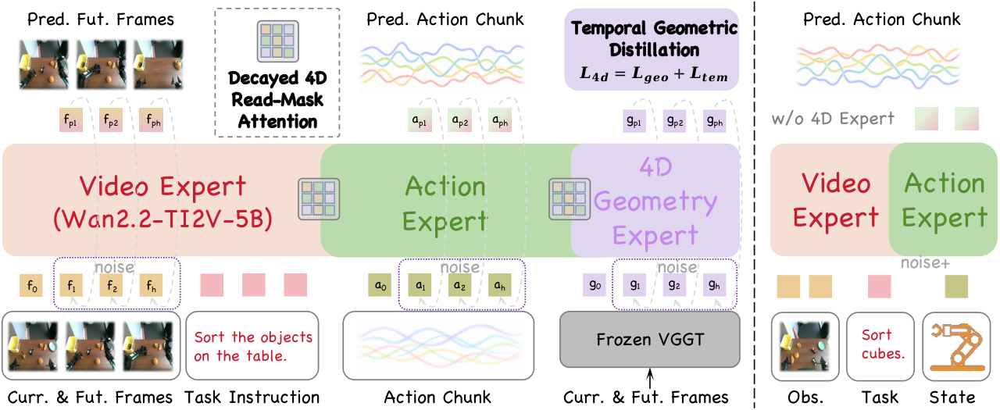

*原论文 Figure 2：训练时视频、动作、4D 几何专家共同学习，推理时保留视频和动作专家；沿用知域卡片的选图。[原图与图注](https://arxiv.org/html/2607.05468v1#Sx1.F2)*

**核心 insight**

辅助专家提供的几何知识，需要迁入最终用于控制的计算路径。MECo-WAM 通过逐渐撤去读取依赖，并蒸馏空间和时序关系，组织这个迁移过程。

**方法概括**

- **输入：** 视频、语言、动作，及冻结 VGGT 提供的几何关系目标。
- **过程：** 增加 4D expert；训练早期允许受限的当前几何读取，再逐步衰减；对齐帧内关系与跨时刻变化，并强调动作相关区域。
- **输出／部署：** 删除辅助 4D 组件，保持原视频—动作推理接口。

**实验**

Table 4 中，Fast-WAM 为 91.83%，单独增加 4D expert 为 91.87%，完整 MECo-WAM 为 92.62%。这说明该实验的收益主要出现在完整迁移设计中；总增益为 0.79 个百分点，需结合统计波动理解。Figure 4 的深度 probing 进一步检查部署特征是否保留几何信息。[Table 4 / Figure 4](https://arxiv.org/html/2607.05468v1)

**与主线的关系：** 与 WAM4D 对照几何知识的迁移机制：一个依靠未来深度读出，一个显式安排逐步撤去几何依赖。

### 2.5 GEM-4D

**论文标题：** [GEM-4D: Geometry-Enhanced Video World Models for Robot Manipulation](https://arxiv.org/abs/2605.22882)  

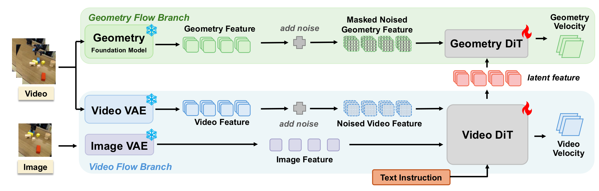

*原论文 Figure 2：视频 DiT 中间特征连接几何 DiT，分别学习视频和几何去噪；在线视频生成使用视频分支。[原图与图注](https://arxiv.org/html/2605.22882v4#S3.F2)*

**核心 insight**

视频模型的训练可以由时序几何对应约束，使未来生成保留空间和运动结构，再将生成结果用于动作恢复。

**方法概括**

- **输入：** 操作视频、语言和几何基础模型提供的稠密 4D 对应特征。
- **过程：** 视频分支与几何分支耦合训练；生成未来视频后，使用论文的 Adaptive Inverse Dynamic System 恢复动作。
- **输出／部署：** 预测视频及由下游系统获得的机器人轨迹。

**实验**

Table 3 比较深度监督、VGGT 特征与完整几何监督：真实视频域的点云 Chamfer 指标分别为 0.2229、0.2370、0.2001，完整方法更低。控制部分则有不同协议：DROID 是 15 人对生成视频的评价；RLBench 执行生成轨迹，例子包括 Pick Up Cup 从 TesserAct 的 49% 到 81%。视频评价与仿真执行分别支撑生成质量和动作恢复能力。[Tables 2–3](https://arxiv.org/html/2605.22882v4)

**与主线的关系：** 几何监督首先改善未来生成，控制还需要一个使用预测的模块，由此过渡到下一章。

### 本章小结

几何教师可以监督当前空间结构，也可以监督动作区间的转移。决定策略是否受益的环节包括教师目标、对齐位置，以及梯度能否到达动作使用的特征。部署时是否保留几何分支，是另一项独立设计选择。

##  三、几何作为未来状态：预测之后怎样求动作？

### 本章总览

| 论文 | 未来表示 | 预测条件 | 动作求解方式 | 关键对照 |
| --- | --- | --- | --- | --- |
| [GAM](https://arxiv.org/abs/2606.17046)   | 几何骨干中的未来 token | 观测与任务上下文 | 几何深层特征连接动作解码 | 预训练／损失／直接动作监督 |
| [Structured 4D](https://arxiv.org/abs/2607.01166)   | 结构化 3D latent 与解码几何 | 当前场景＋语言任务 | 几何子目标→逆动力学 | 三维一致性与任务成功率分别评价 |
| [X-WAM](https://arxiv.org/abs/2604.26694)   | 多视角 RGB-D 与动作 | 观测、任务、本体状态 | 联合建模、异步动作去噪 | 深度分支与采样调度的消融 |
| [PointWorld](https://arxiv.org/abs/2601.03782)   | 全场景 3D point flow | 当前点云＋候选机器人动作 | 预测后果→MPC | 夹爪／全身 flow 与低维动作条件 |

### 3.1 Geometric Action Model（GAM） ✨

**论文标题：** [Geometric Action Model for Robot Policy Learning](https://arxiv.org/abs/2606.17046)  

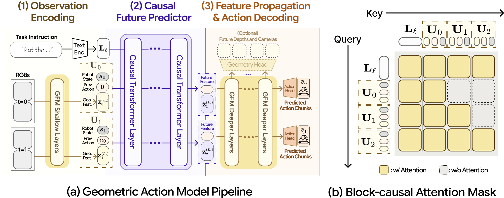

*原论文 Figure 3：浅层观测编码、因果未来预测器、深层几何传播与动作解码，右侧为块状注意力关系。[原图与图注](https://arxiv.org/html/2606.17046v2#S4.F3)*

**核心 insight**

几何模型可以直接承担策略骨干。预测未来 token 后继续使用几何深层网络，使预训练的空间计算参与动作生成。

**方法概括**

- **输入：** 多视角 RGB、任务和机器人状态／动作上下文。
- **过程：** 几何浅层编码→插入的未来预测器→剩余几何深层网络→动作解码；训练结合动作、未来深度和特征目标。
- **输出／部署：** 由预测特征输出动作块；动作解码不要求先完整输出显式点云。

**实验**

| 原文 Pretrain 设置 | 后训练深度／特征损失 | Orig. SR | Plus SR |
| --- | --- | ---: | ---: |
| 有 | 均启用 | 99.6% | 89.7% |
| 有 | 均移除 | 98.6% | 89.5% |
| 无 | 均启用 | 98.4% | 73.4% |
| 无 | 均移除 | 93.6% | 50.0% |

四行均为 H=1；Pretrain 指原文模型预训练设置，与几何基础模型本身的初始化区分。完成预训练后，移除两项后训练损失的影响较小；未完成该预训练时差异增大。附录 C.1 的直接动作监督对照为 98.4% / 84.1%，低于完整 GAM 的 99.6% / 89.7%。这些结果分别考察预训练与动作解码路径，不能将收益统一归因于某一个深度损失。[Table 2 / Appendix C.1](https://arxiv.org/html/2606.17046v2)

**与主线的关系：** 对照 Spatial Forcing 的外部教师路线，几何在此成为模型内部执行预测与解码的骨干。

### 3.2 Structured 4D Latent Predictive Model

**论文标题：** [Structured 4D Latent Predictive Model for Robot Planning](https://arxiv.org/abs/2607.01166)  

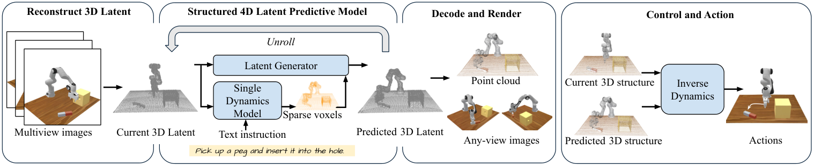

*原论文 Figure 2：多视角重建初始 3D latent，预测未来结构，解码后交给逆动力学模块。[原图与图注](https://arxiv.org/html/2607.01166v1#S2.F2)*

**核心 insight**

将任务目标表达成三维场景的未来结构，使“希望到达什么状态”与“怎样执行”通过几何子目标衔接。

**方法概括**

- **输入：** 多视角观测与语言任务。
- **过程：** 稀疏体素组织 3D latent；结构动态与 latent 生成模块预测未来；将解码点云等几何交给目标条件逆动力学模块。
- **输出／部署：** 未来几何子目标及趋近该目标的机器人动作。

**实验**

Table 1 中，相比 TesserAct，Chamfer 指标从 42.79 降到 5.95，但图像 SSIM 从 0.86 降到 0.79，表明三维一致性与图像指标并非同步。Table 2 的 ManiSkill3 三任务平均成功率为 61.3%，高于 DP 的 55.7%，但插销任务为 16%，低于 DP 的 24%。该协议使用四个全局相机，插销容差放宽至 0.01 m。这支持整体三维预测和部分控制任务的收益，也保留了任务差异。[Tables 1–2](https://arxiv.org/html/2607.01166v1)

**与主线的关系：** 它预测任务所需的子目标；PointWorld 则预测指定机器人动作的后果，两者的条件和求解方向不同。

### 3.3 X-WAM

**论文标题：** [Unified 4D World Action Modeling from Video Priors with Asynchronous Denoising（X-WAM）](https://arxiv.org/abs/2604.26694)  

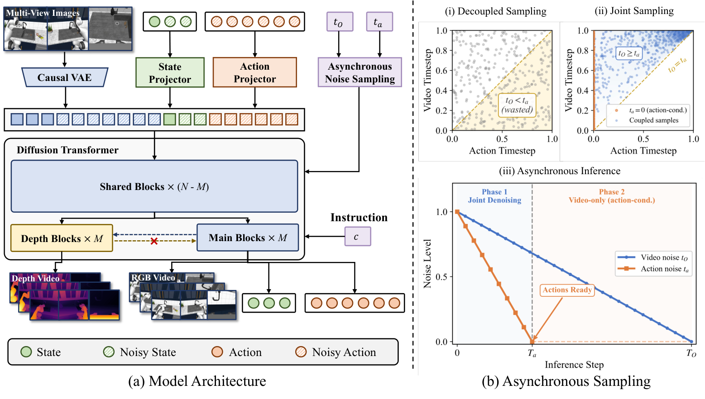

*原论文 Figure 2：左侧为交错深度分支，右侧比较训练噪声采样与动作先完成去噪的推理调度。[原图与图注](https://arxiv.org/html/2604.26694v2#S3.F2)*

**核心 insight**

联合预测 RGB-D 与动作，需要同时安排几何学习和动作何时可以被执行。X-WAM 将深度结构与异步去噪共同设计。

**方法概括**

- **输入：** 多视角 RGB、语言、本体状态和噪声动作。
- **过程：** 以视频模型初始化 DiT，加入交错深度分支；Asynchronous Noise Sampling 对齐训练与推理的模态噪声关系。
- **输出／部署：** 联合生成 RGB-D 和动作，动作先完成去噪并被发送，视频继续生成。

**实验**

Table 4 的深度结构消融中，无深度为 63.0% / 1033 ms，交错分支为 67.8% / 1033 ms，序列拼接为 68.7% / 1888 ms。调度对照中，同步训练与推理为 66.4% / 4665 ms，ANS＋异步为 67.8% / 1033 ms。这组实验体现几何效果与延迟的取舍；数值属于同文消融协议，不与其他论文延迟直接比较。[Table 4](https://arxiv.org/html/2604.26694v2)

**与主线的关系：** 几何进入联合生成后，还需要为控制安排计算预算与输出时机。

### 3.4 PointWorld ✨

**论文标题：** [PointWorld: Scaling 3D World Models for In-The-Wild Robotic Manipulation](https://arxiv.org/abs/2601.03782)  

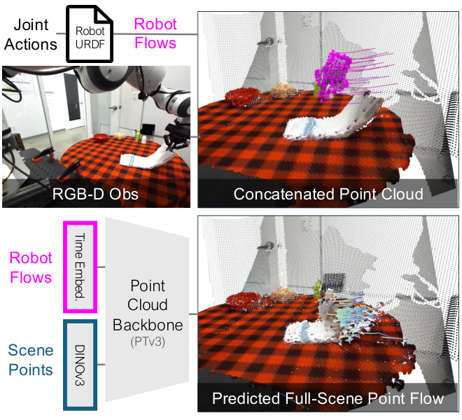

*原论文 Figure 2：关节动作经 URDF 运动学变成紫色机器人点流，与场景点一起输入模型，预测全场景 point flow。[原图与图注](https://arxiv.org/html/2601.03782v1#S1.F2)*

**核心 insight**

把候选动作表达成机器人几何的运动，使世界模型在共同三维空间中预测机器人与环境的交互后果。

**方法概括**

- **输入：** 标定 RGB-D 点云、候选关节动作和已知 URDF。
- **过程：** 正向运动学生成夹爪点运动，与场景点及视觉特征共同输入点云网络，输出场景点未来运动；MPC 根据任务成本比较候选。
- **输出／部署：** 选择动作序列，执行其中一段，再观测、重规划。

**实验**

| 原文实验 | 对照 | 支持的结论 |
| --- | --- | --- |
| §5.2 动作表示 | 夹爪 flow、稀疏／稠密全身 flow、末端位姿、关节位置 | 夹爪 flow 在所测真实／仿真数据中更有效；增加全身点不自动提升预测 |
| Table 2 跨域预测 | DROID、B1K、混合数据以及 held-out 实验室 | 混合训练与少量目标域适配可改善点运动预测；该表衡量预测误差 |
| §5.4 真实 MPC | 世界模型预测＋任务成本选择动作 | 几何后果可被规划器用于真实机器人控制 |

动作表示对照最直接连接本次问题：夹爪点集中描述接触附近的运动，全身点会带来无关计算。实验没有要求模型显式输出接触力；控制依赖标定、运动学、人工成本以及动作跟踪。模型不接收历史速度，采用静止初始状态假设。[§§5.2–5.4 / Appendix A.1](https://arxiv.org/html/2601.03782v1)

**与主线的关系：** 这条链路明确是“候选动作→场景后果→选择”。机器人点流描述动作，场景点流描述后果，二者不能混为同一监督对象。

### 本章小结

GAM／X-WAM 联合组织预测与动作，Structured 4D 先预测几何子目标再逆向求动作，PointWorld 先给出动作再预测后果。判断模型是否能够评价候选动作，首先要检查预测器的条件中是否包含待评价的动作。

## 四、几何／轨迹作为接口：连接视频学习、动作生成与后果评估

### 本章总览

| 论文 | 共享表示 | 主要使用阶段 | 动作接口 | 最有解释力的实验 |
| --- | --- | --- | --- | --- |
| [A4A](https://arxiv.org/abs/2609.05892)   | 交互相关 3D 点未来运动 | 策略预训练 | 微调恢复原生状态／动作接口 | 同架构、不同预训练数据；多种策略迁移 |
| [PointAction](https://arxiv.org/abs/2606.03943)   | RGB＋动态 3D pointmap | 未来生成与动作解码 | 机器人区域点→动作解码器 | RGB／全场景点／机器人点输入消融 |
| [μ₀](https://arxiv.org/abs/2606.13769)   | 语义交互点的 3D traces | 视频预训练与本体适配 | 轨迹去噪特征→action expert | 轨迹指标与机器人成功率分别评价 |
| [TrAct](https://arxiv.org/abs/2608.24101)  | 配对动作的 2D tracks | 在线候选评价 | 轨迹条件视频→评分→配对动作 | 动作条件与轨迹条件世界模型的候选选择 |

### 4.1 A4A

**论文标题：** [A4A: Cross-Embodiment Transfer of Action-Oriented 4D Affordances from Human Demonstrations](https://arxiv.org/abs/2609.05892)  

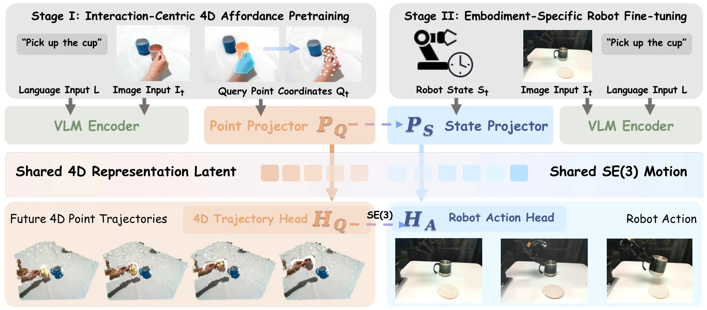

*原论文 Figure 2，复用知域本地卡片图片：左侧用查询点和未来点运动预训练，右侧恢复机器人状态与动作接口。[原图与图注](https://arxiv.org/html/2609.05892v1#S3.F2)*

**核心 insight**

人类演示中可迁移的监督，可以定义为交互相关点的未来运动。它描述作用位置和运动方向，并能接入多种策略的原生训练形式。

**方法概括**

- **输入：** 人类交互视频／RGB-D、语言及下游机器人示范。
- **过程：** 检测、分割、跟踪和深度处理提取 3D 点轨迹；预训练时以查询点替换本体状态、未来点运动替换动作目标，微调时恢复机器人接口。
- **输出／部署：** 由轨迹预训练初始化的机器人策略。

**实验**

LIBERO-Object 的 10 个任务中，Octo 从 28.2% 到 57.2%，OpenVLA 从 66.4% 到 76.4%，OpenVLA-OFT 从 98.0% 到 98.6%。多架构结果支持可迁移性，同时显示高基线下的天花板效应。Figure 4 进一步固定 ARM4R 架构、机器人数据与微调协议，只比较通用场景轨迹和交互导向数据的预训练初始化。[Table 1 / Figure 4](https://arxiv.org/html/2609.05892v1)

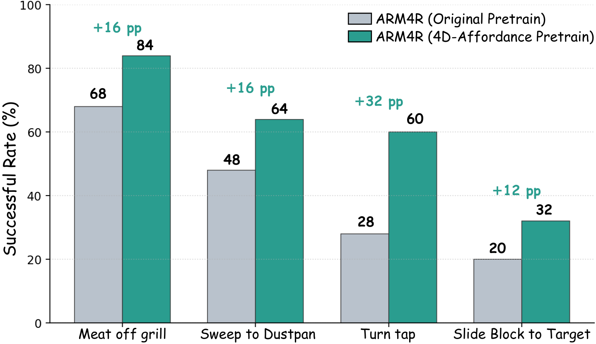

*原论文 Figure 4：固定架构下，交互导向预训练在四项任务中取得增益。该图与“有／无预训练”的 Table 2 是不同对照。[原图与图注](https://arxiv.org/html/2609.05892v1#S4.F4)*

**与主线的关系：** 轨迹可以只承担预训练监督；部署时不必保留显式世界模型规划器。

### 4.2 PointAction

**论文标题：** [PointAction: 3D Points as Universal Action Representations for Robot Control](https://arxiv.org/abs/2606.03943)  

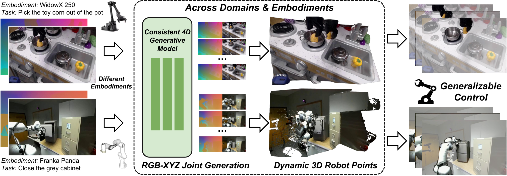

*原论文 Figure 1：RGB-XYZ 联合生成后，以动态机器人点连接控制；沿用知域卡片的 Figure 1 选图。[原图与图注](https://arxiv.org/html/2606.03943v1#S0.F1)*

**核心 insight**

生成模型可以预测完整动态场景，动作解码器则只消费机器人区域的三维点，以空间运动连接视频先验与本体控制。

**方法概括**

- **输入：** 图像、语言与初始机器人状态。
- **过程：** 预测 RGB 和动态 pointmap；分离机器人区域，经点采样、点特征编码和条件扩散动作解码器生成控制。
- **输出／部署：** 机器人动作序列。pointmap 中每个像素关联 XYZ，最终解码输入经过机器人区域筛选。

**实验**

| 动作解码输入（Table 3） | ID 成功率 | OOD-Env 成功率 |
| --- | ---: | ---: |
| RGB | 25.1% | 20.3% |
| 全场景 XYZ | 27.1% | 19.4% |
| 机器人＋场景 XYZ | 40.3% | 33.7% |
| 机器人区域 XYZ | 47.7% | 44.1% |

每个配置评估 100 次。这个消融同时说明几何输入与区域选择的重要性：完整场景并未产生最好的动作表示。两种未在 4D 视频预训练中出现的机械臂实验，也使用了目标本体示范进行适配。[Tables 2–3](https://arxiv.org/html/2606.03943v1)

**与主线的关系：** 与 PointWorld 共同提示交互区域选择的重要性；与 μ₀ 对照时，需要区分“生成的全场景几何”与“解码器实际消费的机器人点”。

### 4.3 μ₀ ✨

**论文标题：** [μ₀: A Scalable 3D Interaction-Trace World Model](https://arxiv.org/abs/2606.13769)  

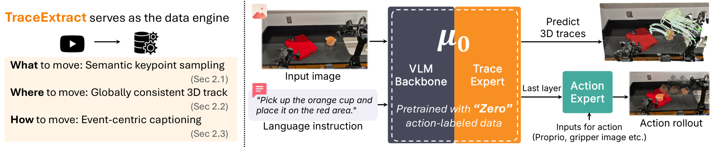

*原论文 Figure 1：TraceExtract 从视频提供轨迹监督，预训练模型向机器人 action expert 提供运动先验；沿用知域卡片的 Figure 1 选图。[原图与图注](https://arxiv.org/html/2606.13769v2#S0.F1)*

**核心 insight**

用语义交互点与事件级语言，将视频监督集中到有动作意义的运动；下游动作专家读取可复用的轨迹特征。

**方法概括**

- **输入：** RGB、语言、关键点查询，可选深度和历史轨迹。
- **过程：** TraceExtract 做实体关键点选择、全局三维对齐和运动事件描述；trace expert 以 B-spline 控制点预测未来轨迹。
- **输出／部署：** 冻结预训练模型，训练 action expert 读取轨迹去噪特征，并结合机器人观测与本体状态输出动作。

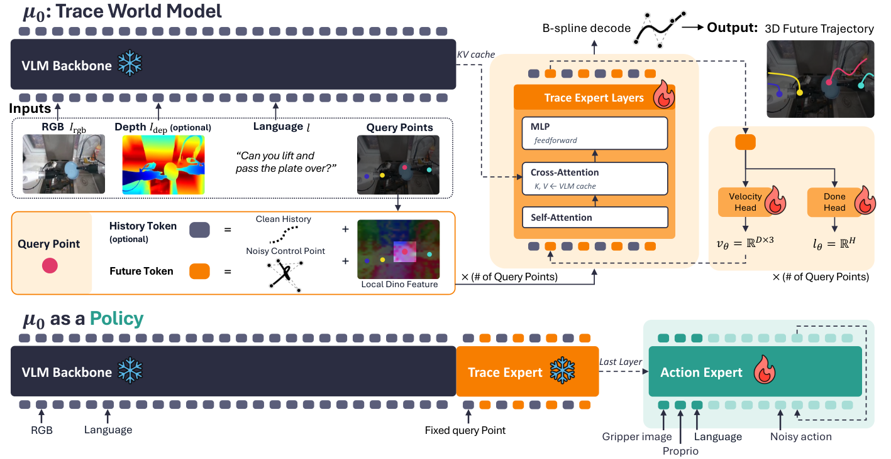

*原论文 Figure 3：上半部分是轨迹预测，下半部分是冻结轨迹模型后的动作适配；动作专家接收轨迹分支特征。[原图与图注](https://arxiv.org/html/2606.13769v2#S2.F3)*

**实验**

| RoboCasa365 八任务（Table 2） | 平均成功率 |
| --- | ---: |
| Diffusion Policy | 22.75% |
| π₀ | 25.25% |
| π₀.₅ | 42.00% |
| TraceGen＋action expert | 23.00% |
| μ₀＋action expert | 30.25% |

轨迹预测由 Table 1 单独评价；控制结果表明视频预训练得到的先验可以用于机器人，但该设置仍低于 π₀.₅。每任务使用 100 条示范、50 次评估。“无动作标签”适用于视频预训练，下游动作专家仍需机器人监督。[Tables 1–2 / 动作适配设置](https://arxiv.org/html/2606.13769v2)

**与主线的关系：** 将人类视频学习和本体动作解码分开。轨迹的可迁移性与下游动作专家的执行能力应分别验证。

### 4.4 TrAct ✨

**论文标题：** [TrAct: Bridging Robot Control and Visual Prediction with Visual Tracks](https://arxiv.org/abs/2608.24101)  

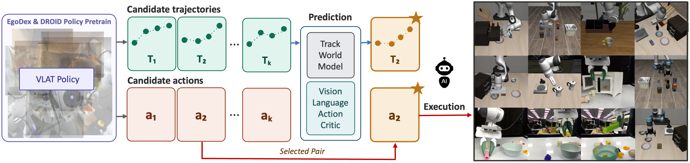

*原论文 Figure 1：VLAT 提出配对动作与轨迹，世界模型预测后果，评价后执行对应动作。[原图来源](https://arxiv.org/html/2608.24101v1/img/splash.png)*

**核心 insight**

二维轨迹可以连接机器人动作提案与视频模型的视觉预测空间；配对关系让后果评价能够回到可执行动作。

**方法概括**

- **输入：** 当前观测与语言。
- **过程：** VLAT 联合提出 `(aᵢ, τᵢ)`；TWM 根据二维轨迹预测未来视频；VLAC 对预测结果按任务打分。
- **输出／部署：** 选择第 i 个候选，执行与该轨迹共同生成的动作 aᵢ，保持候选配对关系。

**实验**

| 方法 | LIBERO-INTEGRAL | 真实任务 |
| --- | ---: | ---: |
| 基础 π₀.₅ | 27% | 49% |
| 动作条件世界模型参与选择 | 49% | 66% |
| TrAct 轨迹条件世界模型参与选择 | 55% | 76% |

第二、三行更接近条件接口问题，第一、三行包含完整系统变化。候选数和推理预算也会影响结果；轨迹条件视频是否忠实于配对动作，是接口有效性的关键。[v3 实验与附录](https://arxiv.org/html/2608.24101v3)

**与主线的关系：** 与 μ₀ 的轨迹特征→动作专家不同，这里用轨迹评价已经配对的动作候选。它使用 2D tracks，说明决策接口同样值得与表示维度一起比较。

### 本章小结

轨迹可以是预训练目标、动作生成的条件，也可以是候选评价接口。选取点的范围同样重要：PointAction 的机器人点筛选、A4A 的交互点选择与 μ₀ 的语义关键点，都在决定模型把容量花在哪里。

##  五、跨本体迁移：共享运动之后还需要处理什么？

### 本章总览

| 论文 | 共享表示 | 单独建模的因素 | 下游接口 | 关键实验 |
| --- | --- | --- | --- | --- |
| [AnyWorld](https://arxiv.org/abs/2608.29242) | 动作控制视频与相机几何 | 动作、相机、本体／场景条件 | 重组机器人域经验，用于策略适配 | 条件可控性、加入重组经验后的策略表现 |

### 5.1 AnyWorld

**论文标题：** [AnyWorld: Factorized Egocentric World Models for Cross-Embodiment Generalization](https://arxiv.org/abs/2608.29242)  

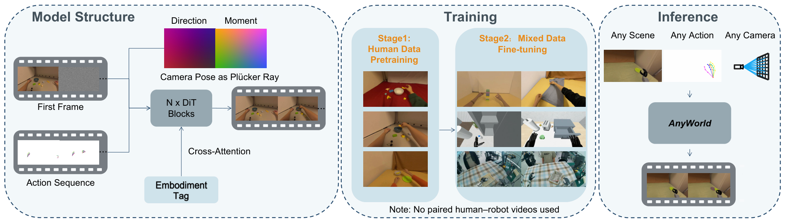

*原论文 Figure 2：分别输入相机射线、动作序列和本体条件，以人类预训练和混合微调学习经验重组；沿用知域卡片所选方法图，编号依据原文。[原图与图注](https://arxiv.org/html/2608.29242v2#S3.F2)*

**核心 insight**

共享运动接口之后，还要处理相机运动与本体／场景差异。条件分解使同一交互能够在目标机器人域中重新呈现。

**方法概括**

- **输入：** 动作控制视频、相机 Plücker rays、目标首帧与本体标签。
- **过程：** 人类视频预训练，再混合人类与机器人视频微调；无需成对人机视频。相机射线描述观察几何，首帧仍共同承载场景与初始交互状态。
- **输出／部署：** 重组视频经验，并结合相应动作监督用于目标机器人策略适配。

**实验**

Table 1 中，相比 WAN Fun-Control，CameraAlign 从 0.402 到 0.789，ActionAlign 为 0.655 到 0.659，收益在各条件维度上不相同。Table 4 加入重组经验后，RoboCasa GR1 的 18 个 pick-and-place 任务从 49.8% 到 54.6%；IRON 的 20 次真实抓取从 20% 到 55%。前者与后者的样本和任务范围不同，分别报告更便于判断迁移证据。[Tables 1、4–5](https://arxiv.org/html/2608.29242v2)

**与主线的关系：** A4A、μ₀ 迁移运动监督或先验，AnyWorld 重组训练经验。跨本体迁移的负担因此可以位于表示、动作适配或数据生成层。

### 本章小结

共享几何和运动表示提供了公共接口，视角与本体条件决定这些表示能否进入目标机器人的学习与执行环境。

---

## 总结与 Takeaways

### 1. 几何可以帮助策略学习，部署时不一定需要重建几何

WAM4D 在训练时预测未来深度，部署时移除几何分支；Track4Action 将示范视频中的三维变化蒸馏给策略，执行时只保留学生模型。两者说明，**几何信息可以通过训练改善动作模型，而不必成为每次执行时都要生成的结果。** 设计模型时，应先明确几何用于辅助学习，还是要在执行时用于解码和规划。

### 2. 几何表示要围绕交互来选择

PointWorld 的夹爪点运动优于所比较的全身点运动；PointAction 的动作解码器使用机器人区域的点，也优于使用全场景点。这两组消融提示：**哪些点与当前操作有关，值得和三维表示本身一起设计。** A4A 的交互点、μ₀ 的语义关键点也体现了这一思路：将预测集中到施动者、操作对象及其运动上。

### 3. 预测“想要的未来”和预测“动作的后果”，是两个不同的问题

Structured 4D 先预测任务所需的几何子目标，再求机器人动作；PointWorld 则先给定候选动作，再预测场景会怎样变化。以放杯子为例，“杯子应该到哪里”描述目标，“这样移动夹爪，杯子会怎样”描述动作后果。**用于动作选择的预测，需要能够区分不同动作带来的结果。** TrAct 进一步说明，评价预测结果之后，还要能够找到与之对应的可执行动作。

### 4. 人类视频提供交互知识，机器人仍需学习怎样执行

A4A 从人类演示学习交互点运动，μ₀ 学习可复用的轨迹先验，AnyWorld 将交互重组为机器人域经验。这些方法共享的思路是：**从视频学习任务中的物体与运动关系，再将其适配到目标机器人。** 相机变化、本体差异和动作监督仍然影响迁移效果；共享轨迹之后，还需要回答机器人如何实现这段运动。

### 对后续工作的启发

我们正在开展的 **JanusAct4D**，关注如何用 4D 交互表示连接动作后果预测与机器人操作。我们希望进一步探索：模型能否理解不同动作会带来怎样的交互变化，并利用这些知识帮助不同机器人完成相同的任务。

---

## 参考文献

以下按方法职责分类，共 27 篇。编号用于检索，非质量排序；“月份”指 arXiv 首次提交月份，EgoWAM 单独标注公开来源。正文中的 15 篇与相关延伸工作在此统一收录。

### 1. 表示对照与设计因素分析

| 编号 | 论文 | 月份 | 关联内容 |
| --- | --- | --- | --- |
| 1 | [EgoWAM: World Action Models Beyond Pixels with In-the-Wild Egocentric Human Data](https://egowam.github.io/) | 项目页；日期待核验 | 固定策略框架，比较 Pixel、DINO 与 3D flow 的人类视频迁移效果。 |
| 2 | [Reconstruction or Semantics? What Makes a Latent Space Useful for Robotic World Models](https://arxiv.org/abs/2605.06388) | 2026.05 | 在固定协议下比较重建与语义编码器，区分视觉质量、规划／策略表现和表示质量。 |
| 3 | [What Matters for Latent Actions in Robot Learning](https://arxiv.org/abs/2608.19613) | 2026.08 | 统一比较隐动作建模、训练目标和策略接入方式，并检验代理指标。 |

### 2. 空间表示、状态对齐与几何监督

| 编号 | 论文 | 月份 | 关联内容 |
| --- | --- | --- | --- |
| 4 | [SpatialVLA: Exploring Spatial Representations for Visual-Language-Action Model](https://arxiv.org/abs/2501.15830) | 2025.01 | Ego3D 位置编码与自适应动作网格，连接空间观测和机器人动作表示。 |
| 5 | [Spatial Forcing: Implicit Spatial Representation Alignment for Vision-language-action Model](https://arxiv.org/abs/2510.12276) | 2025.10 | 几何教师对齐 VLA 中间视觉特征。 |
| 6 | [GeoProp: Grounding Robot State in Vision for Generalist Manipulation](https://arxiv.org/abs/2607.07101) | 2026.07 | 将机器人状态投影到图像，采样局部特征并调制视觉表示。 |
| 7 | [Track4Action: Distilling World-Centric 3D Tracker into Vision-Language-Action Policies](https://arxiv.org/abs/2608.03727) | 2026.08 | 将动作对齐视频区间的 tracker 特征蒸馏到当前观测策略。 |

### 3. 几何监督的视频—动作模型与几何潜空间

| 编号 | 论文 | 月份 | 关联内容 |
| --- | --- | --- | --- |
| 8 | [GEM-4D: Geometry-Enhanced Video World Models for Robot Manipulation](https://arxiv.org/abs/2605.22882) | 2026.05 | 以 4D 对应监督视频预测，再经逆动力学连接动作。 |
| 9 | [WAM4D: Fast 4D World Action Model via Spatial Register Tokens](https://arxiv.org/abs/2606.14048) | 2026.06 | 训练期未来深度读出，部署时移除几何分支。 |
| 10 | [MECo-WAM: Learning 4D Geometric Priors for Inference-Efficient World Action Models](https://arxiv.org/abs/2607.05468) | 2026.07 | 辅助 4D expert、逐步衰减的几何读取与时空关系蒸馏。 |
| 11 | [SG-WAM: Self-Guided World Modeling in Geometry-Aware Policy Space](https://arxiv.org/abs/2608.01397) | 2026.08 | 在策略表示空间学习动作条件动态，以 EMA 教师与几何监督组织潜空间。 |
| 12 | [GWM-VLA: Geometry-Aware Latent World Modeling for Vision-Language-Action Learning](https://arxiv.org/abs/2608.07619) | 2026.08 | 聚合多视角几何上下文，预测目标视角特征，并共享隐动作表示。 |

### 4. 几何未来、联合动作生成与规划

| 编号 | 论文 | 月份 | 关联内容 |
| --- | --- | --- | --- |
| 13 | [PointWorld: Scaling 3D World Models for In-The-Wild Robotic Manipulation](https://arxiv.org/abs/2601.03782) | 2026.01 | 以机器人点运动为动作条件，预测场景 point flow，并通过 MPC 控制。 |
| 14 | [X-WAM: Unified 4D World Action Modeling from Video Priors with Asynchronous Denoising](https://arxiv.org/abs/2604.26694) | 2026.04 | 联合预测 RGB-D 与动作，用异步去噪协调不同模态。 |
| 15 | [Geometric Action Model for Robot Policy Learning](https://arxiv.org/abs/2606.17046) | 2026.06 | 将未来预测器插入几何基础模型，由深层几何特征连接动作解码。 |
| 16 | [Structured 4D Latent Predictive Model for Robot Planning](https://arxiv.org/abs/2607.01166) | 2026.07 | 预测结构化三维子目标，经目标条件逆动力学产生动作。 |

### 5. Points／Tracks／Traces 与跨本体视频学习

| 编号 | 论文 | 月份 | 关联内容 |
| --- | --- | --- | --- |
| 17 | [PointAction: 3D Points as Universal Action Representations for Robot Control](https://arxiv.org/abs/2606.03943) | 2026.06 | 联合生成 RGB 与动态 pointmap，再解码机器人动作。 |
| 18 | [μ₀: A Scalable 3D Interaction-Trace World Model](https://arxiv.org/abs/2606.13769) | 2026.06 | 视频抽取三维交互轨迹，预训练后连接机器人动作专家。 |
| 19 | [TrAct: Bridging Robot Control and Visual Prediction with Visual Tracks](https://arxiv.org/abs/2608.24101) | 2026.08 | 以二维轨迹连接动作候选、未来视频预测与奖励排序。 |
| 20 | [AnyWorld: Factorized Egocentric World Models for Cross-Embodiment Generalization](https://arxiv.org/abs/2608.29242) | 2026.08 | 分解动作、相机与本体条件，重组跨本体视频经验。 |
| 21 | [A4A: Cross-Embodiment Transfer of Action-Oriented 4D Affordances from Human Demonstrations](https://arxiv.org/abs/2609.05892) | 2026.09 | 用人类演示中的交互相关点运动预训练机器人策略。 |

### 6. Visual／Flow as Action 与结构化视觉预测

| 编号 | 论文 | 月份 | 关联内容 |
| --- | --- | --- | --- |
| 22 | [Mask World Model: Predicting What Matters for Robust Robot Policy Learning](https://arxiv.org/abs/2604.19683) | 2026.04 | 以语义 mask 的演化作为预测目标，连接扩散策略头。 |
| 23 | [FlowWAM: Optical Flow as a Unified Action Representation for World Action Models](https://arxiv.org/abs/2607.13017) | 2026.07 | 以光流连接未来视频生成与机器人动作预测。 |
| 24 | [Masked Visual Actions for Unified World Modeling](https://arxiv.org/abs/2607.19343) | 2026.07 | 以部分可见实体运动为像素空间控制接口，支持正向与逆向建模。 |
| 25 | [Hydra-0: Action Flow for Generalist World Modeling and Control](https://arxiv.org/abs/2608.18077) | 2026.08 | 将动作表示为像素运动，连接跨本体后果预测、策略评价与控制。 |

### 7. 动作条件训练、失败经验与部署效率

| 编号 | 论文 | 月份 | 关联内容 |
| --- | --- | --- | --- |
| 26 | [GigaWorld-Policy-0.5: A Faster and Stronger WAM Empowered by AutoResearch](https://arxiv.org/abs/2607.13960) | 2026.07 | 混合动作条件世界建模与 WAM 训练，结合专家分工实现动作单独解码。 |
| 27 | [FACT: Failure-Aware Causal Training for World-Action Models](https://arxiv.org/abs/2608.10232) | 2026.08 | 用执行动作条件化未来视频与进度预测，将失败经验用于后果学习和候选评价。 |
