# 3D/4D Geometric World Action Model

> 技术分享 · 党灵伟 · 2026.09.18

> 报告永久链接： [知域 · 3D/4D Geometric World Action Model](https://droliven.github.io/zhiyu/#report=report-wam-depth-talk-20260918)

## 目录

[TOC]

## 分析框架

本文围绕一个问题展开：**几何如何从更好的世界表征，转化为更好的机器人动作？**

相关方法可以按几何在“观测 → 未来 → 动作”链条中的位置分为四类：

1. **世界表征比较：** 比较 Pixel、semantic feature 与 3D motion 等候选状态表征。
2. **几何蒸馏：** 将 3D 先验注入视觉状态表征，推理时通常移除教师和几何分支。
3. **3D 世界建模：** 将 3D 与视觉、动作并列建模，或直接在独立的 3D 状态空间中预测未来。
4. **几何运动接口：** 用 points、trajectories 或 traces 连接视觉学习与本体动作。

四类机制并不互斥。本文重点比较三个问题：**预测什么、几何如何进入动作路径、推理时保留哪些组件。**

## 一、世界表征比较：Pixel、Semantic Feature 与 3D Motion

### 本章总览

| 论文 | 比较对象 | 几何的职责 | 动作接口 | 实验目标 |
| --- | --- | --- | --- | --- |
| [EgoWAM](https://egowam.github.io/) | Pixel、DINO、3D motion flow | 未来预测监督 | 共享骨干＋动作头 | 比较相同框架下不同预测目标的人类视频迁移能力 |

### 1.1 EgoWAM

**CoRL 2026, 佐治亚理工：** [EgoWAM: World Action Models Beyond Pixels with In-the-Wild Egocentric Human Data](https://egowam.github.io/)  

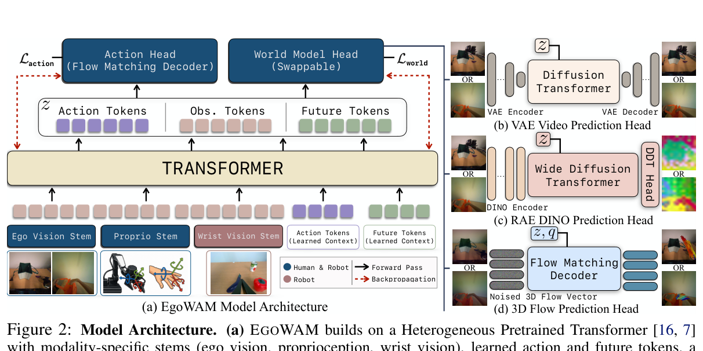

*原论文 Figure 2：共享骨干与三种可插拔 world-model head，包括 VAE video、RAE DINO 和 camera-stabilized 3D flow。[原图与图注](https://arxiv.org/html/2607.08436#S4.F2)*

**核心观点**

**EgoWAM 探索不同的 world state representation 如何影响机器人控制。** 它在相同策略框架下比较 Pixel、DINO feature 和 3D flow：DINO 从人类数据中获得的提升更大，尤其是在 OOD 设置下；3D flow 的 ID 最终成绩通常最高或持平。

**受控变量**

- 共享 Transformer 同时接收第一视角视觉、机器人本体状态，以及学习得到的 action／future tokens。
- Action head 始终用 flow matching 解码动作；可插拔 world head 分别重建 **VAE pixel latent、DINO semantic feature、camera-stabilized dense 3D motion field**。
- 人类和机器人数据都参与 action loss 与 world loss；人类动作会先映射到统一的末端动作空间。World loss 额外提供对本体差异不敏感的场景动态监督，并通过共享骨干改变动作表示。
- 部署时只运行动作路径，world head 可以关闭。因此，几何在该方法中主要作为**训练信号**，而非在线规划状态。

**实验结论**

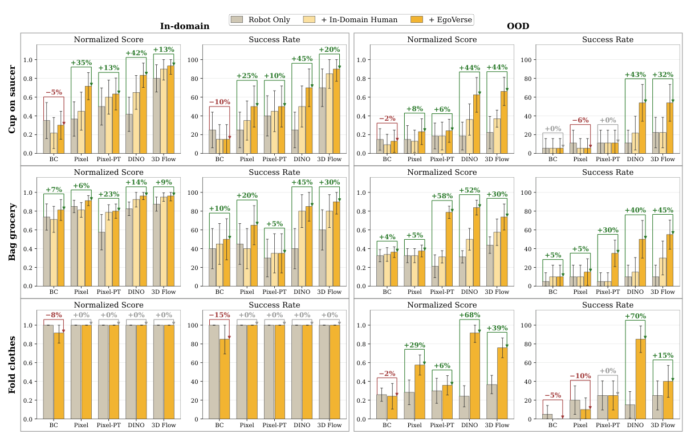

*原论文 Figure 3：三个真实双臂任务上的 ID／OOD normalized score 与 success rate。[原图与图注](https://arxiv.org/html/2607.08436#S4.F3)*

**换表征，迁移效果不同：**

- ID 最终性能总体呈现 BC < Pixel／Pixel-PT < DINO < 3D Flow，其中 Pixel 与 Pixel-PT 没有稳定排序；
- OOD 中，DINO 从人类数据获得的增益整体最明显。

> Pixel：DiT 从随机初始化开始训练。Pixel-PT：DiT 使用预训练视频生成模型 VACE-1.3B 的权重初始化。3D Flow 监督的生成器：预训练的 Track4World。它从 RGB 视频预测逐像素 3D scene flow、metric depth、相机内参与位姿，再结合 Aria VIO 消除头部相机运动。

### 本章小结

**World state representation 决定 WAM 能从人类视频中迁移什么能力**：Pixel 迁移较弱，DINO 侧重 OOD 泛化，3D Flow 的 ID 最终表现更高。下一章进一步讨论几何监督如何进入动作路径，以及部署时是否保留。

## 二、几何蒸馏：将 3D 先验注入视觉状态表征

### 本章总览

本章方法的共同特征是：**几何主要通过 loss 进入模型，而不作为推理阶段必须显式生成的状态。** 方法差异体现在监督对象、注入层级和梯度到达动作路径的方式。

| 论文 | 几何监督对象 | 动作影响路径 | 部署形式 |
| --- | --- | --- | --- |
| [Spatial Forcing](https://arxiv.org/abs/2510.12276) | 当前帧 VGGT feature | 对齐 VLA 中间视觉 token | 只留 VLA |
| [Track4Action](https://arxiv.org/abs/2608.03727) | 动作对齐片段的 pooled 3D tracker feature | Student queries 从当前观测推断对应的紧凑表示 | 只留学生策略 |
| [WAM4D](https://arxiv.org/abs/2606.14048) | 未来深度 | 经 spatial registers 反传到共享历史视频特征 | 删除 register/depth 路径 |
| [GEM-4D](https://arxiv.org/abs/2605.22882) | 4D GFM feature 的去噪目标 | VideoDiT feature 条件化 GeoDiT 的 geometry flow matching | 只留视频生成器，再做动作恢复 |

### 2.1 Spatial Forcing

**ICLR 2026, 港科广：** [Spatial Forcing: Implicit Spatial Representation Alignment for Vision-language-action Model](https://arxiv.org/abs/2510.12276)  

现有 3D VLA 通常在推理时直接输入 depth／point cloud，或调用 3D expert 估计空间观测。Spatial Forcing 将几何信息改为训练期表征监督，使部署路径仍保持 RGB-only VLA。

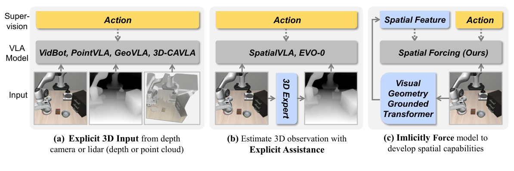

*原论文 Figure 2：显式 3D 输入、由 3D expert 估计空间观测，以及 Spatial Forcing 的隐式空间表征对齐。前两类在推理时依赖深度／点云或 3D expert，Spatial Forcing 仅在训练时使用几何教师。[原图与图注](https://arxiv.org/html/2510.12276v2#S2.F2)*

**核心观点**

标准 VLA 的动作监督仅约束输出动作，不能保证中间视觉表示编码深度、尺度和遮挡。Spatial Forcing 使用冻结 GFM 提供监督，使 VLA 中间层视觉 token 保留可由轻量 DPT depth head 恢复的空间结构，同时保持原有动作定义。

**方法**

- RGB 同时进入原 VLA 与冻结的 VGGT 教师。
- 一个轻量 projector 将 VLA 中间层视觉 token 映射到教师特征空间；alignment loss 与原 action loss 联合训练。
- 教师不接收动作、不预测未来，也不参与推理。因此，该方法属于**几何表征对齐的 VLA**，而非在线 rollout 的 WAM。

*原论文 Figure 1：左侧是几何教师与 VLA 中间层的对齐，右侧是训练效率、成功率和深度探测结果。[原图与图注](https://arxiv.org/html/2510.12276v2#S0.F1)*

**实验与分析**

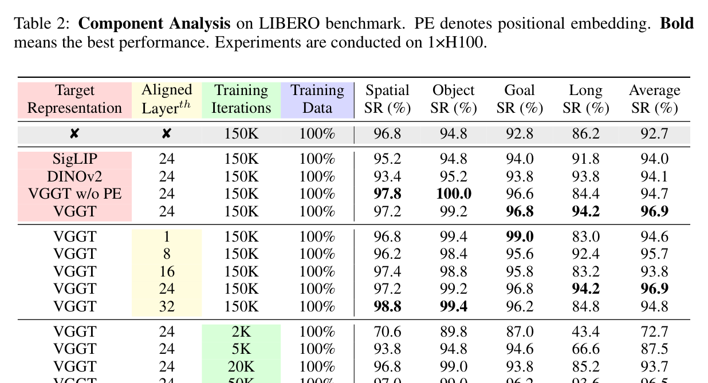

*原论文 Table 2：监督目标、对齐层、训练步数和数据量的组件消融。[原表](https://arxiv.org/html/2510.12276v2#S3.T2)*

1. **VGGT 相对其他教师的增益。** 在相同模型和训练协议下，无对齐为 92.7%，SigLIP 为 94.0%，DINOv2 为 94.1%，VGGT 为 96.9%。因此 VGGT 相对无对齐提升 4.2 个百分点，相对 DINOv2／SigLIP 额外提升约 2.8／2.9 个百分点。

2. **空间信息探查。** 去掉 VGGT positional embedding 后，平均成功率从 96.9% 降至 94.7%，其中 Long 从 94.2% 降至 84.4%。对齐第 24 层为 96.9%，高于第 1 层的 94.6% 和第 32 层的 94.8%，说明较深但非最后一层更适合承载几何监督。

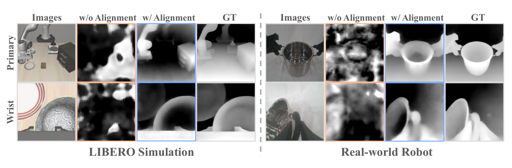

*原论文 Figure 3：冻结 VLA，仅训练 DPT depth head；对齐后的视觉特征能够恢复更完整的深度结构。该实验没有报告定量深度误差。[原图与图注](https://arxiv.org/html/2510.12276v2#S2.F3)*

**局限：** 它学习的是当前观测的空间表示，没有建模动作条件下的未来；效果也依赖教师特征、对齐层和 projector。下一篇 Track4Action 正是把静态教师扩展到动作区间。

### 2.2 Track4Action

**arXiv 2026.08, 上交卢策吾：** [Track4Action: Distilling World-Centric 3D Tracker into Vision-Language-Action Policies](https://arxiv.org/abs/2608.03727)

*原论文 Figure 2：左侧 tracker 读取完整示范区间；右侧学生由当前观测预测汇聚特征，经门控融合连接动作头。[原图与图注](https://arxiv.org/html/2608.03727v1#S2.F2)*

**核心观点**

动作标签仅描述机器人执行的控制，完整视频区间还包含场景、物体和相机的状态变化。Track4Action 将离线训练时可见的未来片段作为 **privileged information**，蒸馏给推理时仅观察当前帧的学生策略。

**与 Spatial Forcing 的关系**

两者都在训练期将几何模型的特征蒸馏进 VLA，并在推理时移除教师。区别在于：

- **Spatial Forcing：** 当前帧 VLA token 经 BN＋两层 MLP 后，直接对齐到 VGGT 的逐像素空间特征。
- **Track4Action：** Track4World 将与 \(K\) 个动作对齐的 \(K+1\) 帧示范片段汇聚为 teacher feature；Q-Former-like track queries 从当前 VLA feature 中推断与之对齐的紧凑表示，并通过 gate 接入动作头。

Track4Action 不显式输出未来 point tracks，也不是候选动作条件的动力学模型。两篇论文没有同协议的直接比较，现有结果不能支持强弱排序。

### 2.3 WAM4D

**arXiv 2026.06, 北大：** [WAM4D: Fast 4D World Action Model via Spatial Register Tokens](https://arxiv.org/abs/2606.14048)

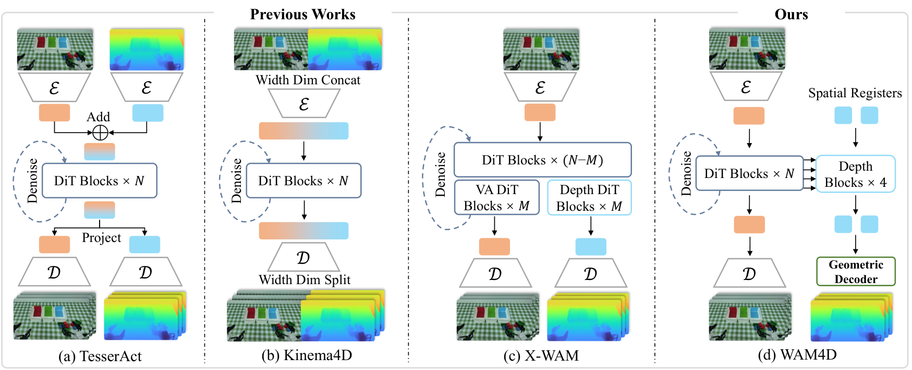

*原论文 Figure 1：TesserAct 做特征相加，Kinema4D 按宽度拼接，X-WAM 复制后部 DiT；WAM4D 以少量 spatial registers 从主干读取几何，再交给独立 depth blocks。主动作路径不读取蓝色几何分支。*

*原论文 Figure 2：左侧是寄存查询和几何读出，右侧展示视频—动作与深度分支的注意力结构。[原图与图注](https://arxiv.org/html/2606.14048v3#S3.F2)*

**核心观点**

WAM4D 不对 noisy geometry latent 做扩散或迭代采样，而是由 spatial registers 从 causal video feature **前馈式读出未来深度**。该几何分支只在训练时提供监督：前向路径与动作隔离，depth loss 则通过共享 video feature 反向更新策略表示。

**几何读出与因果路径**

1. Video-action backbone 先产生因果的历史 video feature。
2. Spatial registers 只读取这些 video feature，再经 depth blocks 和预训练 DA3 head 直接回归未来深度。
3. 该过程没有 noisy geometry latent、几何去噪或迭代采样，本质上是确定性的 feed-forward depth readout。
4. 动作 token 不能读取 registers 或未来视频 token；未来 RGB/depth 只作为训练目标，避免未来信息泄漏。
5. 推理时删除 registers、depth blocks 和 geometry head，仅保留 observation→action 路径。

*原论文 Figure 3：左侧多目标训练，右侧动作推理。比较两侧可看出哪些几何组件被移除。[原图与图注](https://arxiv.org/html/2606.14048v3#S3.F3)*

**实验结论**

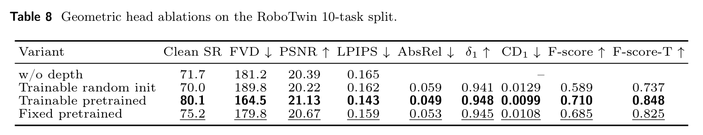

*原论文 Table 8：随机初始化、预训练可训练与预训练冻结几何头的控制、视频和几何指标。[原表](https://arxiv.org/html/2606.14048v3#S4.T8)*

1. **有效的是预训练几何先验，而不是额外的 depth loss。** 无深度监督为 71.7%，随机初始化 depth head 降至 70.0%，预训练并冻结为 75.2%，预训练且可训练达到 80.1%。
2. **几何监督必须读到动作实际使用的 video feature。** 直接从 future VAE hidden 重建深度仅为 70.7%；从中层 causal video feature 读取的 spatial registers 达到 75.2%。双向读取可到 76.6%，但会让主干依赖 geometry token，增加计算和模型复杂度。[Table 7](https://arxiv.org/html/2606.14048v3#S4.T7)
3. **控制收益并不普遍。** 50-task RoboTwin 平均成功率为 91.8%，与 Fast-WAM 持平；优势主要出现在真实长程任务。真实 AstriBot S1 的 sub-action success 为 0.90，高于 LingBot-VA 的 0.84 和 Fast-WAM 的 0.80。**因此，WAM4D 的主要证据不是整体榜单提升，而是预训练几何先验通过 causal video feature 改善几何敏感的长程控制。**

### 2.4 GEM-4D

**ECCV 2026，哈佛：** [GEM-4D: Geometry-Enhanced Video World Models for Robot Manipulation](https://arxiv.org/abs/2605.22882)

*原论文 Figure 2：视频 DiT 中间特征连接几何 DiT，分别学习视频和几何去噪；在线视频生成使用视频分支。[原图与图注](https://arxiv.org/html/2605.22882v4#S3.F2)*

**定位**

GEM-4D 是 geometry-enhanced video world model，而非联合预测视频与动作的 WAM。主体 VideoDiT 生成未来 RGB；机器人动作由独立的 Adaptive Inverse Dynamic System（AIDS）从生成视频中恢复。

**方法**

1. 冻结的 4D GFM 从完整训练视频提取 dense correspondence feature，其中编码 depth、camera motion 和 object motion。主设置使用 PAGE-4D feature，VGGT 作为替代 teacher。
2. VideoDiT 对视频 latent 做 flow matching，并输出中间 feature \(m_t\)。
3. 辅助 GeoDiT 从 noisy geometry latent 出发，以 \(m_t\) 为场景条件，预测 geometry velocity。Geometry loss 通过 \(m_t\) 反向更新 VideoDiT。
4. 推理时删除 GFM 和 GeoDiT，只保留视频生成分支。

**动作来源：Adaptive Inverse Dynamic System（AIDS）**

AIDS 不是 GEM-4D 内部的 action head，而是生成视频之后的模块化动作恢复管线：

1. Qwen3.5-VL＋SAM-2 定位目标物体和末端执行器，结合 depth 与相机内参构建点云。
2. CoTracker3 在生成视频中跟踪末端关键点；置信度下降时重新采样或重新分割。
3. FoundationPose 恢复逐帧 6-DoF 末端位姿；失败时用 depth centroid 恢复平移，并用 SLERP 补全旋转。
4. GraspGen 插入可执行抓取位姿，随后通过轨迹平滑和 inverse kinematics 转成机器人动作。

**机制边界**

GEM-4D 对 VideoDiT 的约束是间接的：它不直接对齐 video feature 与 GFM feature，而是要求 \(m_t\) 能够帮助 GeoDiT 完成 geometry flow matching。\(m_t\) 虽是唯一的场景条件，但 noisy geometry latent 自身仍含部分目标信息，GeoDiT 也可能学习数据集级几何先验。论文没有 drop／shuffle \(m_t\) 的消融，因此尚不能严格证明 GeoDiT 对 video condition 的依赖程度。

**与前文方法的区别**

| 方法 | 主体 | 几何路径 | 注入方式 |
| --- | --- | --- | --- |
| Spatial Forcing | VLA | 当前帧 VGGT feature | 直接对齐 VLA token 与教师 feature |
| WAM4D | Video-action WAM | 从 causal video feature 前馈重建未来 depth | depth loss 更新共享 video feature |
| GEM-4D | Video GWM | GeoDiT 去噪生成 4D correspondence feature | geometry flow loss 更新 VideoDiT feature |

**核心结论：GEM-4D 是“生成式几何正则＋GWM”，WAM4D 是“前馈式几何读出＋WAM”；GEM-4D 的动作能力来自模型外的 AIDS。**

### 本章小结

| 方法 | 几何监督对象 | 几何如何影响动作 | 推理时保留什么 |
| --- | --- | --- | --- |
| Spatial Forcing | 当前帧 VGGT feature | 对齐后的 VLA visual token 被动作解码器使用 | VLA；移除 GFM |
| Track4Action | 已发生的动作区间 3D 转移 | Student track queries 对齐教师特征，并通过 gate 条件化动作头 | Student queries；移除 Track4World |
| WAM4D | 未来 depth | Depth loss 更新动作路径共享的 causal video feature | Action path；移除 depth branch |
| GEM-4D | 完整视频的 4D correspondence feature | 无内部动作路径，仅正则化 VideoDiT | VideoDiT；移除 GFM 与 GeoDiT |

四种方法都在训练期引入几何监督，但监督对象和动作耦合方式不同：Spatial Forcing 对齐当前空间表示，Track4Action 蒸馏已发生的时序转移，WAM4D 从 causal video feature 重建未来深度，GEM-4D 则用生成式 geometry branch 约束视频模型。下一章进一步讨论几何未来如何直接参与动作生成或规划。

## 三、3D 作为世界表征：联合视觉与动作，或独立预测未来

### 本章总览

| 论文 | 未来表示 | 预测条件 | 动作求解方式 | 关键对照 |
| --- | --- | --- | --- | --- |
| [X-WAM](https://arxiv.org/abs/2604.26694)   | 多视角 RGB-D 与动作 | 观测、任务、本体状态 | 联合建模、异步动作去噪 | 深度分支与采样调度的消融 |
| [GAM](https://arxiv.org/abs/2606.17046)   | 几何骨干中的未来 token | 观测与任务上下文 | 几何深层特征连接动作解码 | 预训练／损失／直接动作监督 |
| [Structured 4D](https://arxiv.org/abs/2607.01166)   | 结构化 3D latent 与解码几何 | 当前场景＋语言任务 | 几何子目标→逆动力学 | 三维一致性与任务成功率分别评价 |

### 3.1 X-WAM

**arXiv 2026.04, 清华刘华平：** [Unified 4D World Action Modeling from Video Priors with Asynchronous Denoising（X-WAM）](https://arxiv.org/abs/2604.26694)

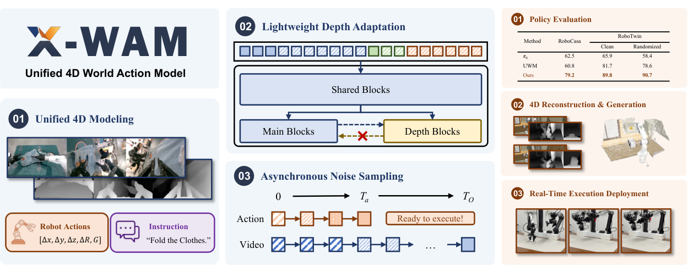

*原论文 Figure 1：统一 RGB-D/action 建模、轻量深度分支、ANS，以及 RoboCasa／RoboTwin 与真机部署结果概览。[原图与图注](https://arxiv.org/html/2604.26694v2#S1.F1)*

*原论文 Figure 2：左侧为交错深度分支，右侧比较训练噪声采样与动作先完成去噪的推理调度。[原图与图注](https://arxiv.org/html/2604.26694v2#S3.F2)*

**核心观点**

X-WAM 使用同一个 Wan2.2-5B DiT 处理未来 RGB、proprioception 与 action，并通过轻量分支预测 depth。其主要问题是协调不同模态的计算需求：**高维视频需要较多去噪步，而低维动作需要低延迟输出。**

**1. Lightweight Depth Adaptation**

- 深度图复制成三通道，用与 RGB 相同的 causal VAE 编码；前 \(N-M\) 个 DiT block 完全共享。
- 只复制最后 \(M\) 个 block 形成 depth branch。每层 depth block 通过**单向 cross-attention**读取同层 RGB main branch，main branch 不反读 depth。
- depth 不是扩散生成：它用 MSE **确定性回归 inverse depth**。这一点与 RGB/action 的 flow matching 不同。
- 推理若只要动作，可关闭 depth branch；若要 4D rollout，再解码 RGB-D 并融合点云。

**2. 相机位姿恢复**

固定外部相机位姿作为已知量；腕部相机与末端通过固定 hand–eye calibration 刚性连接。模型预测未来 proprioceptive state 中的末端位姿 \(T_{ee}\)，并计算 \(T_{wrist}=T_{ee}T_{h2e}\)。由此可为每帧预测 RGB-D 恢复相机位姿，并融合为世界坐标系下的 4D 点云。

**3. Asynchronous Noise Sampling（ANS）**

- **推理：** action/state 用 \(T_a\) 个短步去噪，video 用 \(T_O>T_a\) 个长步。第 \(T_a\) 步动作已干净，可立即发送；如需高质量 rollout，再继续视频去噪，此时干净动作成为 action condition。
- **训练：** 不独立采样两个 timestep，因为那会产生推理中从不出现的 \(t_O<t_a\)。ANS 从满足 \(t_O\ge t_a\) 的联合分布采样，并以一定概率直接设 \(t_a=0\)，显式训练“干净动作条件下继续生成视频”。
- **注意力结构：** X-WAM 使用多模态联合去噪与双向 full attention，不采用 MoT causal attention；后者是 WAM4D 为避免未来信息泄漏设计的可见性规则。

**实验**

Table 4 在 RTX 3090、5-step action decoding 下报告：无深度、交错分支和序列拼接分别为 63.0% / 1033 ms、67.8% / 1033 ms 和 68.7% / 1888 ms；同步调度为 66.4% / 4665 ms，ANS 异步调度为 67.8% / 1033 ms。[Table 4](https://arxiv.org/html/2604.26694v2)

真机实验使用 AC One 双臂机器人执行耳机装盒。装 2 个耳机的平均进度为 93.8%，XR-0 为 79.1%；新位置泛化为 70.8% 对 58.3%。真机的约 300 ms／chunk 来自 RTX 5090D、8-step＋RTC 设置，与 Table 4 的 1033 ms 不可直接比较。每个设置仅评估 6 次，固定历史窗口也限制了长程阶段判断。[Table 8 / Limitations](https://arxiv.org/html/2604.26694v2)

**结论：** X-WAM 在统一模型中同时提供可执行 action 与可观测的 4D rollout；部署时无需在每个控制周期完成 depth/video 生成。异步调度在策略延迟与世界建模质量之间提供了折中。

### 3.2 Geometric Action Model（GAM）

**3DWM Workshop @ ECCV 2026, KAIST/ETH：** [Geometric Action Model for Robot Policy Learning](https://arxiv.org/abs/2606.17046)

Video WAM 在二维 video latent 中联合建模未来与动作；geometry-aware VLA 将 GFM 作为外部教师，只蒸馏当前帧的静态几何。GAM 采用第三种路径：不再蒸馏 GFM，而是把 GFM 本身改造成预测未来与动作的策略骨干。

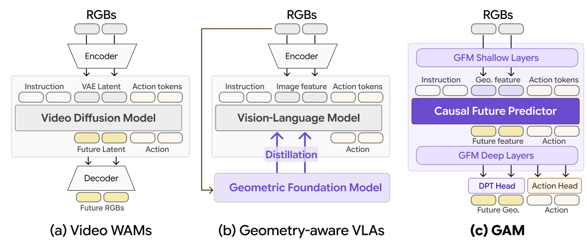

*原论文 Figure 2：Video WAM 基于视频扩散模型，geometry-aware VLA 将 GFM 用作外部 teacher，GAM 则把 GFM 本身改造成 future-and-action backbone。[原图与图注](https://arxiv.org/html/2606.17046v2#S2.F2)*

**核心思路**

GAM 的关键不是增加一个几何 feature，而是复用 GFM 的完整计算路径：浅层编码当前几何，中间预测未来 geometric latent，深层继续传播并同时解码未来深度与动作。

*原论文 Figure 3：浅层观测编码、因果未来预测器、深层几何传播与动作解码，右侧为块状注意力关系。[原图与图注](https://arxiv.org/html/2606.17046v2#S4.F3)*

**具体实现**

1. 主干采用经 Track4World 微调的 **DA3-Giant**。多视角 RGB 经 GFM 浅层得到 geometric latent；GAM 的显式几何目标是未来 depth，而非相机轨迹。
2. 在第 12 层插入 block-causal future predictor，结合语言、proprioception 和历史动作，预测下一时刻的 geometric latent 与 action token。
3. 预测结果继续经过 GFM 深层；冻结的 DPT head 解码未来 depth，轻量 action head 以 \(\ell_1\) loss 回归 8 步 action chunk。

**关键 takeaways**

1. **GFM 从外部 teacher 变成了 world-action backbone**，未来预测与动作解码都发生在几何表征空间。
2. GAM 是确定性的单次前馈回归，没有 diffusion、flow matching 或 latent sampling，因此推理快，但不能表达多模态未来或生成多个动作候选。
3. 它预测任务条件的未来几何并直接回归动作，不是 action-conditioned simulator，也不具备显式候选规划能力。

### 3.3 Structured 4D Latent Predictive Model

**ICML 2026, MIT:** [Structured 4D Latent Predictive Model for Robot Planning](https://arxiv.org/abs/2607.01166)

*原论文 Figure 2：多视角重建初始 3D latent，预测未来结构，解码后交给逆动力学模块。[原图与图注](https://arxiv.org/html/2607.01166v1#S2.F2)*

Structured 4D 先从多视角 RGB-D 构建 sparse voxel latent，再以语言为条件生成完整的未来 3D scene，最后由 inverse dynamics 将几何子目标转换为动作。

**Takeaways：**

- 它回答的是“任务完成后的 3D 世界应该是什么样”，而不是“某个候选动作会造成什么后果”。
- 结构化 3D latent 保持多视角一致性，并将目标预测与动作执行解耦。
- 该范式依赖标定的多视角 RGB-D，完整 3D latent 的两阶段自回归生成也较难扩展到精细接触和大规模训练。

### 本章对比：三种几何未来—动作耦合方式

| 方法 | 几何未来 | 动作耦合 | 生成方式 | 主要限制 |
| --- | --- | --- | --- | --- |
| X-WAM | RGB-D、state、action 联合未来 | Action 用较少步骤先完成去噪 | 生成式联合去噪 | 延迟仍高于专用 VLA |
| GAM | GFM latent future＋action token | Future latent 经 GFM 深层回归动作 | 确定性单次前馈 | 无多样未来与候选动作 |
| Structured 4D | 任务条件的目标 3D scene | 生成几何子目标后调用 inverse dynamics | 生成式子目标；未搜索多候选 | 多视角 RGB-D 与结构化生成成本高 |

三种方法都预测任务条件的未来，但动作接口不同：X-WAM 联合去噪未来与动作，GAM 由几何骨干确定性回归动作，Structured 4D 则先生成几何子目标，再通过 inverse dynamics 求解动作。

## 四、几何运动接口：连接视觉学习与本体动作

### 本章总览

本章关注比 dense future state 更紧凑的中间变量：**先表示场景中任务相关点的目标运动，再由机器人专属模块解码关节或末端动作。**

| 论文 | 运动表示 | 世界模型与动作的连接 | 关键结论 |
| --- | --- | --- | --- |
| [GeomVLA](https://arxiv.org/abs/2609.13812) | robot-centric 3D scene trajectory latent | motion denoiser 的中间 feature 条件化 action denoiser | scene、motion、action 共用同一 3D frame |
| [PointAction](https://arxiv.org/abs/2606.03943) | 动态 RGB-XYZ pointmap | 只取机器人区域点，经本体专属 decoder 出动作 | “哪些点”比“点越多”更重要 |
| [μ₀](https://arxiv.org/abs/2606.13769) | 语义交互点的 3D traces | 冻结 trace model，action expert 读取去噪 feature | 无动作视频预训练与本体动作学习解耦 |

### 4.1 GeomVLA

**CoRL 2026, CMU/NVIDIA：** [GeomVLA: Unifying Scene, Motion, and Action in 3D](https://arxiv.org/abs/2609.13812)

已有方法通常只让 perception 具备 3D 表征，或在 image space 中预测 motion 后再输出 3D action。GeomVLA 关注两者之间的 **geometric mismatch**：scene、motion 和 action 如果不在同一坐标系中，未来运动很难有效指导控制。

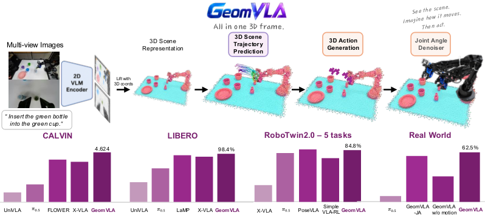

*原论文 Figure 1：多视角 2D VLM feature 被提升到 3D，先预测 scene trajectory，再生成机器人动作；下方给出四组 benchmark 概览。[项目页](https://ziyin-xiong.github.io/geomvla.io/)*

**核心思路**

GeomVLA 不把未来轨迹当作需要直接执行的 plan，而是将其作为 action denoiser 的 latent geometric reasoning。Scene feature、predicted motion 和 Cartesian action 全部表示在 robot base frame 中。

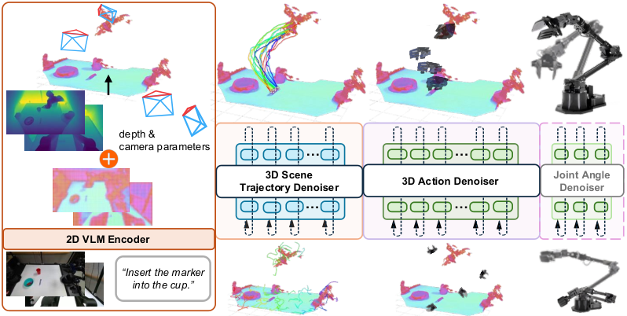

*原论文 Figure 2：scene trajectory denoiser 与 action denoiser 都在同一 metric 3D frame 中操作，虚线表示 denoising feature 的连接。*

**方法**

1. **3D scene representation：** 使用 Florence-2 初始化 VLM，编码多视角 RGB 与语言；depth 和相机标定将视觉 token 提升到 robot-centric 3D，并加入 3D positional encoding。
2. **3D Scene Trajectory Denoiser：** 在冻结 VLM 的条件下，先用 SpatialTrackerV2 伪标签训练 \(20\times20\) 个 3D anchors 的未来轨迹。它预测 15 个时间步的 3D displacement，而不生成未来 RGB。
3. **3D Action Denoiser：** 第二阶段仅使用 action loss，联合微调 VLM、trajectory denoiser 和 action denoiser。推理时不等待完整轨迹生成，只读取初始 noisy state 上的一次 velocity-field evaluation，通过 geometry-aware attention 生成 Cartesian EEF action chunk。
4. **Optional Joint-Angle Denoiser：** 对原生 joint-space 控制的机器人，可进一步读取 scene-motion 与 EEF action feature，生成 joint-angle commands。它是 Cartesian EEF 输出的替代接口，不是同时执行的第二套动作。
5. **Chunk-level closed loop：** 每个 action chunk 执行后重新观测并计算 scene motion 与 action；预测轨迹只作为内部条件，不被直接开环跟踪。

**与前文方法的区别**

| 方法 | 几何／运动的作用 | 推理时的动作路径 |
| --- | --- | --- |
| Track4Action | 蒸馏训练视频中已经发生的 3D transition | Student queries 从当前观测预测压缩 transition，并条件化动作头 |
| WAM4D | 从 causal video feature 前馈重建未来 depth | 删除 depth branch，只保留共享 video feature |
| GAM | 用确定性 GFM backbone 预测 future latent | Future latent 经 GFM 深层直接回归动作 |
| GeomVLA | 在线生成 latent 3D scene motion | Motion denoiser 的 early feature 条件化 action denoiser |

**关键 takeaways**

1. **关键不是“加 motion loss”，而是几何一致性。** 2D motion＋3D action 仅为 4.085，低于不使用 motion 的 4.508；将 scene、motion、action 一起变换到任意共享 3D frame 仍达到 4.596，接近完整模型的 4.624。
2. **GeomVLA 预测未来 3D motion，而不生成未来 RGB。** Early motion latent 比最终轨迹更适合作为动作条件：使用 fully denoised trajectory 仅为 4.047，而读取初始阶段的 velocity feature 达到 4.624。
3. **未来运动在复杂控制中确有作用。** 受控 CALVIN 消融从无 motion 的 4.508 提升至 4.624，真实八任务从 44.4% 提升至 62.5%。RoboTwin 5-task 为 70.0% 对 84.8%，但两者训练任务集合不同，只能作为辅助证据。
4. **3D reasoning 与最终动作参数化可以解耦。** 主模型输出 Cartesian EEF action；Joint-Angle Denoiser 则将相同的 scene-motion reasoning 适配到 joint-space 控制。

**局限：** 需要 depth 和相机标定；scene trajectory 没有显式物理约束，也不是 action-conditioned consequence model，因此不能直接评价候选动作的后果。

### 4.2 PointAction

**CVPR 2026 4DV Workshop, 宾大刘玲洁：** [PointAction: 3D Points as Universal Action Representations for Robot Control](https://arxiv.org/abs/2606.03943)  

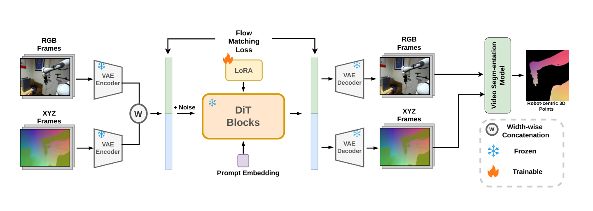

*原论文 Figure 2：RGB 与 XYZ latent 沿宽度拼接，在同一 VideoDiT 中联合生成；随后从预测结果中分割机器人区域，得到 robot-centric 3D points。[原图与图注](https://arxiv.org/html/2606.03943v1#S3.F2)*

PointAction 不在 world model 内部直接生成 action，而是把生成和控制拆成两个阶段：先预测动态 3D pointmap，再由独立 decoder 将 point trajectory 翻译成特定机器人的动作。

**Action 如何生成**

1. VideoDiT 联合生成未来 RGB 与逐像素 XYZ pointmap。
2. SAM-3 从预测 RGB 中分割机器人，只保留 robot-centric XYZ trajectory。
3. 每帧用 FPS 采样 512 个点，经 PointNet-style MLP 编码。
4. Embodiment-specific conditional DiT 以 point feature 和初始机器人状态为条件，通过 10-step DDIM 生成完整 49-step action chunk。

**与一般 WAM 的区别**

一般 WAM 在共享 backbone 中联合去噪 video 与 action；PointAction 的 VideoDiT 不包含 action token，必须先完成 4D rollout，再调用独立的 point-to-action decoder。前者学习共享 video-action 表征，后者将动态 3D points 作为显式中间接口。

**关键 takeaways**

1. 3D point trajectory 将可跨本体预训练的世界模型与本体相关的低层动作空间解耦。
2. “通用”只适用于 video-to-point model；每种机器人仍需动作示范训练自己的 point-to-action decoder，并非零样本跨本体控制。
3. 系统需要先生成完整 rollout，再一次性输出 49-step action，推理较慢且属于开环执行；分割、自遮挡或 pointmap 误差会直接传递到动作。

### 4.3 μ₀

**arXiv 2026, 马里兰大学帕克分校／首尔大学：** [μ₀: A Scalable 3D Interaction-Trace World Model](https://arxiv.org/abs/2606.13769)

Pixel world model 需要重建大量外观细节，直接 action model 又依赖本体专属动作标签。μ₀ 选择两者之间的中间表示：**对象、工具、手和接触区域等语义交互点的 3D trace**。

**方法**

1. **TraceExtract：** 用 DINOv2 entity cluster 选择语义关键点，将其跟踪并提升到全局对齐的 3D，再按运动事件生成对应语言，构造 `{observation, trace, language}` 训练数据。
2. **Trace world model：** 每个 query 预测 anchor-relative cubic B-spline control points，并通过 conditional flow matching 表达多模态、平滑的未来轨迹；validity 与 semantic rigidity loss 分别处理遮挡终止和实体局部刚性。
3. **Action expert：** 预训练 μ₀ 保持冻结；本体专属 action expert 读取机器人观测、proprioception、语言和 trace 去噪过程的中间 feature，再通过 flow matching 输出 action chunk。

*原论文 Figure 3：上半部分是 trace world model，下半部分是冻结 μ₀ 后训练 embodiment-specific action expert。[原图与图注](https://arxiv.org/html/2606.13769v2#S2.F3)*

**与相关工作的区别**

| 方法 | 运动表示 | 从运动到动作 |
| --- | --- | --- |
| Track4Action | 已发生动作区间的 pooled 3D tracker feature | 蒸馏到当前策略的 student queries；部署时不保留可复用的 trace world model |
| GeomVLA | 场景级 latent 3D motion | 端到端条件化同一策略内的 action denoiser |
| PointAction | 完整 rollout 中的 dense robot pointmap | 完成 4D rollout 后，由本体专属 decoder 开环生成动作 |
| μ₀ | Sparse semantic 3D interaction traces | 冻结可复用 trace prior，由本体专属 action expert 读取中间 motion feature |

**关键 takeaways**

1. 3D trace 比 pixel rollout 更紧凑，又比机器人 action 更容易跨本体共享，适合作为视频预训练与动作学习之间的接口。
2. Action expert 读取的是 trace 去噪的中间 feature，而不是直接跟踪最终轨迹；trace 在这里是保留不确定性的 motion prior，不是开环计划。
3. “Action-free”仅指 μ₀ 的视频预训练阶段。每种机器人仍需动作示范训练自己的 action expert，因此尚未实现零样本跨本体控制。
4. 该表示不显式建模 force、触觉和 contact mode，并继承关键点选择、3D 跟踪与语言伪标签的误差。

### 本章小结

| 方法 | 运动变量的覆盖范围 | 动作接口 | 范式差异 |
| --- | --- | --- | --- |
| GeomVLA | 场景级 3D trajectory latent | 同一坐标系内条件化 action denoiser | 端到端闭环 VLA，motion 是内部推理 |
| PointAction | dense pointmap 中筛出的机器人点 | 本体专属 point-to-action decoder | 先生成完整 rollout，再开环解码 |
| μ₀ | sparse semantic interaction traces | 冻结 trace prior＋本体 action expert | 视频预训练与动作学习解耦 |

μ₀ 不预测完整世界状态或候选 action 的 consequence，而是将**任务相关运动**作为跨本体复用的中间表示。这一区别使其更接近视频预训练与动作生成之间的接口，而非在线规划器。

## 总结

1. **预测什么，决定迁移什么。** Pixel、semantic feature 和 3D motion 分别偏向外观、语义与空间动态；world state representation 不是附属设计，而是决定模型能力的核心变量。
2. **若目标是提升控制，几何必须影响动作实际使用的表示或解码路径。** 它可以通过 feature alignment、student query、共享梯度或 latent motion 发挥作用；推理时是否显式生成几何并不是必要条件。
3. **目标未来与动作后果必须区分。** 任务条件的 future 描述“应该发生什么”，action-conditioned dynamics 提供比较不同动作后果的接口；能否识别因果关系还取决于动作覆盖、干预数据与失败样本。
4. **交互中心表示可以显著压缩动作相关的预测空间。** Robot-centric points、semantic traces 和 latent scene motion 聚焦于操作变化；完整场景表示仍适合可视化 rollout、重建和显式规划。
5. **跨本体迁移需要拆开两种对齐。** Video→motion 负责保留任务意图，motion→action 负责适配具体本体；人类视频可以提供交互先验，但不能替代目标机器人的动作学习。

### 对后续工作的启发

现有模型已经能够预测“任务期望的运动”，但尚未将同一个 4D interaction state 同时用于两件事：**比较不同 action 的交互后果，以及为不同本体生成可执行动作。**

我们正在进行的 **JanusAct4D** 以共享 4D interaction state 连接两条互补映射：前向动力学从“状态＋候选动作”预测交互后果，逆向策略从“状态＋任务期望交互”生成本体专属动作。人类视频用于学习任务与运动先验，带动作及成败信息的机器人数据负责识别动作后果并适配具体本体。

## 参考文献

以下按方法职责分类，共 30 篇。编号用于检索，非质量排序；“月份”指 arXiv 首次提交月份。

### 1. 表示对照与设计因素分析

| 编号 | 论文 | 月份 | 关联内容 |
| --- | --- | --- | --- |
| 1 | [EgoWAM: World Action Models Beyond Pixels with In-the-Wild Egocentric Human Data](https://arxiv.org/abs/2607.08436) | 2026.07 | 固定策略框架，比较 Pixel、DINO 与 camera-stabilized 3D flow 的人类视频迁移效果。 |
| 2 | [Reconstruction or Semantics? What Makes a Latent Space Useful for Robotic World Models](https://arxiv.org/abs/2605.06388) | 2026.05 | 在固定协议下比较重建与语义编码器，区分视觉质量、规划／策略表现和表示质量。 |
| 3 | [What Matters for Latent Actions in Robot Learning](https://arxiv.org/abs/2608.19613) | 2026.08 | 统一比较隐动作建模、训练目标和策略接入方式，并检验代理指标。 |

### 2. 空间表示、状态对齐与几何监督

| 编号 | 论文 | 月份 | 关联内容 |
| --- | --- | --- | --- |
| 4 | [SpatialVLA: Exploring Spatial Representations for Visual-Language-Action Model](https://arxiv.org/abs/2501.15830) | 2025.01 | Ego3D 位置编码与自适应动作网格，连接空间观测和机器人动作表示。 |
| 5 | [Spatial Forcing: Implicit Spatial Representation Alignment for Vision-language-action Model](https://arxiv.org/abs/2510.12276) | 2025.10 | 几何教师对齐 VLA 中间视觉特征。 |
| 6 | [GeoProp: Grounding Robot State in Vision for Generalist Manipulation](https://arxiv.org/abs/2607.07101) | 2026.07 | 将机器人状态投影到图像，采样局部特征并调制视觉表示。 |
| 7 | [Track4Action: Distilling World-Centric 3D Tracker into Vision-Language-Action Policies](https://arxiv.org/abs/2608.03727) | 2026.08 | 将动作对齐视频区间的 tracker 特征蒸馏到当前观测策略。 |

### 3. 几何监督的视频—动作模型与几何潜空间

| 编号 | 论文 | 月份 | 关联内容 |
| --- | --- | --- | --- |
| 8 | [GEM-4D: Geometry-Enhanced Video World Models for Robot Manipulation](https://arxiv.org/abs/2605.22882) | 2026.05 | 以 4D 对应监督视频预测，再经逆动力学连接动作。 |
| 9 | [WAM4D: Fast 4D World Action Model via Spatial Register Tokens](https://arxiv.org/abs/2606.14048) | 2026.06 | 训练期未来深度读出，部署时移除几何分支。 |
| 10 | [MECo-WAM: Learning 4D Geometric Priors for Inference-Efficient World Action Models](https://arxiv.org/abs/2607.05468) | 2026.07 | 辅助 4D expert、逐步衰减的几何读取与时空关系蒸馏。 |
| 11 | [SG-WAM: Self-Guided World Modeling in Geometry-Aware Policy Space](https://arxiv.org/abs/2608.01397) | 2026.08 | 在策略表示空间学习动作条件动态，以 EMA 教师与几何监督组织潜空间。 |
| 12 | [GWM-VLA: Geometry-Aware Latent World Modeling for Vision-Language-Action Learning](https://arxiv.org/abs/2608.07619) | 2026.08 | 聚合多视角几何上下文，预测目标视角特征，并共享隐动作表示。 |
| 13 | [PhysisForcing: Physics Reinforced World Simulator for Robotic Manipulation](https://arxiv.org/abs/2606.28128) | 2026.06 | 用 2D point trajectory 与交互区域关系监督视频 DiT；改善物理一致性，但不显式建模 3D/4D。 |

### 4. 几何未来、联合动作生成与规划

| 编号 | 论文 | 月份 | 关联内容 |
| --- | --- | --- | --- |
| 14 | [PointWorld: Scaling 3D World Models for In-The-Wild Robotic Manipulation](https://arxiv.org/abs/2601.03782) | 2026.01 | 以机器人点运动为动作条件，预测场景 point flow，并通过 MPC 控制。 |
| 15 | [X-WAM: Unified 4D World Action Modeling from Video Priors with Asynchronous Denoising](https://arxiv.org/abs/2604.26694) | 2026.04 | 联合预测 RGB-D 与动作，用异步去噪协调不同模态。 |
| 16 | [Geometric Action Model for Robot Policy Learning](https://arxiv.org/abs/2606.17046) | 2026.06 | 将未来预测器插入几何基础模型，由深层几何特征连接动作解码。 |
| 17 | [Structured 4D Latent Predictive Model for Robot Planning](https://arxiv.org/abs/2607.01166) | 2026.07 | 预测结构化三维子目标，经目标条件逆动力学产生动作。 |
| 18 | [GeomVLA: Unifying Scene, Motion, and Action in 3D](https://arxiv.org/abs/2609.13812) | 2026.09 | 在统一 robot-centric 3D frame 中连接 scene token、未来运动与 action denoising。 |

### 5. 3D Motion／Points／Traces 接口

| 编号 | 论文 | 月份 | 关联内容 |
| --- | --- | --- | --- |
| 19 | [PointAction: 3D Points as Universal Action Representations for Robot Control](https://arxiv.org/abs/2606.03943) | 2026.06 | 联合生成 RGB 与动态 pointmap，再解码机器人动作。 |
| 20 | [μ₀: A Scalable 3D Interaction-Trace World Model](https://arxiv.org/abs/2606.13769) | 2026.06 | 视频抽取三维交互轨迹，预训练后连接机器人动作专家。 |
| 21 | [A4A: Cross-Embodiment Transfer of Action-Oriented 4D Affordances from Human Demonstrations](https://arxiv.org/abs/2609.05892) | 2026.09 | 交互点数据处理与策略预训练 recipe；不是部署时运行的 WAM。 |
| 22 | [MotionForesight: Re-purposing Video Models for Future 3D Scene-Flow Prediction](https://arxiv.org/abs/2607.16192) | 2026.07 | 从普通人类视频预测物体中心的未来 3D scene flow；未直接连接机器人动作。 |

### 6. 相邻的视觉运动与跨本体工作

| 编号 | 论文 | 月份 | 关联内容 |
| --- | --- | --- | --- |
| 23 | [TrAct: Bridging Robot Control and Visual Prediction with Visual Tracks](https://arxiv.org/abs/2608.24101) | 2026.08 | 用 2D tracks 连接动作候选、未来视频与评分；接口相关，但不是 3D/4D 几何方法。 |
| 24 | [AnyWorld: Factorized Egocentric World Models for Cross-Embodiment Generalization](https://arxiv.org/abs/2608.29242) | 2026.08 | 分解动作、相机与本体条件，重点是经验重组而非几何未来。 |
| 25 | [Mask World Model: Predicting What Matters for Robust Robot Policy Learning](https://arxiv.org/abs/2604.19683) | 2026.04 | 以语义 mask 的演化作为预测目标，连接扩散策略头。 |
| 26 | [FlowWAM: Optical Flow as a Unified Action Representation for World Action Models](https://arxiv.org/abs/2607.13017) | 2026.07 | 以光流连接未来视频生成与机器人动作预测。 |
| 27 | [Masked Visual Actions for Unified World Modeling](https://arxiv.org/abs/2607.19343) | 2026.07 | 以部分可见实体运动为像素空间控制接口，支持正向与逆向建模。 |
| 28 | [Hydra-0: Action Flow for Generalist World Modeling and Control](https://arxiv.org/abs/2608.18077) | 2026.08 | 将动作表示为像素运动，连接跨本体后果预测、策略评价与控制。 |

### 7. 动作条件训练、失败经验与部署效率

| 编号 | 论文 | 月份 | 关联内容 |
| --- | --- | --- | --- |
| 29 | [GigaWorld-Policy-0.5: A Faster and Stronger WAM Empowered by AutoResearch](https://arxiv.org/abs/2607.13960) | 2026.07 | 混合动作条件世界建模与 WAM 训练，结合专家分工实现动作单独解码。 |
| 30 | [FACT: Failure-Aware Causal Training for World-Action Models](https://arxiv.org/abs/2608.10232) | 2026.08 | 用执行动作条件化未来视频与进度预测，将失败经验用于后果学习和候选评价。 |
